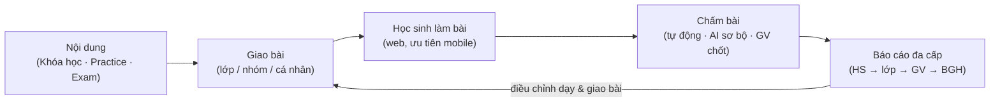

# Tầm nhìn sản phẩm — Edmicro App

**Trạng thái:** 🟢 Đã chốt

## 1. Tuyên bố tầm nhìn

> **Edmicro App là nền tảng LMS B2B đa ngôn ngữ cho trung tâm ngoại ngữ tại Việt Nam** — nơi giáo viên giao bài, học sinh luyện đủ 4 kỹ năng nghe-nói-đọc-viết và thi thử theo chuẩn quốc tế, AI chấm sơ bộ để giáo viên chốt nhanh, và ban giám hiệu nhìn thấy toàn cảnh chất lượng dạy–học bằng số liệu.

## 2. Bài toán

Trung tâm ngoại ngữ VN (từ vài chục đến vài nghìn học sinh) hiện vận hành rời rạc:

1. **Giao bài thủ công** — qua Zalo/giấy, không theo dõi được ai đã làm, làm thế nào.
2. **Chấm speaking/writing là nút cổ chai** — 5–15 phút/bài × hàng chục học sinh; học sinh chờ phản hồi nhiều ngày.
3. **Không có dữ liệu hệ thống** — điểm nằm trong Excel từng giáo viên; ban giám hiệu không so sánh được lớp/chi nhánh, không phát hiện sớm học sinh đuối.
4. **Công cụ hiện có không vừa vặn**: app B2C (ELSA, Prep…) không quản lý được lớp/trung tâm; LMS tổng quát (Moodle, Google Classroom) không có practice 4 kỹ năng, thi thử theo chuẩn, hay AI chấm; và hầu hết chỉ tối ưu cho tiếng Anh.

## 3. Giải pháp — 3 trụ nội dung + 1 vòng lặp dữ liệu

- **Khóa học**: bài học tuần tự gồm video, văn bản, flashcard, file Word/Excel/PPT, practice và exam nhúng.
- **Practice**: bài luyện theo từng kỹ năng nghe-nói-đọc-viết, với catalog loại câu hỏi phong phú.
- **Exam**: thi thử mô phỏng đúng cấu trúc IELTS/TOEIC/VSTEP/Cambridge/HSK/JLPT/TOPIK — có đồng hồ, phần thi, thang điểm chuẩn.
- **Vòng lặp dữ liệu**: mọi lượt làm bài đổ về báo cáo; báo cáo dẫn hướng lần giao bài tiếp theo.

## 4. Điểm khác biệt (USP)

| # | USP                                                                                                                                                                               | Vì sao đối thủ khó có                                                          |
| - | --------------------------------------------------------------------------------------------------------------------------------------------------------------------------------- | ------------------------------------------------------------------------------------ |
| 1 | **Đa ngôn ngữ từ lõi** — Anh, Trung, Nhật, Hàn cùng một hệ thống, content model ngôn ngữ-agnostic                                                             | App B2C và LMS hiện có gần như chỉ tối ưu tiếng Anh, hoặc 1 ngôn ngữ/app |
| 2 | **Chấm hybrid AI + giáo viên** — AI chấm sơ bộ theo rubric chuẩn thi, giáo viên chốt: nhanh gấp nhiều lần nhưng vẫn giữ uy tín điểm số của trung tâm | B2C chấm AI 100% (thiếu tin cậy với phụ huynh); LMS tổng quát không chấm AI |
| 3 | **B2B đúng nghĩa** — multi-tenant, chi nhánh, phân quyền 11 vai trò (tách quyền chủ trung tâm ↔ nhân viên quản lý, có cổng phụ huynh), báo cáo cho ban giám hiệu, tùy chọn on-premise                                            | Sản phẩm học ngoại ngữ hiện tại chủ yếu B2C                                 |
| 4 | **Kho nội dung chuẩn thi dùng chung** — trung tâm nhỏ không có đội học thuật vẫn có đề chất lượng theo gói                                              | Cần đội ngũ nội dung — lợi thế sẵn có của Edmicro                         |

## 5. Phạm vi phiên bản

### v1 (phạm vi của bộ SRS này)

| Nhóm             | Trong v1                                                                                                                                                            |
| ----------------- | ------------------------------------------------------------------------------------------------------------------------------------------------------------------- |
| Nội dung         | Khóa học (video, text, flashcard, file Office/PDF, nhúng practice/exam) · Practice 4 kỹ năng · Exam theo chuẩn · Ngân hàng câu hỏi + quy trình duyệt |
| Vận hành lớp   | Giao bài lớp/nhóm/cá nhân + deadline · Lịch học & điểm danh · Thông báo in-app/email/Zalo                                                              |
| Chấm & dữ liệu | Cổng phụ huynh (xem kết quả + chuyên cần + lịch của con) · Chấm tự động · AI chấm speaking/writing sơ bộ + GV review · Báo cáo đa cấp · Gamification (điểm, streak, huy hiệu, xếp hạng)                     |
| Nền tảng        | Multi-tenant + RLS · RBAC 11 vai trò · Gói dịch vụ & quota · Ticket support + impersonation · Audit log · MinIO storage adapter                             |

### v2 trở đi (ghi nhận, KHÔNG thiết kế chi tiết trong bộ docs này)

- App mobile native (v1: web responsive, ưu tiên mobile).
- Lớp học ảo/livestream tích hợp (v1: chỉ link Zoom/Meet gắn vào buổi học).
- Thanh toán học phí, hợp đồng, CRM tuyển sinh.
- Marketplace nội dung giữa các trung tâm.
- AI sinh đề tự động, lộ trình học cá nhân hóa bằng AI (adaptive learning).
- Ứng dụng chấm thi nói trực tiếp tại phòng thi.

## 6. Chỉ số thành công (v1)

| Chỉ số                                          | Mục tiêu 6 tháng sau go-live                  |
| ------------------------------------------------- | ------------------------------------------------ |
| Tenant hoạt động (trả phí)                   | ≥ 10 trung tâm                                 |
| Tỉ lệ học sinh làm bài đúng hạn           | ≥ 70% assignment hoàn thành trước deadline  |
| Thời gian chấm 1 bài speaking/writing của GV  | Giảm ≥ 60% so với chấm tay (nhờ AI sơ bộ) |
| Học sinh hoạt động hằng tuần (WAU/enrolled) | ≥ 60%                                           |
| Uptime SaaS                                       | ≥ 99,5%                                         |

## 7. Ràng buộc đã chốt

- Stack: **Python FastAPI · Next.js + HeroUI (100% HeroUI) · PostgreSQL · MinIO → S3/R2**.
- Triển khai: **SaaS multi-tenant** mặc định; **on-premise** cho khách lớn (cùng codebase).
- Bảo mật dữ liệu là yêu cầu **tuyệt đối** — xem [Bảo mật](../01-kien-truc/03-bao-mat.md); tuân thủ Nghị định 13/2023/NĐ-CP về bảo vệ dữ liệu cá nhân.
- Docs và UI mặc định tiếng Việt; kiến trúc sẵn sàng i18n.

## Lịch sử thay đổi

| Ngày      | Thay đổi                  | Người |
| ---------- | --------------------------- | ------- |
| 2026-07-16 | Tạo bản nháp đầu tiên | Claude  |
| 2026-07-16 | 11 vai trò (owner/manager/academic_head/parent); kéo cổng phụ huynh lên v1 | Chủ sản phẩm |
