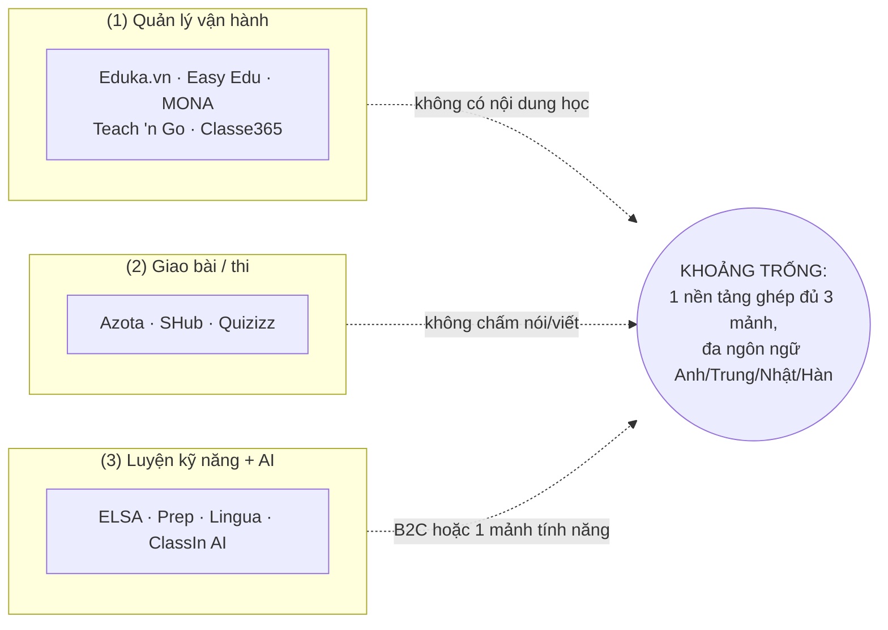

# Nghiên cứu thị trường — Ngành ngoại ngữ Việt Nam

**Trạng thái:** 🟢 Đã chốt
**Phương pháp:** tổng hợp nguồn công khai (web research, 7/2026), mỗi số liệu kèm nguồn; số chưa kiểm chứng độc lập được đánh dấu *(ước tính)* hoặc *(tự công bố)*. Phân tích đối thủ chi tiết ở [phần B](#phần-b--đối-thủ--sản-phẩm-tham-chiếu).

---

## Phần A — Thị trường

## 1. Quy mô & xu hướng

- EdTech Việt Nam đạt ~**1,0–1,08 tỷ USD năm 2024**, CAGR ~13–19%/năm; dự báo 3,7 tỷ USD vào 2034 ([Expert Market Research](https://www.expertmarketresearch.com/reports/vietnam-education-technology-market), [IMARC](https://www.imarcgroup.com/vietnam-edtech-market)). Số liệu giữa các hãng chênh lệch — đọc theo khoảng.
- Phân khúc **học tiếng Anh số**: 38,45 triệu USD (2024) → dự báo 120,6 triệu USD (2033), CAGR 12,11% ([IMARC](https://www.imarcgroup.com/vietnam-digital-english-language-learning-market)).
- Đào tạo ngoại ngữ là **phân khúc lớn thứ 2 của EdTech VN**: ~750 sản phẩm, ~9 triệu người dùng online ([VnExpress](https://vnexpress.net/nguoi-viet-dau-tu-hoc-tieng-anh-the-nao-4796385.html)).
- Số trung tâm: **TP.HCM** ~2.380 trung tâm tiếng Anh được cấp phép (2024, gấp 6 lần 2010); đến 8/2025 có 1.961 trung tâm ngoại ngữ–tin học ([Tạp chí Kinh tế Tài chính](https://tapchikinhtetaichinh.vn/tp-ho-chi-minh-co-gan-2-000-trung-tam-ngoai-ngu-tin-hoc-duoc-cap-phep.html)). **Hà Nội** 955 trung tâm (12/2024); năm học 2024–2025 mở ~49.163 lớp, ~268.580 học viên ([Hà Nội Mới](https://hanoimoi.vn/ca-nuoc-co-hon-17-000-co-so-giao-duc-thuong-xuyen-492873.html)). Không có tổng toàn quốc chính thức cập nhật.
- **Hậu COVID — tái cấu trúc mạnh**: Apax Leaders sụp đổ từ đỉnh 130 trung tâm, nợ hoàn học phí ~108 tỷ đồng riêng TP.HCM ([Thanh Niên](https://thanhnien.vn/toan-canh-vu-shark-thuy-va-apax-leaders-no-hoc-phi-phu-huynh-ca-nuoc-den-nay-185240326122113709.htm)); nhiều trung tâm nhỏ đóng cửa đột ngột → phụ huynh cực kỳ nhạy cảm với **minh bạch tiến độ học** → báo cáo minh bạch là tính năng bán hàng.
- **Blended learning** (lớp trực tiếp + nền tảng online) là mô hình chủ đạo; xu hướng LMS 2025: gamification, AI, mobile-first (>70% học qua smartphone) ([Flyer.vn](https://flyer.vn/xu-huong-lms-trong-nam-2025/), [Aegona](https://aegona.vn/thiet-ke-website-e-learning-va-lms-cho-trung-tam-ngoai-ngu/)).

## 2. Nhu cầu theo ngôn ngữ

Khảo sát Q&Me 2021 (~900 người — dữ liệu cũ nhưng là khảo sát công khai tốt nhất): đang học **tiếng Anh 86%**, Nhật 16%, Trung 15%; ý định học tương lai: **Nhật 37%, Hàn 36%, Trung 25%** ([Q&Me](https://qandme.net/en/report/vietnam-language-learning-behaviors.html)).

| Ngôn ngữ | Tín hiệu nhu cầu | Động lực chính |
|---|---|---|
| Anh | Lớn nhất; 57% thí sinh THPT dưới 5 điểm tiếng Anh trong 8 năm → nhu cầu học thêm rất lớn ([VnExpress](https://vnexpress.net/nguoi-viet-dau-tu-hoc-tieng-anh-the-nao-4796385.html)) | Tuyển sinh ĐH (quy đổi IELTS), du học, việc làm |
| Trung | **VN đứng số 1 thế giới về thí sinh HSK 2025: 138.432 người** ([Dân Trí](https://dantri.com.vn/giao-duc/vuot-thai-lan-viet-nam-co-nhieu-nguoi-thi-tieng-trung-nhat-the-gioi-20260323135416997.htm)); nhu cầu học tăng ~24%/năm *(ước tính)* | FDI Trung Quốc (12.997 tin tuyển dụng yêu cầu tiếng Trung 2025, +50%), du học |
| Hàn | **VN dẫn đầu thế giới về thí sinh TOPIK ngoài Hàn**: >70.000 (2024), ~85.000 (2025) ([Zila](https://www.zila.com.vn/tin-tuc-so-luong-thi-sinh-thi-topik-tai-viet-nam-cao-nhat-the-gioi.html)) | FDI Hàn (Samsung, LG), Hallyu, du học, XKLĐ (EPS) |
| Nhật | Không có tổng JLPT đáng tin; Dungmori tự công bố 510.000 học viên | XKLĐ (Tokutei Ginou ~N4–N3), du học |

> **Hàm ý:** không hard-code cho tiếng Anh. Content model phải ngôn ngữ-agnostic: khung trình độ (CEFR/HSK/JLPT/TOPIK), loại câu hỏi, font chữ tượng hình, ruby text (furigana/pinyin) — đã phản ánh vào [SRS Practice](../05-practice/srs-practice.md) và [Phụ lục chuẩn thi](../99-phu-luc/02-chuan-thi-quoc-te.md).

## 3. Chứng chỉ & kỳ thi

| Kỳ thi | Thí sinh VN/năm | Cấu trúc cơ bản |
|---|---|---|
| IELTS | ~50–60 nghìn *(ước tính)*, có nguồn nêu ~300 nghìn lượt 2025 *(chưa kiểm chứng)* | 4 kỹ năng L-R-W-S, band 0–9 |
| TOEIC | Không có số công khai; chuẩn đầu ra >130 trường ĐH/CĐ | L&R 990 điểm/200 câu; S&W thi riêng |
| VSTEP | Không có tổng đáng tin; 36 trường ĐH được tổ chức thi (2025) | 4 kỹ năng, bậc 3–5 (B1–C1), thang 10 |
| Cambridge YLE/KET/PET/FCE | Không có số công khai; nhu cầu lớn ở tiểu học (xét tuyển) | YLE 3 cấp pre-A1→A2; KET A2, PET B1, FCE B2 |
| HSK/HSKK | **138.432 (2025) — số 1 thế giới** | HSK 6 cấp (đang chuyển khung 9 cấp), HSKK 3 cấp, thi máy phổ biến |
| JLPT | Không có tổng đáng tin | N5→N1; Kiến thức ngôn ngữ + Đọc + Nghe; 180 điểm; 2 kỳ/năm |
| TOPIK | >70.000 (2024) — số 1 ngoài Hàn Quốc | TOPIK I (Nghe+Đọc), TOPIK II (Nghe+Viết+Đọc) |
| NAT-TEST | Không có số đáng tin | 5 cấp tương đương JLPT, ~6 kỳ/năm |

> **Hàm ý:** mô hình dữ liệu exam phải là "kỳ thi → phần thi → dạng câu hỏi → thang điểm" cấu hình được — không hard-code từng kỳ thi; chi tiết ở [SRS Exam](../06-exam/srs-exam.md).

## 4. Quy định pháp lý

| Văn bản | Nội dung chính | Tác động lên sản phẩm |
|---|---|---|
| **Thông tư 21/2018/TT-BGDĐT** | Quy chế tổ chức & hoạt động trung tâm ngoại ngữ–tin học; trung tâm tổ chức kiểm tra, cấp giấy xác nhận hoàn thành chương trình ([Chính phủ](https://vanban.chinhphu.vn/?pageid=27160&docid=195136)) | Xuất báo cáo theo mẫu quản lý nhà nước (danh sách lớp, GV, học viên); lưu hồ sơ kết quả |
| **Nghị định 125/2024/NĐ-CP** | Điều kiện đầu tư & hoạt động giáo dục; thẩm quyền cấp phép thuộc Sở GD&ĐT ([LuatVietnam](https://luatvietnam.vn/hanh-chinh/thu-tuc-thanh-lap-trung-tam-ngoai-ngu-570-29674-article.html)) | Quản lý hồ sơ giáo viên (bằng cấp) là nghiệp vụ tuân thủ của trung tâm |
| **Nghị định 13/2023/NĐ-CP** | Bảo vệ dữ liệu cá nhân: consent, DPIA gửi Bộ Công an, quy định riêng **dữ liệu trẻ em** (đồng ý cha mẹ; trẻ đủ 7 tuổi cần thêm ý kiến của trẻ) ([TVPL](https://thuvienphapluat.vn/van-ban/Cong-nghe-thong-tin/Nghi-dinh-13-2023-ND-CP-bao-ve-du-lieu-ca-nhan-465185.aspx)) | Consent flow + lưu vết; quyền xóa/xuất dữ liệu; phân quyền chặt — xem [Bảo mật](../01-kien-truc/03-bao-mat.md) |
| **Luật Bảo vệ DLCN 91/2025/QH15** (hiệu lực **1/1/2026**, thay NĐ 13) | Kế thừa NĐ 13 + chế tài mạnh hơn; DN nhỏ được hoãn một số nghĩa vụ 5 năm ([TVPL](https://thuvienphapluat.vn/chinh-sach-phap-luat-moi/vn/ho-tro-phap-luat/chinh-sach-moi/102230/nghi-dinh-13-2023-nd-cp-ve-bao-ve-du-lieu-ca-nhan-het-hieu-luc-tu-01-01-2026)) | Thiết kế theo chuẩn Luật mới ngay từ v1 (đang có hiệu lực) |
| **Luật An ninh mạng 2018** + NĐ 53/2022 | Yêu cầu lưu trữ dữ liệu tại VN với một số dịch vụ | Ưu tiên hosting tại VN (SaaS); cần thẩm định pháp lý riêng |

## 5. Chuỗi trung tâm lớn — mô hình vận hành

| Chuỗi | Quy mô | Ghi chú |
|---|---|---|
| VUS | ~73 trung tâm, ~30.000 học viên thường xuyên | Đối tác Cambridge; GV bản ngữ + trợ giảng |
| ILA | ~43–60 chi nhánh | Phân khúc cao cấp trẻ em–thiếu niên |
| Apollo English | 50+ trung tâm | 100% GV nước ngoài |
| Wall Street English | 7 trung tâm + 1 online | Blended learning độc quyền, người lớn 16+ |
| IELTS Fighter | 60+ cơ sở *(tự công bố)* | Luyện IELTS đại trà giá rẻ |
| DOL English | Chuỗi luyện IELTS lớn | Định vị "Linearthinking" |
| Prep | Online: Series A 7 triệu USD, >100.000 người dùng | AI chấm Speaking/Writing |
| Dungmori (Nhật) | 510.000 học viên *(tự công bố)*, 4 cơ sở | Online-first + offline bổ trợ |

**Mô hình vận hành chung** (định hình yêu cầu SRS):
- Nhiều chi nhánh phân tán → cần **quản lý tập trung đa cơ sở** (entity Branch).
- Lớp ca tối/cuối tuần, sĩ số 10–25; cặp **GV (bản ngữ/Việt) + trợ giảng** — trợ giảng chấm bài, điểm danh, liên lạc phụ huynh → vai trò `assistant` là thiết yếu.
- Vòng đời học viên: tư vấn → **test đầu vào** → xếp lớp → học → thi giữa/cuối khóa → tái ghi danh (test đầu vào: dùng Exam + Assignment; CRM tuyển sinh để v2).

## 6. Hành vi người dùng

- **Mobile-first tuyệt đối**: 79,8 triệu người dùng Internet (78,8% dân số), smartphone là thiết bị chính; >70% người học e-learning qua smartphone ([DataReportal 2025](https://datareportal.com/reports/digital-2025-vietnam), [Aegona](https://aegona.vn/thiet-ke-website-e-learning-va-lms-cho-trung-tam-ngoai-ngu/)) → giao diện học sinh thiết kế mobile-first; web quản trị cho nhân viên.
- **Zalo là kênh liên lạc mặc định** giữa trung tâm và phụ huynh; ngành giáo dục dùng **Zalo ZNS** gửi lịch học, học phí, điểm danh, kết quả tự động ([VietGuys](https://www.vietguys.biz/vi/martech/knowledge/ung-dung-zalo-zns-nang-cao-trai-nghiem-khach-hang-trong-mang-giao-duc)) → tích hợp Zalo OA/ZNS gần như bắt buộc — xem [SRS Thông báo](../11-thong-bao/srs-thong-bao.md).
- Cách học (Q&Me): tự học 44–49%; học trung tâm 29%; app phổ biến: Duolingo, ELSA, Cake; 37% học 1–3 giờ/tuần.
- 69% ưu tiên trung tâm dạng chuỗi; học phí phổ biến 1,7–4,7 triệu đ/tháng (20–50% thu nhập bình quân) → phụ huynh đòi hỏi thấy kết quả → **báo cáo tiến độ là giá trị bán hàng cốt lõi**.

---

## Phần B — Đối thủ & sản phẩm tham chiếu

> Giá là giá niêm yết/khuyến mãi tại thời điểm nguồn công bố (7/2026), thay đổi thường xuyên. "Chưa xác minh" = không tìm thấy bằng chứng công khai.

### B1. B2C học ngoại ngữ tại VN

| Sản phẩm | Điểm chính | Giá tham khảo | Yếu (cơ hội cho ta) |
|---|---|---|---|
| **ELSA Speak** | AI chấm phát âm từng âm tiết, dự đoán IELTS Speaking; **có B2B** (ELSA for Schools: lớp, giao bài, báo cáo) ([elsaspeak](https://vn.elsaspeak.com/bao-gia-hoc-phi-elsa-speak/)) | ~799k–1,1tr/năm | Chỉ kỹ năng Nói; chấm AI thuần đôi khi sai gây ức chế |
| **Prep.vn** | Phòng luyện ảo Speaking/Writing, AI chấm (tự công bố ~95% chính xác); thi thử 4 kỹ năng; có B2B ([prepedu](https://prepedu.com/vi/)) | ~1,5–5tr/khóa | Video quay sẵn, bám lộ trình Prep; công nghệ giữ nội bộ |
| **DOL English** | superLMS nội bộ: giao bài theo tuần, AI chấm W/S chuẩn IELTS, mock test | ~3–15tr/khóa | Công nghệ khép kín phục vụ chuỗi DOL, không bán ra |
| **Migii (eUp)** | 30.000+ đề JLPT/TOPIK/HSK/TOEIC, thi thử sát format ([migii](https://migii.net/en/)) | ~479k/3 tháng | Chỉ trắc nghiệm B2C, bỏ trống nói-viết, không B2B |
| **FLYER** | Phòng thi ảo Cambridge cho thiếu nhi, gamification, báo cáo phụ huynh, kênh giáo viên miễn phí ([flyer](https://flyer.vn/)) | ~590k/năm | Công cụ luyện đề, không phải khóa học; Speaking hạn chế |
| **Duolingo** | Gamification chuẩn mực; Duolingo for Schools miễn phí | Super ~$84–122/năm | Lộ trình cứng, không luyện thi, không nghiệp vụ trung tâm |

### B2. Nền tảng thi/giao bài tại VN

| Sản phẩm | Điểm chính | Giá | Yếu |
|---|---|---|---|
| **Azota** | Tạo đề từ Docx, chấm trắc nghiệm + OCR, giám sát thi AI, thông báo phụ huynh; 300k+ GV ([azota](https://azota.vn/bao-gia/)) | VIP 999k/năm; gói tổ chức liên hệ | Không chuyên ngoại ngữ; mất kết nối dễ mất bài; không chấm nói/viết |
| **Quizizz (Wayground)** | Quiz game hóa, kho 20tr+ hoạt động, AI tạo câu hỏi | Free giới hạn; School liên hệ | Không tự luận/speaking; không bám nghiệp vụ trung tâm VN |
| **SHub Classroom** | Giao bài từ PDF/ảnh — rất hợp thói quen GV Việt; thống kê nhiều cấp; phụ huynh xem điểm | Free; gói trường liên hệ | Không chuyên ngoại ngữ, chống gian lận hạn chế |
| **OnLuyen.vn** | **B2B trường học rõ nhất**: 1.500+ trường; 300k+ câu hỏi; **AI chấm nói & viết tiếng Anh**; báo cáo BGH ([onluyen](https://www.onluyen.vn/truong-hoc/)) | ~1–2tr/tài khoản *(nguồn thứ 3)* | Bám chương trình phổ thông, không đa ngôn ngữ |
| **Testuru** | Thi thử IELTS 4 kỹ năng, speaking qua video call | ~500k/lượt (2021) | Dấu hiệu ngừng hoạt động (7/2026) |

### B3. LMS quốc tế & lớp học ảo dùng ở VN

| Sản phẩm | Điểm chính | Giá | Yếu với trung tâm ngoại ngữ VN |
|---|---|---|---|
| **ClassIn** | Lớp ảo chuyên dạy học; AI Speaking Practice; quản lý đa chi nhánh (Enterprise); Edupia Pro, YOLA dùng ([classin](https://www.classin.com/pricing/)) | $99–299/GV/tháng | Chi phí theo GV rất cao khi mở rộng; học viên phải cài app |
| **Moodle** | Open-source, quiz engine mạnh, SCORM/LTI | Free + hosting; MoodleCloud từ $170/năm | Cần người kỹ thuật; UX kém với học sinh nhỏ; không AI chấm |
| **Canvas** | SpeedGrader, LTI 1.3, analytics — RMIT/Fulbright dùng | Liên hệ | Định vị đại học; thiếu toàn bộ nghiệp vụ trung tâm |
| **Google Classroom** | Miễn phí, ai cũng quen, guardian summaries | Free (Fundamentals) | Không phải LMS đầy đủ; không đa chi nhánh, không luyện kỹ năng |
| **Zoom/TalkCloud** | Hạ tầng lớp online mặc định | Liên hệ | Chỉ là lớp ảo — phải ghép với LMS |

### B4. LMS B2B & phần mềm quản lý trung tâm

| Sản phẩm | Điểm chính | Giá | Yếu |
|---|---|---|---|
| **Classe365** | SIS+LMS+CRM cho trường tư/language school, cổng phụ huynh, thu phí ([classe365](https://www.classe365.com/pricing)) | Từ $100/tháng + $75/module | Chi phí cộng dồn cao; không luyện kỹ năng/AI chấm; không bản địa VN |
| **Teach 'n Go** | Chuyên language school: lịch, điểm danh, học phí, cổng phụ huynh | Từ €69/tháng/100 HS | Thuần quản lý — không có nội dung học/AI chấm; chưa có VietQR/Zalo |
| **Eduka.vn** | Quản lý trung tâm thuần Việt: học phí, VietQR, cổng phụ huynh OTP | 99–399k/tháng | Chỉ vận hành — không LMS/thi online/luyện kỹ năng |
| **MONA LMS / Easy Edu** | Quản lý trung tâm đa chi nhánh, nhắc phí qua Zalo/Facebook | Liên hệ / ~2k/ngày/user | Không luyện 4 kỹ năng, không AI chấm |
| **Cohota** | LMS Việt: khóa/lớp, quiz, lớp ảo, mobile | Free → ~$100/tháng | Không học phí/chi nhánh/phụ huynh; không AI chấm |
| **Lingua (linguaclassroom)** | Bài R/L/W/S theo trình độ, **AI chấm theo rubric của GV**, chống gian lận | Không công khai | Chỉ mảnh bài tập — không quản lý trung tâm, không hỗ trợ VN |
| **Base.vn / SC Training / LearnWorlds / Teachable** | Đào tạo nội bộ DN / bán khóa creator | $5–249/tháng | Sai đối tượng — không phải trung tâm dạy học sinh |

### B5. Phân tích khoảng trống thị trường

**Thị trường bị cắt thành 3 mảnh rời rạc, chưa ai ghép đủ:**

Trung tâm VN hiện phải chắp vá 3–4 công cụ (VD: Easy Edu + Zoom + Azota + ELSA) → dữ liệu học tập phân mảnh, không có báo cáo hợp nhất. Gần như không sản phẩm nào phủ **đa ngôn ngữ Anh/Trung/Nhật/Hàn** (Migii có nhưng chỉ trắc nghiệm B2C). Trung tâm tiếng Trung/Nhật/Hàn hiện **không có lựa chọn nào** tương đương bộ "Azota + ELSA" của tiếng Anh.

**Table stakes (bắt buộc phải có, thiếu là bị loại):**
1. Quản lý lớp/học viên/điểm danh; 2. Giao bài & thu bài — kể cả **nhập đề từ file Word/PDF sẵn có** (thói quen đã được Azota/SHub định hình); 3. Ngân hàng câu hỏi + thi thử chấm trắc nghiệm tự động; 4. Báo cáo tiến độ cho phụ huynh **qua Zalo** (chuẩn thị trường VN); 5. Giao diện tiếng Việt + mobile; 6. Giá theo quy mô hợp mặt bằng VN (tham chiếu: Eduka.vn 99–399k/tháng, Azota 999k/năm — **độ nhạy giá rất cao**); 7. Tích hợp lớp online (link Zoom).

**Differentiators (đúng với USP đã nêu ở [Tầm nhìn](01-tam-nhin-san-pham.md)):**
1. **AI chấm speaking/writing hybrid** (AI sơ bộ + GV duyệt) tích hợp thẳng vào luồng giao bài — chưa ai làm ở dạng B2B đa ngôn ngữ; hybrid giải quyết đúng điểm bị phàn nàn nhất của AI thuần (ELSA chấm sai gây ức chế).
2. **Đa ngôn ngữ Anh/Trung/Nhật/Hàn cùng một nền tảng** — khoảng trống gần như tuyệt đối.
3. **Multi-tenant + chuỗi chi nhánh + báo cáo đa cấp** HS → GV → BGH — hiện chỉ ClassIn Enterprise ($299/GV/tháng, quá đắt) chạm tới, và không kèm nội dung luyện kỹ năng.
4. **Bản địa hóa vận hành VN**: thông báo Zalo ZNS, cổng phụ huynh (v2), VietQR (v2) — SaaS quốc tế đều chưa có.

**Rủi ro:** phân tích dựa trên thông tin công khai 7/2026 — ClassIn/Prep/OnLuyen có thể có roadmap chưa công bố; độ chính xác AI chấm là yếu tố sống còn và các con số tự công bố (Prep "~95%") chưa được kiểm chứng độc lập.

---

## Khoảng trống dữ liệu

1. Không có tổng chính thức toàn quốc về số trung tâm đang hoạt động (chỉ có theo địa phương).
2. Không có số thí sinh công khai của TOEIC, VSTEP, JLPT, NAT-TEST, Cambridge tại VN; số IELTS là ước tính báo chí.
3. Khảo sát hành vi Q&Me từ 2021 — nên khảo sát sơ cấp khi discovery với khách B2B đầu tiên.
4. Quy mô IELTS Fighter, DOL, chuỗi tiếng Trung/Hàn chủ yếu tự công bố.

## Lịch sử thay đổi

| Ngày | Thay đổi | Người |
|---|---|---|
| 2026-07-16 | Tạo bản nháp phần A (thị trường) từ web research | Claude |
| 2026-07-16 | Bổ sung phần B (đối thủ & khoảng trống thị trường) | Claude |
| 2026-07-16 | Chốt — chuyển trạng thái Đã chốt | Chủ sản phẩm |
