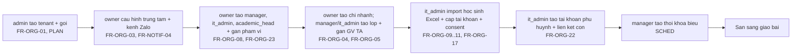
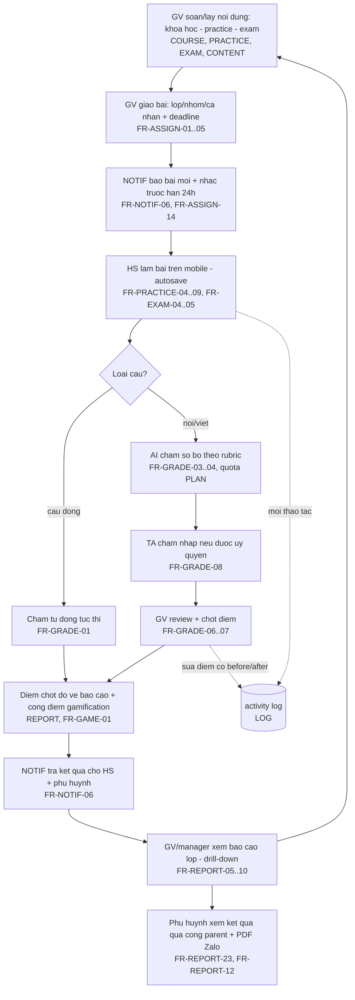
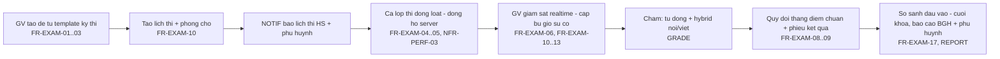
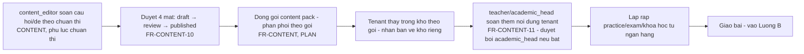

# Luồng nghiệp vụ chính — truy vết yêu cầu gốc

**Trạng thái:** 🟢 Đã chốt

> Tài liệu này chứng minh bộ SRS phủ **đúng luồng yêu cầu gốc** của chủ sản phẩm, nối các module thành 4 luồng xuyên suốt. Mỗi bước ghi rõ module + FR chịu trách nhiệm — khi đổi yêu cầu, sửa từ đây lần ra các SRS liên quan.

## 1. Bảng truy vết yêu cầu gốc → nơi đáp ứng

| Yêu cầu gốc (nguyên văn chủ sản phẩm) | Nơi đáp ứng |
|---|---|
| "Giảng viên có thể giao bài cho học sinh" | [ASSIGN](../07-giao-bai/srs-giao-bai.md) — FR-ASSIGN-01→20 |
| "Khóa học… trong khóa học có practice, exam, video, flashcard, word excel powerpoint" | [COURSE](../04-khoa-hoc/srs-khoa-hoc.md) — content block 6 loại, FR-COURSE-01→22 |
| "Practice có các bài nghe nói đọc viết" | [PRACTICE](../05-practice/srs-practice.md) + [catalog ~24 loại câu hỏi](../99-phu-luc/01-loai-cau-hoi.md) |
| "Exam là các bài thi thử" | [EXAM](../06-exam/srs-exam.md) — template IELTS/TOEIC/VSTEP/Cambridge/HSK/JLPT/TOPIK |
| "Hệ thống báo cáo đầy đủ học sinh làm bài như nào" | [REPORT](../09-bao-cao/srs-bao-cao.md) — 4 cấp + cổng phụ huynh |
| "Có các quyền: BGH, giáo viên/giảng viên, trợ giảng, học sinh; admin, nhân viên nội dung, support" + "thêm quyền IT trung tâm" + "tách quyền NV quản lý với quyền trung tâm" | [AUTH](../02-phan-quyen/srs-phan-quyen.md) — 11 vai trò, ma trận §6 |
| "B2B phục vụ trung tâm ngoại ngữ" | [Multi-tenant](../01-kien-truc/02-multi-tenant.md), [PLAN](../14-goi-dich-vu/srs-goi-dich-vu.md) |
| "Python, React HeroUI 100%, Postgres, MinIO → S3/R2" | [Kiến trúc](../01-kien-truc/01-kien-truc-tong-the.md), [Lưu trữ file](../01-kien-truc/04-luu-tru-file.md), [Cấu trúc code](../01-kien-truc/05-cau-truc-code.md) |
| "Bảo mật dữ liệu tuyệt đối" | [Bảo mật](../01-kien-truc/03-bao-mat.md) |
| "Quản lý file, code theo module dễ làm dễ sửa; folder doc theo module" | [Cấu trúc code](../01-kien-truc/05-cau-truc-code.md) + cấu trúc `docs/` này |
| "Mọi phần đều log phiên bản — ai sửa gì; có phần quản trị log theo từng phần" | [LOG](../18-quan-tri-log/srs-quan-tri-log.md) — activity log 2 tầng + UI quản trị |

## 2. Luồng A — Onboard trung tâm mới → sẵn sàng dạy

## 3. Luồng B — Vòng lặp dạy–học cốt lõi (yêu cầu trung tâm nhất)

Vòng lặp khép kín đúng thiết kế ở [Tầm nhìn §3](01-tam-nhin-san-pham.md): nội dung → giao bài → làm bài → chấm → báo cáo → điều chỉnh lần giao tiếp theo.

## 4. Luồng C — Thi thử tập trung cuối khóa

## 5. Luồng D — Vòng đời nội dung (kho global → tenant)

## 6. Điểm nối giữa các module (hay bị bỏ sót — đã kiểm tra)

| Điểm nối | Cơ chế | Doc |
|---|---|---|
| Nộp bài → trừ quota AI | Kiểm tra quota trước khi enqueue chấm; hết quota → GV chấm tay | GRADE §5.4, PLAN |
| Điểm chốt → báo cáo | Event cập nhật pre-aggregate incremental | REPORT §pipeline |
| Điểm chốt → gamification | Chỉ attempt đầu được cộng điểm; trần điểm/ngày | GAME anti-gaming |
| Điểm danh vắng → Zalo phụ huynh | Digest cuối buổi (đã chốt NOTIF #2) | SCHED, NOTIF |
| Học sinh vào lớp muộn → nhận bài còn hạn | Đã chốt ASSIGN #2 | ASSIGN |
| Sửa điểm sau chốt → log + thông báo | change_reason + audit + activity log + NOTIF | GRADE FR-10, LOG |
| Xóa học sinh → ẩn danh nhưng báo cáo không lệch | Anonymize giữ số liệu thống kê | ORG §5.3, Bảo mật §7 |
| Mọi thao tác ghi → activity log | Interceptor service layer, async | LOG §5.1 |

## Lịch sử thay đổi

| Ngày | Thay đổi | Người |
|---|---|---|
| 2026-07-17 | Tạo tài liệu truy vết luồng theo yêu cầu tổng rà soát | Claude |
| 2026-07-17 | Chốt — chuyển trạng thái Đã chốt | Chủ sản phẩm |
