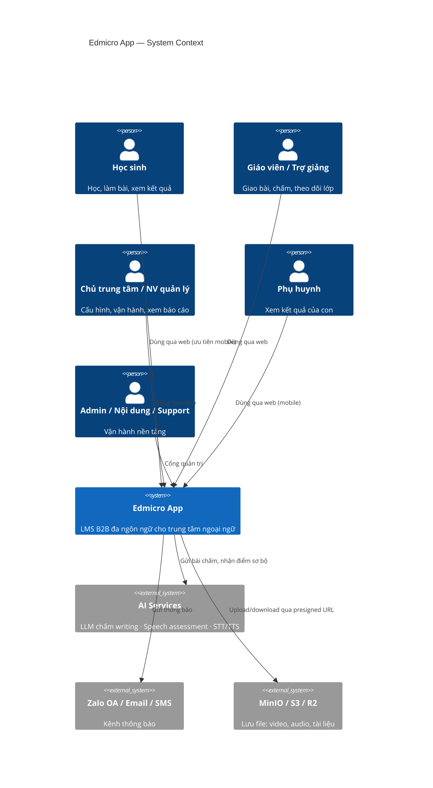
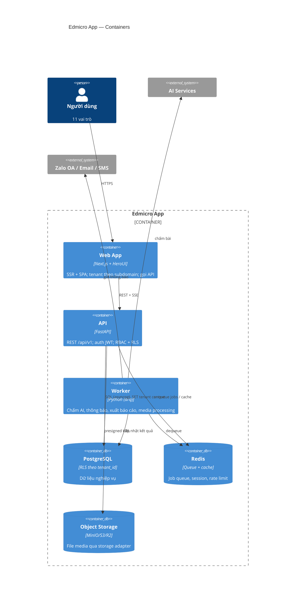
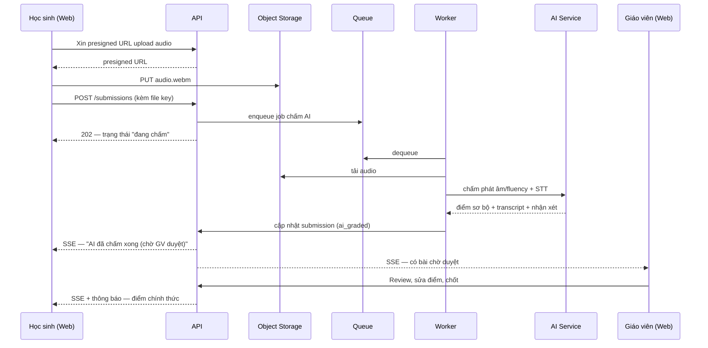

# Kiến trúc tổng thể

**Trạng thái:** 🟢 Đã chốt

## 1. Tech stack & lý do chọn

| Tầng        | Công nghệ                                                           | Lý do                                                                                                                                                             |
| ------------ | --------------------------------------------------------------------- | ------------------------------------------------------------------------------------------------------------------------------------------------------------------ |
| Frontend     | **Next.js (App Router) + HeroUI + Tailwind CSS**                | HeroUI hỗ trợ first-class cho Next.js; middleware xử lý tenant theo subdomain; team đã quen Next.js (edmicro-tools).**100% component UI dùng HeroUI** |
| Backend      | **Python FastAPI**                                              | Async tốt cho I/O (file, AI API); team đã dùng FastAPI; hệ sinh thái AI/xử lý file mạnh                                                                   |
| Database     | **PostgreSQL 16+**                                              | RLS cho multi-tenant, JSONB cho nội dung câu hỏi linh hoạt, full-text search                                                                                   |
| Job queue    | **Redis + worker (arq/celery)**                                 | Chấm AI, gửi thông báo, xuất báo cáo là việc bất đồng bộ                                                                                              |
| File storage | **MinIO** (local) → S3/R2 qua **storage adapter**        | S3-compatible API — đổi nhà cung cấp bằng config, không đổi code                                                                                          |
| AI services  | LLM (chấm writing/nhận xét) + Speech assessment (chấm nói) + STT | Qua service layer riêng, có quota — xem[SRS Chấm bài](../08-cham-bai/srs-cham-bai.md)                                                                          |
| Realtime     | SSE (Server-Sent Events)                                              | Đủ cho thông báo in-app + trạng thái chấm bài; đơn giản hơn WebSocket                                                                                  |

## 2. Sơ đồ ngữ cảnh (C4 — Context)

## 3. Sơ đồ container (C4 — Container)

## 4. Nguyên tắc kiến trúc

1. **Module hóa theo nghiệp vụ** — backend và frontend chia folder theo 14 module nghiệp vụ (xem [Cấu trúc code](05-cau-truc-code.md)); module giao tiếp qua service interface, không import chéo repository của nhau.
2. **Tenant-first** — mọi bảng nghiệp vụ có `tenant_id`; RLS bật mặc định; không API nào trả dữ liệu vượt tenant (trừ vai trò platform có kiểm soát) — xem [Multi-tenant](02-multi-tenant.md).
3. **Bất đồng bộ cho việc nặng** — chấm AI, gửi thông báo, xuất báo cáo, xử lý media đều qua queue; API chỉ nhận yêu cầu và trả trạng thái job.
4. **Storage adapter** — code chỉ gọi interface `Storage`; MinIO/S3/R2 là driver — xem [Lưu trữ file](04-luu-tru-file.md).
5. **AI provider adapter** — chấm AI qua interface, cho phép đổi nhà cung cấp/model theo cấu hình và theo phương án on-premise.
6. **API versioning** — mọi endpoint dưới `/api/v1/`; thay đổi phá vỡ tương thích → bump version.
7. **Log-by-design 2 tầng** — mọi thao tác ghi trên mọi module tự động vào **activity log** (ai sửa gì, before/after — interceptor ở service layer, ghi async); hành động nhạy cảm ghi thêm **audit log** bất biến. UI quản trị log theo module: xem [SRS Quản trị log](../18-quan-tri-log/srs-quan-tri-log.md).

## 5. Quyết định kiến trúc (ADR tóm tắt)

| # | Quyết định                        | Lựa chọn khác đã cân nhắc  | Lý do chốt                                                                                                                      |
| - | ------------------------------------ | --------------------------------- | --------------------------------------------------------------------------------------------------------------------------------- |
| 1 | Next.js App Router                   | React SPA (Vite)                  | HeroUI first-class, middleware tenant subdomain, SEO trang public, team quen                                                      |
| 2 | 1 DB chung + RLS                     | DB riêng mỗi tenant             | Vận hành đơn giản, chi phí thấp; on-premise = deploy 1 tenant cùng codebase; RLS đủ mạnh khi kết hợp app-level check |
| 3 | REST (không GraphQL)                | GraphQL                           | Đơn giản, dễ cache, đủ cho domain; FastAPI + OpenAPI sinh types cho frontend                                                |
| 4 | SSE cho realtime                     | WebSocket                         | Nhu cầu chỉ là server→client (thông báo, trạng thái chấm); SSE đơn giản, qua được proxy                            |
| 5 | Monorepo`backend/` + `frontend/` | Repo tách                        | Đồng bộ types OpenAPI, PR xuyên tầng, giống mô hình edmicro-tools đã chạy tốt                                         |
| 6 | JSONB cho`question.content`        | Bảng riêng mỗi loại câu hỏi | ~20 loại câu hỏi, cấu trúc khác nhau; JSONB + JSON Schema validation linh hoạt mà vẫn kiểm soát                        |

## 6. Luồng dữ liệu chính (ví dụ: nộp bài speaking)

## Lịch sử thay đổi

| Ngày      | Thay đổi                  | Người |
| ---------- | --------------------------- | ------- |
| 2026-07-16 | Tạo bản nháp đầu tiên | Claude  |
| 2026-07-16 | Cập nhật 11 vai trò + phụ huynh trong sơ đồ C4 | Chủ sản phẩm |
| 2026-07-17 | Nguyên tắc #7 mở rộng thành log 2 tầng (activity + audit) | Chủ sản phẩm + Claude |
