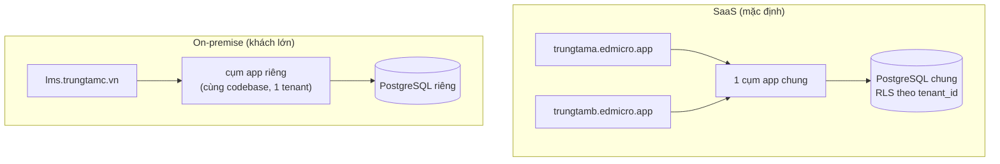

# Multi-tenant

**Trạng thái:** 🟢 Đã chốt

## 1. Mô hình

**1 hệ thống chung — mỗi trung tâm là 1 tenant** — cách ly dữ liệu bằng `tenant_id` + Postgres **Row-Level Security (RLS)**. Khách hàng lớn yêu cầu riêng → **on-premise**: deploy cùng codebase với 1 tenant duy nhất.



## 2. Nhận diện tenant

| Bước | Cơ chế |
|---|---|
| 1. Request đến | Subdomain `<slug>.edmicro.app` (SaaS) hoặc custom domain (on-premise/khách lớn SaaS) |
| 2. Next.js middleware | Đọc host → resolve `tenant_slug` → gắn vào header nội bộ khi gọi API |
| 3. API auth | JWT chứa `tenant_id` + `role`; API đối chiếu JWT ↔ tenant của request — lệch là 401 |
| 4. DB session | Mỗi transaction `SET LOCAL app.tenant_id = '<uuid>'` → RLS policy lọc mọi truy vấn |

- User thuộc **đúng 1 tenant**. Người dạy ở 2 trung tâm dùng 2 tài khoản (v1 — ghi ở Câu hỏi mở).
- Vai trò platform (`admin`, `content_editor`, `support_agent`) đăng nhập ở **cổng quản trị riêng** `ops.edmicro.app`, không thuộc tenant nào; truy cập dữ liệu tenant phải qua cơ chế được kiểm soát (mục 4).

## 3. Cách ly dữ liệu bằng RLS

- **Mọi bảng nghiệp vụ** có cột `tenant_id UUID NOT NULL` (trừ bảng platform: `tenants`, `plans`, `platform_users`, kho nội dung global).
- RLS bật trên mọi bảng nghiệp vụ, policy mẫu:

```sql
ALTER TABLE submissions ENABLE ROW LEVEL SECURITY;
ALTER TABLE submissions FORCE ROW LEVEL SECURITY;  -- áp cả owner

CREATE POLICY tenant_isolation ON submissions
  USING (tenant_id = current_setting('app.tenant_id')::uuid);
```

- App connect bằng role DB **không có** `BYPASSRLS`. Migration/maintenance dùng role riêng.
- **Phòng thủ 2 lớp**: ngoài RLS, tầng repository vẫn luôn filter `tenant_id` tường minh — RLS là lưới an toàn, không phải chỗ dựa duy nhất.
- Kho nội dung dùng chung (platform content) nằm ở bảng có `tenant_id NULL` + cờ `is_global`; tenant chỉ **đọc** phần được phân phối theo gói — ghi rõ trong [SRS Nội dung](../10-noi-dung/srs-noi-dung.md).

## 4. Truy cập xuyên tenant (chỉ vai trò platform)

| Ai | Được gì | Kiểm soát |
|---|---|---|
| `admin` | CRUD tenant, gán gói, xem số liệu sử dụng (usage) — **không** xem nội dung bài làm | Audit log |
| `support_agent` | Impersonation user cụ thể khi xử lý ticket | Phải gắn ticket, giới hạn 30 phút, audit đầy đủ, banner hiển thị cho chính user — xem [SRS Hỗ trợ](../15-ho-tro/srs-ho-tro.md) |
| `content_editor` | Ghi kho nội dung global; không truy cập dữ liệu học tập tenant | Audit log |

Kỹ thuật: request platform chạy với `app.tenant_id` của tenant đích **chỉ khi** đã qua kiểm tra quyền + ghi audit; không có "chế độ xem tất cả tenant cùng lúc" ở tầng API nghiệp vụ.

## 5. Tài nguyên khác theo tenant

| Tài nguyên | Cách ly |
|---|---|
| File (MinIO/S3) | Prefix `tenant/<tenant_id>/…`; presigned URL cấp theo quyền từng file — xem [Lưu trữ file](04-luu-tru-file.md) |
| Queue jobs | Payload mang `tenant_id`; worker set tenant context trước khi chạm DB |
| Cache (Redis) | Key prefix `t:<tenant_id>:` |
| Quota | Đếm theo tenant: học sinh active, GB lưu trữ, lượt chấm AI/tháng — xem [SRS Gói dịch vụ](../14-goi-dich-vu/srs-goi-dich-vu.md) |
| Cấu hình riêng | Logo, màu chủ đạo (theme HeroUI), múi giờ, năm học, kênh Zalo OA riêng của tenant |

## 6. SaaS vs on-premise — khác biệt vận hành

| Khía cạnh | SaaS | On-premise |
|---|---|---|
| Codebase | Chung | Chung (cùng release, cùng docker images) |
| Tenant | Nhiều | 1 (cấu hình `SINGLE_TENANT=1`, bỏ qua resolve subdomain) |
| AI services | Cloud API chung của platform | Cloud API bằng key của khách **hoặc** model local (tùy chọn, chất lượng thấp hơn — ghi rõ với khách) |
| Cập nhật | Rolling update do Edmicro | Bản phát hành có đánh số, khách/Edmicro chạy script upgrade |
| Thông báo Zalo/SMS | Cấu hình platform | Cấu hình của khách |
| Backup | Edmicro chịu trách nhiệm | Khách chịu trách nhiệm (kèm hướng dẫn + script) — xem [Vận hành](07-van-hanh-trien-khai.md) |

## 7. Câu hỏi mở cần chốt

| # | Câu hỏi | Quyết định | Ngày chốt |
|---|---|---|---|
| 1 | 1 người dạy nhiều trung tâm: v1 dùng 2 tài khoản riêng — chấp nhận? | **Chốt:** v1 dùng 2 tài khoản riêng; hợp nhất tài khoản để v2 | 2026-07-16 |
| 2 | Custom domain cho tenant SaaS (VD `hoctap.trungtama.vn`) có trong v1 không, hay chỉ subdomain? | **Chốt:** v1 chỉ subdomain; custom domain thiết lập tay theo hợp đồng khách lớn, tự phục vụ để v2 | 2026-07-16 |
| 3 | On-premise có bắt buộc tối thiểu gói hạ tầng (RAM/CPU/GPU cho AI local) — chốt spec ở doc vận hành? | **Chốt:** Có — spec tối thiểu ghi ở Vận hành §6 (8 vCPU/32GB/500GB; GPU chỉ khi chọn AI local) | 2026-07-16 |

## Lịch sử thay đổi

| Ngày | Thay đổi | Người |
|---|---|---|
| 2026-07-16 | Tạo bản nháp đầu tiên | Claude |
| 2026-07-16 | Chốt toàn bộ câu hỏi mở (quyết định ghi trong bảng), chuyển trạng thái Đã chốt | Chủ sản phẩm |
