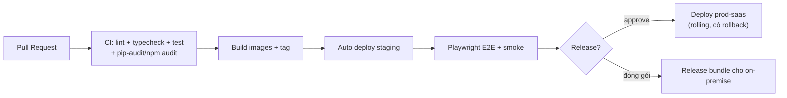

# Vận hành & triển khai

**Trạng thái:** 🟢 Đã chốt

## 1. Đóng gói

- Toàn bộ hệ thống đóng gói **Docker images**: `frontend` (Next.js standalone), `api` (FastAPI), `worker` (arq), kèm `postgres`, `redis`, `minio` chuẩn.
- 1 file `docker-compose.yml` chạy được toàn hệ thống — dùng cho dev, on-premise và SaaS quy mô đầu (single-node); scale ngang sau này bằng cách tách services (không đổi image).
- Release đánh số **SemVer** (`v1.4.2`), mỗi release gồm: images (đã ký digest), changelog, script migrate.

## 2. Môi trường

| Môi trường | Mục đích | Dữ liệu |
|---|---|---|
| `dev` (local) | Phát triển — docker compose + seed data | Dữ liệu giả (script `scripts/seed`) |
| `staging` | Kiểm thử trước release, chạy load test | Dữ liệu giả + bản sao ẩn danh hóa (không bao giờ copy dữ liệu thật chưa ẩn danh) |
| `prod-saas` | SaaS chính, hạ tầng đặt tại **Việt Nam** (tuân thủ lưu trú dữ liệu) | Dữ liệu thật |
| `prod-onprem-<khách>` | Instance on-premise của khách | Dữ liệu của khách, khách chịu trách nhiệm hạ tầng |

## 3. CI/CD

- Merge vào `main` = deploy staging tự động; deploy prod cần approve thủ công.
- Migration chạy trước khi chuyển traffic; mọi release có đường rollback (image trước + script down-migration nếu cần).
- **Load test** (kịch bản 500 HS thi đồng thời — [NFR](06-yeu-cau-phi-chuc-nang.md)) chạy trên staging trước mỗi release lớn.

## 4. Backup & khôi phục

| Đối tượng | Cách backup | Tần suất | Lưu |
|---|---|---|---|
| PostgreSQL | WAL archiving (RPO ≤ 15') + full dump | WAL liên tục; dump hằng ngày | 30 ngày, mã hóa, lưu chéo site |
| Object storage | Versioning + replicate sang bucket backup | Liên tục | 30 ngày |
| Cấu hình/secrets | IaC + secret manager | Theo thay đổi | — |

- **Diễn tập khôi phục mỗi quý** trên staging: restore từ backup thật (ẩn danh hóa), đo RTO.
- On-premise: kèm script `backup.sh`/`restore.sh` + tài liệu hướng dẫn; trách nhiệm chạy thuộc khách (ghi trong hợp đồng).

## 5. Giám sát & cảnh báo

| Lớp | Công cụ | Cảnh báo chính |
|---|---|---|
| Uptime | Healthcheck `/health` từng service + probe ngoài | Service down > 2' |
| Metrics | Prometheus + Grafana | API p95 vượt ngưỡng, queue depth tăng bất thường, disk > 80%, lỗi AI > 5% |
| Logs | Loki (hoặc tương đương) — JSON, correlation id | Spike 5xx, spike 401/403 (dấu hiệu tấn công) |
| Errors | Sentry self-host | Lỗi mới sau release |
| Nghiệp vụ | Dashboard quota/tenant | Tenant chạm 90% quota (báo cả admin lẫn tenant) |

## 6. On-premise — gói triển khai

- **Yêu cầu tối thiểu**: 1 máy chủ Linux (Ubuntu 22.04+/Debian 12+), 8 vCPU / 32GB RAM / SSD 500GB (điển hình 1.000 học sinh); Docker + Docker Compose. AI local (nếu chọn) cần GPU — spec riêng theo model.
- **Cài đặt**: script `install.sh` (như mô hình `infra/` của edmicro-tools) — hỏi config → sinh `.env` → kéo images → migrate → healthcheck.
- **Cập nhật**: `upgrade.sh <version>` — backup tự động trước khi migrate; giữ 2 bản trước để rollback.
- **AI cho on-premise**: mặc định gọi cloud AI bằng key của khách; tùy chọn model local (chất lượng thấp hơn, cần GPU) — quyết định theo hợp đồng, xem [SRS Chấm bài](../08-cham-bai/srs-cham-bai.md).
- **Hỗ trợ từ xa**: khách mở kênh (VPN/tunnel) khi cần Edmicro can thiệp; mọi phiên can thiệp ghi log.

## 7. Câu hỏi mở cần chốt

| # | Câu hỏi | Quyết định | Ngày chốt |
|---|---|---|---|
| 1 | Hạ tầng SaaS đặt ở đâu (VNG Cloud / Viettel / FPT / máy chủ riêng)? | **Chốt:** Cloud VN có cam kết lưu trú dữ liệu; chọn nhà cung cấp cụ thể khi xin báo giá — không ảnh hưởng thiết kế | 2026-07-16 |
| 2 | Kubernetes ngay từ v1 hay docker-compose single-node rồi nâng cấp khi cần? | **Chốt:** docker-compose single-node trước; K8s khi cần scale | 2026-07-16 |

## Lịch sử thay đổi

| Ngày | Thay đổi | Người |
|---|---|---|
| 2026-07-16 | Tạo bản nháp đầu tiên | Claude |
| 2026-07-16 | Chốt toàn bộ câu hỏi mở (quyết định ghi trong bảng), chuyển trạng thái Đã chốt | Chủ sản phẩm |
