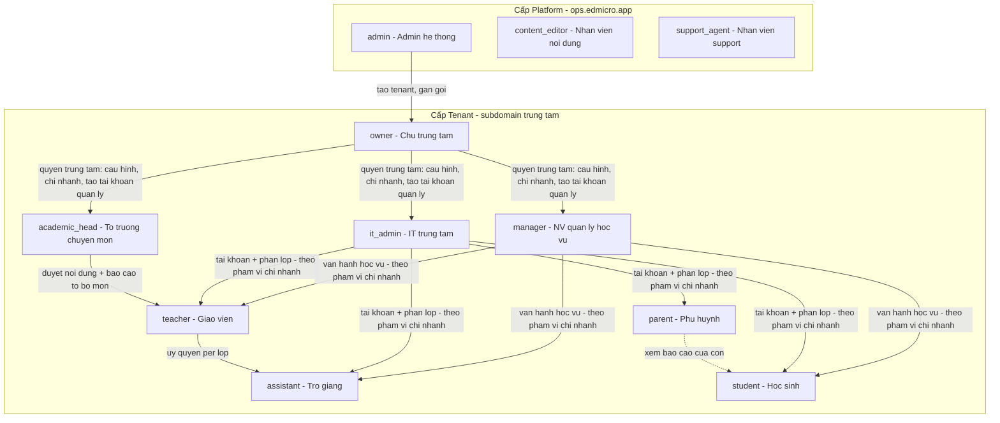
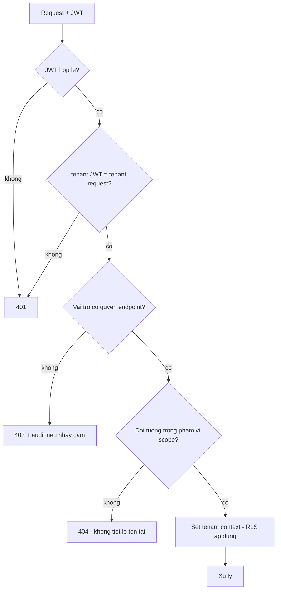
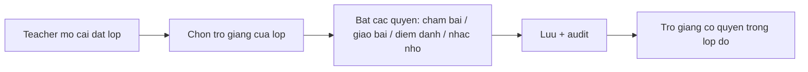

# SRS — Phân quyền (RBAC)

**Mã module:** `AUTH`
**Trạng thái:** 🟢 Đã chốt
**Phụ thuộc:** [Multi-tenant](../01-kien-truc/02-multi-tenant.md), [Bảo mật](../01-kien-truc/03-bao-mat.md)

## 1. Mục đích

Định nghĩa 11 vai trò và ma trận quyền thống nhất cho toàn hệ thống. Mọi module khác tham chiếu ma trận này; API kiểm tra quyền theo đúng bảng dưới đây (deny-by-default).

**Nguyên tắc tách quyền quản lý** (quyết định 2026-07-16): quyền trong tenant tách làm 2 tầng — **quyền trung tâm** thuộc `owner` (Chủ trung tâm: cấu hình, kênh, chi nhánh, gói, tài khoản quản lý, audit) và **quyền nhân viên quản lý** thuộc `manager` (học vụ: lớp, học sinh, giao bài, báo cáo). `owner` kế thừa toàn bộ quyền `manager`; `manager` không có quyền trung tâm.

## 2. Phạm vi

- **Trong phạm vi (v1):** 11 vai trò cố định; phạm vi dữ liệu theo vai trò (scope); **phạm vi chi nhánh** cho `manager`/`it_admin` và **phạm vi tổ chuyên môn** (ngôn ngữ + chi nhánh tùy chọn) cho `academic_head`; ủy quyền trợ giảng per lớp; liên kết phụ huynh–học sinh; kiểm tra quyền tầng API + RLS tầng DB.
- **Ngoài phạm vi (v2):** vai trò tùy biến (custom role), quyền chi tiết per người dùng, SSO/SAML.

## 3. Mô hình vai trò

**Nguyên tắc phạm vi dữ liệu (scope):**

| Vai trò | Phạm vi thấy dữ liệu |
|---|---|
| `student` | Chỉ dữ liệu của chính mình |
| `parent` | Chỉ dữ liệu **kết quả** của học sinh được liên kết (báo cáo, điểm chốt, chuyên cần, lịch học); không xem nội dung bài học/đề thi/bài làm chi tiết |
| `assistant` | Lớp được gán làm trợ giảng |
| `teacher` | Lớp mình dạy (chủ nhiệm hoặc được gán) |
| `academic_head` | Như teacher + phạm vi tổ: nội dung & báo cáo của các lớp thuộc ngôn ngữ được gán (tùy chọn giới hạn chi nhánh) |
| `manager` | **Phạm vi được gán**: toàn tenant hoặc 1+ chi nhánh — dữ liệu vận hành học vụ (lớp, học sinh, báo cáo, lịch) |
| `owner` | Toàn tenant, mọi dữ liệu — duy nhất có quyền trung tâm (cấu hình, kênh, chi nhánh, gói, audit) |
| `it_admin` | **Phạm vi được gán** (toàn tenant hoặc chi nhánh) nhưng **chỉ dữ liệu tổ chức & tài khoản**; **không** thấy dữ liệu học tập (điểm, bài làm, báo cáo, nội dung) |
| `admin` | Metadata mọi tenant (không xem nội dung học tập) |
| `content_editor` | Kho nội dung global; không thấy dữ liệu tenant |
| `support_agent` | Ticket + tra cứu vận hành; dữ liệu tenant chỉ qua impersonation có kiểm soát |

1 user có đúng 1 vai trò trong tenant của mình (v1 — không kiêm nhiệm; đã chốt ở câu hỏi #1). Phụ huynh có nhiều con trong cùng trung tâm dùng 1 tài khoản `parent` liên kết nhiều học sinh; khác trung tâm thì mỗi trung tâm 1 tài khoản (nhất quán mô hình 1 user – 1 tenant).

## 4. User stories

- `US-AUTH-01` — Là **manager**, tôi muốn gán vai trò khi tạo tài khoản để mỗi người chỉ thấy đúng phần việc của họ.
- `US-AUTH-02` — Là **teacher**, tôi muốn ủy quyền chấm bài cho trợ giảng theo từng lớp để san tải nhưng vẫn giữ quyền chốt điểm.
- `US-AUTH-03` — Là **student**, tôi yên tâm rằng bạn cùng lớp không xem được điểm của tôi.
- `US-AUTH-04` — Là **admin**, tôi muốn mọi thay đổi vai trò được ghi audit để truy vết.
- `US-AUTH-05` — Là **IT trung tâm**, tôi muốn quản lý tài khoản và phân lớp trong phạm vi được gán mà không nhìn thấy điểm số của học sinh, để làm đúng phận sự kỹ thuật và trung tâm yên tâm về dữ liệu.
- `US-AUTH-06` — Là **chủ trung tâm (owner)**, tôi muốn giữ độc quyền cấu hình trung tâm, chi nhánh, kênh thông báo và tài khoản quản lý, để nhân viên quản lý chỉ lo vận hành học vụ và không đụng được vào phần "sở hữu" của trung tâm.
- `US-AUTH-07` — Là **nhân viên quản lý (manager)**, tôi muốn có đủ quyền vận hành lớp/học sinh/báo cáo trong chi nhánh được gán, để làm việc hằng ngày mà không cần mượn tài khoản chủ trung tâm.
- `US-AUTH-08` — Là **tổ trưởng chuyên môn**, tôi muốn duyệt nội dung và xem báo cáo các lớp trong tổ của mình, để đảm bảo chất lượng chuyên môn theo ngôn ngữ tôi phụ trách.
- `US-AUTH-09` — Là **phụ huynh**, tôi muốn đăng nhập xem kết quả học và chuyên cần của con, để không phụ thuộc vào tin nhắn Zalo rời rạc.

## 5. Luồng hoạt động

### 5.1 Kiểm tra quyền mỗi request

### 5.2 Ủy quyền trợ giảng

Ủy quyền là **per lớp + per nhóm quyền**; teacher/manager thu hồi được bất kỳ lúc nào. Điểm do trợ giảng chấm vẫn ở trạng thái chờ teacher chốt (xem [SRS Chấm bài](../08-cham-bai/srs-cham-bai.md)).

## 6. Ma trận quyền (rút gọn theo nhóm chức năng)

Chú thích: ✅ toàn quyền trong scope · 👁 chỉ xem trong scope · 🔸 khi được ủy quyền · ─ không có quyền.

Cột vai trò tenant xếp theo mức quyền tăng dần; `manager`, `it_admin`, `academic_head` luôn hiểu là **trong phạm vi được gán** (chi nhánh / tổ).

| Chức năng | student | parent | assistant | teacher | academic_head | manager | owner | it_admin | admin | content_editor | support_agent |
|---|---|---|---|---|---|---|---|---|---|---|---|
| **ORG** — cấu hình trung tâm (logo, theme, múi giờ, năm học) | ─ | ─ | ─ | ─ | ─ | ─ | ✅ | 👁 | ✅ (tạo/khóa tenant) | ─ | 👁 |
| **ORG** — chi nhánh (CRUD) | ─ | ─ | ─ | ─ | ─ | 👁 | ✅ | 👁 | ─ | ─ | 👁 |
| **ORG** — lớp (tạo/sửa, gán GV/TA, xếp HS) | 👁 (của mình) | 👁 lớp của con | 👁 lớp gán | 👁 lớp mình | 👁 lớp trong tổ | ✅ | ✅ | ✅ (tạo/sửa lớp + phân người) | ─ | ─ | 👁 |
| **ORG** — tài khoản user | 👁 hồ sơ mình | 👁 hồ sơ mình + liên kết con | ─ | quản lý HS lớp mình | như teacher | ✅ HS/GV/TA/parent — không tạo vai trò quản lý | ✅ mọi vai trò tenant (kể cả manager/it_admin/academic_head, đổi vai trò) | ✅ HS/GV/TA/parent: tạo/import/reset/khóa/xóa/chuyển lớp — **trừ** vai trò quản lý & đổi vai trò | ─ | ─ | 👁 |
| **COURSE** — soạn khóa học tenant | ─ | ─ | ─ | ✅ | ✅ | ✅ | ✅ | ─ | ─ | ─ | ─ |
| **COURSE** — học | ✅ | ─ | 👁 | 👁 | 👁 | 👁 | 👁 | ─ | ─ | ─ | ─ |
| **CONTENT** — ngân hàng câu hỏi tenant | ─ | ─ | 👁 | ✅ | ✅ + **duyệt** (khi tenant bật) | ✅ + duyệt | ✅ + duyệt | ─ | ─ | ─ | ─ |
| **CONTENT** — kho global | ─ | ─ | ─ | 👁 (theo gói) | 👁 (theo gói) | 👁 (theo gói) | 👁 (theo gói) | ─ | ─ | ✅ | ─ |
| **PRACTICE/EXAM** — làm bài | ✅ | ─ | ─ | preview | preview | preview | preview | ─ | ─ | preview | ─ |
| **ASSIGN** — giao bài | ─ | ─ | 🔸 | ✅ (lớp mình) | ✅ (lớp trong tổ) | ✅ | ✅ | ─ | ─ | ─ | ─ |
| **GRADE** — chấm/duyệt AI | ─ | ─ | 🔸 (chấm nháp) | ✅ (chốt điểm) | ✅ | ✅ | ✅ | ─ | ─ | ─ | ─ |
| **GRADE** — sửa điểm đã chốt | ─ | ─ | ─ | ✅ (log audit) | ✅ (log audit) | ✅ (log audit) | ✅ (log audit) | ─ | ─ | ─ | ─ |
| **REPORT** — cấp học sinh | ✅ (của mình) | ✅ (con mình — bản kết quả) | 👁 lớp gán | 👁 lớp mình | 👁 lớp trong tổ | ✅ | ✅ | ─ | ─ | ─ | ─ |
| **REPORT** — cấp lớp / trung tâm | ─ | ─ | 👁 lớp gán | 👁 lớp mình | 👁 tổ bộ môn | ✅ (phạm vi gán) | ✅ toàn tenant | ─ | ─ | ─ | ─ |
| **NOTIF** — cấu hình kênh (Zalo OA, SMTP, SMS) | ─ | ─ | ─ | ─ | ─ | ─ | ✅ | ─ | ✅ platform | ─ | ─ |
| **NOTIF** — gửi thông báo thủ công | ─ | ─ | 🔸 (lớp gán) | ✅ (lớp mình) | ✅ (tổ) | ✅ (phạm vi gán) | ✅ toàn tenant | ─ | ✅ toàn platform | ─ | ─ |
| **SCHED** — lịch/điểm danh | 👁 (của mình) | 👁 lịch + chuyên cần của con | ✅ điểm danh lớp gán | ✅ lớp mình | ✅ lớp trong tổ | ✅ | ✅ | 👁 lịch (không điểm danh) | ─ | ─ | ─ |
| **GAME** — points/leaderboard | ✅ (của mình + BXH) | 👁 của con | 👁 lớp gán | 👁 + thưởng điểm | 👁 + thưởng điểm | 👁 + thưởng điểm | ✅ bật/tắt tenant + per lớp | ─ | ✅ quy tắc điểm | ─ | ─ |
| **PLAN** — gói & quota | ─ | ─ | ─ | ─ | ─ | ─ | 👁 usage tenant + cảnh báo | 👁 usage tenant | ✅ | ─ | 👁 |
| **SUPPORT** — ticket | ✅ tạo | ✅ tạo | ✅ tạo | ✅ tạo | ✅ tạo | ✅ tạo | ✅ tạo | ✅ tạo | ✅ + báo cáo | ✅ tạo | ✅ xử lý |
| **SUPPORT** — impersonation | ─ | ─ | ─ | ─ | ─ | ─ | tắt/bật cho tenant | ─ | ─ | ─ | ✅ (ràng buộc chặt) |
| **Audit log** | ─ | ─ | ─ | ─ | ─ | ─ | 👁 toàn tenant | 👁 (chỉ sự kiện tài khoản/phân lớp) | ✅ | ─ | 👁 (phục vụ ticket) |
| **LOG** — quản trị activity log | ─ | ─ | ─ | 👁 timeline đối tượng lớp mình | 👁 log nội dung tổ | 👁 log nghiệp vụ phạm vi gán | ✅ toàn tenant | 👁 log tài khoản/phân lớp phạm vi gán | ✅ platform + tenant (có audit) | 👁 kho global | 👁 theo ticket (có audit) |

> Ma trận chi tiết đến từng endpoint sẽ sinh tự động từ code (decorator khai báo quyền) và đối chiếu lại với bảng này khi implement. SRS mỗi module lặp lại phần vai trò liên quan của module đó — nếu lệch, **bảng này là chuẩn**.

## 7. Yêu cầu chức năng

| Mã | Yêu cầu | Vai trò | Ưu tiên |
|---|---|---|---|
| FR-AUTH-01 | Hệ thống có đúng 11 vai trò cố định như mục 3; không tạo/sửa vai trò ở v1 | — | Must |
| FR-AUTH-02 | Mọi endpoint khai báo quyền tường minh; không khai báo → từ chối (deny-by-default) | — | Must |
| FR-AUTH-03 | Kiểm tra quyền 3 lớp: vai trò → scope đối tượng → RLS tenant | — | Must |
| FR-AUTH-04 | Truy cập ngoài scope trả 404 (không tiết lộ tồn tại), riêng sai vai trò trả 403 | — | Must |
| FR-AUTH-05 | Teacher ủy quyền trợ giảng per lớp theo 4 nhóm: chấm bài, giao bài, điểm danh, nhắc nhở | teacher, manager | Must |
| FR-AUTH-06 | Thu hồi ủy quyền có hiệu lực ngay (phiên đang mở cũng bị chặn ở request kế tiếp) | teacher, manager | Must |
| FR-AUTH-07 | Đổi vai trò user (VD teacher → manager) chỉ do owner; ghi audit before/after | owner | Must |
| FR-AUTH-08 | Vai trò platform bắt buộc 2FA; owner/manager/teacher bật 2FA tùy chọn (khuyến nghị nổi bật với owner) | — | Must |
| FR-AUTH-09 | JWT chứa: user_id, tenant_id, role; refresh xoay vòng; đổi vai trò → vô hiệu token cũ | — | Must |
| FR-AUTH-10 | Màn hình quản lý người dùng hiển thị rõ vai trò + phạm vi ủy quyền hiện có | manager, it_admin | Should |
| FR-AUTH-11 | Xuất ma trận quyền thực tế (từ code) để đối chiếu định kỳ với SRS | admin | Could |
| FR-AUTH-12 | `it_admin` bị chặn ở tầng API khỏi mọi endpoint dữ liệu học tập (điểm, bài làm, báo cáo, nội dung); không đổi vai trò user, không tạo tài khoản vai trò quản lý (việc này chỉ owner) | it_admin | Must |
| FR-AUTH-13 | Khuyến nghị bật 2FA hiển thị nổi bật với tài khoản `it_admin`; owner có thể ép buộc 2FA cho manager/it_admin/academic_head của tenant mình | it_admin, owner | Should |
| FR-AUTH-14 | Phạm vi chi nhánh: `manager` và `it_admin` gán "toàn trung tâm" hoặc 1+ chi nhánh; mọi kiểm tra quyền lọc theo phạm vi; owner thay đổi phạm vi có hiệu lực ngay, ghi audit | owner | Must |
| FR-AUTH-15 | `academic_head`: có mọi quyền teacher; thêm quyền duyệt nội dung tenant (khi tenant bật "cần duyệt") và xem báo cáo/ngân hàng câu hỏi của các lớp trong phạm vi tổ (ngôn ngữ được gán, tùy chọn giới hạn chi nhánh) | academic_head | Must |
| FR-AUTH-16 | `parent` liên kết 1+ học sinh (do owner/manager/it_admin thiết lập); chỉ truy cập nhóm endpoint "kết quả": báo cáo học tập, điểm chốt, chuyên cần, lịch học, thông báo — bị chặn khỏi nội dung bài học, đề thi, bài làm chi tiết, BXH lớp (chỉ thấy điểm/hạng của con) | parent | Must |
| FR-AUTH-17 | Quyền trung tâm (cấu hình tenant, kênh thông báo, chi nhánh, xem gói & usage, bật/tắt impersonation & gamification tenant, audit log tenant, tạo/đổi vai trò tài khoản quản lý) chỉ thuộc `owner`; `manager` gọi các endpoint này bị 403 + audit | owner | Must |
| FR-AUTH-18 | Chống chia sẻ tài khoản học sinh: giới hạn số phiên đăng nhập đồng thời per student (mặc định 2 thiết bị, cấu hình per tenant bởi owner); vượt giới hạn → phiên cũ nhất bị đăng xuất; cảnh báo owner khi 1 tài khoản đăng nhập bất thường (nhiều IP/thiết bị trong thời gian ngắn) | owner, hệ thống | Should |

## 8. Yêu cầu phi chức năng (riêng module)

- Kiểm tra quyền thêm ≤ 5ms/request (cache khai báo quyền trong process).
- Thay đổi ủy quyền lan truyền ngay (không cache quyền per-user quá 30s).

## 9. Màn hình chính

| Màn hình | Vai trò dùng | Mockup |
|---|---|---|
| Quản lý người dùng & vai trò (trong Cài đặt tenant) | manager | _sẽ bổ sung_ |
| Cài đặt ủy quyền trợ giảng (trong trang lớp) | teacher, manager | _sẽ bổ sung_ |

## 10. API sơ bộ

| Method | Path | Mô tả | Quyền |
|---|---|---|---|
| GET | `/api/v1/authz/me` | Vai trò + quyền hiệu lực của user hiện tại | mọi vai trò |
| PUT | `/api/v1/authz/users/{id}/role` | Đổi vai trò user trong tenant | manager |
| GET/PUT | `/api/v1/authz/classes/{id}/delegations` | Xem/sửa ủy quyền trợ giảng của lớp | teacher, manager |

## 11. Entity liên quan

`users.role`, `class_staff` (gán GV/TA vào lớp), `class_delegations` (ủy quyền per lớp), `audit_logs` — xem [ERD](../16-du-lieu/01-erd.md).

## 12. Câu hỏi mở cần chốt

| # | Câu hỏi | Quyết định | Ngày chốt |
|---|---|---|---|
| 1 | 1 người vừa dạy vừa là manager: v1 buộc chọn 1 vai trò (manager có đủ quyền teacher) — OK? | **Chốt:** v1 một vai trò/người; manager có đủ quyền teacher khi cần dạy | 2026-07-16 |
| 2 | Manager có được tự tạo tài khoản manager khác không, hay chỉ admin platform? (đề xuất: được, có audit) | **Chốt (cập nhật cùng ngày):** quyền tạo tài khoản quản lý chuyển cho `owner` khi tách vai trò — owner tạo manager/it_admin/academic_head, ghi audit | 2026-07-16 |
| 3 | `it_admin` có được tạo/sửa lớp và chi nhánh không, hay chỉ phân người vào lớp có sẵn? (đề xuất v1: được tạo/sửa **lớp**, không đụng chi nhánh) | **Chốt:** it_admin được tạo/sửa lớp, không đụng chi nhánh | 2026-07-16 |
| 4 | `it_admin` có được xem danh sách lớp kèm sĩ số/trạng thái enrollment nhưng ẩn cột điểm — đủ cho việc phân lớp chưa? | **Chốt:** Đúng — thấy sĩ số/enrollment, ẩn cột điểm | 2026-07-16 |

## Lịch sử thay đổi

| Ngày | Thay đổi | Người |
|---|---|---|
| 2026-07-16 | Tạo bản nháp đầu tiên | Claude |
| 2026-07-16 | Chốt toàn bộ câu hỏi mở (quyết định ghi trong bảng), chuyển trạng thái Đã chốt | Chủ sản phẩm |
| 2026-07-16 | Thêm vai trò `it_admin` (IT trung tâm): scope, ma trận, FR-AUTH-12/13 | Claude |
| 2026-07-16 | Tách `owner` (quyền trung tâm) khỏi `manager` (học vụ); thêm `academic_head`, `parent`, phạm vi chi nhánh — 11 vai trò; FR-AUTH-14→17 | Chủ sản phẩm |
| 2026-07-17 | Thêm FR-AUTH-18 chống chia sẻ tài khoản học sinh (phát hiện thiếu khi tổng rà soát) | Chủ sản phẩm + Claude |
| 2026-07-17 | Thêm dòng LOG vào ma trận quyền | Chủ sản phẩm + Claude |
