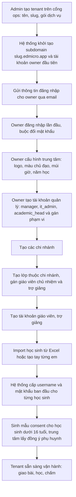
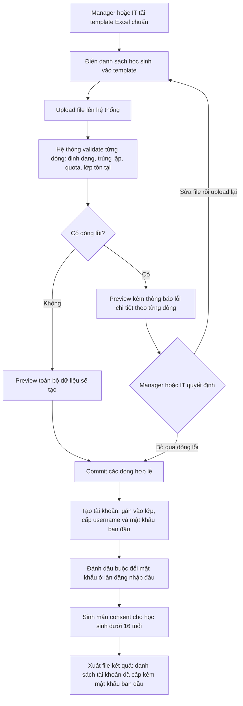
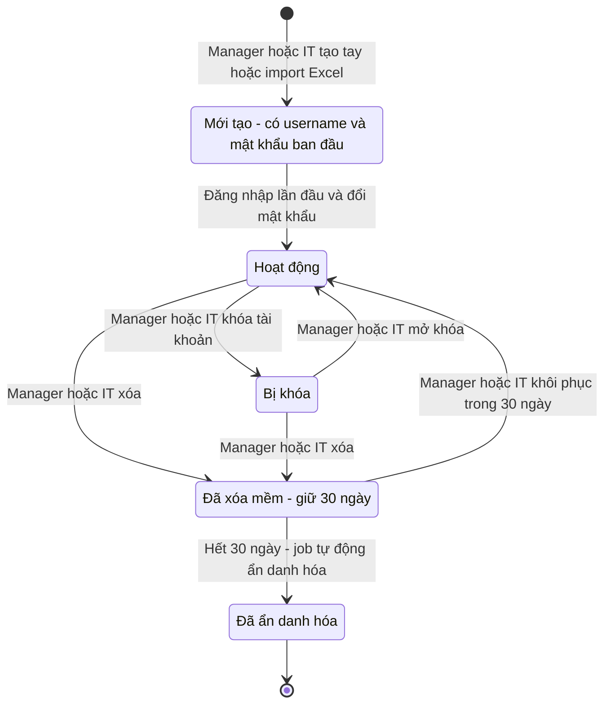

# SRS — Tổ chức & người dùng

**Mã module:** `ORG` (dùng trong mã FR: `FR-ORG-xx`)
**Trạng thái:** 🟢 Đã chốt
**Phụ thuộc:** `AUTH` ([Phân quyền](../02-phan-quyen/srs-phan-quyen.md) — đăng nhập, JWT, vai trò), `PLAN` ([Gói dịch vụ](../14-goi-dich-vu/srs-goi-dich-vu.md) — quota học sinh active theo gói). Nền tảng kỹ thuật: [Multi-tenant](../01-kien-truc/02-multi-tenant.md), [Bảo mật](../01-kien-truc/03-bao-mat.md).

## 1. Mục đích

Module này quản lý "bộ khung tổ chức" của toàn hệ thống: trung tâm (tenant), chi nhánh (branch), lớp học (class) và vòng đời người dùng (user). Đây là module nền — mọi module nghiệp vụ khác (giao bài, chấm bài, báo cáo…) đều tham chiếu cấu trúc tổ chức và danh sách người dùng do module này quản lý. Mục tiêu chính: giúp một trung tâm mới onboard nhanh (tạo tenant → cấu hình → import học sinh → vận hành) và quản lý tài khoản đúng chuẩn Nghị định 13/2023/NĐ-CP về bảo vệ dữ liệu cá nhân.

## 2. Phạm vi

- **Trong phạm vi (v1):**
  - Vòng đời tenant: `admin` platform tạo tenant (tên, slug subdomain, gói dịch vụ); tạm ngưng/kích hoạt lại; `owner` (tài khoản đầu tiên của tenant) cấu hình trung tâm: logo, màu chủ đạo (theme HeroUI), múi giờ, năm học.
  - Chi nhánh: CRUD bởi `owner`; mỗi lớp thuộc đúng 1 chi nhánh.
  - Tài khoản quản lý: `owner` tạo `manager`/`it_admin`/`academic_head` và gán **phạm vi**: manager/it_admin theo chi nhánh (hoặc toàn trung tâm), academic_head theo ngôn ngữ giảng dạy (tùy chọn kèm chi nhánh).
  - Tài khoản phụ huynh: tạo tài khoản `parent` và liên kết 1+ học sinh (tự động gợi ý theo SĐT phụ huynh trong hồ sơ học sinh).
  - Lớp học: tạo lớp, gán giáo viên chủ nhiệm + trợ giảng (1 lớp có thể có nhiều giáo viên/trợ giảng), thêm học sinh vào lớp, trạng thái lớp (sắp mở / đang học / kết thúc).
  - Vòng đời user: tạo tay từng người; **import hàng loạt từ Excel** (template chuẩn, validate, báo lỗi từng dòng, preview trước khi commit); cấp username/mật khẩu ban đầu (học sinh nhỏ không cần email, buộc đổi mật khẩu lần đầu); khóa/mở khóa; chuyển lớp; xóa = soft-delete 30 ngày → ẩn danh hóa.
  - Consent: khi tạo học sinh dưới 16 tuổi, hệ thống sinh mẫu thông báo xử lý dữ liệu cá nhân để trung tâm lấy đồng ý của phụ huynh; lưu vết trạng thái consent.
- **Ngoài phạm vi (để v2 / không làm):**
  - CRM tuyển sinh (lead, tư vấn, chuyển đổi).
  - Quản lý học phí, thanh toán.
  - Tự đăng ký tài khoản (self-signup).
  - SSO / đăng nhập bằng Google, Zalo…
  - Cơ chế đăng nhập, phiên, 2FA — thuộc [SRS Phân quyền](../02-phan-quyen/srs-phan-quyen.md).
  - Impersonation của support — thuộc [SRS Hỗ trợ](../15-ho-tro/srs-ho-tro.md).

## 3. Vai trò liên quan

| Vai trò | Tương tác với module này |
|---|---|
| Admin hệ thống (`admin`) | Tạo/tạm ngưng tenant, gán gói dịch vụ trên cổng ops; xem số liệu sử dụng — không xem dữ liệu học tập |
| Nhân viên nội dung (`content_editor`) | Không tương tác trực tiếp; chỉ dùng danh sách tenant khi phân phối nội dung (xem [SRS Nội dung](../10-noi-dung/srs-noi-dung.md)) |
| Nhân viên support (`support_agent`) | Tra cứu tenant/chi nhánh/lớp/user ở chế độ chỉ-đọc để xử lý ticket |
| Chủ trung tâm (`owner`) | Quyền trung tâm: cấu hình trung tâm, CRUD chi nhánh, tạo tài khoản quản lý (`manager`/`it_admin`/`academic_head`) + gán phạm vi, đổi vai trò; kế thừa mọi quyền manager |
| Nhân viên quản lý (`manager`) | Vận hành học vụ trong phạm vi được gán: CRUD lớp, gán GV/TA, quản lý HS/GV/TA/parent, consent — không cấu hình trung tâm/chi nhánh, không tạo vai trò quản lý |
| IT trung tâm (`it_admin`) | Quản lý tài khoản trong phạm vi chi nhánh được gán: tạo/import/reset mật khẩu/khóa/mở/xóa mềm user (trừ vai trò quản lý và đổi vai trò); tạo/sửa lớp + phân lớp: thêm/bớt/chuyển học sinh, gán GV/TA; tạo tài khoản parent + liên kết con; cập nhật consent. **Không** truy cập dữ liệu học tập (xem [SRS Phân quyền](../02-phan-quyen/srs-phan-quyen.md)) |
| Tổ trưởng chuyên môn (`academic_head`) | Như teacher trong module này; phạm vi tổ dùng cho nội dung/báo cáo (module khác) |
| Phụ huynh (`parent`) | Xem hồ sơ mình + danh sách con được liên kết; đổi mật khẩu |
| Giáo viên (`teacher`) | Xem lớp mình phụ trách; thêm/bớt học sinh và reset mật khẩu học sinh trong lớp mình |
| Trợ giảng (`assistant`) | Xem danh sách lớp và học sinh của lớp được gán (chỉ-đọc trong module này) |
| Học sinh (`student`) | Xem thông tin cá nhân, lớp mình thuộc về; đổi mật khẩu lần đầu |

## 4. User stories

- `US-ORG-01` — Là **admin**, tôi muốn **tạo tenant mới với tên, slug subdomain và gói dịch vụ** để **trung tâm khách hàng bắt đầu sử dụng hệ thống trong ngày ký hợp đồng**.
- `US-ORG-02` — Là **manager**, tôi muốn **cấu hình logo, màu chủ đạo, múi giờ và năm học của trung tâm** để **nền tảng mang nhận diện thương hiệu của trung tâm tôi**.
- `US-ORG-03` — Là **manager**, tôi muốn **tổ chức trung tâm theo chi nhánh và lớp, gán giáo viên chủ nhiệm và trợ giảng cho từng lớp** để **phân công rõ ràng ai phụ trách lớp nào**.
- `US-ORG-04` — Là **manager**, tôi muốn **import hàng trăm học sinh từ file Excel với báo lỗi rõ ràng từng dòng và xem preview trước khi commit** để **không phải nhập tay và không tạo nhầm dữ liệu bẩn**.
- `US-ORG-05` — Là **manager**, tôi muốn **cấp tài khoản username/mật khẩu ban đầu không cần email** để **học sinh nhỏ tuổi chưa có email vẫn dùng được hệ thống**.
- `US-ORG-06` — Là **teacher**, tôi muốn **xem danh sách lớp và học sinh mình phụ trách, reset mật khẩu khi học sinh quên** để **hỗ trợ học sinh ngay tại lớp mà không phải chờ ban giám hiệu**.
- `US-ORG-07` — Là **manager**, tôi muốn **chuyển học sinh sang lớp khác mà vẫn giữ lịch sử học tập** để **xếp lớp lại theo trình độ giữa khóa**.
- `US-ORG-08` — Là **manager**, tôi muốn **xóa tài khoản theo cơ chế soft-delete 30 ngày** để **khôi phục được khi thao tác nhầm, đồng thời tuân thủ quy định xóa/ẩn danh dữ liệu cá nhân**.
- `US-ORG-09` — Là **manager**, tôi muốn **hệ thống sinh sẵn mẫu thông báo xử lý dữ liệu cá nhân khi tạo học sinh dưới 16 tuổi và lưu vết trạng thái đồng ý của phụ huynh** để **trung tâm chứng minh được tuân thủ Nghị định 13/2023/NĐ-CP**.
- `US-ORG-10` — Là **support_agent**, tôi muốn **tra cứu nhanh thông tin tenant, lớp, trạng thái tài khoản của người dùng gửi ticket** để **trả lời chính xác mà không cần hỏi lại nhiều lần**.
- `US-ORG-11` — Là **it_admin (IT trung tâm)**, tôi muốn **tự xử lý toàn bộ việc tài khoản và xếp lớp (import đầu khóa, reset mật khẩu, khóa/mở, chuyển lớp, gán giáo viên/trợ giảng)** để **ban giám hiệu và giáo viên không phải làm việc kỹ thuật, còn tôi không phải mượn tài khoản manager và không nhìn thấy điểm số học sinh**.

## 5. Luồng hoạt động

### 5.1 Luồng onboarding tenant mới (end-to-end)

**Các bước & ngoại lệ:**

1. `admin` nhập tên trung tâm, slug (kiểm tra unique toàn hệ thống, đúng định dạng hostname), chọn gói. Slug trùng hoặc sai định dạng → báo lỗi ngay, không tạo.
2. Hệ thống tạo tenant ở trạng thái `active`, tạo tài khoản `owner` đầu tiên và gửi email thông tin đăng nhập. Email gửi thất bại → admin có thể gửi lại hoặc copy link kích hoạt thủ công.
3. `owner` đăng nhập lần đầu bị buộc đổi mật khẩu (chính sách mật khẩu xem [Bảo mật](../01-kien-truc/03-bao-mat.md)).
4. Các bước cấu hình → chi nhánh → lớp → người dùng có thể làm theo thứ tự bất kỳ; hệ thống hiển thị checklist onboarding cho owner và các tài khoản quản lý.
5. Owner ủy thác vận hành: tạo `manager`/`it_admin` sớm để họ làm các bước tạo lớp–tài khoản–import; trung tâm nhỏ không có nhân sự riêng thì owner tự làm (owner kế thừa mọi quyền manager).
6. Tổng học sinh active vượt quota gói → chặn bước tạo/import và hướng dẫn liên hệ nâng gói.

### 5.2 Luồng import học sinh từ Excel

**Các bước & ngoại lệ:**

1. Template chuẩn gồm các cột: họ tên (bắt buộc), ngày sinh (bắt buộc — để xác định dưới 16 tuổi), giới tính, email (không bắt buộc), SĐT phụ huynh, mã lớp, ghi chú. Kèm sheet hướng dẫn và dòng ví dụ.
2. Validate: sai định dạng ngày sinh, mã lớp không tồn tại, trùng học sinh trong file, trùng học sinh đã có trong tenant (theo họ tên + ngày sinh — cảnh báo, cho phép xác nhận tạo tiếp), vượt quota học sinh active.
3. Kết quả validate hiển thị dạng bảng preview: dòng hợp lệ đánh dấu xanh, dòng lỗi đánh dấu đỏ kèm lý do cụ thể (VD: dòng 12 — mã lớp A1-2026 không tồn tại). **Chưa có gì được ghi vào DB ở bước này.**
4. Commit chạy nền (background job) với file lớn; hiển thị tiến trình; hoàn tất thì thông báo in-app.
5. File kết quả chứa mật khẩu ban đầu chỉ tải được **một lần**, sau đó hệ thống chỉ giữ hash (xem [Bảo mật](../01-kien-truc/03-bao-mat.md)).
6. Upload lại file đã sửa tạo phiên import mới; phiên cũ chưa commit tự hủy sau 24 giờ.

### 5.3 Luồng vòng đời tài khoản học sinh

**Các bước & ngoại lệ:**

1. **Mới tạo**: tài khoản có username + mật khẩu ban đầu, cờ `must_change_password = true`; chưa tính là "đã kích hoạt" nhưng **đã tính vào quota học sinh active**.
2. **Bị khóa**: không đăng nhập được; dữ liệu học tập giữ nguyên, vẫn xuất hiện trong báo cáo lớp. Khóa/mở khóa ghi audit log.
3. **Xóa mềm**: tài khoản biến mất khỏi danh sách mặc định (còn trong bộ lọc "đã xóa"), không đăng nhập được, không tính quota. Khôi phục được trong 30 ngày, giữ nguyên lớp và lịch sử học tập.
4. **Ẩn danh hóa** (tự động sau 30 ngày, **không thể đảo ngược**): xóa họ tên, ngày sinh, email, SĐT, username; giữ lại số liệu thống kê (điểm, lượt làm bài) dưới định danh ẩn danh để báo cáo lớp/trung tâm không bị sai lệch — theo chính sách ở [Bảo mật §7](../01-kien-truc/03-bao-mat.md).
5. Chuyển lớp không đổi trạng thái tài khoản: học sinh rời lớp cũ (giữ lịch sử enrollment + kết quả cũ) và vào lớp mới từ thời điểm chuyển.

## 6. Yêu cầu chức năng

| Mã | Yêu cầu | Vai trò | Ưu tiên |
|---|---|---|---|
| FR-ORG-01 | Tạo tenant với tên, slug subdomain (unique, đúng định dạng hostname, không đổi sau khi tạo ở v1) và gói dịch vụ; tự động tạo tài khoản manager đầu tiên và gửi thông tin đăng nhập | admin | Must |
| FR-ORG-02 | Tạm ngưng / kích hoạt lại tenant; tenant tạm ngưng chặn toàn bộ đăng nhập của user tenant đó nhưng giữ nguyên dữ liệu | admin | Should |
| FR-ORG-03 | Cấu hình trung tâm: logo, màu chủ đạo (áp vào theme HeroUI), múi giờ, năm học; thay đổi áp dụng cho toàn tenant ngay khi lưu | owner | Must |
| FR-ORG-04 | CRUD chi nhánh; không cho xóa chi nhánh còn lớp ở trạng thái sắp mở hoặc đang học | owner | Must |
| FR-ORG-05 | Tạo/sửa lớp học thuộc 1 chi nhánh; gán nhiều giáo viên (có 1 chủ nhiệm) và nhiều trợ giảng cho 1 lớp | manager, it_admin (trong phạm vi chi nhánh được gán) | Must |
| FR-ORG-06 | Quản lý trạng thái lớp: sắp mở → đang học → kết thúc; lớp kết thúc khóa thao tác giao bài mới (module `ASSIGN` tham chiếu) | manager, teacher | Must |
| FR-ORG-07 | Thêm/bớt học sinh vào lớp; manager và it_admin thao tác mọi lớp, teacher chỉ lớp mình phụ trách | manager, it_admin, teacher | Must |
| FR-ORG-08 | Tạo user tay từng người với họ tên, ngày sinh, vai trò, lớp (nếu là học sinh); owner tạo mọi vai trò tenant; manager/it_admin tạo teacher/assistant/student/parent | owner, manager, it_admin | Must |
| FR-ORG-09 | Tải template Excel chuẩn để import học sinh (kèm sheet hướng dẫn và dòng ví dụ) | manager, it_admin | Must |
| FR-ORG-10 | Import học sinh hàng loạt từ Excel: validate từng dòng, hiển thị preview kèm lỗi chi tiết theo dòng, chỉ ghi DB khi manager xác nhận commit; cho phép commit riêng các dòng hợp lệ | manager, it_admin | Must |
| FR-ORG-11 | Cấp username + mật khẩu ban đầu khi tạo tài khoản; học sinh không bắt buộc email; buộc đổi mật khẩu ở lần đăng nhập đầu; file/danh sách mật khẩu ban đầu chỉ xem/tải được một lần | manager, it_admin | Must |
| FR-ORG-12 | Reset mật khẩu: manager/it_admin cho user trong phạm vi (trừ vai trò quản lý — chỉ owner reset), teacher cho học sinh lớp mình; mật khẩu mới buộc đổi ở lần đăng nhập kế tiếp | owner, manager, it_admin, teacher | Should |
| FR-ORG-13 | Khóa / mở khóa tài khoản user; tài khoản khóa không đăng nhập được, dữ liệu giữ nguyên; manager/it_admin không khóa được tài khoản vai trò quản lý (chỉ owner) | owner, manager, it_admin | Must |
| FR-ORG-14 | Chuyển học sinh sang lớp khác; giữ lịch sử enrollment và kết quả học tập ở lớp cũ | manager, it_admin | Must |
| FR-ORG-15 | Xóa user theo cơ chế soft-delete: ẩn khỏi danh sách, không tính quota, khôi phục được trong 30 ngày; manager/it_admin không xóa được tài khoản vai trò quản lý (chỉ owner) | owner, manager, it_admin | Must |
| FR-ORG-16 | Job tự động ẩn danh hóa user hết hạn soft-delete 30 ngày: xóa danh tính (họ tên, ngày sinh, email, SĐT, username), giữ số liệu thống kê; không thể đảo ngược — tuân thủ NĐ 13/2023 ([Bảo mật §7](../01-kien-truc/03-bao-mat.md)) | hệ thống | Must |
| FR-ORG-17 | Khi tạo học sinh dưới 16 tuổi (theo ngày sinh), sinh mẫu thông báo xử lý dữ liệu cá nhân (in/tải PDF) để trung tâm lấy đồng ý phụ huynh; lưu vết trạng thái consent: chưa lấy / đã đồng ý / từ chối, kèm ngày và người cập nhật | manager, it_admin | Must |
| FR-ORG-18 | Cảnh báo trên danh sách học sinh những em dưới 16 tuổi chưa có consent đã-đồng-ý | manager, it_admin | Should |
| FR-ORG-22 | Tạo tài khoản `parent`: liên kết 1+ học sinh (gợi ý tự động theo SĐT phụ huynh trong hồ sơ); gỡ/thêm liên kết; 1 phụ huynh nhiều con dùng 1 tài khoản | owner, manager, it_admin | Must |
| FR-ORG-23 | Gán phạm vi cho tài khoản quản lý: manager/it_admin ↔ toàn trung tâm hoặc 1+ chi nhánh; academic_head ↔ ngôn ngữ (tùy chọn kèm chi nhánh); thay đổi hiệu lực ngay, ghi audit | owner | Must |
| FR-ORG-19 | Tra cứu chỉ-đọc thông tin tenant, chi nhánh, lớp, trạng thái tài khoản user phục vụ xử lý ticket (không xem dữ liệu học tập) | support_agent | Should |
| FR-ORG-20 | Ghi audit log các hành động nhạy cảm của module: tạo/tạm ngưng tenant, đổi cấu hình trung tâm, tạo/khóa/xóa/khôi phục user, import, chuyển lớp, cập nhật consent | hệ thống | Must |
| FR-ORG-21 | Học sinh xem thông tin cá nhân và lớp mình thuộc về; tự đổi mật khẩu | student | Could |

## 7. Yêu cầu phi chức năng (riêng module)

Phần chung xem [Yêu cầu phi chức năng](../01-kien-truc/06-yeu-cau-phi-chuc-nang.md). Riêng module này:

- **Import Excel**: hỗ trợ tối đa 2.000 dòng/file; validate + trả preview ≤ 30 giây với file tối đa; commit chạy background job, có thanh tiến trình; phiên import chưa commit tự hủy sau 24 giờ.
- **Mật khẩu ban đầu**: sinh ngẫu nhiên đủ mạnh; chỉ hiển thị/tải một lần, sau đó hệ thống chỉ lưu hash (chuẩn hash xem [Bảo mật](../01-kien-truc/03-bao-mat.md)).
- **Ẩn danh hóa**: job chạy hằng ngày; kết quả không thể đảo ngược; báo cáo thống kê không thay đổi tổng số liệu sau ẩn danh.
- **Cách ly tenant**: mọi bảng của module (trừ `tenants`, `plans`) có `tenant_id` + RLS theo [Multi-tenant](../01-kien-truc/02-multi-tenant.md); API cổng ops (`admin`) tách khỏi API tenant.
- **Theme tenant**: đổi logo/màu chủ đạo áp dụng ngay không cần deploy; màu chủ đạo map vào design token của HeroUI.
- **Múi giờ**: mọi deadline/lịch hiển thị theo múi giờ tenant; lưu trữ UTC.

## 8. Màn hình chính

| Màn hình | Vai trò dùng | Mockup |
|---|---|---|
| Quản trị tenant (cổng ops): danh sách, tạo mới, tạm ngưng, gán gói | admin | _sẽ bổ sung_ |
| Cấu hình trung tâm: logo, màu chủ đạo, múi giờ, năm học | manager | _sẽ bổ sung_ |
| Danh sách chi nhánh + CRUD | manager | _sẽ bổ sung_ |
| Danh sách lớp / chi tiết lớp: giáo viên, trợ giảng, học sinh, trạng thái | manager, teacher, assistant | _sẽ bổ sung_ |
| Danh sách người dùng: lọc theo vai trò/lớp/trạng thái, khóa/mở, xóa/khôi phục | manager | _sẽ bổ sung_ |
| Wizard import học sinh từ Excel: upload → preview lỗi → commit → kết quả | manager | _sẽ bổ sung_ |
| Chi tiết học sinh: thông tin, lớp, trạng thái consent, mẫu thông báo xử lý dữ liệu | manager, teacher | _sẽ bổ sung_ |
| Trang cá nhân học sinh: thông tin, lớp, đổi mật khẩu | student | _sẽ bổ sung_ |

## 9. API sơ bộ

| Method | Path | Mô tả | Quyền |
|---|---|---|---|
| POST | `/api/v1/org/tenants` | Tạo tenant (cổng ops) | admin |
| PATCH | `/api/v1/org/tenants/{tenant_id}` | Tạm ngưng/kích hoạt, đổi gói (cổng ops) | admin |
| GET | `/api/v1/org/settings` | Xem cấu hình tenant hiện tại | manager |
| PATCH | `/api/v1/org/settings` | Cập nhật logo, màu chủ đạo, múi giờ, năm học | manager |
| GET / POST | `/api/v1/org/branches` | Danh sách / tạo chi nhánh | manager |
| PATCH / DELETE | `/api/v1/org/branches/{branch_id}` | Sửa / xóa chi nhánh | manager |
| GET / POST | `/api/v1/org/classes` | Danh sách / tạo lớp | manager (tạo), teacher/assistant (xem lớp mình) |
| PATCH | `/api/v1/org/classes/{class_id}` | Sửa lớp, đổi trạng thái | manager, teacher (lớp mình) |
| PUT | `/api/v1/org/classes/{class_id}/staff` | Gán giáo viên chủ nhiệm + trợ giảng | manager |
| POST / DELETE | `/api/v1/org/classes/{class_id}/students` | Thêm / bớt học sinh vào lớp | manager, teacher (lớp mình) |
| GET / POST | `/api/v1/org/users` | Danh sách / tạo user tay | manager |
| PATCH | `/api/v1/org/users/{user_id}` | Sửa thông tin user | manager |
| POST | `/api/v1/org/users/{user_id}/lock` · `/unlock` | Khóa / mở khóa | manager |
| POST | `/api/v1/org/users/{user_id}/reset-password` | Reset mật khẩu ban đầu | manager, teacher (học sinh lớp mình) |
| POST | `/api/v1/org/users/{user_id}/transfer` | Chuyển học sinh sang lớp khác | manager |
| DELETE | `/api/v1/org/users/{user_id}` | Soft-delete | manager |
| POST | `/api/v1/org/users/{user_id}/restore` | Khôi phục trong 30 ngày | manager |
| GET | `/api/v1/org/imports/template` | Tải template Excel chuẩn | manager |
| POST | `/api/v1/org/imports` | Upload file → validate → trả kết quả preview theo dòng | manager |
| GET | `/api/v1/org/imports/{import_id}` | Xem trạng thái/preview phiên import | manager |
| POST | `/api/v1/org/imports/{import_id}/commit` | Commit các dòng hợp lệ, tạo tài khoản | manager |
| GET | `/api/v1/org/imports/{import_id}/result` | Tải file kết quả kèm mật khẩu ban đầu (một lần) | manager |
| GET / PATCH | `/api/v1/org/users/{user_id}/consent` | Xem / cập nhật trạng thái consent | manager |
| GET | `/api/v1/org/users/{user_id}/consent/notice` | Tải mẫu thông báo xử lý dữ liệu cá nhân (PDF) | manager |
| GET | `/api/v1/org/lookup` | Tra cứu chỉ-đọc tenant/lớp/user cho support (cổng ops, ghi audit) | support_agent |

## 10. Entity liên quan

Chi tiết thuộc tính ở [Từ điển dữ liệu](../16-du-lieu/02-tu-dien-du-lieu.md), quan hệ ở [ERD](../16-du-lieu/01-erd.md).

- `Tenant` — trung tâm: tên, slug, gói, trạng thái, cấu hình (logo, màu chủ đạo, múi giờ, năm học). Bảng platform, không có `tenant_id`.
- `Branch` — chi nhánh, thuộc 1 tenant.
- `Class` — lớp học, thuộc 1 chi nhánh; trạng thái sắp mở / đang học / kết thúc.
- `ClassStaff` — gán giáo viên/trợ giảng vào lớp (vai trò trong lớp: chủ nhiệm / giáo viên / trợ giảng).
- `ClassStudent` — enrollment của học sinh vào lớp, có ngày vào/ngày rời để giữ lịch sử chuyển lớp.
- `User` — người dùng tenant: username, danh tính, vai trò, trạng thái (mới tạo / hoạt động / khóa / xóa mềm / ẩn danh), cờ buộc đổi mật khẩu, mốc soft-delete.
- `Consent` — bản ghi đồng ý xử lý dữ liệu cá nhân của học sinh dưới 16 tuổi: trạng thái, ngày, người cập nhật, file mẫu thông báo.
- `ImportJob` / `ImportRow` — phiên import Excel và kết quả validate/commit từng dòng.

## 11. Câu hỏi mở cần chốt

| # | Câu hỏi | Quyết định | Ngày chốt |
|---|---|---|---|
| 1 | "Năm học" của trung tâm ngoại ngữ định nghĩa thế nào: mốc bắt đầu–kết thúc do tenant tự đặt, hay chỉ là nhãn (VD 2026–2027) để lọc báo cáo? | **Chốt:** Năm học là nhãn do tenant đặt để lọc báo cáo, không ràng buộc logic | 2026-07-16 |
| 2 | Consent phụ huynh v1: trung tâm thu bản ký offline rồi đánh dấu trên hệ thống là đủ, hay cần luồng phụ huynh xác nhận online (link/OTP qua SĐT)? | **Chốt:** v1 thu bản ký offline + đánh dấu trên hệ thống (upload scan tùy chọn); xác nhận online OTP để v2 | 2026-07-16 |
| 3 | Quy tắc sinh username: hệ thống tự sinh theo mẫu (VD `hs` + số thứ tự theo tenant) hay cho trung tâm tự đặt trong file Excel — hay hỗ trợ cả hai? | **Chốt:** Hỗ trợ cả hai: tự sinh mặc định, cột username tùy chọn trong Excel | 2026-07-16 |
| 4 | Lớp ở trạng thái "kết thúc": học sinh còn xem lại nội dung và kết quả trong bao lâu (vô thời hạn theo tài khoản active, hay giới hạn theo cấu hình tenant)? | **Chốt:** Vô thời hạn khi tài khoản còn active (v1 không giới hạn) | 2026-07-16 |
| 5 | `it_admin` có được tạo/sửa **lớp** và **chi nhánh** không, hay chỉ phân người vào lớp có sẵn? (đề xuất v1: được tạo/sửa lớp, không đụng chi nhánh — đồng bộ với câu hỏi mở #3 của [SRS Phân quyền](../02-phan-quyen/srs-phan-quyen.md)) | **Chốt:** it_admin được tạo/sửa lớp, không đụng chi nhánh (đồng bộ Phân quyền #3) | 2026-07-16 |

## Lịch sử thay đổi

| Ngày | Thay đổi | Người |
|---|---|---|
| 2026-07-16 | Tạo bản nháp đầu tiên | Claude |
| 2026-07-16 | Chốt toàn bộ câu hỏi mở (quyết định ghi trong bảng), chuyển trạng thái Đã chốt | Chủ sản phẩm |
| 2026-07-16 | Thêm vai trò `it_admin`: cập nhật vai trò liên quan, US-ORG-11, các FR tài khoản/phân lớp, luồng onboarding | Claude |
| 2026-07-16 | Tách owner/manager, phạm vi chi nhánh, tài khoản parent (FR-ORG-22/23), cập nhật onboarding | Chủ sản phẩm |
