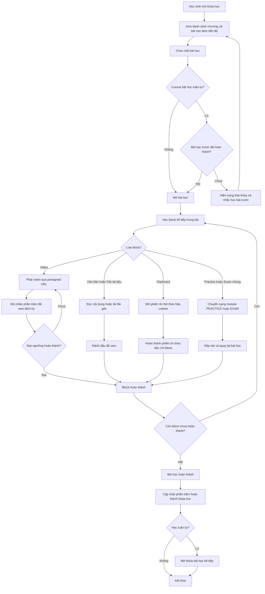
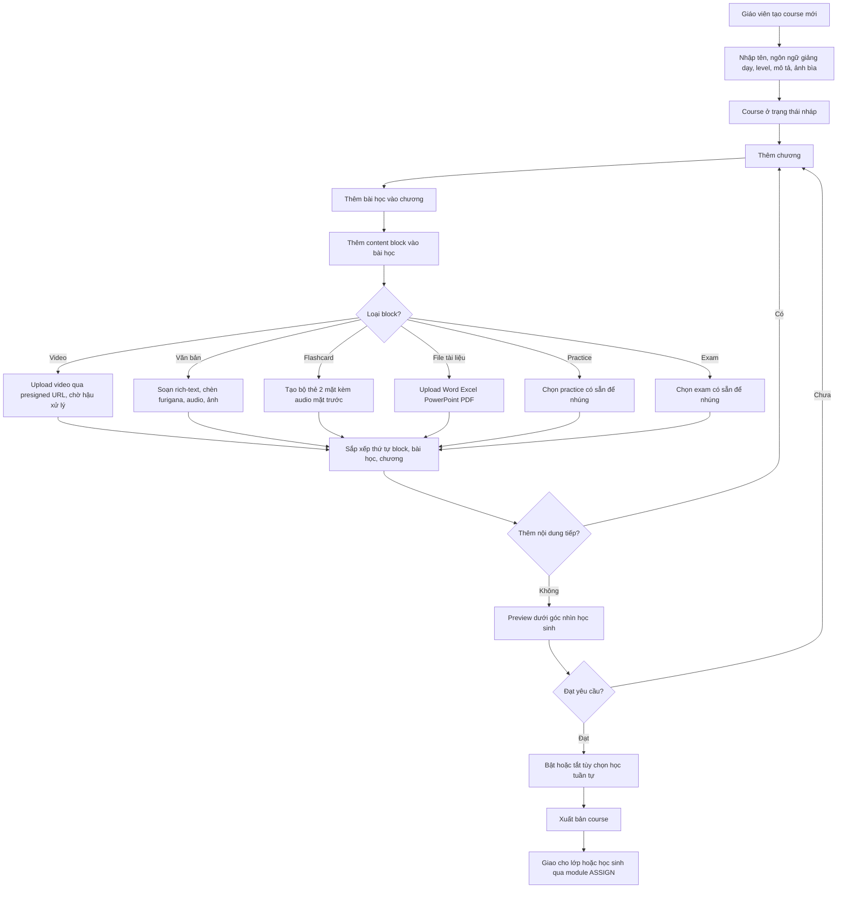
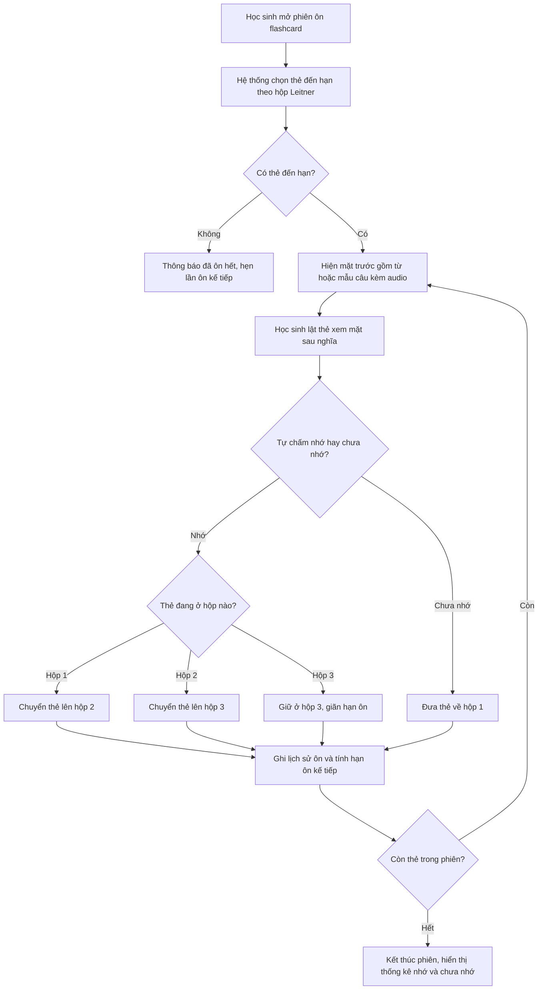

# SRS — Khóa học

**Mã module:** `COURSE` (dùng trong mã FR: `FR-COURSE-xx`)
**Trạng thái:** 🟢 Đã chốt
**Phụ thuộc:** [Phân quyền](../02-phan-quyen/srs-phan-quyen.md) (AUTH), [Tổ chức](../03-to-chuc-nguoi-dung/srs-to-chuc-nguoi-dung.md) (ORG — lớp học), [Luyện tập](../05-practice/srs-practice.md) (PRACTICE — block practice nhúng), [Thi thử](../06-exam/srs-exam.md) (EXAM — block exam nhúng), [Giao bài](../07-giao-bai/srs-giao-bai.md) (ASSIGN — giao khóa học), [Kho nội dung](../10-noi-dung/srs-noi-dung.md) (CONTENT — course từ kho global), [Lưu trữ file](../01-kien-truc/04-luu-tru-file.md) (video/audio/ảnh/tài liệu qua presigned URL)

> **Lưu ý thuật ngữ:** trong module này, **Section** nghĩa là **chương** của khóa học (entity `CourseSection`), khác với Section = **phần thi** của module EXAM ([Thuật ngữ](../00-tong-quan/04-thuat-ngu.md)).

## 1. Mục đích

Module Khóa học cho phép giáo viên (và nhân viên nội dung ở kho global) tổ chức nội dung giảng dạy thành cấu trúc **Course → Section (chương) → Lesson (bài học) → Content Block**, với nhiều loại khối nội dung phù hợp dạy ngoại ngữ: video bài giảng, văn bản đa hệ chữ, flashcard spaced repetition, tài liệu, practice/exam nhúng. Học sinh học theo lộ trình rõ ràng (tùy chọn học tuần tự), hệ thống ghi nhận tiến độ đến từng block để giáo viên và ban giám hiệu theo dõi. Đây là module trung tâm kết nối nội dung (PRACTICE, EXAM, CONTENT) với việc giao bài (ASSIGN) và báo cáo (REPORT).

## 2. Phạm vi

- **Trong phạm vi (v1):**
  - Cấu trúc 4 tầng: Course → Section (chương) → Lesson (bài học) → Content Block; sắp xếp thứ tự tự do.
  - Thuộc tính course: tên, ngôn ngữ giảng dạy (en/zh/ja/ko…), level (map CEFR/HSK/JLPT/TOPIK), mô tả, ảnh bìa, trạng thái nháp/xuất bản.
  - 6 loại content block: **(1)** video bài giảng (upload, phát qua presigned URL, ghi nhận % đã xem); **(2)** văn bản rich-text (hỗ trợ hệ chữ Hán, kana + furigana, Hangul; nhúng audio/ảnh); **(3)** flashcard set (thẻ 2 mặt: mặt trước từ/mẫu câu + audio, mặt sau nghĩa; spaced repetition kiểu Leitner 3 hộp, tự chấm nhớ/chưa nhớ); **(4)** file tài liệu Word/Excel/PowerPoint/PDF (tải bản gốc, preview PDF nếu có); **(5)** Practice nhúng (tham chiếu module PRACTICE); **(6)** Exam nhúng (tham chiếu module EXAM).
  - Tiến độ: hoàn thành block → hoàn thành lesson → % hoàn thành course; tùy chọn **học tuần tự** (khóa bài sau đến khi xong bài trước) bật/tắt per course.
  - Học sinh vào khóa học qua **assignment** hoặc **gán theo lớp**.
  - Course do teacher của tenant soạn, hoặc từ **kho global** của content_editor phân phối theo gói — module này chỉ tham chiếu; quy trình soạn/duyệt/phân phối kho global chi tiết ở [SRS Kho nội dung](../10-noi-dung/srs-noi-dung.md).
  - **Nhân bản** (duplicate) course; **version đơn giản**: sửa course đã xuất bản tạo bản nháp mới, học sinh đang học giữ bản cũ đến khi giáo viên áp dụng bản mới.
- **Ngoài phạm vi (để v2 / không làm):**
  - SCORM / xAPI.
  - Chứng chỉ hoàn thành tự động.
  - Marketplace bán khóa học.
  - Comment / thảo luận trong bài học.

## 3. Vai trò liên quan

| Vai trò | Tương tác với module này |
|---|---|
| `student` (Học sinh) | Học khóa học được giao/gán theo lớp; xem video, đọc bài, ôn flashcard, làm practice/exam nhúng, tải tài liệu; xem % tiến độ của mình |
| `teacher` (Giáo viên) | Tạo/sửa/nhân bản course; quản lý section/lesson/block; preview; xuất bản; áp dụng version mới; dùng course từ kho global; theo dõi tiến độ học sinh lớp mình |
| `assistant` (Trợ giảng) | Xem tiến độ học sinh trong lớp được gán để nhắc học; không sửa nội dung course |
| `manager` (Ban giám hiệu) | Xem danh sách course và tiến độ tổng quan toàn tenant; không bắt buộc soạn nội dung |
| `admin` (Admin hệ thống) | Không thao tác nội dung; quản lý quota dung lượng/gói ảnh hưởng đến upload video/file |
| `content_editor` (Nhân viên nội dung) | Soạn course ở kho global, phân phối cho tenant theo gói (chi tiết ở module CONTENT); course global hiển thị chế độ chỉ-đọc phía tenant |
| `support_agent` (Nhân viên support) | Tra cứu trạng thái course/tiến độ khi xử lý ticket, qua impersonation có audit |

## 4. User stories

- `US-COURSE-01` — Là **giáo viên**, tôi muốn **tạo khóa học có chương/bài học và nhiều loại khối nội dung** để **tổ chức giáo trình một chỗ thay vì gửi rời rạc qua Zalo**.
- `US-COURSE-02` — Là **giáo viên**, tôi muốn **upload video bài giảng và biết học sinh đã xem bao nhiêu phần trăm** để **nắm ai thực sự học bài**.
- `US-COURSE-03` — Là **giáo viên dạy tiếng Nhật/Trung/Hàn**, tôi muốn **soạn văn bản có furigana, chữ Hán, Hangul kèm audio** để **học sinh đọc đúng cách phát âm**.
- `US-COURSE-04` — Là **học sinh**, tôi muốn **ôn từ vựng bằng flashcard có audio, hệ thống tự nhắc thẻ đến hạn** để **nhớ từ lâu mà không phải tự lên lịch ôn**.
- `US-COURSE-05` — Là **học sinh**, tôi muốn **thấy % hoàn thành từng khóa học và bài kế tiếp cần học** để **biết mình đang ở đâu trong lộ trình**.
- `US-COURSE-06` — Là **giáo viên**, tôi muốn **bật chế độ học tuần tự** để **học sinh không nhảy cóc bỏ qua kiến thức nền**.
- `US-COURSE-07` — Là **giáo viên**, tôi muốn **nhân bản khóa học kỳ trước và sửa cho lớp mới** để **không soạn lại từ đầu**.
- `US-COURSE-08` — Là **giáo viên**, tôi muốn **sửa khóa học đã xuất bản trên một bản nháp riêng và chủ động áp dụng** để **học sinh đang học không bị xáo trộn giữa chừng**.
- `US-COURSE-09` — Là **ban giám hiệu**, tôi muốn **xem tiến độ hoàn thành khóa học theo lớp** để **đánh giá chất lượng dạy-học**.
- `US-COURSE-10` — Là **nhân viên nội dung**, tôi muốn **course tôi soạn ở kho global được tenant dùng ở chế độ chỉ-đọc** để **bảo toàn chất lượng nội dung chuẩn**.

## 5. Luồng hoạt động

### 5.1 Luồng học sinh học một bài học

Học sinh vào khóa học (được giao hoặc gán theo lớp), mở lesson và học lần lượt từng block. Nếu course bật học tuần tự, lesson chỉ mở khi lesson trước đã hoàn thành. Video ghi tiến độ định kỳ; flashcard mở phiên ôn; practice/exam nhúng chuyển sang module tương ứng rồi quay lại.

**Ngoại lệ / lỗi:**
- Học sinh không thuộc assignment hoặc lớp được gán → 403, không thấy course.
- Presigned URL video hết hạn giữa chừng → client xin URL mới, phát tiếp từ vị trí cũ (tiến độ đã lưu server-side).
- Mất mạng khi ghi tiến độ → client giữ tiến độ cục bộ, đồng bộ lại khi có mạng; server lấy giá trị lớn nhất.
- Giáo viên áp dụng version mới khi học sinh đang mở bài → phiên hiện tại học tiếp bản cũ; lần vào sau tải bản mới (xem FR-COURSE-18).

### 5.2 Luồng giáo viên soạn và xuất bản khóa học

**Ngoại lệ / lỗi:**
- Upload video/file vượt quota dung lượng gói → 402 kèm thông báo rõ ([Lưu trữ file](../01-kien-truc/04-luu-tru-file.md)).
- Xuất bản course rỗng (không có lesson nào hoặc lesson không có block) → chặn, báo lỗi validation.
- Practice/exam nhúng bị xóa hoặc chuyển về nháp ở module gốc → block hiển thị cảnh báo hỏng tham chiếu, chặn xuất bản đến khi giáo viên sửa.
- Video đang hậu xử lý (transcode) → block hiển thị trạng thái đang xử lý; vẫn xuất bản được nhưng học sinh thấy "video đang xử lý" đến khi xong.

### 5.3 Luồng flashcard spaced repetition (Leitner 3 hộp)

Thẻ mới vào hộp 1. Mỗi phiên ôn lấy các thẻ **đến hạn**: hộp 1 ôn hằng ngày, hộp 2 cách 2 ngày, hộp 3 cách 4 ngày (khoảng cách chờ chốt — câu hỏi mở #2). Chấm "nhớ" → thẻ lên hộp cao hơn (tối đa hộp 3); "chưa nhớ" → về hộp 1.

**Ngoại lệ / lỗi:**
- Audio mặt trước lỗi/không tải được → vẫn hiện text, log lỗi file.
- Học sinh thoát giữa phiên → kết quả các thẻ đã chấm vẫn được lưu (lưu theo từng thẻ, không theo phiên).

## 6. Yêu cầu chức năng

| Mã | Yêu cầu | Vai trò | Ưu tiên |
|---|---|---|---|
| FR-COURSE-01 | Tạo/sửa/xóa (soft-delete) course với thuộc tính: tên, ngôn ngữ giảng dạy (en/zh/ja/ko…), level (map CEFR/HSK/JLPT/TOPIK), mô tả, ảnh bìa | teacher, content_editor (kho global) | Must |
| FR-COURSE-02 | Quản lý cấu trúc Course → Section (chương) → Lesson: thêm/sửa/xóa/sắp xếp thứ tự (kéo-thả) | teacher, content_editor | Must |
| FR-COURSE-03 | Thêm block **video bài giảng**: upload qua presigned URL, hậu xử lý (thumbnail/transcode theo [Lưu trữ file](../01-kien-truc/04-luu-tru-file.md)), phát qua presigned URL, không cho tải toàn bộ video | teacher, content_editor | Must |
| FR-COURSE-04 | Ghi nhận **% đã xem video** per học sinh (lưu định kỳ, lấy max), đạt ngưỡng cấu hình thì tính block hoàn thành | student (hệ thống ghi) | Must |
| FR-COURSE-05 | Thêm block **văn bản rich-text**: hỗ trợ hệ chữ Hán, kana + furigana (ruby text), Hangul; nhúng audio và ảnh trong nội dung | teacher, content_editor | Must |
| FR-COURSE-06 | Thêm block **flashcard set**: thẻ 2 mặt — mặt trước từ/mẫu câu kèm audio, mặt sau nghĩa; thêm/sửa/xóa/sắp xếp thẻ | teacher, content_editor | Must |
| FR-COURSE-07 | Học flashcard theo **Leitner 3 hộp**: thẻ mới vào hộp 1; chấm nhớ → lên hộp trên, chưa nhớ → về hộp 1; hệ thống tính thẻ đến hạn theo chu kỳ từng hộp và lưu lịch sử ôn per học sinh | student | Must |
| FR-COURSE-08 | Thêm block **file tài liệu** Word/Excel/PowerPoint/PDF: học sinh tải bản gốc qua presigned URL; preview PDF trên trình duyệt nếu có bản preview | teacher, content_editor, student | Must |
| FR-COURSE-09 | Thêm block **Practice nhúng**: chọn practice đã xuất bản (của tenant hoặc kho global theo gói) để tham chiếu; kết quả làm bài ghi ở module PRACTICE, trạng thái hoàn thành đồng bộ về block | teacher, content_editor | Must |
| FR-COURSE-10 | Thêm block **Exam nhúng**: tương tự FR-COURSE-09 với exam, tham chiếu module EXAM | teacher, content_editor | Must |
| FR-COURSE-11 | Trạng thái course **nháp/xuất bản**: chỉ course đã xuất bản mới giao được qua ASSIGN; chặn xuất bản khi course rỗng hoặc có block hỏng tham chiếu | teacher, content_editor | Must |
| FR-COURSE-12 | **Preview** course/lesson dưới góc nhìn học sinh trước khi xuất bản (không ghi tiến độ) | teacher, content_editor | Should |
| FR-COURSE-13 | Tính **tiến độ**: hoàn thành đủ block → hoàn thành lesson → % hoàn thành course; hiển thị cho học sinh (của mình) và teacher/assistant/manager (theo phạm vi quyền) | student, teacher, assistant, manager | Must |
| FR-COURSE-14 | Tùy chọn **học tuần tự** bật/tắt per course: khóa lesson sau đến khi lesson trước hoàn thành; đổi cấu hình áp dụng ngay cho học sinh đang học | teacher | Should |
| FR-COURSE-15 | Học sinh truy cập course qua **assignment** hoặc **gán theo lớp**; ngoài phạm vi này không thấy/không truy cập được course (403) | student | Must |
| FR-COURSE-16 | Sử dụng course từ **kho global**: tenant thấy course được phân phối theo gói ở chế độ chỉ-đọc, giao trực tiếp hoặc nhân bản về tenant để sửa (theo quyền gói — chi tiết module CONTENT) | teacher, content_editor | Must |
| FR-COURSE-17 | **Nhân bản** (duplicate) course: sao chép toàn bộ cấu trúc, block, flashcard; file media tham chiếu chung (copy-on-write khi sửa); bản sao ở trạng thái nháp, không sao chép tiến độ học sinh | teacher | Should |
| FR-COURSE-18 | **Version đơn giản**: sửa course đã xuất bản tạo bản nháp mới song song; học sinh đang học tiếp tục bản cũ; giáo viên chủ động **áp dụng** bản mới — từ đó học sinh vào lại sẽ thấy bản mới, tiến độ map theo lesson còn tồn tại | teacher | Should |
| FR-COURSE-19 | Manager xem danh sách course toàn tenant kèm tiến độ tổng quan theo lớp; teacher xem theo lớp mình; assistant xem theo lớp được gán (chỉ đọc, để nhắc học) | manager, teacher, assistant | Should |
| FR-COURSE-20 | Admin không truy cập nội dung course của tenant; support_agent chỉ tra cứu qua impersonation có audit log | admin, support_agent | Must |
| FR-COURSE-21 | Học sinh xem lại flashcard **ngoài luồng lesson** (mục "Ôn tập của tôi" gom thẻ đến hạn từ mọi course đang học) | student | Could |
| FR-COURSE-22 | Lưu vị trí học gần nhất per học sinh per course để nút "Học tiếp" đưa thẳng vào block đang dở | student | Could |

## 7. Yêu cầu phi chức năng (riêng module)

Phần chung xem [06-yeu-cau-phi-chuc-nang](../01-kien-truc/06-yeu-cau-phi-chuc-nang.md). Riêng module này:

- **Bảo vệ nội dung:** video chỉ phát qua presigned URL có thời hạn, không public bucket, không endpoint tải toàn bộ video (mức chống copy v1 — DRM để v2, theo [Lưu trữ file](../01-kien-truc/04-luu-tru-file.md)).
- **Ghi tiến độ video:** client gửi tiến độ theo chu kỳ (đề xuất mỗi 10 giây hoặc khi pause/seek/đóng trang), server lấy giá trị lớn nhất — tránh spam ghi DB; chịu được mất mạng tạm thời (đồng bộ lại).
- **Mobile-first cho học sinh:** màn hình học lesson, phát video, ôn flashcard phải mượt trên điện thoại (70–80% học sinh dùng mobile — [Personas](../00-tong-quan/03-personas.md)).
- **Đa hệ chữ:** render đúng CJK; furigana dùng thẻ ruby chuẩn HTML; font fallback cho Hán/kana/Hangul; input và lưu trữ Unicode đầy đủ (Postgres UTF-8).
- **Cách ly tenant:** mọi truy vấn course/tiến độ đều theo `tenant_id`; course kho global đánh dấu riêng, tenant không sửa được bản gốc.
- **Hiệu năng:** mở trang lesson (ngoài file media) < 1s p95; danh sách course kèm % tiến độ dùng giá trị tổng hợp sẵn (không tính lại từ từng block mỗi request).

## 8. Màn hình chính

| Màn hình | Vai trò dùng | Mockup |
|---|---|---|
| Danh sách khóa học của tôi (kèm % tiến độ, nút Học tiếp) | student | _sẽ bổ sung_ |
| Trang khóa học — cây chương/bài học kèm trạng thái khóa/mở/hoàn thành | student | _sẽ bổ sung_ |
| Trang học bài học — trình phát video, văn bản, block tuần tự | student | _sẽ bổ sung_ |
| Phiên ôn flashcard (lật thẻ, chấm nhớ/chưa nhớ, thống kê cuối phiên) | student | _sẽ bổ sung_ |
| Quản lý khóa học (danh sách, tạo, nhân bản, trạng thái, version) | teacher, manager | _sẽ bổ sung_ |
| Trình soạn khóa học — cấu trúc chương/bài, thêm block 6 loại | teacher, content_editor | _sẽ bổ sung_ |
| Trình soạn flashcard set (thẻ 2 mặt, gắn audio) | teacher, content_editor | _sẽ bổ sung_ |
| Preview khóa học góc nhìn học sinh | teacher, content_editor | _sẽ bổ sung_ |
| Tiến độ khóa học theo lớp/học sinh | teacher, assistant, manager | _sẽ bổ sung_ |

## 9. API sơ bộ

Upload/download file media (video, audio, ảnh, tài liệu) dùng luồng presigned chung `/api/v1/files/...` ([Lưu trữ file](../01-kien-truc/04-luu-tru-file.md)); API dưới đây chỉ quản lý entity.

| Method | Path | Mô tả | Quyền |
|---|---|---|---|
| GET | `/api/v1/courses` | Danh sách course (lọc theo ngôn ngữ, level, trạng thái, nguồn tenant/global) | teacher, assistant, manager |
| POST | `/api/v1/courses` | Tạo course nháp | teacher |
| GET | `/api/v1/courses/{id}` | Chi tiết course + cây section/lesson | teacher, assistant, manager; student (nếu trong phạm vi truy cập) |
| PATCH | `/api/v1/courses/{id}` | Sửa thuộc tính course (tên, level, mô tả, ảnh bìa, học tuần tự…) | teacher (chủ sở hữu/lớp mình), manager |
| DELETE | `/api/v1/courses/{id}` | Xóa course (soft-delete; chặn nếu đang có assignment hoạt động) | teacher, manager |
| POST | `/api/v1/courses/{id}/publish` | Xuất bản course (validate rỗng/hỏng tham chiếu) | teacher |
| POST | `/api/v1/courses/{id}/duplicate` | Nhân bản course thành bản nháp mới | teacher |
| POST | `/api/v1/courses/{id}/versions` | Tạo bản nháp mới từ course đã xuất bản | teacher |
| POST | `/api/v1/courses/{id}/versions/{versionId}/apply` | Áp dụng version mới cho học sinh đang học | teacher |
| POST | `/api/v1/courses/{id}/sections` | Thêm section (chương) | teacher |
| PATCH | `/api/v1/courses/{id}/sections/{sectionId}` | Sửa/sắp xếp section | teacher |
| DELETE | `/api/v1/courses/{id}/sections/{sectionId}` | Xóa section | teacher |
| POST | `/api/v1/courses/{id}/sections/{sectionId}/lessons` | Thêm lesson | teacher |
| PATCH | `/api/v1/courses/{id}/lessons/{lessonId}` | Sửa/di chuyển/sắp xếp lesson | teacher |
| DELETE | `/api/v1/courses/{id}/lessons/{lessonId}` | Xóa lesson | teacher |
| POST | `/api/v1/courses/{id}/lessons/{lessonId}/blocks` | Thêm content block (type + payload theo loại) | teacher |
| PATCH | `/api/v1/courses/{id}/blocks/{blockId}` | Sửa/sắp xếp block | teacher |
| DELETE | `/api/v1/courses/{id}/blocks/{blockId}` | Xóa block | teacher |
| GET | `/api/v1/courses/my` | Danh sách course của học sinh (qua assignment/lớp) kèm % tiến độ | student |
| GET | `/api/v1/courses/{id}/lessons/{lessonId}` | Nội dung lesson để học (kèm trạng thái khóa nếu học tuần tự) | student |
| PUT | `/api/v1/courses/{id}/blocks/{blockId}/progress` | Ghi tiến độ block (video %, đánh dấu đã xem…) — idempotent, lấy max | student |
| GET | `/api/v1/courses/{id}/progress` | Tiến độ theo lớp/học sinh của course | teacher, assistant, manager |
| GET | `/api/v1/courses/{id}/blocks/{blockId}/flashcards/due` | Danh sách thẻ đến hạn ôn của học sinh | student |
| POST | `/api/v1/courses/{id}/blocks/{blockId}/flashcards/{cardId}/review` | Ghi kết quả chấm nhớ/chưa nhớ, cập nhật hộp Leitner | student |
| GET | `/api/v1/courses/{id}/preview` | Xem course góc nhìn học sinh, không ghi tiến độ | teacher, content_editor |

## 10. Entity liên quan

Chi tiết thuộc tính ở [Từ điển dữ liệu](../16-du-lieu/02-tu-dien-du-lieu.md), quan hệ ở [ERD](../16-du-lieu/01-erd.md).

- `courses` — khóa học: tenant_id (null nếu global), language, level, status (draft/published), sequential_learning, source (tenant/global), cover_file_id.
- `course_versions` — version đơn giản: bản xuất bản đang hoạt động + bản nháp đang sửa; con trỏ version học sinh đang học.
- `course_sections` — chương, thứ tự trong course. (Lưu ý: khác `exam_sections` — phần thi của EXAM.)
- `lessons` — bài học, thứ tự trong section.
- `content_blocks` — khối nội dung: type (video/rich_text/flashcard_set/document/practice_ref/exam_ref), payload theo loại, thứ tự trong lesson; tham chiếu `files` (video, tài liệu) hoặc `practices`/`exams`.
- `flashcards` — thẻ 2 mặt thuộc block flashcard_set: front_text, front_audio_file_id, back_text, thứ tự.
- `flashcard_review_states` — trạng thái Leitner per (student, card): box (1–3), due_at, lịch sử ôn.
- `block_progress` — tiến độ per (student, block): status, video_watched_pct, completed_at.
- `lesson_progress`, `course_progress` — giá trị tổng hợp per học sinh (tính từ block_progress, lưu sẵn để đọc nhanh).
- Tham chiếu ngoài module: `files` (Lưu trữ file), `assignments` (ASSIGN), `classes` (ORG), `practices` (PRACTICE), `exams` (EXAM).

## 11. Câu hỏi mở cần chốt

| # | Câu hỏi | Quyết định | Ngày chốt |
|---|---|---|---|
| 1 | Ngưỡng % xem video để tính hoàn thành block: cố định 90% toàn hệ thống hay cho giáo viên cấu hình per block? | **Chốt:** Mặc định 90%, v1 không cho cấu hình | 2026-07-16 |
| 2 | Chu kỳ ôn Leitner 3 hộp: hộp 1 hằng ngày, hộp 2 cách 2 ngày, hộp 3 cách 4 ngày — chốt khoảng cách này hay khác? | **Chốt:** Giữ chu kỳ 1/2/4 ngày | 2026-07-16 |
| 3 | Khi giáo viên áp dụng version mới: tiến độ học sinh map theo lesson còn tồn tại (giữ phần đã học), hay yêu cầu học lại lesson có block thay đổi? | **Chốt:** Giữ tiến độ lesson không đổi; reset lesson có block bị sửa/xóa | 2026-07-16 |
| 4 | Block practice/exam nhúng: hoàn thành tính khi **nộp bài** hay khi **đạt điểm tối thiểu** (giáo viên đặt)? | **Chốt:** v1: nộp bài là hoàn thành | 2026-07-16 |

## Lịch sử thay đổi

| Ngày | Thay đổi | Người |
|---|---|---|
| 2026-07-16 | Tạo bản nháp đầu tiên | Claude |
| 2026-07-16 | Chốt toàn bộ câu hỏi mở (quyết định ghi trong bảng), chuyển trạng thái Đã chốt | Chủ sản phẩm |
