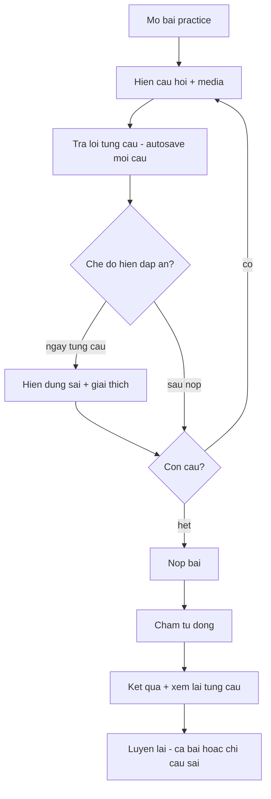
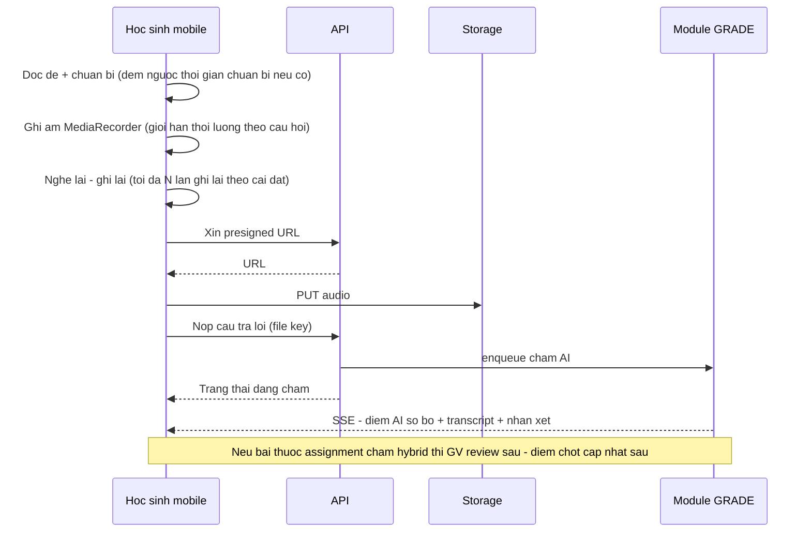

# SRS — Practice (Luyện tập 4 kỹ năng)

**Mã module:** `PRACTICE`
**Trạng thái:** 🟢 Đã chốt
**Phụ thuộc:** [Nội dung](../10-noi-dung/srs-noi-dung.md) (ngân hàng câu hỏi), [Chấm bài](../08-cham-bai/srs-cham-bai.md), [Giao bài](../07-giao-bai/srs-giao-bai.md), [Lưu trữ file](../01-kien-truc/04-luu-tru-file.md)

## 1. Mục đích

Cho học sinh luyện tập theo từng kỹ năng **Nghe – Nói – Đọc – Viết** với phản hồi nhanh (chấm tự động hoặc AI), cho mọi ngôn ngữ giảng dạy (en/zh/ja/ko…). Practice là dạng bài "ít áp lực": có thể làm nhiều lần, thấy giải thích, dùng độc lập hoặc nhúng trong khóa học.

## 2. Phạm vi

- **Trong phạm vi (v1):** bài practice theo 1 kỹ năng chính; lắp ráp từ ngân hàng câu hỏi; làm bài + autosave; chấm tự động ngay với câu đóng; chấm AI + GV cho nói/viết (qua module GRADE); xem lại bài + giải thích; luyện lại.
- **Ngoài phạm vi (v2):** chế độ luyện adaptive (tự chọn câu theo trình độ), luyện phát âm realtime từng từ (đọc theo — shadowing có chấm ngay), quiz battle giữa học sinh.

## 3. Vai trò liên quan

| Vai trò | Tương tác |
|---|---|
| student | Làm bài, xem kết quả/giải thích, luyện lại |
| teacher | Tạo practice từ ngân hàng câu hỏi, preview, giao bài, xem kết quả lớp |
| assistant | Preview; theo dõi kết quả lớp được gán; chấm nháp nếu được ủy quyền |
| manager | Như teacher — Trong phạm vi được gán (chi nhánh); owner kế thừa với toàn tenant |
| content_editor | Tạo practice mẫu trong kho global |
| admin / support_agent | Không dùng trực tiếp; support tra cứu trạng thái chấm |

## 4. User stories

- `US-PRACTICE-01` — Là **học sinh**, tôi muốn luyện nghe với audio nghe lại được từng đoạn để tự học hiệu quả.
- `US-PRACTICE-02` — Là **học sinh**, tôi muốn ghi âm câu trả lời nói trên điện thoại và nhận phản hồi AI nhanh (phát âm, trôi chảy) để tự sửa.
- `US-PRACTICE-03` — Là **học sinh**, tôi muốn viết đoạn văn và nhận nhận xét theo tiêu chí để biết mình yếu chỗ nào.
- `US-PRACTICE-04` — Là **giáo viên**, tôi muốn lắp bài practice từ ngân hàng câu hỏi theo tag (kỹ năng, level, chủ đề) trong vài phút.
- `US-PRACTICE-05` — Là **giáo viên**, tôi muốn thấy tỉ lệ đúng từng câu của cả lớp để biết cần giảng lại phần nào.

## 5. Luồng hoạt động

### 5.1 Cấu trúc bài practice

```
Practice (kỹ năng chính, ngôn ngữ, level, cài đặt)
└── Question Group (tùy chọn — passage/audio dùng chung)
    └── Question (từ ngân hàng câu hỏi, có thứ tự)
```

Cài đặt per practice: hiện đáp án+giải thích (ngay từng câu / sau nộp), cho nghe lại audio (không giới hạn / N lần), giới hạn thời gian (không / có), xáo trộn câu hỏi/đáp án, chế độ luyện lại chỉ câu sai.

### 5.2 Học sinh làm practice kỹ năng Nghe/Đọc (câu đóng — chấm ngay)



### 5.3 Học sinh làm practice kỹ năng Nói (ghi âm → AI chấm)



Xử lý lỗi: không cấp được quyền micro → hướng dẫn theo trình duyệt; upload lỗi → giữ audio local (IndexedDB) và retry; hết quota AI của tenant → bài chuyển GV chấm tay, học sinh thấy "giáo viên sẽ chấm".

### 5.4 Kỹ năng Viết

Học sinh gõ văn bản (editor hỗ trợ IME tiếng Trung/Nhật/Hàn, đếm từ/ký tự theo ngôn ngữ) → nộp → AI chấm sơ bộ theo rubric (qua GRADE) → GV review nếu hybrid. Có chế độ "viết tay chụp ảnh" (upload ảnh, GV chấm tay 100%) — Must ở v1 (quan trọng với thị trường tiếng Trung/Nhật).

### 5.5 Giáo viên tạo practice


## 6. Yêu cầu chức năng

| Mã | Yêu cầu | Vai trò | Ưu tiên |
|---|---|---|---|
| FR-PRACTICE-01 | Practice thuộc 1 kỹ năng chính (listening/speaking/reading/writing) + ngôn ngữ + level | teacher | Must |
| FR-PRACTICE-02 | Lắp ráp practice từ ngân hàng câu hỏi (lọc theo tag), hỗ trợ question group chung passage/audio | teacher, content_editor | Must |
| FR-PRACTICE-03 | Hỗ trợ đầy đủ loại câu hỏi theo kỹ năng trong [catalog](../99-phu-luc/01-loai-cau-hoi.md) | — | Must |
| FR-PRACTICE-04 | Autosave từng câu trả lời; mất kết nối không mất bài; khôi phục phiên làm dở | student | Must |
| FR-PRACTICE-05 | Câu đóng chấm tự động tức thì; hiện giải thích theo cài đặt | student | Must |
| FR-PRACTICE-06 | Ghi âm trong trình duyệt (mobile Safari/Chrome), nghe lại, ghi lại tối đa N lần, đếm ngược thời gian chuẩn bị/nói | student | Must |
| FR-PRACTICE-07 | Bài nói gửi chấm AI (phát âm/trôi chảy/transcript) qua module GRADE; kết quả trả qua SSE | student | Must |
| FR-PRACTICE-08 | Bài viết: editor hỗ trợ IME CJK, đếm từ (en) / ký tự (zh, ja, ko), gửi chấm AI theo rubric | student | Must |
| FR-PRACTICE-09 | Audio đề nghe: điều khiển phát, giới hạn số lần nghe theo cài đặt, tốc độ phát 0.75x–1.25x | student | Must |
| FR-PRACTICE-10 | Xem lại bài đã làm: từng câu, đáp án đúng, giải thích, điểm từng phần | student | Must |
| FR-PRACTICE-11 | Luyện lại: làm lại cả bài hoặc chỉ các câu sai (kết quả attempt lưu riêng) | student | Must |
| FR-PRACTICE-12 | Preview practice đúng như học sinh thấy | teacher, manager, content_editor | Must |
| FR-PRACTICE-13 | Thống kê per practice: tỉ lệ đúng từng câu theo lớp, thời gian làm trung bình | teacher | Must |
| FR-PRACTICE-14 | Hiển thị đúng hệ chữ + ruby text (furigana/pinyin) khi câu hỏi có cấu hình | student | Must |
| FR-PRACTICE-15 | Nhân bản practice; sửa practice đã dùng tạo version mới (bài đã làm giữ version cũ) | teacher | Should |
| FR-PRACTICE-16 | Chế độ "viết tay chụp ảnh" cho bài viết (GV chấm tay) — thiết yếu cho luyện viết chữ Hán/kanji | student | Must |

## 7. Yêu cầu phi chức năng (riêng module)

- Ghi âm: định dạng webm/opus (fallback mp4/aac trên iOS); tối đa 5 phút/câu trả lời; hiển thị waveform đơn giản khi ghi.
- Audio đề nghe preload trước khi bắt đầu để không giật khi làm bài.
- Làm bài trên mobile là trải nghiệm hạng nhất (thao tác 1 tay, font đủ lớn cho Hán tự).

## 8. Màn hình chính

| Màn hình | Vai trò dùng | Mockup |
|---|---|---|
| Làm bài practice — Nghe/Đọc | student | [practice-lam-bai.html](../17-mockups/hoc-sinh/practice-lam-bai.html) |
| Làm bài practice — Nói (ghi âm) | student | [practice-speaking.html](../17-mockups/hoc-sinh/practice-speaking.html) |
| Kết quả + xem lại bài | student | [ket-qua.html](../17-mockups/hoc-sinh/ket-qua.html) |
| Tạo/sửa practice | teacher | _sẽ bổ sung_ |

## 9. API sơ bộ

| Method | Path | Mô tả | Quyền |
|---|---|---|---|
| POST | `/api/v1/practices` | Tạo practice | teacher+ |
| GET | `/api/v1/practices/{id}` | Chi tiết (bản học sinh không lộ đáp án) | theo scope |
| POST | `/api/v1/practices/{id}/attempts` | Bắt đầu lượt làm | student |
| PUT | `/api/v1/attempts/{id}/answers/{qid}` | Autosave câu trả lời | student (chủ attempt) |
| POST | `/api/v1/attempts/{id}/submit` | Nộp bài | student (chủ attempt) |
| GET | `/api/v1/attempts/{id}/result` | Kết quả + review | theo scope |
| GET | `/api/v1/practices/{id}/stats` | Thống kê theo lớp | teacher+ |

## 10. Entity liên quan

`practices`, `practice_questions` (liên kết + thứ tự), `attempts`, `answers` — dùng chung bảng attempt/answer với EXAM (phân biệt bằng `kind`). Xem [ERD](../16-du-lieu/01-erd.md).

## 11. Câu hỏi mở cần chốt

| # | Câu hỏi | Quyết định | Ngày chốt |
|---|---|---|---|
| 1 | Practice tự do (học sinh tự tìm bài luyện ngoài bài được giao) có trong v1 không, hay chỉ làm bài được giao + trong khóa học? | **Chốt:** Có — trong phạm vi nội dung tenant mở | 2026-07-16 |
| 2 | Số lần ghi lại tối đa mặc định cho câu nói (đề xuất 2 lần)? | **Chốt:** 2 lần | 2026-07-16 |
| 3 | Bài viết có bật kiểm tra đạo văn/AI-generated không (v2?)? | **Chốt:** Để v2 | 2026-07-16 |

## Lịch sử thay đổi

| Ngày | Thay đổi | Người |
|---|---|---|
| 2026-07-16 | Tạo bản nháp đầu tiên | Claude |
| 2026-07-16 | Chốt toàn bộ câu hỏi mở (quyết định ghi trong bảng), chuyển trạng thái Đã chốt | Chủ sản phẩm |
| 2026-07-17 | Đồng bộ phạm vi manager/owner trong bảng vai trò | Chủ sản phẩm + Claude |
