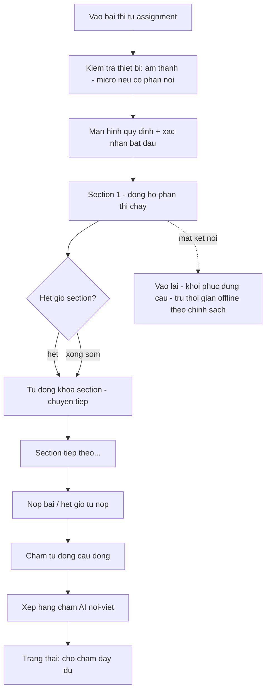
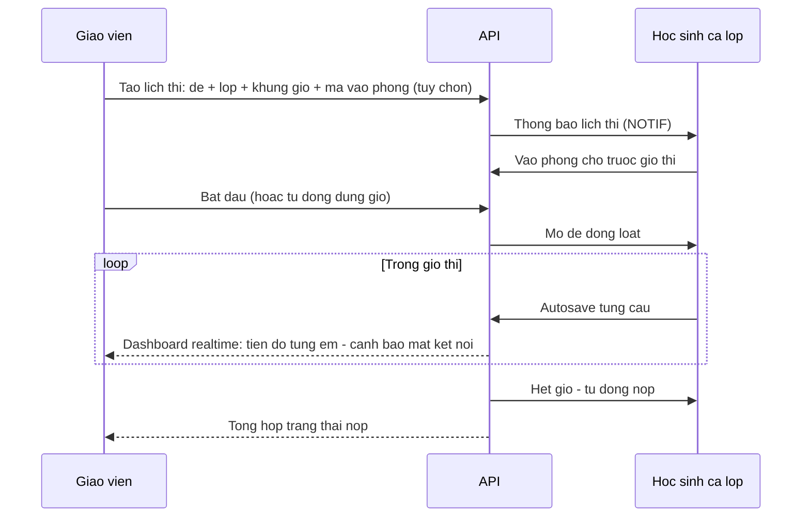

# SRS — Exam (Thi thử)

**Mã module:** `EXAM`
**Trạng thái:** 🟢 Đã chốt
**Phụ thuộc:** [Nội dung](../10-noi-dung/srs-noi-dung.md), [Chấm bài](../08-cham-bai/srs-cham-bai.md), [Giao bài](../07-giao-bai/srs-giao-bai.md), [NFR](../01-kien-truc/06-yeu-cau-phi-chuc-nang.md) (thi đồng thời)

## 1. Mục đích

Cho học sinh **thi thử sát điều kiện thật** theo cấu trúc các kỳ thi chuẩn (IELTS, TOEIC, VSTEP, Cambridge, HSK/HSKK, JLPT, TOPIK…): đúng phần thi, đúng thời gian, đúng thang điểm. Kết quả thi thử là dữ liệu chính để trung tâm đánh giá đầu vào, giữa khóa, cuối khóa.

## 2. Phạm vi

- **Trong phạm vi (v1):** mô hình đề thi cấu hình theo template kỳ thi; làm bài có đồng hồ; autosave; chấm tự động + hybrid (nói/viết); quy đổi thang điểm chuẩn (band IELTS, điểm TOEIC…); chống gian lận mức cơ bản; chế độ thi tập trung (cả lớp thi cùng khung giờ).
- **Ngoài phạm vi (v2):** giám thị video (proctoring bằng webcam/AI), khóa trình duyệt (lockdown browser), thi nói 1-1 với giám khảo qua video call, in phiếu điểm chính thức.

## 3. Vai trò liên quan

| Vai trò | Tương tác |
|---|---|
| student | Thi, xem kết quả + phiếu điểm quy đổi |
| teacher | Tạo đề từ template, giao lịch thi, giám sát tiến trình, xem kết quả lớp |
| assistant | Theo dõi tiến trình thi lớp được gán |
| manager | Như teacher — Trong phạm vi được gán (chi nhánh); owner kế thừa với toàn tenant; so sánh kết quả giữa lớp |
| content_editor | Soạn đề thi thử chuẩn trong kho global |
| support_agent | Xử lý sự cố thi (mất mạng, mở lại bài) qua ticket |

## 4. User stories

- `US-EXAM-01` — Là **học sinh**, tôi muốn thi thử IELTS đúng 4 phần đúng thời gian để quen áp lực phòng thi.
- `US-EXAM-02` — Là **học sinh**, khi rớt mạng giữa giờ tôi muốn vào lại và tiếp tục đúng chỗ đang làm, thời gian không bị tính oan.
- `US-EXAM-03` — Là **giáo viên**, tôi muốn tạo đề HSK 4 từ template có sẵn cấu trúc phần thi, chỉ việc chọn câu hỏi.
- `US-EXAM-04` — Là **giáo viên**, khi lớp đang thi tôi muốn màn hình theo dõi realtime ai đang làm phần nào, ai mất kết nối.
- `US-EXAM-05` — Là **ban giám hiệu**, tôi muốn so điểm thi thử đầu vào với cuối khóa để chứng minh chất lượng với phụ huynh.

## 5. Luồng hoạt động

### 5.1 Mô hình đề thi (exam template)

```
ExamTemplate (kỳ thi: IELTS Academic, TOEIC LR, HSK4, JLPT N3, TOPIK II, VSTEP B2, tùy chỉnh)
└── SectionTemplate (phần thi: tên, kỹ năng, thời gian, số câu, thang điểm phần, quy tắc quy đổi)

Exam (đề cụ thể) = ExamTemplate + câu hỏi thật cho từng section
```

- Template chuẩn do platform định nghĩa sẵn (danh sách ở [Phụ lục chuẩn thi](../99-phu-luc/02-chuan-thi-quoc-te.md)); tenant dùng hoặc tạo **template tùy chỉnh** (đặt phần thi, thời gian, thang điểm riêng — cho bài kiểm tra nội bộ).
- Quy đổi điểm: bảng quy đổi raw score → thang chuẩn (band 0–9, 10–990, cấp đạt/không đạt…) cấu hình per template; điểm nói/viết hybrid nhập vào sau khi GV chốt → hệ thống tính điểm tổng khi đủ thành phần.

### 5.2 Học sinh làm bài thi



Quy tắc thời gian: đồng hồ theo **server** (client chỉ hiển thị); mỗi section có thời gian riêng, hết giờ khóa section (theo chuẩn thi thật — không quay lại section trước với IELTS Listening/Reading; template quy định có cho quay lại hay không); mất kết nối: bài tự autosave từng câu, vào lại tiếp tục, thời gian vẫn chạy (chính sách "đồng hồ không dừng" — GV có quyền cấp bù thời gian khi sự cố diện rộng).

### 5.3 Chế độ thi tập trung (cả lớp cùng giờ)



### 5.4 Chống gian lận (mức v1)

- Xáo trộn thứ tự câu hỏi + đáp án per học sinh (theo cài đặt đề).
- Phát hiện & ghi log: rời tab/thu nhỏ trình duyệt (đếm số lần + thời lượng, hiển thị cho GV — không tự đánh trượt), copy/paste bị chặn trong bài viết (cài đặt), 2 phiên đăng nhập cùng lúc → chặn phiên sau.
- Ngân hàng đề: rút ngẫu nhiên N câu từ pool theo tag (mỗi học sinh đề khác nhau nhưng cùng ma trận độ khó) — Should.
- Ghi rõ trong docs: v1 **không** cam kết chống gian lận tuyệt đối (không proctoring); phù hợp thi thử/kiểm tra nội bộ, không phải thi chính thức.

## 6. Yêu cầu chức năng

| Mã | Yêu cầu | Vai trò | Ưu tiên |
|---|---|---|---|
| FR-EXAM-01 | Template kỳ thi chuẩn có sẵn: IELTS (A/G), TOEIC LR, TOEIC SW, VSTEP 3-5, Cambridge KET/PET/FCE, HSK 1–6, HSKK, JLPT N5–N1, TOPIK I/II | — | Must |
| FR-EXAM-02 | Tenant tạo template tùy chỉnh: phần thi, kỹ năng, thời gian, thang điểm | teacher, manager | Must |
| FR-EXAM-03 | Tạo đề từ template: chọn câu hỏi cho từng section từ ngân hàng (đúng kỹ năng/số câu) | teacher, content_editor | Must |
| FR-EXAM-04 | Đồng hồ server-side per section; hết giờ tự khóa/chuyển; template quy định có cho quay lại section | — | Must |
| FR-EXAM-05 | Autosave từng câu; khôi phục phiên khi mất kết nối; đồng hồ không dừng | student | Must |
| FR-EXAM-06 | GV cấp bù thời gian cho 1 học sinh hoặc cả phòng thi khi sự cố (ghi audit) | teacher, manager | Must |
| FR-EXAM-07 | Chấm tự động câu đóng ngay khi nộp; câu nói/viết vào hàng chấm hybrid (GRADE) | — | Must |
| FR-EXAM-08 | Quy đổi raw score → thang chuẩn per template; điểm tổng chỉ chốt khi đủ thành phần | — | Must |
| FR-EXAM-09 | Phiếu kết quả: điểm từng phần + quy đổi + xem lại bài (bật/tắt xem lại per đề) | student | Must |
| FR-EXAM-10 | Chế độ thi tập trung: lịch thi, phòng chờ, mở đề đồng loạt, dashboard giám sát realtime | teacher | Must |
| FR-EXAM-11 | Log hành vi: rời tab, mất kết nối, thời gian mỗi câu — hiển thị cho GV per bài thi | teacher | Must |
| FR-EXAM-12 | Xáo trộn câu/đáp án per học sinh theo cài đặt | teacher | Must |
| FR-EXAM-13 | Chặn 2 phiên song song của cùng tài khoản trong giờ thi | — | Must |
| FR-EXAM-14 | Kiểm tra thiết bị trước khi thi (loa, micro nếu có phần nói) | student | Must |
| FR-EXAM-15 | Rút đề ngẫu nhiên từ pool câu hỏi theo ma trận (mỗi HS 1 đề tương đương) | teacher | Should |
| FR-EXAM-16 | Chặn copy/paste trong phần viết (cài đặt per đề) | teacher | Should |
| FR-EXAM-17 | So sánh kết quả 2 kỳ thi thử của cùng nhóm (đầu vào vs cuối khóa) | teacher, manager | Should |

## 7. Yêu cầu phi chức năng (riêng module)

- Chịu tải theo [NFR-PERF-03](../01-kien-truc/06-yeu-cau-phi-chuc-nang.md): 500 HS/tenant thi đồng thời; load test là điều kiện release.
- Media đề thi preload trước giờ thi (phòng chờ tải sẵn) để giảm tải thời điểm mở đề.
- Độ lệch đồng hồ hiển thị ≤ 2s so với server.

## 8. Màn hình chính

| Màn hình | Vai trò dùng | Mockup |
|---|---|---|
| Làm bài thi (đồng hồ + điều hướng câu) | student | [exam-lam-bai.html](../17-mockups/hoc-sinh/exam-lam-bai.html) |
| Phiếu kết quả thi | student | [ket-qua.html](../17-mockups/hoc-sinh/ket-qua.html) |
| Tạo đề từ template | teacher | _sẽ bổ sung_ |
| Giám sát phòng thi realtime | teacher | _sẽ bổ sung_ |

## 9. API sơ bộ

| Method | Path | Mô tả | Quyền |
|---|---|---|---|
| GET | `/api/v1/exams/templates` | Danh sách template kỳ thi | teacher+ |
| POST | `/api/v1/exams` | Tạo đề từ template | teacher+ |
| POST | `/api/v1/exams/{id}/sessions` | Tạo lịch thi tập trung | teacher+ |
| POST | `/api/v1/exams/{id}/attempts` | Bắt đầu thi | student |
| PUT | `/api/v1/attempts/{id}/answers/{qid}` | Autosave (chung với practice) | student |
| POST | `/api/v1/attempts/{id}/submit` | Nộp bài | student |
| GET | `/api/v1/exams/sessions/{id}/monitor` | Dashboard giám sát (SSE) | teacher+ |
| POST | `/api/v1/attempts/{id}/extra-time` | Cấp bù thời gian | teacher+ |

## 10. Entity liên quan

`exam_templates`, `exam_section_templates`, `exams`, `exam_sections`, `exam_sessions` (lịch thi tập trung), `attempts`, `answers`, `score_conversions` — xem [ERD](../16-du-lieu/01-erd.md).

## 11. Câu hỏi mở cần chốt

| # | Câu hỏi | Quyết định | Ngày chốt |
|---|---|---|---|
| 1 | Chính sách mất kết nối "đồng hồ không dừng" có đúng ý muốn không, hay tự động bù tối đa X phút? | **Chốt:** Đồng hồ không dừng; sự cố dùng quyền cấp bù thời gian của GV (FR-EXAM-06) | 2026-07-16 |
| 2 | Phần Speaking của IELTS/VSTEP thi thử qua ghi âm (không giám khảo) v1 — chấp nhận sai khác so thi thật? | **Chốt:** Chấp nhận ghi âm; ghi rõ giới hạn với trung tâm | 2026-07-16 |
| 3 | Học sinh xem lại đề + đáp án sau thi: mặc định bật hay tắt (lộ đề pool)? | **Chốt:** Tắt với đề pool, bật với đề riêng (mặc định) | 2026-07-16 |

## Lịch sử thay đổi

| Ngày | Thay đổi | Người |
|---|---|---|
| 2026-07-16 | Tạo bản nháp đầu tiên | Claude |
| 2026-07-16 | Chốt toàn bộ câu hỏi mở (quyết định ghi trong bảng), chuyển trạng thái Đã chốt | Chủ sản phẩm |
| 2026-07-17 | Đồng bộ phạm vi manager/owner trong bảng vai trò | Chủ sản phẩm + Claude |
