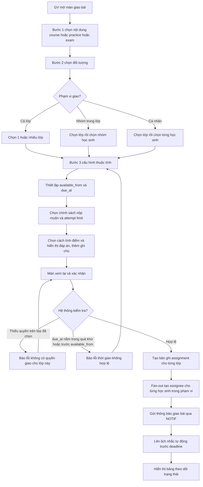
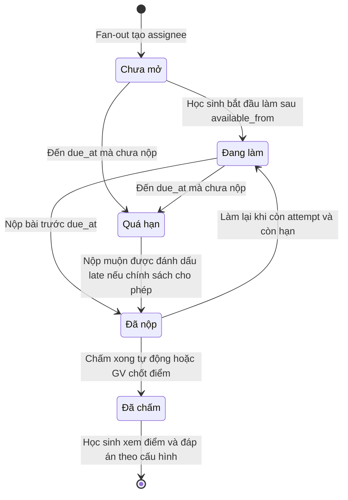
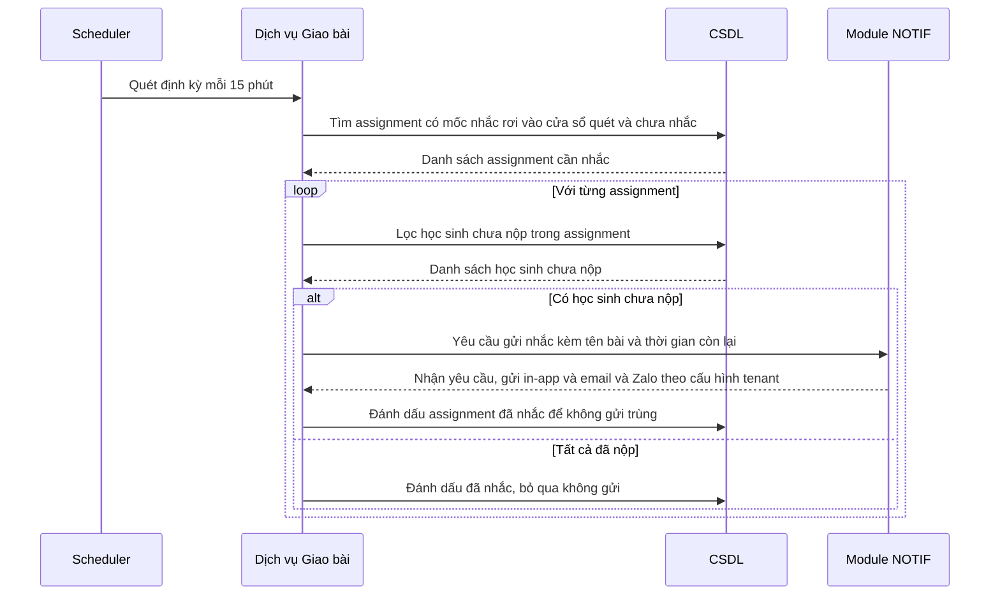

# SRS — Giao bài

**Mã module:** `ASSIGN` (dùng trong mã FR: `FR-ASSIGN-xx`)
**Trạng thái:** 🟢 Đã chốt
**Phụ thuộc:** `AUTH` (phân quyền, cờ ủy quyền trợ giảng), `ORG` (lớp, nhóm học sinh trong lớp), `COURSE` / `PRACTICE` / `EXAM` (nội dung được giao), `NOTIF` (gửi thông báo, nhắc deadline), `GRADE` (trạng thái chấm của bài nộp)

## 1. Mục đích

Giao bài là module trung tâm kết nối kho nội dung với học sinh: giáo viên chọn một nội dung (khóa học, bài luyện tập, bài thi thử) và giao cho đối tượng cụ thể kèm hạn nộp, số lần làm và các quy tắc tính điểm. Module thay thế cách giao bài qua Zalo/giấy đang khiến bài tập bị trôi, đồng thời cho giáo viên và trợ giảng bảng theo dõi ai đã làm — ai chưa để can thiệp kịp thời. Với học sinh, module trả lời câu hỏi quan trọng nhất mỗi ngày: "hôm nay mình phải làm gì, hạn đến bao giờ".

## 2. Phạm vi

- **Trong phạm vi (v1):**
  - Giao 1 nội dung (course / practice / exam) cho: cả lớp, nhóm học sinh trong lớp, hoặc cá nhân; có thể chọn nhiều lớp cùng lúc trong một lần thao tác.
  - Thuộc tính assignment: thời gian mở (`available_from`), hạn nộp (`due_at`), chính sách nộp muộn (cho phép nộp muộn — đánh dấu `late`, hoặc khóa hẳn sau hạn), giới hạn số lần làm (attempt limit — áp dụng cho practice/exam), cách tính điểm khi có nhiều attempt (cao nhất / lần cuối / trung bình), hiển thị đáp án sau nộp (không hiển thị / sau khi nộp / sau deadline), ghi chú của giáo viên.
  - Giao lặp lại (recurring): tạo assignment mới định kỳ hằng tuần theo mẫu — VD bài tập về nhà thứ 2 hằng tuần (Should).
  - Người giao: `teacher` (lớp mình phụ trách), `assistant` (nếu được giáo viên ủy quyền — cờ bật/tắt theo từng lớp), `academic_head` (lớp trong tổ), `manager` (lớp trong phạm vi chi nhánh được gán), `owner` (mọi lớp).
  - Theo dõi: bảng trạng thái theo từng học sinh (chưa mở / đang làm / đã nộp / đã chấm / quá hạn), tỉ lệ hoàn thành; nhắc thủ công 1-chạm cho các em chưa nộp; nhắc tự động trước deadline (mặc định 24 giờ, cấu hình được theo từng assignment, gửi qua module `NOTIF`).
  - Sửa / thu hồi: đổi deadline (học sinh được thông báo), hủy giao (bài đã nộp được giữ lại).
  - Phía học sinh: danh sách "việc cần làm" sắp xếp theo deadline, phân tab (chưa làm / đã nộp / đã có điểm), đồng hồ đếm ngược với bài sắp hết hạn.
- **Ngoài phạm vi (để v2 / không làm):**
  - Giao bài theo điều kiện (adaptive — làm xong bài A mới được nhận bài B).
  - Peer review (học sinh chấm chéo bài của nhau).

## 3. Vai trò liên quan

| Vai trò | Tương tác với module này |
|---|---|
| Học sinh (`student`) | Xem danh sách việc cần làm theo deadline; mở và làm bài được giao; nhận thông báo giao bài, đổi deadline và nhắc hạn |
| Giáo viên (`teacher`) | Tạo / sửa / hủy assignment cho lớp mình phụ trách; cấu hình deadline, attempt, đáp án; theo dõi bảng trạng thái; nhắc học sinh; bật/tắt cờ ủy quyền giao bài cho trợ giảng theo từng lớp; thiết lập giao lặp lại |
| Trợ giảng (`assistant`) | Giao bài trong các lớp được giáo viên ủy quyền; xem bảng trạng thái lớp được gán; nhắc 1-chạm học sinh chưa nộp |
| Nhân viên quản lý (`manager`) — owner kế thừa toàn bộ | Giao bài + xem danh sách assignment và tỉ lệ hoàn thành trong phạm vi chi nhánh được gán (owner: toàn trung tâm) |
| Admin hệ thống (`admin`) | Không dùng trực tiếp; theo dõi số liệu vận hành tổng hợp (khối lượng fan-out, job nhắc) ở cấp nền tảng |
| Nhân viên nội dung (`content_editor`) | Không tương tác trực tiếp; nội dung họ xuất bản là đầu vào để tenant giao bài |
| Nhân viên support (`support_agent`) | Tra cứu trạng thái assignment và lịch sử thông báo khi xử lý ticket; thao tác thay người dùng qua đăng nhập thay (có audit) |

## 4. User stories

- `US-ASSIGN-01` — Là **giáo viên**, tôi muốn **giao một bài luyện tập cho cả lớp kèm deadline chỉ trong vài phút** để **không phải nhắn tin từng em qua Zalo**.
- `US-ASSIGN-02` — Là **giáo viên**, tôi muốn **giao cùng một nội dung cho nhiều lớp cùng lúc** để **không lặp lại thao tác cho từng lớp dạy cùng giáo trình**.
- `US-ASSIGN-03` — Là **giáo viên**, tôi muốn **giao riêng cho một nhóm học sinh yếu hoặc một cá nhân** để **cá nhân hóa việc luyện tập**.
- `US-ASSIGN-04` — Là **giáo viên**, tôi muốn **xem bảng trạng thái ai chưa mở, ai đang làm, ai đã nộp** để **biết cần can thiệp với em nào trước buổi học**.
- `US-ASSIGN-05` — Là **giáo viên**, tôi muốn **thiết lập giao bài về nhà lặp lại hằng tuần theo mẫu** để **không phải tạo lại assignment mỗi tuần**.
- `US-ASSIGN-06` — Là **trợ giảng**, tôi muốn **nhắc 1-chạm tất cả học sinh chưa nộp** để **không phải nhắn tin thủ công từng em**.
- `US-ASSIGN-07` — Là **trợ giảng được ủy quyền**, tôi muốn **tự giao bài cho lớp mình hỗ trợ** để **giảm tải cho giáo viên các việc lặp lại**.
- `US-ASSIGN-08` — Là **ban giám hiệu**, tôi muốn **giao một đề thi thử chung cho nhiều lớp và xem tỉ lệ hoàn thành** để **đánh giá mặt bằng chất lượng toàn trung tâm**.
- `US-ASSIGN-09` — Là **học sinh**, tôi muốn **thấy danh sách việc cần làm sắp xếp theo deadline kèm đồng hồ đếm ngược** để **không bỏ lỡ hạn nộp bài nào**.
- `US-ASSIGN-10` — Là **học sinh**, tôi muốn **được nhắc trước deadline 24 giờ nếu chưa nộp** để **kịp sắp xếp thời gian làm bài**.
- `US-ASSIGN-11` — Là **giáo viên**, tôi muốn **đổi deadline và học sinh được thông báo ngay** để **linh hoạt khi lớp nghỉ đột xuất**.

## 5. Luồng hoạt động

### 5.1 Luồng giáo viên tạo assignment (end-to-end)

Mô tả các bước:

1. Người giao (teacher / assistant được ủy quyền / manager) mở màn giao bài từ trang lớp học hoặc từ trang chi tiết nội dung ("Giao bài này").
2. **Bước 1 — chọn nội dung:** tìm trong kho nội dung tenant được phép dùng (nội dung tự soạn + kho chung theo gói). Chỉ nội dung đã xuất bản mới giao được.
3. **Bước 2 — chọn đối tượng:** cả lớp (chọn được nhiều lớp), nhóm học sinh trong lớp, hoặc từng cá nhân. Với assistant, danh sách lớp chỉ gồm lớp có cờ ủy quyền đang bật.
4. **Bước 3 — cấu hình:** `available_from` (mặc định: ngay lập tức), `due_at` (bắt buộc), chính sách nộp muộn, attempt limit và cách tính điểm (chỉ hiện với practice/exam), hiển thị đáp án, ghi chú.
5. **Xác nhận:** màn xem lại tóm tắt nội dung + đối tượng + cấu hình; hệ thống kiểm tra quyền và tính hợp lệ thời gian trước khi tạo.
6. Khi giao nhiều lớp, mỗi lớp tạo một bản ghi assignment riêng (theo dõi và sửa độc lập). Hệ thống fan-out tạo bản ghi assignee cho từng học sinh, gửi thông báo qua `NOTIF` và đăng ký lịch nhắc tự động.

Ngoại lệ:

- Lớp không có học sinh nào trong phạm vi chọn → chặn xác nhận, báo "không có học sinh nào được giao".
- Fan-out với lớp đông chạy nền (job bất đồng bộ); nếu gửi thông báo lỗi một phần, assignment vẫn được tạo và hệ thống retry phần thông báo lỗi.
- Học sinh vào lớp sau thời điểm giao: xem Câu hỏi mở #2.

### 5.2 Vòng đời một assignment với một học sinh

Ghi chú trạng thái:

- **Chưa mở:** học sinh chưa từng mở bài; trước `available_from` bài hiển thị trong danh sách nhưng chưa vào làm được.
- **Đang làm:** đã có ít nhất một attempt chưa nộp.
- **Đã nộp:** attempt gần nhất đã nộp; nếu còn lượt và còn hạn, học sinh có thể làm lại (điểm tính theo cấu hình cao nhất / lần cuối / trung bình).
- **Quá hạn:** qua `due_at` mà chưa có bài nộp. Nếu chính sách cho phép nộp muộn, học sinh vẫn nộp được và submission bị đánh dấu `late`; nếu khóa hẳn, bài không vào làm được nữa.
- **Đã chấm:** điểm chốt đã có (chấm tự động tức thì, hoặc qua duyệt chấm của module `GRADE` với speaking/writing).
- Trạng thái "Quá hạn" của học sinh không thay đổi khi giáo viên gia hạn deadline — hệ thống tính lại theo `due_at` mới.

### 5.3 Nhắc deadline tự động

Mô tả:

1. Scheduler quét định kỳ (chu kỳ 15 phút). Mốc nhắc của mỗi assignment = `due_at` trừ khoảng nhắc (mặc định 24 giờ, cấu hình được theo từng assignment; người giao có thể tắt nhắc).
2. Chỉ học sinh **chưa nộp** nhận được nhắc; học sinh đã nộp không bị làm phiền.
3. Việc gửi đa kênh (in-app / email / Zalo OA) do module `NOTIF` quyết định theo cấu hình kênh của tenant và tùy chọn của người nhận — `ASSIGN` chỉ phát yêu cầu.
4. Idempotent: mỗi assignment chỉ nhắc tự động 1 lần cho mỗi mốc nhắc; đổi deadline sẽ tính lại mốc nhắc và cho phép nhắc lại theo mốc mới.
5. Ngoại lệ: nếu khi tạo assignment mà mốc nhắc đã ở quá khứ (deadline quá gần), bỏ qua nhắc tự động; nhắc thủ công 1-chạm vẫn dùng được bất cứ lúc nào.

### 5.4 Sửa và thu hồi assignment (mô tả ngắn)

- **Đổi deadline:** người giao sửa `due_at` (và/hoặc `available_from`); hệ thống tính lại trạng thái quá hạn của từng học sinh, tính lại mốc nhắc tự động và gửi thông báo "deadline đã thay đổi" cho toàn bộ học sinh trong phạm vi.
- **Hủy giao:** assignment chuyển trạng thái `cancelled`, biến mất khỏi danh sách việc cần làm của học sinh chưa nộp; bài đã nộp và điểm đã chấm **được giữ nguyên** để tra cứu. Học sinh nhận thông báo hủy. Không thể "un-cancel" — muốn giao lại thì tạo assignment mới.

## 6. Yêu cầu chức năng

| Mã | Yêu cầu | Vai trò | Ưu tiên |
|---|---|---|---|
| FR-ASSIGN-01 | Giao 1 nội dung (course / practice / exam) cho cả lớp, cho nhóm học sinh trong lớp, hoặc cho cá nhân | teacher, assistant (được ủy quyền), manager | Must |
| FR-ASSIGN-02 | Chọn nhiều lớp trong một lần giao; hệ thống tạo assignment riêng cho từng lớp để theo dõi và sửa độc lập | teacher, manager | Must |
| FR-ASSIGN-03 | Cấu hình thời gian mở `available_from` và hạn nộp `due_at`; chặn cấu hình thời gian không hợp lệ (deadline trong quá khứ, deadline trước thời gian mở) | teacher, assistant, manager | Must |
| FR-ASSIGN-04 | Cấu hình chính sách nộp muộn: cho phép nộp sau hạn (submission đánh dấu `late`) hoặc khóa hẳn sau `due_at` | teacher, assistant, manager | Must |
| FR-ASSIGN-05 | Cấu hình số lần làm tối đa (attempt limit) với practice/exam; mặc định 1 lần với exam, không giới hạn với practice | teacher, assistant, manager | Must |
| FR-ASSIGN-06 | Cấu hình cách tính điểm khi có nhiều attempt: điểm cao nhất / lần cuối / trung bình | teacher, assistant, manager | Must |
| FR-ASSIGN-07 | Cấu hình hiển thị đáp án cho học sinh: không hiển thị / sau khi nộp / sau deadline | teacher, assistant, manager | Must |
| FR-ASSIGN-08 | Đính kèm ghi chú của giáo viên vào assignment; học sinh thấy ghi chú trước khi làm bài | teacher, assistant, manager | Must |
| FR-ASSIGN-09 | Giáo viên bật/tắt cờ ủy quyền giao bài cho trợ giảng theo từng lớp; assistant chỉ giao được trong lớp có cờ đang bật | teacher | Must |
| FR-ASSIGN-10 | Khi xác nhận giao, hệ thống fan-out tạo bản ghi assignee cho từng học sinh trong phạm vi và gửi thông báo giao bài qua `NOTIF` | hệ thống | Must |
| FR-ASSIGN-11 | Bảng theo dõi trạng thái theo từng học sinh (chưa mở / đang làm / đã nộp / đã chấm / quá hạn) kèm tỉ lệ hoàn thành của assignment | teacher, assistant, manager | Must |
| FR-ASSIGN-12 | Nhắc thủ công 1-chạm: gửi thông báo cho toàn bộ học sinh chưa nộp của một assignment bằng một thao tác | teacher, assistant, manager | Must |
| FR-ASSIGN-13 | Nhắc tự động trước deadline cho học sinh chưa nộp; mặc định trước 24 giờ, cấu hình được (hoặc tắt) theo từng assignment; gửi qua `NOTIF`; không gửi trùng | hệ thống | Must |
| FR-ASSIGN-14 | Đổi deadline sau khi giao; hệ thống thông báo thay đổi cho học sinh và tính lại trạng thái quá hạn cùng mốc nhắc tự động | teacher, assistant, manager | Must |
| FR-ASSIGN-15 | Hủy giao (thu hồi) assignment; bài đã nộp và điểm đã chấm được giữ lại; học sinh chưa nộp nhận thông báo hủy | teacher, assistant, manager | Must |
| FR-ASSIGN-16 | Học sinh xem danh sách việc cần làm sắp xếp theo deadline gần nhất, phân tab: chưa làm / đã nộp / đã có điểm | student | Must |
| FR-ASSIGN-17 | Hiển thị đồng hồ đếm ngược với bài sắp hết hạn trong danh sách việc cần làm của học sinh | student | Should |
| FR-ASSIGN-18 | Giao lặp lại (recurring): định nghĩa mẫu giao hằng tuần (nội dung, đối tượng, cấu hình, ngày giờ giao trong tuần); hệ thống tự tạo assignment mới theo chu kỳ; tạm dừng / kết thúc được mẫu | teacher, manager | Should |
| FR-ASSIGN-19 | Manager/owner xem danh sách assignment các lớp trong phạm vi (owner: toàn trung tâm), lọc theo chi nhánh / lớp / giáo viên / trạng thái | manager, owner | Should |
| FR-ASSIGN-20 | Support agent tra cứu chi tiết assignment, trạng thái assignee và lịch sử thông báo đã gửi khi xử lý ticket (qua đăng nhập thay, có audit) | support_agent | Could |

## 7. Yêu cầu phi chức năng (riêng module)

Phần chung xem [06-yeu-cau-phi-chuc-nang](../01-kien-truc/06-yeu-cau-phi-chuc-nang.md). Riêng module:

- **Fan-out:** giao cho lớp 100 học sinh hoàn tất tạo assignee trong ≤ 5 giây; giao nhiều lớp / lớp đông chạy job nền, UI trả về ngay kèm trạng thái xử lý — không chặn người giao.
- **Nhắc tự động:** độ trễ gửi nhắc so với mốc nhắc ≤ 15 phút (bằng chu kỳ quét); cơ chế đánh dấu đã nhắc phải idempotent để không gửi trùng khi job retry.
- **Múi giờ:** thời gian lưu UTC; hiển thị và nhập theo múi giờ tenant (mặc định Asia/Ho_Chi_Minh — xem Câu hỏi mở #1).
- **Hiệu năng đọc:** bảng trạng thái assignment của lớp 100 học sinh tải < 2 giây; danh sách việc cần làm của học sinh trả về < 1 giây và hoạt động tốt trên mobile.
- **Toàn vẹn dữ liệu:** hủy giao là soft-delete — không bao giờ xóa attempt / submission đã có; mọi truy vấn ràng buộc `tenant_id` (cách ly multi-tenant).
- **Recurring:** job sinh assignment theo mẫu phải chịu được trùng lịch (nếu chạy lại không tạo bản ghi đúp cho cùng một chu kỳ).

## 8. Màn hình chính

| Màn hình | Vai trò dùng | Mockup |
|---|---|---|
| Wizard giao bài 3 bước (chọn nội dung → chọn đối tượng → cấu hình) + màn xác nhận | teacher, assistant, manager | _sẽ bổ sung_ |
| Danh sách assignment của lớp (lọc theo trạng thái, người giao) | teacher, assistant, manager | _sẽ bổ sung_ |
| Chi tiết assignment: bảng trạng thái theo học sinh, tỉ lệ hoàn thành, nút nhắc 1-chạm, sửa deadline, hủy giao | teacher, assistant, manager | _sẽ bổ sung_ |
| Quản lý mẫu giao lặp lại (tạo / tạm dừng / kết thúc) | teacher, manager | _sẽ bổ sung_ |
| Danh sách assignment toàn trung tâm (lọc chi nhánh / lớp / giáo viên) | owner, manager | _sẽ bổ sung_ |
| Việc cần làm của học sinh: tab chưa làm / đã nộp / đã có điểm, sắp xếp theo deadline, đếm ngược bài sắp hết hạn | student | _sẽ bổ sung_ |

## 9. API sơ bộ

| Method | Path | Mô tả | Quyền |
|---|---|---|---|
| POST | `/api/v1/assignments` | Tạo assignment: nội dung + đối tượng (1..n lớp / nhóm / cá nhân) + cấu hình; trả về danh sách assignment đã tạo, fan-out chạy nền | teacher, assistant (ủy quyền), manager |
| GET | `/api/v1/assignments` | Danh sách assignment; lọc theo lớp, trạng thái, người giao, khoảng thời gian; phạm vi theo vai trò | teacher, assistant, manager, support_agent |
| GET | `/api/v1/assignments/{id}` | Chi tiết assignment: nội dung, cấu hình, thống kê tổng quan | teacher, assistant, manager, support_agent |
| PATCH | `/api/v1/assignments/{id}` | Sửa assignment: deadline, thời gian mở, ghi chú, cấu hình nhắc; đổi deadline sẽ phát thông báo | teacher, assistant (ủy quyền), manager |
| POST | `/api/v1/assignments/{id}/cancel` | Hủy giao; giữ bài đã nộp; thông báo học sinh chưa nộp | teacher, assistant (ủy quyền), manager |
| GET | `/api/v1/assignments/{id}/progress` | Bảng trạng thái theo từng học sinh + tỉ lệ hoàn thành | teacher, assistant, manager, support_agent |
| POST | `/api/v1/assignments/{id}/remind` | Nhắc thủ công 1-chạm: gửi thông báo cho toàn bộ học sinh chưa nộp | teacher, assistant, manager |
| GET | `/api/v1/assignments/me` | Việc cần làm của học sinh đang đăng nhập: lọc theo tab (chưa làm / đã nộp / đã có điểm), sắp xếp theo deadline | student |
| POST | `/api/v1/assignments/recurring` | Tạo mẫu giao lặp lại hằng tuần | teacher, manager |
| GET | `/api/v1/assignments/recurring` | Danh sách mẫu giao lặp lại của các lớp trong phạm vi | teacher, assistant, manager |
| PATCH | `/api/v1/assignments/recurring/{id}` | Sửa / tạm dừng / kết thúc mẫu giao lặp lại | teacher, manager |

## 10. Entity liên quan

Chi tiết thuộc tính xem [Từ điển dữ liệu](../16-du-lieu/02-tu-dien-du-lieu.md), quan hệ xem [ERD](../16-du-lieu/01-erd.md).

- **Assignment** — lượt giao bài: tham chiếu nội dung (course/practice/exam), lớp, người giao, `available_from`, `due_at`, chính sách nộp muộn, attempt limit, cách tính điểm, hiển thị đáp án, ghi chú, cấu hình nhắc, trạng thái (`active` / `cancelled`).
- **AssignmentAssignee** — người được giao: liên kết assignment × học sinh, trạng thái dẫn xuất (chưa mở / đang làm / đã nộp / đã chấm / quá hạn), thời điểm nộp, cờ `late`.
- **AssignmentRecurrence** — mẫu giao lặp lại: cấu hình mẫu + lịch tuần + trạng thái (đang chạy / tạm dừng / kết thúc); mỗi chu kỳ sinh 1 Assignment tham chiếu về mẫu.
- Tham chiếu từ module khác: **Class / ClassGroup / User** (`ORG`), **Course / Practice / Exam** (`COURSE`/`PRACTICE`/`EXAM`), **Attempt / Submission** (`PRACTICE`/`EXAM`/`GRADE`), **Notification** (`NOTIF`).

## 11. Câu hỏi mở cần chốt

| # | Câu hỏi | Quyết định | Ngày chốt |
|---|---|---|---|
| 1 | Múi giờ nhập/hiển thị deadline cố định Asia/Ho_Chi_Minh cho mọi tenant, hay cấu hình theo tenant (tính đến trung tâm có học sinh học online ở nước ngoài)? | **Chốt:** Theo múi giờ tenant (NFR-I18N-04); hiển thị kèm nhãn múi giờ khi khác VN | 2026-07-16 |
| 2 | Học sinh vào lớp **sau** khi assignment đã giao có tự động nhận các assignment còn hạn của lớp không, hay giáo viên phải thêm thủ công? | **Chốt:** Tự động nhận assignment còn hạn của lớp; tắt được per assignment | 2026-07-16 |
| 3 | Có cho sửa attempt limit / cách tính điểm / hiển thị đáp án **sau khi đã có học sinh nộp bài** không, hay khóa các trường này và chỉ cho sửa deadline + ghi chú? | **Chốt:** Khóa attempt limit / cách tính điểm / hiển thị đáp án sau khi có bài nộp; chỉ sửa deadline + ghi chú | 2026-07-16 |
| 4 | Mẫu giao lặp lại sinh assignment con vào lúc nào (đúng ngày giờ giao, hay trước N ngày để giáo viên kịp xem lại) và tự kết thúc theo ngày kết thúc lớp hay chạy đến khi tắt tay? | **Chốt:** Sinh trước 24h ở trạng thái nháp để GV xem; tự kết thúc theo ngày kết thúc lớp | 2026-07-16 |

## Lịch sử thay đổi

| Ngày | Thay đổi | Người |
|---|---|---|
| 2026-07-16 | Tạo bản nháp đầu tiên | Claude |
| 2026-07-16 | Chốt toàn bộ câu hỏi mở (quyết định ghi trong bảng), chuyển trạng thái Đã chốt | Chủ sản phẩm |
| 2026-07-17 | Người giao + phạm vi đồng bộ 11 vai trò | Chủ sản phẩm + Claude |
