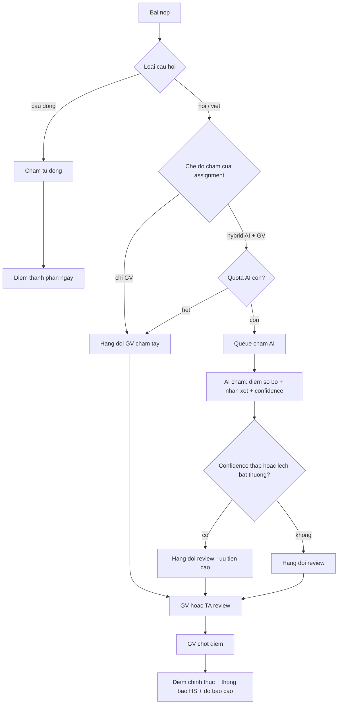
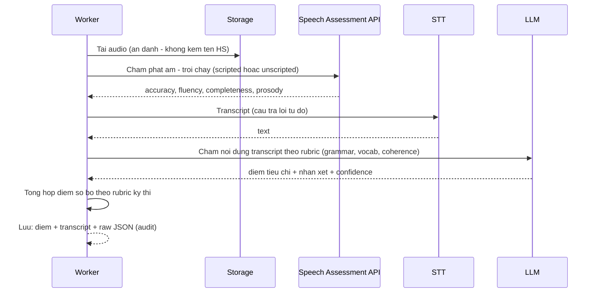
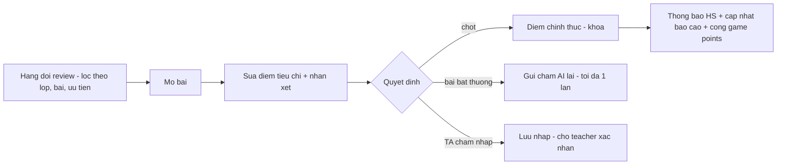

# SRS — Chấm bài (Hybrid AI + Giáo viên)

**Mã module:** `GRADE`
**Trạng thái:** 🟢 Đã chốt
**Phụ thuộc:** [Practice](../05-practice/srs-practice.md), [Exam](../06-exam/srs-exam.md), [Gói dịch vụ](../14-goi-dich-vu/srs-goi-dich-vu.md) (quota AI), [Kiến trúc](../01-kien-truc/01-kien-truc-tong-the.md) (AI adapter, queue)

## 1. Mục đích

Chấm mọi bài nộp theo 3 tầng: **tự động** (câu đóng — tức thì), **AI sơ bộ** (nói/viết — theo rubric chuẩn thi), **giáo viên chốt** (review kết quả AI, sửa, quyết định điểm cuối). Mô hình hybrid giữ tốc độ của AI và uy tín điểm số của giáo viên — đúng khoảng trống thị trường đã xác định trong [nghiên cứu](../00-tong-quan/02-nghien-cuu-thi-truong.md).

## 2. Phạm vi

- **Trong phạm vi (v1):** chấm tự động câu đóng; pipeline AI chấm speaking (phát âm/trôi chảy + nội dung) và writing (rubric); hàng đợi review cho GV/trợ giảng; rubric theo chuẩn thi; quota AI theo tenant; hiệu chuẩn AI-vs-GV; degrade khi AI lỗi.
- **Ngoài phạm vi (v2):** AI chấm hoàn toàn không cần GV (chế độ tùy chọn), chấm chéo giữa học sinh (peer review), fine-tune model theo tenant.

## 3. Vai trò liên quan

| Vai trò | Tương tác |
|---|---|
| student | Nộp bài; thấy trạng thái chấm; nhận điểm AI sơ bộ (đánh dấu "chờ GV duyệt") và điểm chốt |
| assistant | Chấm nháp trong lớp được ủy quyền (điểm đề xuất — không phải điểm chốt) |
| teacher | Hàng đợi review; sửa điểm/nhận xét AI; chốt điểm; chấm tay khi cần |
| manager | Như teacher — Trong phạm vi được gán (chi nhánh); owner kế thừa với toàn tenant; xem thống kê chênh lệch AI-GV |
| admin | Cấu hình AI provider, model, giá quota; theo dõi chi phí |
| support_agent | Tra cứu trạng thái job chấm khi xử lý ticket |

## 4. User stories

- `US-GRADE-01` — Là **học sinh**, tôi muốn nhận phản hồi AI trong vài phút sau khi nộp bài nói để biết ngay lỗi phát âm.
- `US-GRADE-02` — Là **giáo viên**, tôi muốn màn hình review đặt audio + transcript + điểm AI cạnh nhau để chốt 1 bài trong ≤ 2 phút.
- `US-GRADE-03` — Là **giáo viên**, tôi muốn bài AI chấm "thiếu tự tin" hoặc lệch chuẩn được đẩy lên đầu hàng đợi.
- `US-GRADE-04` — Là **trợ giảng**, tôi muốn chấm nháp để giáo viên chỉ xác nhận, tiết kiệm thời gian cả nhóm.
- `US-GRADE-05` — Là **ban giám hiệu**, tôi muốn biết mức chênh AI vs GV để tin tưởng dần vào điểm AI.

## 5. Luồng hoạt động

### 5.1 Pipeline tổng

### 5.2 AI chấm Speaking

- **Stack AI theo ngôn ngữ** (căn cứ: [Phụ lục — Nghiên cứu AI chấm bài](../99-phu-luc/03-nghien-cuu-ai-cham-bai.md)): phát âm dùng provider hỗ trợ đủ Anh/Trung/Nhật/Hàn (Azure Pronunciation Assessment là mặc định — phủ cả 4; SpeechSuper là fallback CJK); STT: Whisper-class; nội dung + writing: LLM qua adapter (đổi model bằng config).
- **Ẩn danh**: payload gửi AI không chứa tên/ID thật học sinh ([Bảo mật](../01-kien-truc/03-bao-mat.md)).
- Kỹ thuật chấm writing bằng LLM: rubric chính thức từng tiêu chí trong prompt, chấm analytic từng tiêu chí → tổng hợp, temperature 0, yêu cầu rationale + JSON; nghiên cứu cho thấy QWK với examiner ~0.8 ở IELTS Task 2 nhưng có bias (né điểm cực trị, thiên vị bài dài) → **luôn cần GV chốt** ở v1.

### 5.3 Màn hình review của giáo viên

Bố cục 3 cột: (1) đề bài + rubric; (2) bài làm (audio player + transcript highlight lỗi / bài viết với annotation AI); (3) phiếu điểm — điểm AI đề xuất từng tiêu chí (GV sửa trực tiếp), nhận xét AI (GV sửa/viết lại), nút **Chốt điểm** / **Trả lại chấm lại** / **Bỏ qua AI, chấm tay**.

- Trợ giảng (được ủy quyền): thao tác như GV nhưng kết quả là **điểm nháp** — teacher xác nhận 1-chạm (hàng loạt được) để thành điểm chốt.
- Sửa điểm sau khi chốt: được (teacher/manager), bắt buộc nhập lý do, ghi audit, học sinh nhận thông báo điểm thay đổi.

### 5.4 Degrade khi AI lỗi

| Tình huống | Hành vi |
|---|---|
| AI API lỗi tạm (429/5xx) | Retry backoff 3 lần; job giữ trạng thái "đang chấm" |
| AI down kéo dài (> cấu hình, mặc định 4h) | Circuit breaker mở → bài chuyển thẳng hàng đợi GV chấm tay; học sinh thấy "giáo viên đang chấm" |
| Hết quota AI tháng | Không gửi AI; vào hàng GV; manager nhận cảnh báo quota ([PLAN](../14-goi-dich-vu/srs-goi-dich-vu.md)) |
| Audio hỏng/không nghe được | AI trả lỗi phân loại → học sinh được nộp lại (không tính attempt) nếu GV cho phép |

**Không bao giờ** chặn luồng nộp bài vì AI lỗi.

### 5.5 Hiệu chuẩn (calibration)

- Lưu cặp (điểm AI, điểm GV chốt) mọi bài hybrid → dashboard chênh lệch theo: rubric, ngôn ngữ, level, giáo viên.
- Chênh trung bình > 1 band/bậc trong 30 ngày → cảnh báo admin xem lại prompt/rubric/model.
- Dữ liệu này là tài sản để cải thiện prompt (reflect-and-revise) và cân nhắc mức tự động hóa cao hơn ở v2.

## 6. Yêu cầu chức năng

| Mã | Yêu cầu | Vai trò | Ưu tiên |
|---|---|---|---|
| FR-GRADE-01 | Chấm tự động câu đóng ngay khi nộp (đáp án từ ngân hàng câu hỏi; điền từ chấp nhận nhiều đáp án đúng + tùy chọn bỏ qua hoa/thường) | — | Must |
| FR-GRADE-02 | Chế độ chấm per assignment: tự động / hybrid AI+GV / chỉ GV | teacher | Must |
| FR-GRADE-03 | AI chấm speaking: phát âm, trôi chảy (+ đầy đủ chỉ số theo provider), transcript, nội dung theo rubric; đủ 4 ngôn ngữ en/zh/ja/ko | — | Must |
| FR-GRADE-04 | AI chấm writing theo rubric chuẩn thi từng tiêu chí + nhận xét + gợi ý sửa; confidence score | — | Must |
| FR-GRADE-05 | Rubric theo chuẩn thi có sẵn (IELTS Speaking/Writing band descriptors, TOEIC SW, HSKK, JLPT không có nói — theo [phụ lục](../99-phu-luc/02-chuan-thi-quoc-te.md)); tenant tạo rubric riêng | teacher | Must |
| FR-GRADE-06 | Hàng đợi review: lọc theo lớp/bài/trạng thái; ưu tiên confidence thấp; đếm số chờ | teacher, assistant | Must |
| FR-GRADE-07 | Màn review: audio + transcript + điểm AI cạnh nhau; GV sửa và chốt; thao tác được bằng phím tắt | teacher | Must |
| FR-GRADE-08 | Trợ giảng chấm nháp (khi ủy quyền); teacher xác nhận đơn/hàng loạt thành điểm chốt | assistant, teacher | Must |
| FR-GRADE-09 | Điểm AI hiển thị cho học sinh là "sơ bộ — chờ GV duyệt" (bật/tắt per tenant: có tenant muốn ẩn hoàn toàn đến khi chốt — cài đặt cấp tenant do owner) | owner | Must |
| FR-GRADE-10 | Sửa điểm sau chốt: nhập lý do + audit + thông báo học sinh | teacher, manager | Must |
| FR-GRADE-11 | Degrade đầy đủ theo mục 5.4; trạng thái job chấm tra cứu được (cho support) | — | Must |
| FR-GRADE-12 | Trừ quota AI per lượt chấm thành công; không trừ khi lỗi; đếm riêng speaking/writing | — | Must |
| FR-GRADE-13 | Lưu audio gốc + transcript + raw JSON AI ≥ theo retention tenant (audit + khiếu nại điểm) | — | Must |
| FR-GRADE-14 | Dashboard hiệu chuẩn AI-vs-GV (chênh lệch theo rubric/ngôn ngữ/GV) | owner, manager, admin | Should |
| FR-GRADE-15 | AI provider adapter: đổi provider/model qua config; on-premise chọn model local (chất lượng thấp hơn — ghi rõ) | admin | Must |
| FR-GRADE-16 | Học sinh khiếu nại điểm 1 bài (gửi kèm lời nhắn) → về hàng đợi GV với cờ khiếu nại | student | Should |

## 7. Yêu cầu phi chức năng (riêng module)

- Kết quả AI: p90 < 3 phút từ lúc nộp ([NFR-PERF-05](../01-kien-truc/06-yeu-cau-phi-chuc-nang.md)).
- Chi phí AI mục tiêu ≤ $0.7/học sinh hoạt động/tháng ở cấu hình mặc định (scripted speaking + model nhỏ cho writing) — theo dõi trên dashboard admin.
- Job idempotent theo submission id — retry không tạo kết quả trùng.

## 8. Màn hình chính

| Màn hình | Vai trò dùng | Mockup |
|---|---|---|
| Hàng đợi chấm bài | teacher, assistant | [cham-bai-queue.html](../17-mockups/giao-vien/cham-bai-queue.html) |
| Review 1 bài speaking/writing | teacher, assistant | [cham-bai-review.html](../17-mockups/giao-vien/cham-bai-review.html) |
| Dashboard hiệu chuẩn AI | manager, admin | _sẽ bổ sung_ |

## 9. API sơ bộ

| Method | Path | Mô tả | Quyền |
|---|---|---|---|
| GET | `/api/v1/grading/queue` | Hàng đợi review theo scope | teacher, assistant |
| GET | `/api/v1/grading/submissions/{id}` | Chi tiết bài + kết quả AI | teacher, assistant |
| PUT | `/api/v1/grading/submissions/{id}/scores` | Lưu điểm (nháp với TA, chốt với teacher) | theo ủy quyền |
| POST | `/api/v1/grading/submissions/{id}/finalize` | Chốt điểm | teacher, manager |
| POST | `/api/v1/grading/submissions/{id}/regrade` | Gửi AI chấm lại (1 lần) | teacher |
| GET | `/api/v1/grading/calibration` | Thống kê AI vs GV | manager, admin |

## 10. Entity liên quan

`submissions`, `answers`, `ai_gradings` (kết quả AI + raw), `scores` (điểm per tiêu chí, trạng thái draft/final), `rubrics`, `rubric_criteria`, `ai_usage_ledger` — xem [ERD](../16-du-lieu/01-erd.md).

## 11. Câu hỏi mở cần chốt

| # | Câu hỏi | Quyết định | Ngày chốt |
|---|---|---|---|
| 1 | Mặc định tenant mới: hiển thị điểm AI sơ bộ cho học sinh ngay, hay ẩn đến khi GV chốt? | **Chốt:** Hiển thị ngay, gắn nhãn 'AI sơ bộ — chờ GV duyệt'; tenant tắt được | 2026-07-16 |
| 2 | Provider phát âm mặc định chốt Azure PA (phủ 4 ngôn ngữ, ~$0.22–0.44/HS/tháng)? | **Chốt:** Azure PA mặc định; SpeechSuper fallback CJK | 2026-07-16 |
| 3 | SLA nội bộ cho GV chốt điểm (đề xuất: nhắc GV nếu bài chờ > 48h)? | **Chốt:** Nhắc GV khi bài chờ > 48h | 2026-07-16 |

## Lịch sử thay đổi

| Ngày | Thay đổi | Người |
|---|---|---|
| 2026-07-16 | Tạo bản nháp đầu tiên | Claude |
| 2026-07-16 | Chốt toàn bộ câu hỏi mở (quyết định ghi trong bảng), chuyển trạng thái Đã chốt | Chủ sản phẩm |
| 2026-07-17 | Cài đặt hiển thị điểm AI per tenant → owner; dashboard hiệu chuẩn thêm owner | Chủ sản phẩm + Claude |
| 2026-07-17 | Đồng bộ phạm vi manager/owner trong bảng vai trò | Chủ sản phẩm + Claude |
