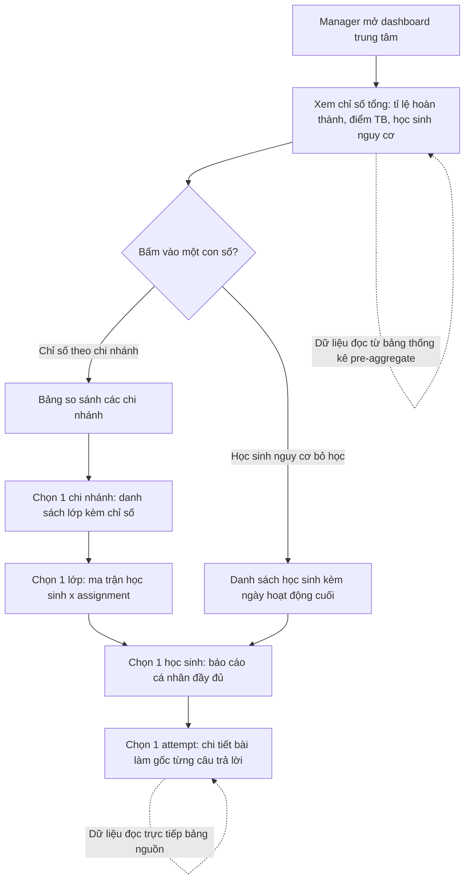
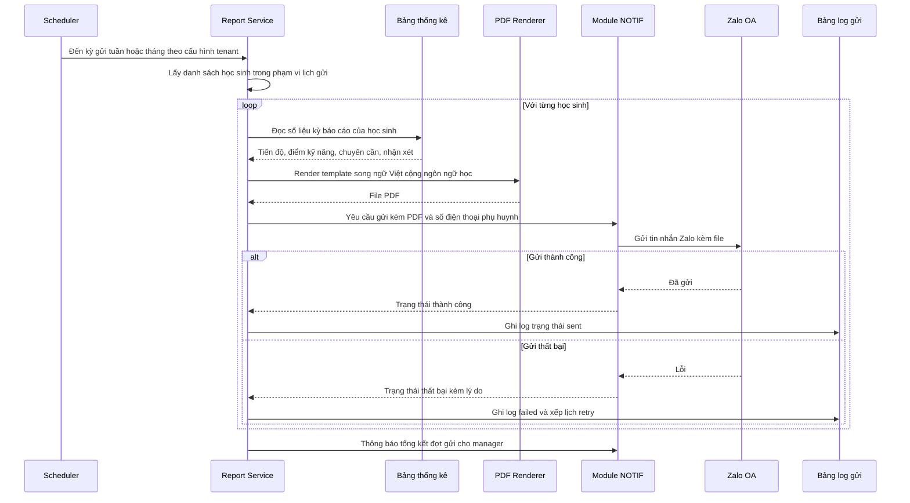
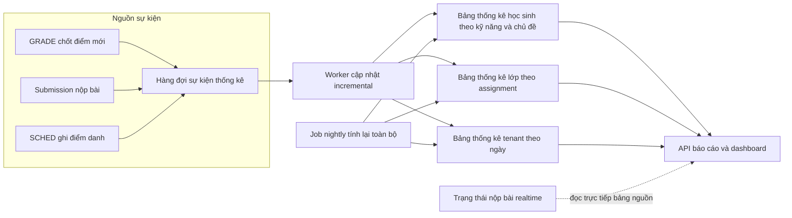
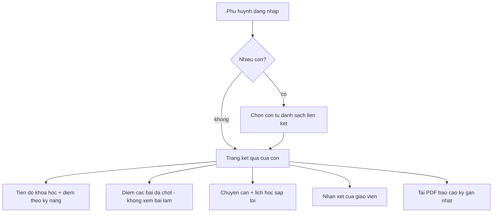

# SRS — Báo cáo

**Mã module:** `REPORT` (dùng trong mã FR: `FR-REPORT-xx`)
**Trạng thái:** 🟢 Đã chốt
**Phụ thuộc:** `AUTH` (phạm vi dữ liệu theo vai trò), `ORG` (chi nhánh/lớp/học sinh), `ASSIGN` (lượt giao bài, deadline), `GRADE` (điểm chốt, tiến trình chấm), `COURSE` (tiến độ khóa học), `CONTENT` (tag ngân hàng câu hỏi: kỹ năng/loại câu hỏi/chủ đề), `SCHED` (điểm danh/chuyên cần), `NOTIF` (gửi báo cáo phụ huynh qua Zalo)

## 1. Mục đích

Module Báo cáo trả lời câu hỏi cốt lõi của chủ sản phẩm: **"học sinh làm bài như thế nào"** — đầy đủ, theo 4 cấp: học sinh → lớp → trung tâm → xuất & chia sẻ ra ngoài. Học sinh thấy tiến bộ của mình; giáo viên biết ai chưa làm, ai đang yếu để can thiệp; ban giám hiệu nhìn toàn cảnh chất lượng dạy–học và ra quyết định; trung tâm có **báo cáo PDF song ngữ gửi phụ huynh** — giá trị bán hàng cốt lõi ở thị trường Việt Nam. Mọi con số hiển thị đều bấm vào drill-down được đến danh sách bài làm gốc, để báo cáo luôn kiểm chứng được.

## 2. Phạm vi

- **Trong phạm vi (v1):**
  - **Cấp học sinh:** tiến độ khóa học; điểm theo 4 kỹ năng nghe/nói/đọc/viết (radar chart); lịch sử làm bài chi tiết từng attempt (thời gian làm, điểm, trạng thái); xu hướng điểm theo thời gian; chuyên cần (dữ liệu từ `SCHED`); điểm mạnh/yếu theo loại câu hỏi & chủ đề (tag từ ngân hàng câu hỏi).
  - **Cấp lớp:** ma trận học sinh × assignment (trạng thái/điểm); tỉ lệ hoàn thành đúng hạn; phân bố điểm (histogram); danh sách học sinh cần chú ý theo rule cấu hình được; so sánh điểm giữa các kỳ thi thử.
  - **Cấp trung tâm:** tổng quan chi nhánh/lớp với drill-down chi nhánh → lớp → học sinh; so sánh lớp cùng level; báo cáo hoạt động giáo viên (số bài giao, tốc độ chấm trung bình, thời gian phản hồi); học sinh có nguy cơ bỏ học; xu hướng toàn trung tâm theo tháng.
  - **Xuất & chia sẻ:** xuất PDF/Excel mọi báo cáo; báo cáo học tập 1 học sinh dạng PDF song ngữ (tiếng Việt + ngôn ngữ đang học) thân thiện phụ huynh; lịch gửi tự động báo cáo tuần/tháng cho phụ huynh qua Zalo (qua `NOTIF`).
  - **Kỹ thuật:** pre-aggregation bảng thống kê chạy nightly + cập nhật incremental khi có điểm chốt mới; dữ liệu realtime cơ bản (trạng thái nộp bài) đọc trực tiếp từ bảng nguồn.
- **Ngoài phạm vi (để v2 / không làm):**
  - _(đã chuyển vào v1 ngày 2026-07-16)_ ~~Cổng phụ huynh đăng nhập riêng~~ — phụ huynh có tài khoản `parent` xem báo cáo kết quả của con (mục 5.4).
  - Báo cáo tùy biến kéo-thả (custom report builder).
  - Export API cho công cụ BI bên ngoài (Metabase, Power BI…).

## 3. Vai trò liên quan

| Vai trò | Tương tác với module này |
|---|---|
| Học sinh (`student`) | Xem báo cáo cá nhân của **chính mình**: tiến độ, radar kỹ năng, lịch sử làm bài, xu hướng điểm, chuyên cần |
| Giáo viên (`teacher`) | Xem báo cáo mọi học sinh **thuộc lớp mình phụ trách**; báo cáo cấp lớp; xuất PDF/Excel; tạo/gửi báo cáo phụ huynh cho học sinh lớp mình |
| Trợ giảng (`assistant`) | Xem báo cáo học sinh & lớp **trong phạm vi lớp được gán** (chỉ đọc) để nhắc nhở học sinh; không cấu hình rule, không thiết lập lịch gửi |
| Nhân viên quản lý (`manager`) — owner kế thừa toàn bộ | Xem **mọi** báo cáo của tenant: dashboard trung tâm, drill-down chi nhánh → lớp → học sinh, hoạt động giáo viên, nguy cơ bỏ học; cấu hình ngưỡng rule; thiết lập lịch gửi báo cáo phụ huynh; xuất mọi báo cáo |
| Admin hệ thống (`admin`) | Không xem nội dung báo cáo của tenant; theo dõi sức khỏe pipeline pre-aggregation (job nightly, độ trễ incremental) ở mức hạ tầng |
| Nhân viên nội dung (`content_editor`) | Không dùng trực tiếp; tag câu hỏi (kỹ năng/loại/chủ đề) do họ gán là đầu vào cho phân tích điểm mạnh/yếu |
| Nhân viên support (`support_agent`) | Tra cứu trạng thái job xuất báo cáo / gửi báo cáo phụ huynh khi xử lý ticket (qua log trạng thái, có audit) |
| Phụ huynh (`parent`) | Đăng nhập xem **bản báo cáo kết quả** của con: tiến độ, điểm chốt, chuyên cần, nhận xét GV, lịch học; nhiều con = 1 tài khoản; không xem bài làm chi tiết/nội dung đề |

## 4. User stories

- `US-REPORT-01` — Là **học sinh**, tôi muốn **xem radar 4 kỹ năng và xu hướng điểm của mình** để **biết mình yếu kỹ năng nào và có tiến bộ không**.
- `US-REPORT-02` — Là **học sinh**, tôi muốn **xem lại lịch sử từng lượt làm bài với điểm và thời gian làm** để **rút kinh nghiệm cho lần sau**.
- `US-REPORT-03` — Là **giáo viên**, tôi muốn **nhìn ma trận cả lớp × các bài đã giao** để **thấy ngay ai chưa nộp, ai điểm thấp mà không phải mở từng bài**.
- `US-REPORT-04` — Là **giáo viên**, tôi muốn **hệ thống tự gom danh sách học sinh cần chú ý** để **can thiệp sớm thay vì phát hiện muộn qua Excel**.
- `US-REPORT-05` — Là **trợ giảng**, tôi muốn **xem danh sách học sinh chưa nộp bài của lớp được gán** để **nhắc đúng người, một chạm**.
- `US-REPORT-06` — Là **ban giám hiệu**, tôi muốn **drill-down từ tổng quan trung tâm xuống chi nhánh, lớp, học sinh, tới từng bài làm** để **kiểm chứng mọi con số trước khi ra quyết định**.
- `US-REPORT-07` — Là **ban giám hiệu**, tôi muốn **xem hoạt động giáo viên (số bài giao, tốc độ chấm, thời gian phản hồi)** để **đánh giá và hỗ trợ nhân sự công bằng bằng dữ liệu**.
- `US-REPORT-08` — Là **ban giám hiệu**, tôi muốn **danh sách học sinh không hoạt động quá ngưỡng ngày** để **giữ chân học viên trước khi họ bỏ học**.
- `US-REPORT-09` — Là **giáo viên/ban giám hiệu**, tôi muốn **xuất báo cáo học tập của một học sinh thành PDF song ngữ thân thiện phụ huynh** để **làm việc với phụ huynh chuyên nghiệp — điểm khác biệt khi phụ huynh chọn trung tâm**.
- `US-REPORT-10` — Là **ban giám hiệu**, tôi muốn **đặt lịch gửi tự động báo cáo tuần/tháng cho phụ huynh qua Zalo** để **phụ huynh luôn được cập nhật mà nhân viên không phải làm tay**.

## 5. Luồng hoạt động

### 5.1 Luồng BGH drill-down: trung tâm → chi nhánh → lớp → học sinh → bài làm

**Các bước:**
1. Manager mở dashboard trung tâm — số liệu tổng đọc từ bảng thống kê pre-aggregate (đáp ứng NFR-PERF-06: tenant 5.000 học sinh render < 5s).
2. Mỗi chỉ số là một phần tử bấm được; bấm vào mở cấp chi tiết hơn với filter tương ứng được giữ nguyên (khoảng thời gian, ngôn ngữ, level).
3. Chuỗi drill-down: trung tâm → chi nhánh → lớp → học sinh → attempt. Ở cấp attempt hiển thị bài làm gốc (từng câu trả lời, điểm, nhận xét) — đọc trực tiếp từ bảng nguồn của `GRADE`.
4. Breadcrumb cho phép quay ngược lên bất kỳ cấp nào mà không mất filter.

**Ngoại lệ / lỗi:**
- Bảng thống kê chưa có dữ liệu ngày hôm nay (job nightly chưa chạy xong hoặc lỗi): hiển thị số liệu kèm nhãn "tính đến <thời điểm cập nhật cuối>", không hiển thị số 0 gây hiểu nhầm.
- Manager không có quyền trên tenant khác — mọi query luôn bị chặn bởi ranh giới tenant (`AUTH`).
- Học sinh đã chuyển lớp/nghỉ học: vẫn xuất hiện trong báo cáo lịch sử của lớp cũ (theo khoảng thời gian đang xem), có nhãn trạng thái.

### 5.2 Luồng sinh & gửi báo cáo phụ huynh định kỳ

**Các bước:**
1. Scheduler kích hoạt theo lịch tenant cấu hình (tuần/tháng, giờ gửi, phạm vi: toàn trung tâm / chi nhánh / lớp).
2. Với từng học sinh: đọc số liệu kỳ báo cáo từ bảng thống kê, render PDF song ngữ (tiếng Việt + ngôn ngữ đang học) theo template thân thiện phụ huynh — tránh thuật ngữ kỹ thuật, có phần nhận xét của giáo viên nếu đã nhập.
3. Gửi qua `NOTIF` đến Zalo phụ huynh; mọi lượt gửi ghi log trạng thái (sent/failed/retry) để giáo viên/manager và support tra cứu.
4. Kết thúc đợt gửi, manager nhận thông báo tổng kết: bao nhiêu gửi thành công / thất bại, danh sách cần xử lý tay.

**Ngoại lệ / lỗi:**
- Học sinh thiếu số điện thoại phụ huynh: bỏ qua, ghi log `skipped` kèm lý do, gom vào danh sách cần bổ sung trong thông báo tổng kết.
- Zalo lỗi/quá hạn mức: retry theo chính sách của `NOTIF` (backoff); quá số lần retry thì đánh dấu failed, manager gửi lại thủ công được.
- Học sinh không có hoạt động nào trong kỳ: vẫn sinh báo cáo (nêu rõ không hoạt động) hay bỏ qua — theo cấu hình lịch gửi, mặc định vẫn gửi.

### 5.3 Pipeline pre-aggregation

**Các bước:**
1. **Incremental:** khi `GRADE` chốt điểm (final score), nộp bài mới, hoặc `SCHED` ghi điểm danh — phát sự kiện vào hàng đợi; worker cập nhật các bảng thống kê liên quan (học sinh, lớp, tenant) trong vài phút.
2. **Nightly:** job chạy đêm (giờ thấp điểm theo múi giờ tenant) tính lại toàn bộ bảng thống kê từ dữ liệu nguồn — sửa mọi sai lệch tích lũy của incremental (ví dụ giáo viên sửa điểm, xóa attempt).
3. **Realtime:** riêng trạng thái nộp bài (đã nộp / chưa nộp / nộp muộn) trên ma trận lớp đọc trực tiếp bảng nguồn — giáo viên cần thấy ngay trong buổi học, không chờ aggregate.
4. Mỗi bảng thống kê lưu mốc `computed_at`; API trả kèm để UI hiển thị "tính đến <thời điểm>".

**Ngoại lệ / lỗi:**
- Worker lỗi giữa chừng: sự kiện ở lại hàng đợi và được xử lý lại (at-least-once); phép cập nhật thiết kế idempotent để không đếm trùng.
- Job nightly thất bại: cảnh báo vận hành (`NFR-MAINT-02`), dashboard vẫn phục vụ số liệu của lần tính gần nhất kèm nhãn thời điểm.
- Sửa điểm sau khi đã aggregate: sự kiện sửa điểm cũng đi qua hàng đợi incremental; nightly là chốt chặn cuối bảo đảm khớp tuyệt đối.

### 5.4 Cổng phụ huynh (trong app, vai trò `parent`)

- Dữ liệu phụ huynh thấy = đúng nội dung báo cáo PDF gửi phụ huynh (mục 5.2), dạng xem trực tuyến + realtime hơn (điểm chốt mới, điểm danh hôm nay).
- Chỉ hiển thị **điểm đã chốt** (final) — không hiển thị điểm AI sơ bộ, không truy cập bài làm/đề (bảo vệ nội dung trung tâm, tránh tranh cãi điểm chưa chốt).
- Phụ huynh nhiều con: chuyển giữa các con bằng tab/dropdown; mỗi con hiển thị độc lập.

## 6. Yêu cầu chức năng

| Mã | Yêu cầu | Vai trò | Ưu tiên |
|---|---|---|---|
| FR-REPORT-01 | Xem dashboard cá nhân học sinh: tiến độ từng khóa học đang học và điểm trung bình theo 4 kỹ năng nghe/nói/đọc/viết dạng radar chart | student (của mình); teacher/assistant (học sinh lớp mình); manager (mọi học sinh) | Must |
| FR-REPORT-02 | Xem lịch sử làm bài chi tiết: từng attempt kèm bài, thời điểm, thời gian làm, điểm, trạng thái chấm; bấm vào attempt mở bài làm gốc | student; teacher/assistant; manager (phạm vi như FR-REPORT-01) | Must |
| FR-REPORT-03 | Xem xu hướng điểm theo thời gian của học sinh (đường theo kỳ/tháng, tách được theo kỹ năng và loại bài practice/exam) | student; teacher/assistant; manager | Must |
| FR-REPORT-04 | Xem chuyên cần của học sinh (tỉ lệ có mặt/vắng/muộn theo kỳ, dữ liệu từ module SCHED) trong báo cáo cá nhân | student; teacher/assistant; manager | Must |
| FR-REPORT-05 | Xem phân tích điểm mạnh/yếu của học sinh theo loại câu hỏi và chủ đề (dựa trên tag từ ngân hàng câu hỏi), kèm tỉ lệ đúng và số câu đã làm mỗi nhóm | student; teacher/assistant; manager | Must |
| FR-REPORT-06 | Xem ma trận lớp: mọi học sinh × mọi assignment với trạng thái (chưa làm / đang làm / đã nộp / nộp muộn / đã chấm) và điểm; trạng thái nộp bài là realtime | teacher; assistant (lớp được gán); manager | Must |
| FR-REPORT-07 | Xem tỉ lệ hoàn thành đúng hạn của lớp theo assignment và theo kỳ | teacher; assistant; manager | Must |
| FR-REPORT-08 | Xem phân bố điểm của lớp dạng histogram theo từng assignment hoặc kỳ thi thử | teacher; manager | Must |
| FR-REPORT-09 | Xem danh sách học sinh cần chú ý theo rule: 2 bài liên tiếp không nộp HOẶC điểm trung bình giảm hơn 20% so với kỳ trước — ngưỡng cấu hình được ở cấp tenant | teacher; assistant; manager | Must |
| FR-REPORT-10 | So sánh điểm của lớp giữa các kỳ thi thử (cùng format kỳ thi) để thấy tiến bộ chung | teacher; manager | Should |
| FR-REPORT-11 | Xem dashboard tổng quan trung tâm: chỉ số theo chi nhánh/lớp, drill-down chi nhánh → lớp → học sinh → bài làm | manager | Must |
| FR-REPORT-12 | So sánh các lớp cùng level (cùng ngôn ngữ + trình độ) về điểm trung bình, tỉ lệ hoàn thành, chuyên cần | manager | Should |
| FR-REPORT-13 | Xem báo cáo hoạt động giáo viên: số bài đã giao, tốc độ chấm trung bình, thời gian phản hồi từ lúc học sinh nộp đến khi có điểm chốt | manager | Must |
| FR-REPORT-14 | Xem danh sách học sinh có nguy cơ bỏ học: không hoạt động (không đăng nhập/không nộp bài) quá N ngày — mặc định 14, cấu hình được | manager | Must |
| FR-REPORT-15 | Xem xu hướng toàn trung tâm theo tháng: học sinh active, lượt làm bài, điểm trung bình, tỉ lệ hoàn thành | manager | Should |
| FR-REPORT-16 | Xuất mọi báo cáo (học sinh/lớp/trung tâm) ra PDF và Excel, giữ nguyên filter đang áp dụng; xuất chạy nền và báo khi xong với báo cáo lớn | teacher; assistant (báo cáo được xem); manager | Must |
| FR-REPORT-17 | Sinh báo cáo học tập của 1 học sinh dạng PDF **song ngữ** (tiếng Việt + ngôn ngữ đang học) theo template thân thiện phụ huynh: tiến độ, radar kỹ năng, chuyên cần, nhận xét giáo viên | teacher; manager | Must |
| FR-REPORT-18 | Thiết lập lịch gửi tự động báo cáo phụ huynh theo tuần/tháng qua Zalo (qua module NOTIF), chọn phạm vi (trung tâm/chi nhánh/lớp) và xem log trạng thái từng lượt gửi | manager (thiết lập); teacher (xem log lớp mình) | Should |
| FR-REPORT-19 | Mọi con số hiển thị trên mọi báo cáo bấm vào được và drill-down đến danh sách bài làm/bản ghi gốc tạo nên con số đó | mọi vai trò xem báo cáo | Must |
| FR-REPORT-20 | Cấu hình ngưỡng các rule cảnh báo ở cấp tenant: số bài liên tiếp không nộp, % giảm điểm, số ngày không hoạt động | manager | Should |
| FR-REPORT-21 | Gửi lại thủ công báo cáo phụ huynh cho các lượt gửi thất bại/bị bỏ qua từ màn hình log | teacher; manager | Should |
| FR-REPORT-22 | Tra cứu trạng thái job xuất báo cáo và đợt gửi báo cáo phụ huynh khi hỗ trợ người dùng (chỉ metadata trạng thái, không xem nội dung báo cáo; có audit) | support_agent | Could |
| FR-REPORT-23 | Cổng phụ huynh: parent xem trang kết quả của từng con được liên kết (tiến độ, điểm chốt theo kỹ năng, chuyên cần, nhận xét GV, lịch học) — chỉ dữ liệu final, không bài làm chi tiết | parent | Must |
| FR-REPORT-24 | Parent tải PDF báo cáo kỳ gần nhất của con ngay trong cổng; danh sách các bản đã gửi qua Zalo | parent | Should |

## 7. Yêu cầu phi chức năng (riêng module)

Phần chung xem [06-yeu-cau-phi-chuc-nang](../01-kien-truc/06-yeu-cau-phi-chuc-nang.md) — đặc biệt **NFR-PERF-06**: dashboard tenant 5.000 học sinh render < 5s nhờ pre-aggregate.

| Mã | Yêu cầu | Mục tiêu |
|---|---|---|
| NFR-REPORT-01 | Độ trễ incremental: điểm chốt mới xuất hiện trong các báo cáo aggregate | ≤ 5 phút (p95) |
| NFR-REPORT-02 | Trạng thái nộp bài trên ma trận lớp là realtime (đọc trực tiếp bảng nguồn) | Phản ánh ngay, p95 < 1s cho lớp ≤ 50 học sinh |
| NFR-REPORT-03 | Job nightly hoàn thành trong khung giờ thấp điểm và không làm chậm API | Xong trước 06:00 giờ tenant; chạy trên read-replica hoặc giới hạn tài nguyên |
| NFR-REPORT-04 | Nhất quán số liệu: số trên dashboard và tổng của danh sách drill-down phải khớp (cùng mốc `computed_at`) | Sai lệch = 0 sau nightly; UI luôn hiển thị mốc thời điểm dữ liệu |
| NFR-REPORT-05 | Render PDF báo cáo phụ huynh (1 học sinh) | < 10s/bản; đợt gửi 1.000 học sinh xong trong ≤ 30 phút |
| NFR-REPORT-06 | PDF song ngữ hiển thị đúng mọi hệ chữ của ngôn ngữ đang học (Hán tự, kana, Hangul…) — theo NFR-I18N-02 | Font nhúng trong PDF, không lỗi ô vuông |
| NFR-REPORT-07 | Phạm vi dữ liệu theo vai trò áp dụng ở tầng query (không chỉ ẩn UI): student chỉ đọc dữ liệu của mình, teacher/assistant chỉ lớp được gán | Kiểm thử phân quyền tự động cho mọi endpoint reports |

## 8. Màn hình chính

| Màn hình | Vai trò dùng | Mockup |
|---|---|---|
| Dashboard cá nhân học sinh (tiến độ, radar kỹ năng, xu hướng, chuyên cần) | student | _sẽ bổ sung_ |
| Báo cáo chi tiết 1 học sinh (giáo viên xem, thêm mạnh/yếu theo tag + lịch sử attempt) | teacher, assistant, manager | _sẽ bổ sung_ |
| Báo cáo lớp — ma trận học sinh × assignment | teacher, assistant, manager | _sẽ bổ sung_ |
| Báo cáo lớp — thống kê (hoàn thành đúng hạn, histogram điểm, so sánh thi thử, danh sách cần chú ý) | teacher, manager | _sẽ bổ sung_ |
| Dashboard trung tâm (tổng quan + drill-down chi nhánh/lớp) | manager | _sẽ bổ sung_ |
| Báo cáo hoạt động giáo viên | manager | _sẽ bổ sung_ |
| Danh sách học sinh nguy cơ bỏ học | manager | _sẽ bổ sung_ |
| Xuất báo cáo & xem trước PDF phụ huynh | teacher, manager | _sẽ bổ sung_ |
| Cấu hình lịch gửi báo cáo phụ huynh + log trạng thái gửi | manager, teacher (xem log) | _sẽ bổ sung_ |

## 9. API sơ bộ

| Method | Path | Mô tả | Quyền |
|---|---|---|---|
| GET | `/api/v1/reports/students/{student_id}/overview` | Tổng quan 1 học sinh: tiến độ khóa học, radar 4 kỹ năng, chuyên cần | student (mình), teacher/assistant (lớp mình), manager |
| GET | `/api/v1/reports/students/{student_id}/attempts` | Lịch sử attempt chi tiết (phân trang, filter theo kỹ năng/loại bài/khoảng thời gian) | như trên |
| GET | `/api/v1/reports/students/{student_id}/trend` | Xu hướng điểm theo thời gian, tách theo kỹ năng | như trên |
| GET | `/api/v1/reports/students/{student_id}/strengths` | Mạnh/yếu theo loại câu hỏi & chủ đề (tag) | như trên |
| GET | `/api/v1/reports/classes/{class_id}/matrix` | Ma trận học sinh × assignment (trạng thái nộp realtime + điểm) | teacher/assistant (lớp mình), manager |
| GET | `/api/v1/reports/classes/{class_id}/stats` | Thống kê lớp: tỉ lệ đúng hạn, histogram điểm, so sánh kỳ thi thử | teacher, manager |
| GET | `/api/v1/reports/classes/{class_id}/watchlist` | Danh sách học sinh cần chú ý theo rule | teacher/assistant, manager |
| GET | `/api/v1/reports/tenant/overview` | Dashboard trung tâm: chỉ số theo chi nhánh/lớp | manager |
| GET | `/api/v1/reports/tenant/class-comparison` | So sánh lớp cùng level | manager |
| GET | `/api/v1/reports/tenant/teacher-activity` | Hoạt động giáo viên: bài giao, tốc độ chấm, thời gian phản hồi | manager |
| GET | `/api/v1/reports/tenant/dropout-risk` | Học sinh không hoạt động quá ngưỡng ngày | manager |
| GET | `/api/v1/reports/tenant/trend` | Xu hướng toàn trung tâm theo tháng | manager |
| POST | `/api/v1/reports/exports` | Tạo job xuất PDF/Excel (loại báo cáo + filter); chạy nền | teacher/assistant, manager |
| GET | `/api/v1/reports/exports/{export_id}` | Trạng thái + link tải file xuất | người tạo job; support_agent (chỉ trạng thái) |
| POST | `/api/v1/reports/parent-reports` | Sinh báo cáo phụ huynh PDF song ngữ cho 1 học sinh (xem trước hoặc gửi ngay) | teacher, manager |
| GET | `/api/v1/reports/parent-reports/schedules` | Danh sách lịch gửi tự động của tenant | manager |
| POST/PUT | `/api/v1/reports/parent-reports/schedules` | Tạo/sửa lịch gửi (chu kỳ, phạm vi, giờ gửi) | manager |
| GET | `/api/v1/reports/parent-reports/logs` | Log trạng thái từng lượt gửi (sent/failed/skipped), filter theo lớp/đợt | manager, teacher (lớp mình), support_agent (metadata) |
| POST | `/api/v1/reports/parent-reports/logs/{log_id}/resend` | Gửi lại 1 lượt thất bại | teacher, manager |
| GET/PUT | `/api/v1/reports/settings` | Ngưỡng rule cảnh báo của tenant (bài không nộp liên tiếp, % giảm điểm, ngày không hoạt động) | manager |

## 10. Entity liên quan

Chi tiết thuộc tính xem [Từ điển dữ liệu](../16-du-lieu/02-tu-dien-du-lieu.md), quan hệ xem [ERD](../16-du-lieu/01-erd.md).

- **Bảng thống kê pre-aggregate (thuộc REPORT):**
  - `student_skill_stat` — điểm trung bình/số attempt theo học sinh × kỹ năng × kỳ.
  - `student_tag_stat` — tỉ lệ đúng theo học sinh × loại câu hỏi/chủ đề (tag).
  - `class_assignment_stat` — thống kê lớp × assignment (số nộp, đúng hạn, phân bố điểm).
  - `tenant_daily_stat` — chỉ số tenant/chi nhánh theo ngày (active, lượt làm bài, điểm TB).
  - `teacher_activity_stat` — hoạt động giáo viên theo kỳ.
- **Vận hành báo cáo:** `report_export` (job xuất PDF/Excel), `parent_report_schedule` (lịch gửi), `parent_report_log` (trạng thái từng lượt gửi), `report_setting` (ngưỡng rule theo tenant).
- **Đọc từ module khác (không sở hữu):** `attempt`, `submission`, `final_score` (`GRADE`); `assignment`, `assignee` (`ASSIGN`); `course_progress` (`COURSE`); `attendance` (`SCHED`); `question`/`tag` (`CONTENT`); `branch`, `class`, `user` (`ORG`).

## 11. Câu hỏi mở cần chốt

| # | Câu hỏi | Quyết định | Ngày chốt |
|---|---|---|---|
| 1 | Báo cáo phụ huynh gửi qua Zalo OA riêng của từng tenant hay OA chung của Edmicro (ảnh hưởng thương hiệu trung tâm + chi phí ZNS)? | **Chốt:** OA riêng của tenant; chưa có OA → giai đoạn chuyển tiếp dùng chung OA Edmicro (đồng bộ Thông báo #3) | 2026-07-16 |
| 2 | Phần song ngữ trong PDF phụ huynh: template dịch sẵn theo từng ngôn ngữ (content_editor soạn) hay chỉ song ngữ Việt–Anh cho v1, các ngôn ngữ khác v2? | **Chốt:** v1 song ngữ Việt–Anh; ngôn ngữ khác v2 | 2026-07-16 |
| 3 | Bài đã nộp nhưng chưa có điểm chốt (đang chờ chấm) tính thế nào trong các chỉ số aggregate — loại khỏi điểm TB nhưng vẫn tính vào tỉ lệ nộp? | **Chốt:** Đúng — loại khỏi điểm TB, vẫn tính vào tỉ lệ nộp | 2026-07-16 |
| 4 | Ngưỡng mặc định của rule cần chú ý / nguy cơ bỏ học (2 bài, 20%, 14 ngày) có cần khác nhau theo loại lớp (luyện thi cấp tốc vs lớp dài hạn) không? | **Chốt:** v1 một bộ ngưỡng mặc định, cấu hình per tenant; per loại lớp để v2 | 2026-07-16 |

## Lịch sử thay đổi

| Ngày | Thay đổi | Người |
|---|---|---|
| 2026-07-16 | Tạo bản nháp đầu tiên | Claude |
| 2026-07-16 | Chốt toàn bộ câu hỏi mở (quyết định ghi trong bảng), chuyển trạng thái Đã chốt | Chủ sản phẩm |
| 2026-07-16 | Thêm vai trò `parent`: đăng nhập xem báo cáo kết quả + chuyên cần + lịch học của con (bản 'kết quả', không xem bài làm chi tiết) — kéo Cổng phụ huynh lên v1; phạm vi manager/academic_head theo chi nhánh/tổ — chi tiết ma trận ở SRS Phân quyền | Chủ sản phẩm |
| 2026-07-17 | Bổ sung mục 5.4 Cổng phụ huynh + FR-REPORT-23/24 (kéo lên v1 theo quyết định 11 vai trò) | Chủ sản phẩm + Claude |
