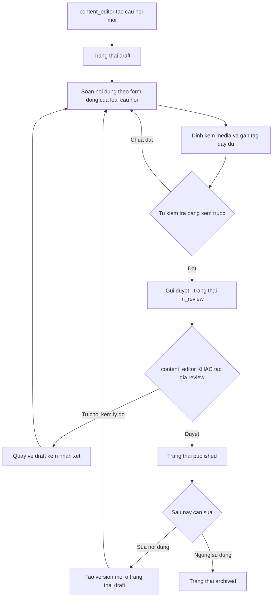
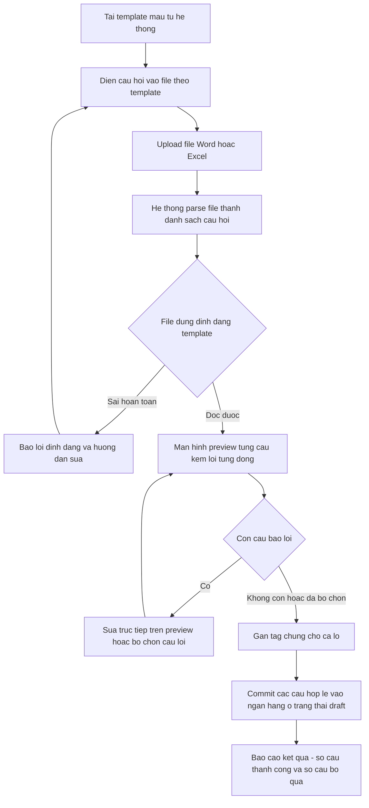
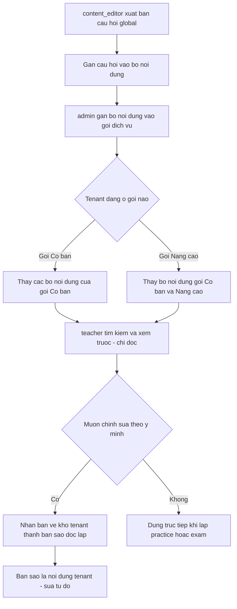

# SRS — Nội dung (Ngân hàng câu hỏi & quản lý nội dung)

**Mã module:** `CONTENT` (dùng trong mã FR: `FR-CONTENT-xx`)
**Trạng thái:** 🟢 Đã chốt
**Phụ thuộc:** [Phân quyền](../02-phan-quyen/srs-phan-quyen.md) (vai trò, quyền), [Gói dịch vụ](../14-goi-dich-vu/srs-goi-dich-vu.md) (phân phối kho global theo gói, quota lưu trữ), [Multi-tenant](../01-kien-truc/02-multi-tenant.md) (kho global `tenant_id NULL` + `is_global`), [Lưu trữ file](../01-kien-truc/04-luu-tru-file.md) (media audio/ảnh). Module [Practice](../05-practice/srs-practice.md) và [Exam](../06-exam/srs-exam.md) tiêu thụ câu hỏi từ module này.

## 1. Mục đích

Module Nội dung quản lý **ngân hàng câu hỏi** — đơn vị nội dung nhỏ nhất mà mọi practice/exam được lắp ráp từ đó. Module giải quyết hai bài toán: (1) đội học thuật Edmicro (`content_editor`) xây kho nội dung chuẩn theo format các kỳ thi (IELTS/TOEIC/HSK/JLPT/TOPIK…) và phân phối cho trung tâm theo gói dịch vụ, thay cho cách soạn Word rồi nhập tay không kiểm soát được phiên bản và chất lượng; (2) giáo viên/trung tâm tự soạn kho câu hỏi riêng của mình, kể cả import hàng loạt từ file Word/Excel theo thói quen đã quen thuộc trên thị trường VN.

## 2. Phạm vi

- **Trong phạm vi (v1):**
  - **Hai kho song song:** kho **GLOBAL** do `content_editor` soạn, phân phối cho tenant theo gói dịch vụ (tenant chỉ đọc/nhân bản); kho **TENANT** do `teacher`/`manager` của trung tâm tự soạn (chỉ tenant đó thấy).
  - Ngân hàng câu hỏi: loại câu hỏi theo catalog ~20 loại (xem [Phụ lục — Loại câu hỏi](../99-phu-luc/01-loai-cau-hoi.md)), nội dung JSONB theo schema từng loại, media đính kèm (audio/ảnh), đáp án + giải thích, ghi chú soạn giả.
  - Hệ thống tag: ngôn ngữ (`en`/`zh`/`ja`/`ko`), kỹ năng (`listening`/`speaking`/`reading`/`writing`), level (CEFR/HSK/JLPT/TOPIK), chủ đề, kỳ thi (IELTS/TOEIC/HSK…), độ khó (1–5).
  - Tìm kiếm/lọc theo mọi tag; xem trước câu hỏi đúng như học sinh thấy.
  - Trình soạn theo từng loại câu hỏi (form động theo loại); upload audio cho câu nghe.
  - **Question group:** nhóm câu hỏi dùng chung passage/audio (VD: 1 bài đọc + 5 câu hỏi con).
  - Quy trình duyệt kho global: `draft → in_review → published → archived`, reviewer là `content_editor` khác tác giả (nguyên tắc 4 mắt). Kho tenant: `teacher` tự xuất bản; `manager` có thể bật "cần duyệt" per tenant.
  - **Import từ file Word/Excel theo template chuẩn:** upload → parse → preview từng câu + lỗi → sửa → commit. V1 hỗ trợ trắc nghiệm + điền từ.
  - Versioning: sửa câu hỏi đã published tạo version mới; bài đã làm giữ version cũ (điểm không thay đổi hồi tố).
  - Phân phối kho global đến tenant theo **bộ nội dung** gắn vào gói dịch vụ.
  - Thống kê chất lượng câu hỏi: tỉ lệ đúng, độ phân biệt (discrimination) đơn giản — mức Should.
- **Ngoài phạm vi (để v2 / không làm):**
  - AI sinh câu hỏi tự động.
  - OCR đề thi từ ảnh chụp.
  - Marketplace trao đổi/mua bán nội dung giữa các tenant.
  - Lắp ráp practice/exam từ câu hỏi — thuộc [SRS Practice](../05-practice/srs-practice.md) và [SRS Exam](../06-exam/srs-exam.md); module này chỉ quản lý kho.

## 3. Vai trò liên quan

| Vai trò | Tương tác với module này |
|---|---|
| `admin` | Gán bộ nội dung global vào gói dịch vụ; không soạn/sửa nội dung |
| `content_editor` | Soạn, duyệt (4 mắt), xuất bản, lưu trữ câu hỏi kho GLOBAL; quản lý bộ nội dung; import file; xem thống kê chất lượng kho global |
| `support_agent` | Tra cứu metadata câu hỏi (mã, trạng thái, version) khi xử lý ticket; không sửa nội dung |
| `manager` | Xem toàn bộ kho TENANT của trung tâm; bật/tắt "cần duyệt" per tenant; duyệt câu hỏi của teacher khi chế độ duyệt bật; xem thống kê chất lượng |
| `teacher` | Soạn/sửa/xuất bản câu hỏi kho TENANT; tìm kiếm cả 2 kho; nhân bản câu global về kho tenant; import file; xem trước; xem thống kê câu hỏi mình soạn |
| `assistant` | Chỉ xem (read-only) ngân hàng tenant để hỗ trợ giáo viên tra cứu; không soạn/sửa |
| `student` | Không truy cập trực tiếp module; chỉ gặp câu hỏi qua practice/exam được giao |

## 4. User stories

- `US-CONTENT-01` — Là **content_editor**, tôi muốn **soạn câu hỏi bằng form đúng với loại câu hỏi đang chọn** để **không phải nhớ cấu trúc JSON của từng loại**.
- `US-CONTENT-02` — Là **content_editor**, tôi muốn **gửi câu hỏi cho đồng nghiệp duyệt trước khi xuất bản** để **kho global luôn đạt chuẩn chất lượng 4 mắt**.
- `US-CONTENT-03` — Là **content_editor**, tôi muốn **gắn câu hỏi đã xuất bản vào bộ nội dung theo gói** để **tenant trả gói nào thì thấy đúng nội dung của gói đó**.
- `US-CONTENT-04` — Là **teacher**, tôi muốn **import 50 câu trắc nghiệm từ file Word theo template quen thuộc** để **không phải nhập tay từng câu như trước**.
- `US-CONTENT-05` — Là **teacher**, tôi muốn **lọc câu hỏi theo ngôn ngữ, kỹ năng, level, chủ đề, độ khó** để **tìm nhanh câu phù hợp khi soạn bài luyện tập**.
- `US-CONTENT-06` — Là **teacher**, tôi muốn **nhân bản một câu hỏi trong kho global về kho của trung tâm và sửa lại** để **tận dụng nội dung chuẩn mà vẫn cá nhân hóa cho lớp mình**.
- `US-CONTENT-07` — Là **teacher**, tôi muốn **xem trước câu hỏi đúng như học sinh sẽ thấy** để **phát hiện lỗi hiển thị trước khi giao bài**.
- `US-CONTENT-08` — Là **manager**, tôi muốn **bật chế độ "cần duyệt" cho nội dung giáo viên tự soạn** để **kiểm soát chất lượng khi trung tâm đông giáo viên**.
- `US-CONTENT-09` — Là **content_editor**, tôi muốn **sửa một câu hỏi đã xuất bản mà không làm thay đổi điểm các bài đã làm** để **an toàn cập nhật nội dung khi phát hiện lỗi**.
- `US-CONTENT-10` — Là **content_editor**, tôi muốn **nhóm 1 bài đọc với 5 câu hỏi con thành một question group** để **soạn và tái sử dụng trọn bộ theo cấu trúc đề thi thật**.
- `US-CONTENT-11` — Là **manager**, tôi muốn **xem tỉ lệ đúng và độ phân biệt của từng câu hỏi** để **loại bỏ câu quá dễ, quá khó hoặc gây nhiễu**.

## 5. Luồng hoạt động

### 5.1 Luồng soạn & duyệt câu hỏi kho global (4 mắt)

**Các bước & ngoại lệ:**

1. `content_editor` tạo câu hỏi → mặc định `draft`; lưu tự động, có thể quay lại soạn tiếp.
2. Gửi duyệt chuyển sang `in_review`; câu hỏi bị khóa sửa với tác giả trong lúc chờ duyệt.
3. Reviewer bắt buộc là `content_editor` **khác** tác giả — hệ thống chặn tự duyệt câu của chính mình.
4. Từ chối phải kèm lý do; câu hỏi quay về `draft` cùng nhận xét để tác giả sửa.
5. Câu hỏi `published` mới đủ điều kiện gắn vào bộ nội dung để phân phối; sửa câu `published` tạo version mới đi lại quy trình từ `draft` (xem FR-CONTENT-14).
6. `archived`: không xuất hiện khi lắp bài mới; practice/exam đang dùng vẫn hoạt động với version đã gắn.
7. **Kho tenant:** khi tenant không bật "cần duyệt", teacher bấm xuất bản là câu chuyển thẳng `draft → published` (bỏ qua `in_review`); khi bật, luồng giống trên nhưng người duyệt là `manager`.

### 5.2 Luồng import câu hỏi từ file Word/Excel

**Các bước & ngoại lệ:**

1. Người dùng tải template mẫu (Word/Excel) có sẵn ví dụ cho từng loại được hỗ trợ (v1: trắc nghiệm, điền từ).
2. Upload file ≤ giới hạn dung lượng; parse chạy nền, hiển thị tiến trình; file 100 câu phải parse xong trong 30 giây.
3. Preview hiển thị từng câu đã parse đúng như trình soạn; câu lỗi được đánh dấu đỏ kèm mô tả lỗi cụ thể (thiếu đáp án, đáp án không khớp lựa chọn, sai cú pháp điền từ…).
4. Người dùng sửa trực tiếp trên preview hoặc bỏ chọn câu lỗi để import phần còn lại; có thể gán tag chung (ngôn ngữ, level, chủ đề…) cho cả lô trước khi commit.
5. Commit đưa câu hợp lệ vào kho tương ứng (global nếu `content_editor` import, tenant nếu `teacher`/`manager` import) ở trạng thái `draft` — vẫn đi qua quy trình xuất bản bình thường.
6. Phiên import dở dang được lưu 7 ngày để quay lại xử lý tiếp; quá hạn tự xóa.

### 5.3 Luồng phân phối kho global đến tenant theo gói

**Các bước & ngoại lệ:**

1. Chỉ câu hỏi global `published` mới gắn được vào bộ nội dung; một câu có thể thuộc nhiều bộ.
2. `admin` cấu hình gói dịch vụ chứa những bộ nội dung nào (chi tiết gói ở [SRS Gói dịch vụ](../14-goi-dich-vu/srs-goi-dich-vu.md)); gói cao hơn bao gồm nội dung gói thấp hơn.
3. Tenant chỉ **đọc** phần được phân phối: tìm kiếm, xem trước, dùng trực tiếp khi lắp bài, hoặc **nhân bản** về kho tenant. Bản nhân bản là bản sao độc lập (không nhận cập nhật từ bản gốc), ghi lại nguồn gốc để truy vết.
4. Tenant hạ gói: câu hỏi global không còn trong gói sẽ ẩn khỏi tìm kiếm khi lắp bài **mới**; bài đang dùng câu đó vẫn hoạt động bình thường (không phá bài cũ).
5. Cơ chế kỹ thuật: bảng câu hỏi dùng `tenant_id NULL` + cờ `is_global` cho kho global; RLS cho phép tenant đọc hàng global `published` thuộc bộ nội dung trong gói của mình — xem [Multi-tenant](../01-kien-truc/02-multi-tenant.md) mục 3.

## 6. Yêu cầu chức năng

| Mã | Yêu cầu | Vai trò | Ưu tiên |
|---|---|---|---|
| FR-CONTENT-01 | Tạo/sửa/lưu trữ câu hỏi trong **kho GLOBAL** (`tenant_id NULL`, `is_global = true`); chỉ vai trò platform được ghi | content_editor | Must |
| FR-CONTENT-02 | Tạo/sửa/lưu trữ câu hỏi trong **kho TENANT**; chỉ người dùng tenant đó thấy và thao tác (RLS) | teacher, manager | Must |
| FR-CONTENT-03 | Câu hỏi có loại tham chiếu **catalog ~20 loại** ([Phụ lục](../99-phu-luc/01-loai-cau-hoi.md)); nội dung lưu **JSONB theo schema từng loại** và được validate theo schema đó khi lưu | content_editor, teacher | Must |
| FR-CONTENT-04 | Câu hỏi mang đủ tag: ngôn ngữ (en/zh/ja/ko), kỹ năng (4 kỹ năng), level (CEFR/HSK/JLPT/TOPIK), chủ đề, kỳ thi (IELTS/TOEIC/HSK…), độ khó 1–5; kèm đáp án + giải thích + ghi chú soạn giả (ghi chú không hiển thị cho học sinh) | content_editor, teacher | Must |
| FR-CONTENT-05 | Đính kèm media (audio/ảnh) cho câu hỏi; upload audio cho câu nghe với định dạng mp3/m4a, dung lượng tính vào quota lưu trữ của tenant (kho tenant) hoặc của platform (kho global) | content_editor, teacher | Must |
| FR-CONTENT-06 | **Trình soạn form động theo loại câu hỏi**: chọn loại → form nhập đúng cấu trúc loại đó (lựa chọn + đáp án đúng cho trắc nghiệm, chỗ trống + đáp án chấp nhận cho điền từ…) | content_editor, teacher | Must |
| FR-CONTENT-07 | **Question group**: nhóm nhiều câu hỏi con dùng chung passage/audio, có thứ tự; nhóm được quản lý (soạn, duyệt, tìm kiếm, nhân bản) như một đơn vị trọn vẹn | content_editor, teacher | Must |
| FR-CONTENT-08 | Tìm kiếm/lọc ngân hàng theo **mọi tag** + từ khóa nội dung + loại câu hỏi + trạng thái + kho (global/tenant); kết hợp nhiều điều kiện đồng thời | content_editor, teacher, manager, assistant | Must |
| FR-CONTENT-09 | **Xem trước** câu hỏi/question group đúng như học sinh thấy khi làm bài (cùng component render với player), gồm phát audio và hiển thị ảnh | content_editor, teacher, manager | Must |
| FR-CONTENT-10 | Quy trình duyệt kho global: `draft → in_review → published → archived`; reviewer bắt buộc là `content_editor` **khác tác giả** (4 mắt); từ chối phải kèm lý do; hệ thống chặn tự duyệt | content_editor | Must |
| FR-CONTENT-11 | Kho tenant: `teacher` tự xuất bản không cần duyệt (mặc định); `owner` bật/tắt cài đặt **"cần duyệt" per tenant** — khi bật, câu của teacher phải qua `academic_head` (trong phạm vi tổ) hoặc manager/owner duyệt mới `published` | teacher, academic_head, manager, owner | Must |
| FR-CONTENT-12 | **Import từ Word/Excel theo template chuẩn**: tải template mẫu → upload → parse → preview từng câu kèm lỗi từng dòng → sửa trực tiếp/bỏ chọn câu lỗi → gán tag chung cho lô → commit vào kho ở trạng thái `draft`. V1 hỗ trợ trắc nghiệm + điền từ | content_editor, teacher, manager | Must |
| FR-CONTENT-13 | Phiên import lưu lại 7 ngày để xử lý dở; báo cáo kết quả sau commit (số câu thành công/bỏ qua kèm lý do) | content_editor, teacher | Must |
| FR-CONTENT-14 | **Versioning**: sửa câu hỏi đã `published` tạo version mới (đi lại quy trình duyệt nếu là kho global); attempt/submission đã làm giữ tham chiếu version cũ — điểm không thay đổi hồi tố; xem được lịch sử version | content_editor, teacher | Must |
| FR-CONTENT-15 | **Bộ nội dung** (content pack): gom câu hỏi global `published` thành bộ; `admin` gán bộ vào gói dịch vụ; tenant chỉ thấy (read-only) câu global thuộc bộ trong gói của mình | content_editor, admin | Must |
| FR-CONTENT-16 | **Nhân bản** câu hỏi/question group global về kho tenant thành bản sao độc lập (ghi nguồn gốc); nhân bản câu trong kho tenant để soạn biến thể | teacher, manager | Must |
| FR-CONTENT-17 | Lưu trữ (archive) câu hỏi: ẩn khỏi tìm kiếm khi lắp bài mới; practice/exam đang dùng vẫn hoạt động với version đã gắn; không có xóa cứng với câu đã từng dùng trong bài | content_editor, teacher, manager | Must |
| FR-CONTENT-18 | **Thống kê chất lượng câu hỏi**: tỉ lệ trả lời đúng, độ phân biệt (discrimination) đơn giản dựa trên nhóm điểm cao/thấp, số lượt sử dụng; lọc câu bất thường (quá dễ/quá khó/phân biệt âm) | content_editor, teacher, manager | Should |
| FR-CONTENT-19 | `support_agent` tra cứu metadata câu hỏi (mã, loại, trạng thái, version, kho) phục vụ xử lý ticket; không xem/sửa được nội dung kho tenant ngoài phạm vi impersonation có kiểm soát | support_agent | Should |
| FR-CONTENT-20 | Thao tác hàng loạt trên danh sách câu hỏi: gán/sửa tag nhiều câu cùng lúc, gửi duyệt nhiều câu, đưa nhiều câu vào bộ nội dung | content_editor, teacher | Could |

## 7. Yêu cầu phi chức năng (riêng module)

Phần chung xem [Yêu cầu phi chức năng](../01-kien-truc/06-yeu-cau-phi-chuc-nang.md). Riêng module:

- **Cách ly kho:** bảng câu hỏi là ngoại lệ có `tenant_id NULL` (kho global) — RLS policy riêng: tenant đọc được hàng global khi `is_global = true`, trạng thái `published` và thuộc bộ nội dung trong gói của tenant; ghi hàng global chỉ dành cho vai trò platform qua cổng `ops`. Tầng repository vẫn filter tường minh (phòng thủ 2 lớp).
- **Hiệu năng tìm kiếm:** lọc/tìm kiếm ngân hàng p95 < 500ms với quy mô 100.000 câu hỏi; index GIN cho tag và full-text tiếng Việt + ngôn ngữ giảng dạy.
- **Import:** file tối đa 10MB/500 câu mỗi lần; parse xong trong 30 giây với file 100 câu; parse chạy nền (queue), không chặn UI.
- **Media:** audio mp3/m4a tối đa 20MB/file, ảnh jpg/png/webp tối đa 5MB/file; lưu theo prefix tenant (hoặc prefix global), truy cập qua presigned URL — xem [Lưu trữ file](../01-kien-truc/04-luu-tru-file.md).
- **Toàn vẹn versioning:** version đã có attempt tham chiếu là **bất biến** (immutable) — mọi chỉnh sửa tạo version mới; ràng buộc này bảo đảm điểm số không đổi hồi tố.
- **Validate JSONB:** schema từng loại câu hỏi quản lý tập trung (theo catalog phụ lục); API từ chối payload không đúng schema với thông báo lỗi chỉ rõ trường sai.
- **Audit:** mọi thao tác duyệt/xuất bản/lưu trữ/nhân bản ghi audit log (ai, câu nào, version nào, lúc nào).

## 8. Màn hình chính

| Màn hình | Vai trò dùng | Mockup |
|---|---|---|
| Danh sách ngân hàng câu hỏi (bộ lọc mọi tag, phân tab kho global/kho trung tâm) | content_editor, teacher, manager, assistant | _sẽ bổ sung_ |
| Trình soạn câu hỏi (form động theo loại, upload media, tag, ghi chú soạn giả) | content_editor, teacher | _sẽ bổ sung_ |
| Trình soạn question group (passage/audio chung + danh sách câu con) | content_editor, teacher | _sẽ bổ sung_ |
| Xem trước câu hỏi (render như học sinh thấy) | content_editor, teacher, manager | _sẽ bổ sung_ |
| Hàng đợi duyệt (danh sách chờ duyệt, so sánh version, duyệt/từ chối kèm lý do) | content_editor (global), manager (tenant khi bật duyệt) | _sẽ bổ sung_ |
| Wizard import Word/Excel (upload → preview lỗi → sửa → commit) | content_editor, teacher, manager | _sẽ bổ sung_ |
| Quản lý bộ nội dung & gán vào gói | content_editor, admin | _sẽ bổ sung_ |
| Cài đặt nội dung của trung tâm (bật/tắt "cần duyệt") | manager | _sẽ bổ sung_ |
| Thống kê chất lượng câu hỏi | content_editor, teacher, manager | _sẽ bổ sung_ |
| Lịch sử version của câu hỏi | content_editor, teacher | _sẽ bổ sung_ |

## 9. API sơ bộ

| Method | Path | Mô tả | Quyền |
|---|---|---|---|
| GET | `/api/v1/content/question-types` | Catalog loại câu hỏi + JSON schema từng loại | mọi vai trò soạn/duyệt |
| GET | `/api/v1/content/questions` | Danh sách + lọc theo mọi tag, từ khóa, loại, trạng thái, kho | content_editor, teacher, manager, assistant |
| POST | `/api/v1/content/questions` | Tạo câu hỏi (kho suy ra từ vai trò: platform → global, tenant → tenant) | content_editor, teacher, manager |
| GET | `/api/v1/content/questions/{id}` | Chi tiết câu hỏi (version mới nhất hoặc `?version=`) | theo kho + quyền |
| PUT | `/api/v1/content/questions/{id}` | Sửa câu hỏi (nếu đang `published` → tạo version mới `draft`) | tác giả/content_editor, teacher, manager |
| POST | `/api/v1/content/questions/{id}/submit-review` | Gửi duyệt (`draft → in_review`) | content_editor, teacher (khi tenant bật duyệt) |
| POST | `/api/v1/content/questions/{id}/review` | Duyệt/từ chối kèm lý do (chặn tự duyệt) | content_editor khác tác giả, manager |
| POST | `/api/v1/content/questions/{id}/publish` | Xuất bản trực tiếp (kho tenant không bật duyệt) | teacher, manager |
| POST | `/api/v1/content/questions/{id}/archive` | Lưu trữ câu hỏi | content_editor, teacher, manager |
| POST | `/api/v1/content/questions/{id}/clone` | Nhân bản (global → tenant, hoặc trong kho tenant) | teacher, manager |
| GET | `/api/v1/content/questions/{id}/versions` | Lịch sử version | content_editor, teacher, manager |
| GET | `/api/v1/content/questions/{id}/preview` | Dữ liệu render xem trước như học sinh thấy | content_editor, teacher, manager |
| GET | `/api/v1/content/questions/{id}/stats` | Thống kê chất lượng (tỉ lệ đúng, discrimination, lượt dùng) | content_editor, teacher, manager |
| POST | `/api/v1/content/question-groups` | Tạo question group (passage/audio chung + câu con) | content_editor, teacher, manager |
| GET | `/api/v1/content/question-groups/{id}` | Chi tiết question group | theo kho + quyền |
| PUT | `/api/v1/content/question-groups/{id}` | Sửa question group (versioning như câu hỏi) | content_editor, teacher, manager |
| POST | `/api/v1/content/media` | Upload media audio/ảnh (trả về media_id + presigned URL) | content_editor, teacher, manager |
| GET | `/api/v1/content/imports/template?type=word\|excel` | Tải template import mẫu | content_editor, teacher, manager |
| POST | `/api/v1/content/imports` | Upload file import, tạo phiên parse (chạy nền) | content_editor, teacher, manager |
| GET | `/api/v1/content/imports/{id}` | Trạng thái parse + danh sách câu preview kèm lỗi | người tạo phiên |
| PUT | `/api/v1/content/imports/{id}/rows/{rowId}` | Sửa một câu trong preview / bỏ chọn câu lỗi | người tạo phiên |
| POST | `/api/v1/content/imports/{id}/commit` | Commit các câu hợp lệ vào kho (kèm tag chung cho lô) | người tạo phiên |
| GET | `/api/v1/content/packs` | Danh sách bộ nội dung (tenant chỉ thấy bộ trong gói) | content_editor, admin, teacher, manager |
| POST | `/api/v1/content/packs` | Tạo bộ nội dung | content_editor |
| PUT | `/api/v1/content/packs/{id}/questions` | Thêm/bớt câu hỏi `published` trong bộ | content_editor |
| PUT | `/api/v1/content/packs/{id}/plans` | Gán/bỏ gán bộ vào gói dịch vụ | admin |
| GET | `/api/v1/content/settings` | Cài đặt nội dung của tenant (cờ "cần duyệt") | manager |
| PUT | `/api/v1/content/settings` | Bật/tắt "cần duyệt" per tenant | manager |

## 10. Entity liên quan

Chi tiết thuộc tính ở [Từ điển dữ liệu](../16-du-lieu/02-tu-dien-du-lieu.md), quan hệ ở [ERD](../16-du-lieu/01-erd.md).

| Entity | Vai trò trong module |
|---|---|
| `question` | Câu hỏi — `tenant_id` (NULL nếu global) + `is_global`, loại, tag, trạng thái, con trỏ version hiện hành |
| `question_version` | Nội dung JSONB theo loại + đáp án + giải thích + ghi chú soạn giả của từng version (bất biến sau khi có attempt tham chiếu) |
| `question_type` | Catalog ~20 loại câu hỏi + JSON schema validate — xem [Phụ lục](../99-phu-luc/01-loai-cau-hoi.md) |
| `question_group` | Nhóm câu hỏi dùng chung passage/audio, thứ tự câu con |
| `media_asset` | File audio/ảnh đính kèm (tham chiếu từ nội dung JSONB) |
| `content_pack` | Bộ nội dung global để phân phối |
| `content_pack_item` | Liên kết bộ nội dung ↔ câu hỏi/question group |
| `plan_content_pack` | Liên kết gói dịch vụ ↔ bộ nội dung — phối hợp [SRS Gói dịch vụ](../14-goi-dich-vu/srs-goi-dich-vu.md) |
| `import_job` | Phiên import: file gốc, trạng thái parse, người tạo, hạn 7 ngày |
| `import_row` | Từng câu đã parse trong phiên: dữ liệu, lỗi, trạng thái chọn/bỏ |
| `review_log` | Lịch sử duyệt: reviewer, quyết định, lý do — phục vụ audit |
| `tenant_content_setting` | Cài đặt per tenant: cờ "cần duyệt" nội dung teacher |

## 11. Câu hỏi mở cần chốt

| # | Câu hỏi | Quyết định | Ngày chốt |
|---|---|---|---|
| 1 | Bản nhân bản từ kho global có cần cơ chế thông báo khi bản gốc ra version mới không, hay hoàn toàn độc lập như đề xuất hiện tại? | **Chốt:** Độc lập hoàn toàn ở v1 | 2026-07-16 |
| 2 | Kho tenant có giới hạn số câu hỏi tự soạn theo gói dịch vụ không (quota), hay không giới hạn ở v1? | **Chốt:** Không giới hạn ở v1; theo dõi usage để quyết quota v2 | 2026-07-16 |
| 3 | Import câu listening kèm file audio (nén zip) có đưa vào v1 không, hay v1 chỉ trắc nghiệm + điền từ dạng text như phạm vi hiện tại? | **Chốt:** v1 chỉ text (trắc nghiệm + điền từ); audio zip để v2 | 2026-07-16 |
| 4 | Khi tenant bật "cần duyệt", manager có được ủy quyền cho một teacher trưởng bộ môn duyệt thay không, hay chỉ manager duyệt ở v1? | **Chốt (cập nhật cùng ngày):** có vai trò `academic_head` (tổ trưởng chuyên môn) duyệt nội dung trong phạm vi tổ; manager/owner cũng duyệt được | 2026-07-16 |

## Lịch sử thay đổi

| Ngày | Thay đổi | Người |
|---|---|---|
| 2026-07-16 | Tạo bản nháp đầu tiên | Claude |
| 2026-07-16 | Chốt toàn bộ câu hỏi mở (quyết định ghi trong bảng), chuyển trạng thái Đã chốt | Chủ sản phẩm |
| 2026-07-16 | Thêm `academic_head` là người duyệt nội dung tenant trong phạm vi tổ (cập nhật quyết định #4) | Chủ sản phẩm |
