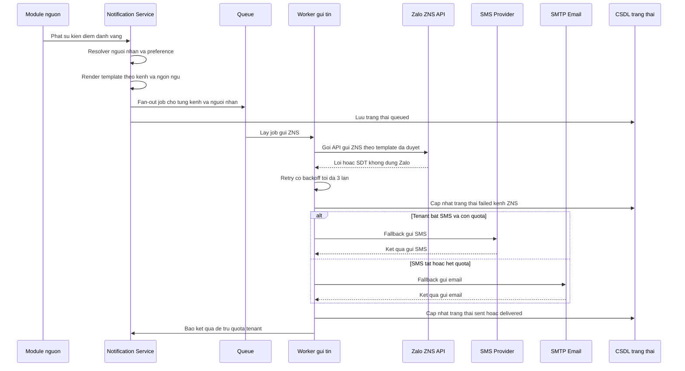
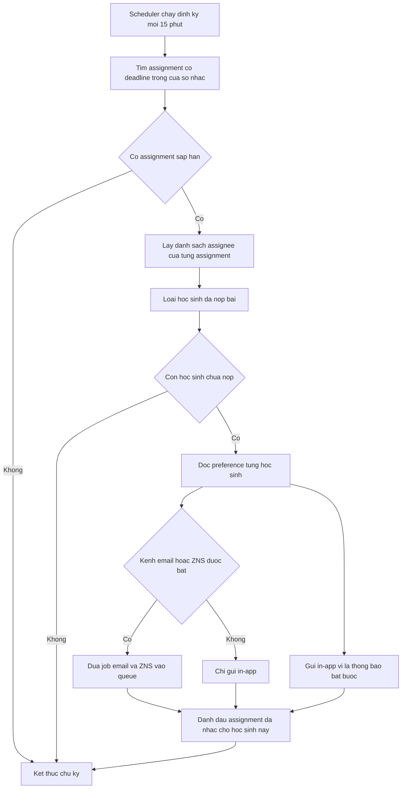
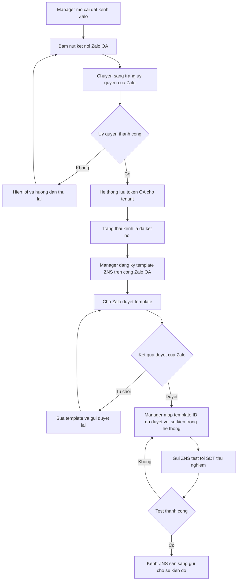

# SRS — Thông báo

**Mã module:** `NOTIF` (dùng trong mã FR: `FR-NOTIF-xx`)
**Trạng thái:** 🟢 Đã chốt
**Phụ thuộc:** [Phân quyền](../02-phan-quyen/srs-phan-quyen.md) (`AUTH`), [Tổ chức &amp; người dùng](../03-to-chuc-nguoi-dung/srs-to-chuc-nguoi-dung.md) (`ORG` — hồ sơ học sinh, SĐT phụ huynh), [Giao bài](../07-giao-bai/srs-giao-bai.md) (`ASSIGN`), [Chấm bài](../08-cham-bai/srs-cham-bai.md) (`GRADE`), [Lịch học &amp; điểm danh](../12-lich-hoc-diem-danh/srs-lich-hoc-diem-danh.md) (`SCHED`), [Gói dịch vụ](../14-goi-dich-vu/srs-goi-dich-vu.md) (`PLAN` — quota ZNS/SMS), [Hỗ trợ](../15-ho-tro/srs-ho-tro.md) (`SUPPORT`)

## 1. Mục đích

Module Thông báo đảm bảo mọi thông tin quan trọng — bài được giao, nhắc deadline, kết quả chấm, điểm danh vắng, lịch học — đến đúng người, đúng lúc, qua đúng kênh. Với thị trường Việt Nam, Zalo là kênh liên lạc mặc định giữa trung tâm và phụ huynh, nên module hỗ trợ gửi Zalo ZNS qua OA riêng của từng trung tâm bên cạnh in-app và email. Module thay thế việc trợ giảng nhắn tay từng học sinh qua Zalo, đồng thời giúp trung tâm kiểm soát chi phí gửi tin (ZNS/SMS tính phí theo quota gói).

## 2. Phạm vi

- **Trong phạm vi (v1):**
  - **4 kênh gửi:** (1) in-app — trung tâm thông báo, badge chưa đọc, realtime qua SSE; (2) email — SMTP cấu hình per tenant hoặc dùng SMTP chung của platform; (3) Zalo ZNS/OA — tenant kết nối OA riêng, gửi ZNS theo template đã được Zalo duyệt tới SĐT học sinh/phụ huynh; (4) SMS fallback — tùy chọn, tính phí, tenant bật/tắt.
  - **Catalog sự kiện phát thông báo — phủ đủ 11 vai trò**, chia theo nhóm; mỗi sự kiện có kênh mặc định, bật/tắt được ở cấp tenant (kênh trả phí ZNS/SMS mặc định chỉ bật cho nhóm Học tập & Chuyên cần):

    **Nhóm Học tập (student, parent):**

    | Mã sự kiện                             | Mô tả                                              | Người nhận                     | Kênh mặc định | In-app bắt buộc |
    | ----------------------------------------- | ---------------------------------------------------- | --------------------------------- | ----------------- | ----------------- |
    | `assignment_created`                    | Bài mới được giao                               | student được giao              | in-app + email    | ✅                |
    | `deadline_reminder`                     | Nhắc deadline (mặc định trước 24h, cấu hình) | student**chưa nộp**       | in-app + ZNS      | ✅                |
    | `grade_finalized`                       | Có kết quả chấm (điểm chốt)                   | student; parent (ZNS tùy tenant) | in-app + email    | ❌                |
    | `grade_changed`                         | Điểm bị sửa sau khi chốt (kèm lý do)          | student; parent                   | in-app            | ✅                |
    | `exam_scheduled`                        | Có lịch thi tập trung                             | student; parent (ZNS)             | in-app + ZNS      | ✅                |
    | `badge_earned` / `leaderboard_result` | Nhận huy hiệu / chốt BXH tuần                    | student                           | in-app            | ❌                |
    | `report_ready`                          | Báo cáo kỳ của con đã sẵn sàng               | parent                            | ZNS + in-app      | ❌                |

    **Nhóm Lịch học & chuyên cần (student, parent, teacher, assistant):**

    | Mã sự kiện            | Mô tả                                     | Người nhận                                         | Kênh mặc định | In-app bắt buộc |
    | ------------------------ | ------------------------------------------- | ----------------------------------------------------- | ----------------- | ----------------- |
    | `attendance_absent`    | Bị điểm danh vắng (digest cuối buổi)  | parent (ZNS, fallback SMS → email); student (in-app) | ZNS               | ❌                |
    | `schedule_changed`     | Lịch học thay đổi / buổi bù           | student + teacher/assistant lớp; parent (ZNS)        | in-app + ZNS      | ✅                |
    | `session_upcoming`     | Buổi học sắp diễn ra (trước 2h)       | student + teacher/assistant lớp                      | in-app            | ❌                |
    | `attendance_not_taken` | Buổi học kết thúc 30' chưa điểm danh | teacher + assistant của buổi                        | in-app            | ❌                |

    **Nhóm Giảng dạy (teacher, assistant, academic_head):**

    | Mã sự kiện               | Mô tả                                                          | Người nhận                             | Kênh mặc định       | In-app bắt buộc |
    | --------------------------- | ---------------------------------------------------------------- | ----------------------------------------- | ----------------------- | ----------------- |
    | `grading_pending`         | Bài chờ duyệt AI / chờ chấm (digest ngày + realtime badge) | teacher; assistant được ủy quyền     | in-app + email (digest) | ✅                |
    | `grading_overdue`         | Bài chờ chốt điểm quá 48h (đã chốt GRADE#3)             | teacher; manager (nếu quá 96h)          | in-app                  | ✅                |
    | `grade_disputed`          | Học sinh khiếu nại điểm                                     | teacher chấm bài                        | in-app                  | ✅                |
    | `submission_late_summary` | Digest học sinh nộp muộn / chưa nộp sau deadline            | teacher của assignment                   | in-app                  | ❌                |
    | `delegation_changed`      | Được cấp / thu hồi ủy quyền trợ giảng                   | assistant                                 | in-app                  | ✅                |
    | `content_pending_review`  | Nội dung tenant chờ duyệt (khi bật "cần duyệt")            | academic_head phạm vi tổ; manager/owner | in-app                  | ❌                |
    | `content_reviewed`        | Nội dung được duyệt / bị từ chối (kèm lý do)           | teacher tác giả                         | in-app                  | ❌                |

    **Nhóm Quản trị trung tâm (owner, manager, it_admin):**

    | Mã sự kiện           | Mô tả                                                                            | Người nhận                                                      | Kênh mặc định                  | In-app bắt buộc |
    | ----------------------- | ---------------------------------------------------------------------------------- | ------------------------------------------------------------------ | ---------------------------------- | ----------------- |
    | `quota_warning`       | Cảnh báo quota 80/90/100% (ZNS/SMS, chấm AI, lưu trữ, học sinh)              | owner (90–100% thêm admin)                                       | in-app + email                     | ✅                |
    | `contract_expiring`   | Hợp đồng sắp hết hạn (60/30/7 ngày)                                         | owner                                                              | in-app + email                     | ✅                |
    | `channel_error`       | Kênh gửi lỗi (Zalo OA token hết hạn, SMTP fail liên tục)                    | owner                                                              | in-app + email                     | ✅                |
    | `security_alert`      | Đăng nhập bất thường / tài khoản vượt giới hạn thiết bị (FR-AUTH-18) | owner; it_admin                                                    | in-app + email                     | ✅                |
    | `student_at_risk`     | Học sinh chạm rule nguy cơ bỏ học (digest tuần)                              | manager phạm vi; teacher lớp                                     | in-app                             | ❌                |
    | `weekly_digest`       | Tổng hợp tuần: hoàn thành bài, chuyên cần, lớp cần chú ý               | owner, manager (theo phạm vi)                                     | email                              | ❌                |
    | `import_completed`    | Import Excel hoàn tất / có dòng lỗi                                           | người chạy import (it_admin/manager/owner)                      | in-app                             | ✅                |
    | `consent_missing`     | Digest học sinh <16 tuổi chưa có consent                                       | manager, it_admin (phạm vi)                                       | in-app                             | ❌                |
    | `manual_announcement` | Thông báo thủ công từ trung tâm                                              | theo phạm vi người soạn (lớp/tổ/chi nhánh/toàn trung tâm) | in-app + kênh người soạn chọn | ❌                |

    **Nhóm Platform (admin, content_editor, support_agent):**

    | Mã sự kiện                                                      | Mô tả                                                     | Người nhận                                                | Kênh mặc định | In-app bắt buộc |
    | ------------------------------------------------------------------ | ----------------------------------------------------------- | ------------------------------------------------------------ | ----------------- | ----------------- |
    | `tenant_quota_critical`                                          | Tenant chạm 90/100% quota (cơ hội upsell / rủi ro)      | admin                                                        | in-app + email    | ❌                |
    | `ai_error_spike`                                                 | Tỉ lệ lỗi chấm AI vượt ngưỡng / circuit breaker mở | admin                                                        | in-app + email    | ✅                |
    | `global_content_review`                                          | Nội dung kho global chờ duyệt (4 mắt)                   | content_editor được phân                                 | in-app            | ❌                |
    | `ticket_created` / `ticket_escalated` / `sla_breach_warning` | Ticket mới / escalate / sắp trễ SLA                      | support_agent (hàng đợi hoặc assignee); admin (escalate) | in-app            | ✅                |
    | `ticket_replied`                                                 | Ticket được trả lời                                    | người tạo ticket (mọi vai trò)                          | in-app + email    | ❌                |
  - **Template nội dung** có biến (`{{student_name}}`, `{{class_name}}`, `{{deadline}}`…), đa ngôn ngữ UI (tiếng Việt trước); template ZNS phải map 1-1 với template đã đăng ký và được Zalo duyệt.
  - **Preference người dùng:** bật/tắt theo nhóm sự kiện × kênh; thông báo bắt buộc (deadline, lịch học thay đổi…) không tắt được ở kênh in-app.
  - **Pipeline gửi:** event → resolver người nhận → render template → fan-out per kênh qua queue → retry có backoff (tối đa 3 lần) → lưu trạng thái (`queued` / `sent` / `failed` / `delivered` nếu kênh hỗ trợ) → fallback chuỗi: ZNS lỗi hoặc SĐT không có Zalo → SMS (nếu tenant bật) → email.
  - **Quota & chi phí:** ZNS/SMS đếm theo tenant, hiển thị usage cho owner, chặn gửi khi vượt quota gói (tham chiếu module `PLAN`); in-app và email không giới hạn.
  - **Trung tâm thông báo in-app:** danh sách, lọc theo loại sự kiện, đánh dấu đã đọc (từng thông báo / tất cả), badge số chưa đọc.
  - **Rate limit chống spam:** thông báo thủ công tối đa N lần/ngày/lớp (N cấu hình ở cấp platform).
- **Ngoài phạm vi (để v2 / không làm):**
  - Web push / mobile push (v2).
  - Chatbot Zalo 2 chiều (nhận và trả lời tin nhắn từ phụ huynh).
  - Inbox 2 chiều giáo viên–học sinh (nhắn tin trực tiếp trong app).

## 3. Vai trò liên quan

| Vai trò                                   | Tương tác với module này                                                                                                         |
| ------------------------------------------ | ------------------------------------------------------------------------------------------------------------------------------------- |
| Học sinh (`student`)                    | Nhận thông báo mọi kênh; xem trung tâm thông báo in-app; tự cài preference (trong giới hạn cho phép)                     |
| Giáo viên (`teacher`)                  | Nhận thông báo (lịch dạy, bài nộp…); soạn thông báo thủ công gửi lớp mình phụ trách                                 |
| Trợ giảng (`assistant`)                | Nhắc 1-chạm học sinh chưa nộp bài trong lớp được gán; nhận thông báo lớp mình hỗ trợ                                |
| Chủ trung tâm (`owner`)                | Cấu hình kênh (SMTP, Zalo OA, SMS); map template ZNS; xem usage ZNS/SMS; nhận cảnh báo quota; gửi thông báo toàn trung tâm |
| Nhân viên quản lý (`manager`)        | Soạn thông báo gửi lớp/toàn phạm vi chi nhánh được gán                                                                    |
| Phụ huynh (`parent`)                    | Nhận thông báo về con (điểm, vắng mặt, lịch học) qua in-app + Zalo/SMS                                                      |
| Admin hệ thống (`admin`)               | Quản lý template hệ thống; cấu hình rate limit và tham số platform; giám sát log gửi toàn hệ thống                      |
| Nhân viên nội dung (`content_editor`) | Nhận thông báo in-app liên quan quy trình duyệt nội dung (nếu có); không cấu hình gì trong module này                   |
| Nhân viên support (`support_agent`)    | Tra cứu trạng thái gửi thông báo của user/tenant để trả lời ticket; nhận thông báo ticket mới                          |
| _Phụ huynh (không phải user)_         | Nhận ZNS/SMS/email qua SĐT + email lưu trong hồ sơ học sinh — không đăng nhập hệ thống                                   |

## 4. User stories

- `US-NOTIF-01` — Là **học sinh**, tôi muốn **nhận nhắc nhở trước khi bài tập hết hạn** để **không bỏ lỡ deadline như khi bài được giao qua Zalo/giấy**.
- `US-NOTIF-02` — Là **học sinh**, tôi muốn **xem mọi thông báo tại một trung tâm thông báo có badge chưa đọc** để **không sót thông tin quan trọng**.
- `US-NOTIF-03` — Là **phụ huynh** (qua SĐT trong hồ sơ con), tôi muốn **nhận tin Zalo khi con vắng học hoặc có kết quả thi** để **theo sát việc học của con mà không cần cài app**.
- `US-NOTIF-04` — Là **giáo viên**, tôi muốn **soạn một thông báo gửi cả lớp trong vài phút** để **không phải nhắn từng người qua Zalo**.
- `US-NOTIF-05` — Là **trợ giảng**, tôi muốn **gửi nhắc nhở 1-chạm cho danh sách học sinh chưa nộp** để **tiết kiệm thời gian nhắc thủ công**.
- `US-NOTIF-06` — Là **ban giám hiệu**, tôi muốn **kết nối Zalo OA của trung tâm và theo dõi lượng ZNS đã dùng** để **chủ động chi phí và không bị gián đoạn kênh phụ huynh**.
- `US-NOTIF-07` — Là **ban giám hiệu**, tôi muốn **nhận cảnh báo khi sắp vượt quota ZNS/SMS** để **nâng gói hoặc điều chỉnh trước khi bị chặn gửi**.
- `US-NOTIF-08` — Là **học sinh**, tôi muốn **tắt các thông báo không quan trọng theo kênh** để **không bị làm phiền nhưng vẫn nhận nhắc deadline**.
- `US-NOTIF-09` — Là **nhân viên support**, tôi muốn **tra cứu trạng thái gửi của một thông báo cụ thể** để **trả lời chính xác khi người dùng khiếu nại không nhận được tin**.
- `US-NOTIF-10` — Là **admin hệ thống**, tôi muốn **cấu hình rate limit thông báo thủ công** để **ngăn tenant spam người dùng làm ảnh hưởng uy tín nền tảng**.

## 5. Luồng hoạt động

### 5.1 Pipeline gửi đa kênh với fallback

Sự kiện nghiệp vụ (ví dụ: điểm danh vắng) được phát từ module nguồn; Notification Service xác định người nhận, render template và fan-out từng kênh qua queue. Nếu ZNS thất bại sau 3 lần retry (hoặc SĐT không dùng Zalo), hệ thống fallback sang SMS (nếu tenant bật), rồi email.

**Bước & ngoại lệ:**

1. Mỗi job có **dedup key** (sự kiện + người nhận + kênh) — worker bỏ qua job trùng để không gửi lặp.
2. Retry backoff đề xuất: 1 phút → 5 phút → 15 phút; sau 3 lần thất bại mới kích hoạt fallback kênh kế tiếp.
3. Nếu SMS cũng thất bại (hoặc tenant không bật SMS), fallback tiếp sang email; nếu người nhận không có email → đánh dấu `failed` toàn chuỗi, hiển thị trong log gửi.
4. Trước khi gửi ZNS/SMS, worker kiểm tra quota tenant (module `PLAN`); hết quota → bỏ qua kênh tính phí, ghi lý do `quota_exceeded`, chuyển thẳng sang email.
5. Kênh in-app không đi qua chuỗi fallback — luôn ghi bản ghi in-app và đẩy realtime qua SSE.

### 5.2 Nhắc deadline tự động

Scheduler chạy định kỳ, tìm assignment sắp đến hạn trong cửa sổ nhắc (mặc định trước 24h, cấu hình được), lọc học sinh chưa nộp và tôn trọng preference trước khi đưa vào queue.

**Bước & ngoại lệ:**

1. Cửa sổ nhắc cấu hình được ở 2 cấp: mặc định tenant và override per assignment (module `ASSIGN`).
2. Cờ "đã nhắc" lưu theo cặp (assignment, học sinh) — học sinh nộp bài sau khi được nhắc sẽ không bị nhắc lại; deadline bị dời thì cờ được reset.
3. Nhắc deadline là **thông báo bắt buộc**: học sinh không tắt được ở kênh in-app, chỉ tắt được email/ZNS.
4. Scheduler idempotent — hai chu kỳ chồng lấn không tạo thông báo trùng nhờ dedup key.

### 5.3 Tenant kết nối Zalo OA và đăng ký template ZNS

Manager kết nối OA riêng của trung tâm qua OAuth của Zalo; template ZNS được đăng ký và duyệt trên cổng Zalo OA (ngoài hệ thống), sau đó manager map template ID đã duyệt với sự kiện trong hệ thống.

**Bước & ngoại lệ:**

1. Token OA lưu mã hóa, tự refresh; token hết hạn/bị thu hồi → kênh chuyển trạng thái `disconnected`, gửi cảnh báo in-app + email cho manager, các thông báo ZNS trong thời gian này đi thẳng vào chuỗi fallback.
2. Việc soạn và duyệt template ZNS diễn ra trên cổng Zalo OA — hệ thống chỉ lưu mapping (sự kiện ↔ template ID) và danh sách biến; khi map, hệ thống kiểm tra biến của sự kiện khớp với biến template.
3. Sự kiện chưa có template ZNS được duyệt → kênh ZNS bị bỏ qua cho sự kiện đó (không tính là lỗi).

## 6. Yêu cầu chức năng

| Mã         | Yêu cầu                                                                                                                                                                                                                                                                                   | Vai trò                                     | Ưu tiên |
| ----------- | ------------------------------------------------------------------------------------------------------------------------------------------------------------------------------------------------------------------------------------------------------------------------------------------- | -------------------------------------------- | --------- |
| FR-NOTIF-01 | Phát thông báo tự động theo catalog sự kiện (mục 2): bài mới giao, nhắc deadline, kết quả chấm, vắng mặt, lịch học thay đổi/buổi sắp diễn ra, cảnh báo quota, ticket được trả lời; mỗi sự kiện có kênh mặc định và bật/tắt được ở cấp tenant | Hệ thống                                   | Must      |
| FR-NOTIF-02 | Trung tâm thông báo in-app: danh sách có phân trang, lọc theo loại sự kiện, đánh dấu đã đọc từng thông báo hoặc tất cả, badge số chưa đọc, cập nhật realtime qua SSE                                                                                           | mọi vai trò (11)                           | Must      |
| FR-NOTIF-03 | Gửi email qua SMTP: tenant tự cấu hình SMTP riêng (host, port, credentials, sender) hoặc dùng SMTP chung của platform; có nút gửi test khi cấu hình                                                                                                                            | owner (cấu hình), hệ thống (gửi)        | Must      |
| FR-NOTIF-04 | Kết nối Zalo OA riêng của trung tâm qua OAuth; hiển thị trạng thái kết nối (connected / disconnected / token hết hạn); ngắt kết nối được                                                                                                                                 | owner                                        | Must      |
| FR-NOTIF-05 | Map template ZNS: khai báo template ID đã được Zalo duyệt cho từng sự kiện, kiểm tra khớp biến, gửi ZNS test; chỉ template đã duyệt mới được dùng để gửi                                                                                                          | owner                                        | Must      |
| FR-NOTIF-06 | Gửi ZNS theo template đã duyệt tới SĐT học sinh/phụ huynh (SĐT phụ huynh lấy từ hồ sơ học sinh — module`ORG`)                                                                                                                                                             | Hệ thống                                   | Must      |
| FR-NOTIF-07 | Pipeline gửi qua queue: fan-out per kênh per người nhận, retry backoff tối đa 3 lần, lưu trạng thái`queued`/`sent`/`failed`/`delivered` (nếu kênh hỗ trợ), dedup không gửi trùng                                                                                  | Hệ thống                                   | Must      |
| FR-NOTIF-08 | Chuỗi fallback kênh tính phí: ZNS lỗi hoặc SĐT không có Zalo → SMS (nếu tenant bật SMS, còn quota) → email; ghi lý do fallback trong log                                                                                                                                     | Hệ thống                                   | Should    |
| FR-NOTIF-09 | Template nội dung có biến (`{{student_name}}`, `{{deadline}}`…), đa ngôn ngữ (vi trước, mở rộng được); admin quản lý bộ template mặc định của hệ thống                                                                                                           | admin (quản lý), hệ thống (render)       | Must      |
| FR-NOTIF-10 | Preference người dùng: bật/tắt theo nhóm sự kiện × kênh; thông báo bắt buộc (deadline, lịch học thay đổi, cảnh báo quota) không tắt được ở kênh in-app                                                                                                           | mọi vai trò tenant (kể cả parent)        | Must      |
| FR-NOTIF-11 | Nhắc deadline tự động: scheduler quét assignment sắp hạn (mặc định trước 24h, cấu hình per tenant và per assignment), chỉ gửi học sinh chưa nộp, không nhắc trùng                                                                                                    | Hệ thống                                   | Must      |
| FR-NOTIF-12 | Soạn và gửi thông báo thủ công: teacher gửi lớp mình; academic_head gửi lớp trong tổ; manager gửi trong phạm vi chi nhánh; owner gửi toàn trung tâm; chọn kênh gửi kèm (in-app luôn có)                                                                            | teacher, academic_head, manager, owner       | Must      |
| FR-NOTIF-13 | Rate limit thông báo thủ công: tối đa N lần/ngày/lớp, N cấu hình ở cấp platform; vượt giới hạn → chặn kèm thông báo rõ lý do                                                                                                                                        | Hệ thống (áp dụng), admin (cấu hình N) | Must      |
| FR-NOTIF-14 | Quota ZNS/SMS: đếm số tin đã gửi theo tenant theo tháng, hiển thị usage cho owner, cảnh báo khi đạt ngưỡng (mặc định 80%), chặn gửi kênh tính phí khi vượt quota gói (tham chiếu module`PLAN`)                                                                 | Hệ thống, owner (xem)                      | Must      |
| FR-NOTIF-15 | Nhắc 1-chạm học sinh chưa nộp: từ danh sách chưa nộp của assignment, gửi lại thông báo nhắc cho toàn bộ danh sách bằng một thao tác (tuân theo rate limit)                                                                                                            | assistant, teacher                           | Should    |
| FR-NOTIF-16 | Tra cứu log gửi: owner xem log toàn tenant, manager trong phạm vi chi nhánh; admin và support_agent tra cứu trạng thái gửi theo tenant/user/sự kiện/kênh trên toàn hệ thống để hỗ trợ                                                                                  | manager, admin, support_agent                | Should    |
| FR-NOTIF-17 | Bật/tắt kênh SMS fallback ở cấp tenant kèm cấu hình nhà cung cấp; hiển thị đơn giá/quota SMS theo gói                                                                                                                                                                       | owner                                        | Should    |
| FR-NOTIF-18 | Webhook nhận trạng thái delivered từ Zalo ZNS (và SMS provider nếu hỗ trợ) để cập nhật trạng thái cuối của tin                                                                                                                                                              | Hệ thống                                   | Could     |

## 7. Yêu cầu phi chức năng (riêng module)

Phần chung xem [06-yeu-cau-phi-chuc-nang](../01-kien-truc/06-yeu-cau-phi-chuc-nang.md). Riêng module này:

- **Độ trễ in-app:** thông báo xuất hiện qua SSE trong ≤ 5 giây kể từ khi sự kiện được phát.
- **Thông lượng:** gửi thông báo toàn trung tâm ~1.200 người nhận hoàn tất fan-out vào queue trong ≤ 1 phút; các kênh ngoài (ZNS/SMS/email) tuân theo rate limit của nhà cung cấp.
- **Không chặn nghiệp vụ nguồn:** phát thông báo là bất đồng bộ — lỗi ở pipeline gửi không được làm fail thao tác nghiệp vụ (chốt điểm, điểm danh…).
- **Idempotency:** dedup key (sự kiện + người nhận + kênh) đảm bảo không gửi trùng khi retry hoặc scheduler chạy chồng lấn.
- **Bảo mật & PII:** token Zalo OA và credentials SMTP mã hóa at-rest; SĐT phụ huynh là PII — che một phần khi hiển thị trong log (`09xx***456`); cách ly cấu hình và quota tuyệt đối theo tenant.
- **Độ bền queue:** job gửi tồn tại qua restart worker; tin `failed` sau cả chuỗi fallback phải truy vết được lý do từng bước.
- **Retention:** log gửi và bản ghi in-app lưu tối thiểu 90 ngày (con số cuối chờ chốt — xem Câu hỏi mở).

## 8. Màn hình chính

| Màn hình                                                                                 | Vai trò dùng                                            | Mockup           |
| ------------------------------------------------------------------------------------------ | --------------------------------------------------------- | ---------------- |
| Trung tâm thông báo (dropdown chuông + trang danh sách, lọc, đánh dấu đã đọc) | Tất cả vai trò đăng nhập                            | _sẽ bổ sung_ |
| Cài đặt preference thông báo (ma trận nhóm sự kiện × kênh)                      | student, teacher, assistant, manager                      | _sẽ bổ sung_ |
| Soạn thông báo thủ công (chọn phạm vi lớp/toàn trung tâm, kênh, xem trước)    | teacher, manager                                          | _sẽ bổ sung_ |
| Cấu hình kênh tenant (SMTP, kết nối Zalo OA, bật/tắt SMS)                           | owner                                                     | _sẽ bổ sung_ |
| Quản lý template & map template ZNS (trạng thái duyệt, biến, gửi test)              | manager (tenant), admin (template hệ thống)             | _sẽ bổ sung_ |
| Usage & quota ZNS/SMS (biểu đồ theo tháng, ngưỡng cảnh báo)                        | owner                                                     | _sẽ bổ sung_ |
| Log gửi thông báo (tra cứu trạng thái, lý do fallback/lỗi)                         | manager (tenant), admin, support_agent (toàn hệ thống) | _sẽ bổ sung_ |

## 9. API sơ bộ

| Method           | Path                                                         | Mô tả                                                                                               | Quyền                                 |
| ---------------- | ------------------------------------------------------------ | ----------------------------------------------------------------------------------------------------- | -------------------------------------- |
| GET              | `/api/v1/notifications`                                    | Danh sách thông báo in-app của user hiện tại (phân trang, lọc theo loại, trạng thái đọc) | Mọi user đăng nhập                 |
| GET              | `/api/v1/notifications/unread-count`                       | Số thông báo chưa đọc (hiển thị badge)                                                        | Mọi user đăng nhập                 |
| GET              | `/api/v1/notifications/stream`                             | Kết nối SSE nhận thông báo realtime                                                              | Mọi user đăng nhập                 |
| POST             | `/api/v1/notifications/{id}/read`                          | Đánh dấu 1 thông báo đã đọc                                                                  | Chủ thông báo                       |
| POST             | `/api/v1/notifications/read-all`                           | Đánh dấu tất cả đã đọc                                                                       | Mọi user đăng nhập                 |
| GET              | `/api/v1/notifications/preferences`                        | Xem preference của user hiện tại                                                                   | Mọi user đăng nhập                 |
| PUT              | `/api/v1/notifications/preferences`                        | Cập nhật preference (trong giới hạn bắt buộc)                                                   | Mọi user đăng nhập                 |
| POST             | `/api/v1/notifications/manual`                             | Gửi thông báo thủ công (phạm vi lớp / toàn trung tâm, kênh) — áp rate limit               | teacher (lớp mình), manager          |
| POST             | `/api/v1/notifications/assignments/{assignment_id}/remind` | Nhắc 1-chạm học sinh chưa nộp của một assignment                                               | teacher, assistant (lớp được gán) |
| GET              | `/api/v1/notifications/settings/channels`                  | Xem cấu hình kênh của tenant (SMTP, Zalo OA, SMS)                                                 | owner                                  |
| PUT              | `/api/v1/notifications/settings/channels`                  | Cập nhật cấu hình kênh (SMTP riêng/chung, bật/tắt SMS)                                        | owner                                  |
| POST             | `/api/v1/notifications/settings/channels/test`             | Gửi tin test theo kênh chỉ định (email/ZNS/SMS)                                                  | manager                                |
| POST             | `/api/v1/notifications/zalo/connect`                       | Bắt đầu OAuth kết nối Zalo OA (trả URL ủy quyền)                                              | manager                                |
| GET              | `/api/v1/notifications/zalo/callback`                      | Callback OAuth từ Zalo, lưu token OA                                                                | Hệ thống (state token)               |
| GET              | `/api/v1/notifications/zalo/status`                        | Trạng thái kết nối OA + danh sách template ZNS đã map                                          | manager                                |
| DELETE           | `/api/v1/notifications/zalo/connection`                    | Ngắt kết nối Zalo OA                                                                               | manager                                |
| GET / POST / PUT | `/api/v1/notifications/zalo/templates`                     | Xem / thêm / sửa mapping template ZNS ↔ sự kiện                                                  | manager                                |
| GET / PUT        | `/api/v1/notifications/templates`                          | Xem / sửa bộ template nội dung hệ thống (biến, đa ngôn ngữ)                                  | admin                                  |
| GET              | `/api/v1/notifications/usage`                              | Usage ZNS/SMS theo tháng của tenant, ngưỡng quota                                                 | owner                                  |
| GET              | `/api/v1/notifications/logs`                               | Log gửi: trạng thái, kênh, lý do lỗi/fallback (manager giới hạn tenant mình)                 | manager, admin, support_agent          |
| POST             | `/api/v1/notifications/webhooks/zns`                       | Webhook nhận trạng thái delivered từ Zalo ZNS                                                     | Hệ thống (xác thực chữ ký)       |
| GET / PUT        | `/api/v1/notifications/platform/settings`                  | Tham số platform: rate limit thủ công N lần/ngày/lớp, ngưỡng cảnh báo quota                 | admin                                  |

## 10. Entity liên quan

Chi tiết thuộc tính xem [ERD](../16-du-lieu/01-erd.md) và [Từ điển dữ liệu](../16-du-lieu/02-tu-dien-du-lieu.md).

- **NotificationEvent** — bản ghi sự kiện phát thông báo (loại, tenant, payload, nguồn phát).
- **Notification** — bản ghi in-app per người nhận (loại, nội dung render, trạng thái đọc).
- **NotificationDelivery** — bản ghi gửi per kênh per người nhận: trạng thái `queued`/`sent`/`failed`/`delivered`, số lần retry, lý do lỗi, kênh fallback.
- **NotificationTemplate** — template nội dung theo sự kiện × kênh × ngôn ngữ, danh sách biến.
- **ZnsTemplateMap** — mapping sự kiện ↔ template ID đã Zalo duyệt, trạng thái duyệt, biến.
- **NotificationPreference** — preference user theo nhóm sự kiện × kênh.
- **TenantChannelConfig** — cấu hình kênh per tenant: SMTP, token Zalo OA (mã hóa), bật/tắt SMS + provider.
- **NotificationUsage** — bộ đếm ZNS/SMS theo tenant theo tháng (đối chiếu quota module `PLAN`).
- Tham chiếu: **Student** (SĐT/email phụ huynh — module `ORG`), **Assignment**/**Submission** (`ASSIGN`), **Attendance** (`SCHED`), **Plan/Quota** (`PLAN`), **Ticket** (`SUPPORT`).

## 11. Câu hỏi mở cần chốt

| # | Câu hỏi                                                                                                                                    | Quyết định                                                                                                      | Ngày chốt |
| - | -------------------------------------------------------------------------------------------------------------------------------------------- | ------------------------------------------------------------------------------------------------------------------ | ----------- |
| 1 | Chọn nhà cung cấp SMS fallback nào (eSMS, SpeedSMS…)? Đơn giá tính vào gói hay tenant trả riêng theo tin?                       | **Chốt:** Qua adapter, chọn nhà cung cấp khi thương thảo giá; SMS tenant trả theo tin (ngoài gói) | 2026-07-16  |
| 2 | Thông báo vắng mặt gửi phụ huynh: gửi ngay từng lượt điểm danh hay gộp digest cuối buổi/cuối ngày để tiết kiệm ZNS?     | **Chốt:** Gộp digest cuối buổi (mặc định); tenant chỉnh gửi ngay                                    | 2026-07-16  |
| 3 | Tenant chưa có Zalo OA riêng: có cho phép dùng chung OA của Edmicro (giai đoạn chuyển tiếp) hay bắt buộc OA riêng ngay từ v1? | **Chốt:** Cho dùng chung OA Edmicro giai đoạn chuyển tiếp; khuyến khích OA riêng                    | 2026-07-16  |
| 4 | Retention log gửi và bản ghi in-app: 90 ngày cố định hay theo gói dịch vụ?                                                         | **Chốt:** 90 ngày cố định ở v1                                                                         | 2026-07-16  |

## Lịch sử thay đổi

| Ngày      | Thay đổi                                                                                                                                                                                          | Người                  |
| ---------- | --------------------------------------------------------------------------------------------------------------------------------------------------------------------------------------------------- | ------------------------ |
| 2026-07-16 | Tạo bản nháp đầu tiên                                                                                                                                                                         | Claude                   |
| 2026-07-16 | Chốt toàn bộ câu hỏi mở (quyết định ghi trong bảng), chuyển trạng thái Đã chốt                                                                                                      | Chủ sản phẩm          |
| 2026-07-16 | Cấu hình kênh (Zalo OA/SMTP/SMS) chuyển từ manager sang`owner` (quyền trung tâm); thêm `parent` là người nhận trực tiếp (in-app + Zalo) — chi tiết ma trận ở SRS Phân quyền | Chủ sản phẩm          |
| 2026-07-17 | Rà soát đồng bộ 11 vai trò vào thân doc: cấu hình kênh/usage → owner; FR-NOTIF-12 theo phạm vi; parent là người nhận                                                               | Chủ sản phẩm + Claude |
| 2026-07-17 | Mở rộng catalog sự kiện phủ đủ 11 vai trò, chia 5 nhóm (~28 sự kiện) theo yêu cầu chủ sản phẩm                                                                                      | Chủ sản phẩm + Claude |
