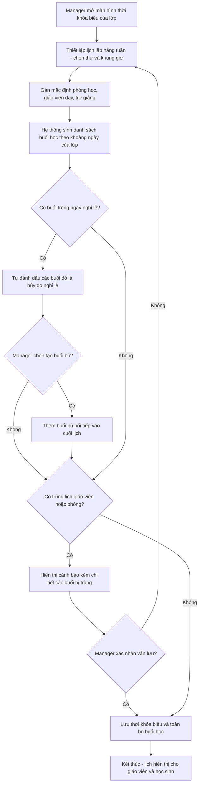
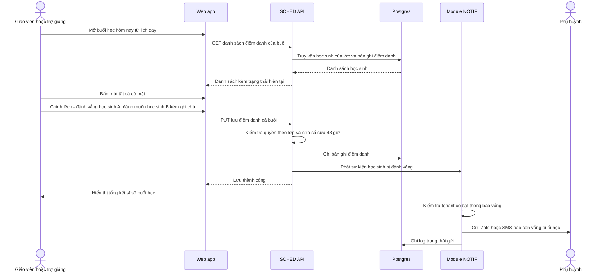
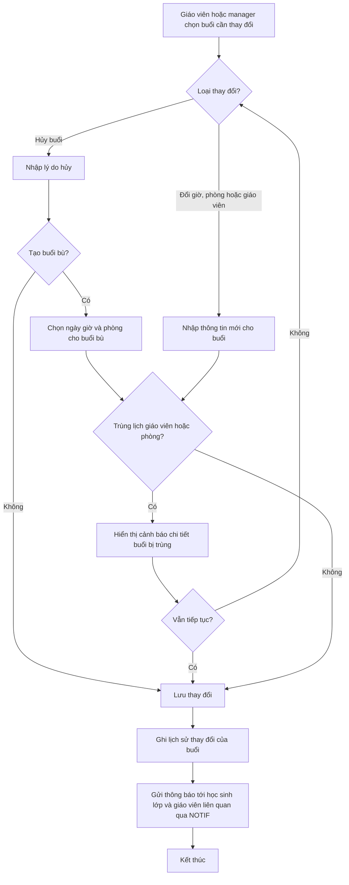

# SRS — Lịch học & điểm danh

**Mã module:** `SCHED` (dùng trong mã FR: `FR-SCHED-xx`)
**Trạng thái:** 🟢 Đã chốt
**Phụ thuộc:** `AUTH` (phân quyền theo vai trò), `ORG` (tenant, chi nhánh, lớp, danh sách học sinh, giáo viên/trợ giảng gán lớp), `NOTIF` (gửi thông báo vắng và nhắc buổi học). Module `REPORT` phụ thuộc ngược vào `SCHED` (nhận dữ liệu chuyên cần).

## 1. Mục đích

Module này quản lý thời khóa biểu của lớp học và việc điểm danh học sinh theo từng buổi. Trung tâm thiết lập lịch lặp hằng tuần một lần, hệ thống tự sinh các buổi học cụ thể, tự xử lý ngày nghỉ lễ và cảnh báo trùng lịch giáo viên/phòng học. Giáo viên/trợ giảng điểm danh ngay trên hệ thống thay vì sổ giấy; học sinh vắng được thông báo tự động tới phụ huynh qua Zalo/SMS. Dữ liệu chuyên cần trở thành đầu vào cho báo cáo chất lượng dạy–học của trung tâm.

## 2. Phạm vi

- **Trong phạm vi (v1):**
  - Thời khóa biểu lớp: lịch lặp hằng tuần (VD: thứ 2-4-6, 18h00–19h30), sinh các buổi học (session) cụ thể theo khoảng ngày của lớp.
  - Sửa buổi lẻ: đổi giờ, đổi phòng, đổi giáo viên, hủy buổi, tạo buổi bù.
  - Lịch nghỉ lễ theo tenant (lịch nghỉ chung): buổi trùng ngày nghỉ tự đánh dấu hủy, tùy chọn tạo buổi bù.
  - Buổi học gắn: phòng học (danh mục phòng đơn giản theo chi nhánh), giáo viên dạy + trợ giảng, link lớp online (Zoom/Meet dán tay), chủ đề buổi học (text).
  - Chống trùng lịch: cảnh báo khi giáo viên hoặc phòng bị trùng giờ (cảnh báo mềm, không chặn cứng).
  - Điểm danh theo buổi: có mặt / vắng / muộn / có phép, kèm ghi chú; điểm danh nhanh "tất cả có mặt rồi chỉnh lệch"; sửa được trong 48 giờ.
  - Thông báo vắng tự động tới phụ huynh qua Zalo/SMS (qua module `NOTIF`, tenant bật/tắt được); nhắc học sinh trước buổi học 2 giờ (cấu hình được).
  - Xem lịch: học sinh xem lịch của mình (tuần/tháng); giáo viên xem lịch dạy; manager xem lịch toàn chi nhánh/trung tâm (theo phòng, theo giáo viên).
  - Đổ dữ liệu chuyên cần sang module `REPORT` (tỉ lệ chuyên cần từng học sinh/lớp).
- **Ngoài phạm vi (để v2 / không làm):**
  - Chấm công, tính lương giáo viên theo buổi dạy.
  - Học sinh tự booking lịch học bù.
  - Đồng bộ Google Calendar / iCal.
  - QR check-in, điểm danh bằng khuôn mặt.
  - Tích hợp API tạo phòng Zoom/Meet tự động (v1 chỉ dán link tay).

## 3. Vai trò liên quan

| Vai trò | Tương tác với module này |
|---|---|
| Học sinh (`student`) | Xem lịch học của mình theo tuần/tháng; nhận nhắc buổi học sắp diễn ra; bấm link lớp online; xem lịch sử chuyên cần của bản thân |
| Giáo viên (`teacher`) | Xem lịch dạy các lớp mình; sửa buổi lẻ của lớp mình phụ trách; điểm danh; ghi chủ đề buổi học; dán link lớp online |
| Trợ giảng (`assistant`) | Xem lịch các lớp được gán; điểm danh thay giáo viên trong phạm vi lớp được gán |
| Nhân viên quản lý (`manager`) — owner kế thừa toàn bộ | Thiết lập thời khóa biểu lớp; quản lý danh mục phòng học, lịch nghỉ lễ; xem lịch toàn chi nhánh/trung tâm theo phòng hoặc theo giáo viên; bật/tắt thông báo vắng, cấu hình giờ nhắc |
| Admin hệ thống (`admin`) | Không tương tác trực tiếp với dữ liệu lịch của tenant; chỉ liên quan gián tiếp qua hạn mức gửi thông báo (thuộc `PLAN`/`NOTIF`) |
| Nhân viên nội dung (`content_editor`) | Không liên quan |
| Nhân viên support (`support_agent`) | Hỗ trợ tenant khi lỗi lịch/điểm danh qua đăng nhập thay (có audit); tra cứu trạng thái thông báo vắng đã gửi (qua `NOTIF`) |

## 4. User stories

- `US-SCHED-01` — Là **manager**, tôi muốn **thiết lập lịch lặp hằng tuần cho lớp một lần và hệ thống tự sinh mọi buổi học**, để **không phải nhập tay từng buổi cho cả khóa 6 tháng**.
- `US-SCHED-02` — Là **manager**, tôi muốn **khai báo lịch nghỉ lễ chung của trung tâm**, để **các buổi trùng ngày nghỉ tự hủy và tôi chủ động sắp buổi bù**.
- `US-SCHED-03` — Là **manager**, tôi muốn **được cảnh báo khi xếp giáo viên hoặc phòng bị trùng giờ**, để **phát hiện xung đột trước khi lớp khai giảng thay vì lúc đã đứng lớp**.
- `US-SCHED-04` — Là **teacher**, tôi muốn **đổi giờ hoặc hủy một buổi lẻ khi có việc đột xuất và học sinh được báo tự động**, để **không phải nhắn Zalo từng em**.
- `US-SCHED-05` — Là **teacher/assistant**, tôi muốn **điểm danh cả lớp trong dưới 1 phút bằng thao tác "tất cả có mặt rồi chỉnh lệch"**, để **không mất thời gian đầu giờ**.
- `US-SCHED-06` — Là **phụ huynh** (người nhận thông báo, không phải người dùng hệ thống), tôi muốn **nhận tin Zalo/SMS ngay khi con vắng học**, để **biết con có đến lớp hay không**.
- `US-SCHED-07` — Là **student**, tôi muốn **xem lịch học tuần/tháng của mình và được nhắc trước buổi học 2 giờ kèm link lớp online**, để **không bỏ lỡ buổi học**.
- `US-SCHED-08` — Là **manager**, tôi muốn **xem lịch toàn chi nhánh theo phòng và theo giáo viên**, để **biết phòng nào trống, giáo viên nào còn slot khi xếp lớp mới**.

## 5. Luồng hoạt động

### 5.1 Luồng tạo thời khóa biểu lớp

Manager chọn lớp, thiết lập lịch lặp hằng tuần; hệ thống sinh các buổi học cụ thể theo khoảng ngày của lớp, tự xử lý ngày nghỉ lễ và cảnh báo trùng lịch trước khi lưu.

**Các bước chính:**
1. Manager chọn lớp (đã có khoảng ngày bắt đầu–kết thúc từ module `ORG`), khai báo lịch lặp: các thứ trong tuần + giờ bắt đầu/kết thúc (một lớp có thể có nhiều khung giờ khác nhau theo thứ).
2. Gán mặc định: phòng học (thuộc chi nhánh của lớp), giáo viên dạy, trợ giảng. Các giá trị mặc định áp cho mọi buổi, có thể override từng buổi sau.
3. Hệ thống sinh toàn bộ buổi học trong khoảng ngày của lớp. Buổi rơi vào ngày nghỉ lễ của tenant tự đánh dấu `cancelled` (lý do: nghỉ lễ); manager chọn có tạo buổi bù nối vào cuối lịch hay không.
4. Hệ thống kiểm tra trùng lịch giáo viên và phòng với các buổi đã tồn tại của lớp khác; nếu trùng thì hiển thị cảnh báo chi tiết nhưng **không chặn** — manager có thể xác nhận lưu.

**Ngoại lệ / lỗi:**
- Lớp chưa có khoảng ngày bắt đầu–kết thúc → yêu cầu bổ sung ở module `ORG` trước.
- Sửa lại lịch lặp khi lớp đã chạy: chỉ áp dụng cho các buổi **trong tương lai chưa điểm danh**; buổi đã điểm danh giữ nguyên.
- Khoảng ngày quá dài khiến số buổi vượt ngưỡng an toàn (VD > 500 buổi) → báo lỗi yêu cầu kiểm tra lại.

### 5.2 Luồng điểm danh một buổi và thông báo vắng tới phụ huynh

**Các bước chính:**
1. Giáo viên/trợ giảng chỉ mở được buổi của lớp mình được gán. Buổi mở điểm danh được từ đầu giờ học đến hết cửa sổ 48 giờ sau giờ kết thúc buổi.
2. Trạng thái điểm danh: `present` (có mặt) / `absent` (vắng) / `late` (muộn) / `excused` (có phép), mỗi học sinh kèm ghi chú tùy chọn.
3. Điểm danh nhanh: một nút đánh tất cả `present`, sau đó chỉnh lệch từng em.
4. Khi lưu, hệ thống phát sự kiện cho từng học sinh bị đánh `absent`; `NOTIF` chịu trách nhiệm gửi Zalo/SMS tới số phụ huynh (lấy từ hồ sơ học sinh ở `ORG`), tôn trọng cấu hình bật/tắt của tenant.
5. Sửa điểm danh trong 48 giờ: nếu học sinh đổi từ `absent` sang trạng thái khác **sau khi** thông báo vắng đã gửi, hệ thống gửi tin đính chính qua cùng kênh.

**Ngoại lệ / lỗi:**
- Buổi đã bị hủy → không cho điểm danh.
- Quá cửa sổ 48 giờ → giao diện khóa, hiển thị lý do (xem câu hỏi mở #1 về quyền override của manager).
- Học sinh không có số phụ huynh → bỏ qua gửi, đánh dấu `skipped` trong log của `NOTIF` để trung tâm bổ sung.
- Gửi Zalo thất bại → `NOTIF` tự fallback sang SMS theo cấu hình kênh của tenant (chi tiết thuộc SRS `NOTIF`).

### 5.3 Luồng đổi lịch buổi lẻ

**Các bước chính:**
1. Thay đổi chỉ áp dụng cho **một buổi** cụ thể, không ảnh hưởng lịch lặp; buổi bị sửa đánh dấu `modified` để phân biệt với lịch gốc.
2. Mọi thay đổi giờ/phòng/giáo viên đều chạy lại kiểm tra trùng lịch (cảnh báo mềm như luồng 5.1).
3. Sau khi lưu, `NOTIF` gửi thông báo tới toàn bộ học sinh của lớp và giáo viên/trợ giảng liên quan (kể cả giáo viên bị thay và giáo viên thay thế).
4. Lịch sử thay đổi của buổi được lưu (ai đổi, đổi gì, lúc nào) phục vụ tra soát.

**Ngoại lệ / lỗi:**
- Không cho sửa/hủy buổi đã điểm danh (đã diễn ra) — chỉ sửa được phần chủ đề và ghi chú.
- Giáo viên chỉ sửa được buổi của lớp mình; đổi giáo viên dạy sang người khác cần quyền manager.

## 6. Yêu cầu chức năng

| Mã | Yêu cầu | Vai trò | Ưu tiên |
|---|---|---|---|
| FR-SCHED-01 | Thiết lập lịch lặp hằng tuần cho lớp (các thứ + khung giờ, có thể khác nhau theo thứ); hệ thống sinh các buổi học cụ thể theo khoảng ngày của lớp | manager | Must |
| FR-SCHED-02 | Quản lý danh mục phòng học theo chi nhánh: tên phòng, sức chứa, ghi chú, bật/tắt sử dụng | manager | Must |
| FR-SCHED-03 | Gán thông tin cho buổi học: phòng, giáo viên dạy, trợ giảng, link lớp online dán tay (Zoom/Meet), chủ đề buổi (text) — mặc định theo lịch lặp, override được từng buổi | manager, teacher | Must |
| FR-SCHED-04 | Sửa buổi lẻ: đổi giờ, đổi phòng, đổi giáo viên (chỉ manager), hủy buổi kèm lý do, tạo buổi bù; lưu lịch sử thay đổi của buổi | manager, teacher | Must |
| FR-SCHED-05 | Quản lý lịch nghỉ lễ theo tenant; buổi trùng ngày nghỉ tự đánh dấu hủy với lý do nghỉ lễ, tùy chọn sinh buổi bù nối vào cuối lịch | manager | Must |
| FR-SCHED-06 | Cảnh báo trùng lịch khi giáo viên hoặc phòng bị xếp trùng giờ ở bước tạo thời khóa biểu và sửa buổi — cảnh báo kèm chi tiết buổi trùng, không chặn cứng, người dùng xác nhận mới lưu | manager, teacher | Must |
| FR-SCHED-07 | Giáo viên/trợ giảng mở buổi học của lớp mình, xem danh sách học sinh và đánh trạng thái: có mặt / vắng / muộn / có phép, kèm ghi chú từng em | teacher, assistant | Must |
| FR-SCHED-08 | Điểm danh nhanh: một thao tác đánh tất cả có mặt, sau đó chỉnh lệch từng học sinh | teacher, assistant | Should |
| FR-SCHED-09 | Cho phép sửa kết quả điểm danh trong vòng 48 giờ sau giờ kết thúc buổi; quá hạn thì khóa | teacher, assistant | Must |
| FR-SCHED-10 | Khi học sinh bị đánh vắng, tự động gửi thông báo tới phụ huynh qua Zalo/SMS thông qua module NOTIF; tenant bật/tắt được tính năng này; nếu sửa từ vắng sang trạng thái khác sau khi đã gửi thì gửi tin đính chính | hệ thống (cấu hình bởi manager) | Must |
| FR-SCHED-11 | Nhắc học sinh buổi học sắp diễn ra trước 2 giờ (khoảng thời gian nhắc cấu hình được theo tenant), kèm giờ học, phòng hoặc link lớp online | hệ thống (cấu hình bởi manager) | Should |
| FR-SCHED-12 | Học sinh xem lịch học của mình dạng tuần và tháng; buổi online hiển thị nút mở link lớp | student | Must |
| FR-SCHED-13 | Giáo viên/trợ giảng xem lịch dạy tổng hợp mọi lớp mình được gán, dạng tuần và tháng | teacher, assistant | Must |
| FR-SCHED-14 | Manager xem lịch toàn chi nhánh hoặc toàn trung tâm, lọc và nhóm theo phòng học hoặc theo giáo viên | manager | Must |
| FR-SCHED-15 | Đổ dữ liệu chuyên cần sang module REPORT: tỉ lệ chuyên cần theo học sinh, theo lớp, theo khoảng thời gian | hệ thống | Must |
| FR-SCHED-16 | Học sinh xem lịch sử chuyên cần của bản thân (buổi nào có mặt/vắng/muộn/có phép) | student | Should |
| FR-SCHED-17 | Xuất lịch tuần của chi nhánh ra file để in dán tại quầy lễ tân | manager | Could |
| FR-SCHED-18 | Parent xem lịch học tuần/tháng + trạng thái điểm danh từng buổi của con (chỉ đọc) | parent | Must |

## 7. Yêu cầu phi chức năng (riêng module)

Phần chung xem [06-yeu-cau-phi-chuc-nang](../01-kien-truc/06-yeu-cau-phi-chuc-nang.md). Riêng module này:

- **Hiệu năng sinh buổi:** sinh toàn bộ buổi học cho lớp 12 tháng, 3 buổi/tuần (~150 buổi) hoàn tất < 5 giây; đặt trần an toàn 500 buổi/lần sinh.
- **Kiểm tra trùng lịch:** phản hồi < 1 giây với tenant có tới 200 lớp đang hoạt động.
- **Xem lịch:** lịch tháng toàn chi nhánh (≤ 50 lớp) tải < 2 giây.
- **Độ trễ thông báo vắng:** sự kiện vắng đẩy sang `NOTIF` ngay khi lưu; phụ huynh nhận tin trong vòng 5 phút (SLA phần gửi thuộc `NOTIF`).
- **Múi giờ:** thời gian lưu UTC, hiển thị theo múi giờ của tenant (mặc định Asia/Ho_Chi_Minh); xử lý đúng buổi học qua ngày nghỉ lễ theo lịch địa phương.
- **Mobile-first cho điểm danh:** màn hình điểm danh phải thao tác tốt trên điện thoại — giáo viên thường điểm danh bằng điện thoại ngay tại lớp.
- **Cách ly dữ liệu:** mọi truy vấn lịch/điểm danh bắt buộc gắn `tenant_id`; giáo viên/trợ giảng chỉ thấy lớp mình được gán.
- **Tính bất biến sau khóa:** bản ghi điểm danh sau cửa sổ 48 giờ không sửa được qua API thường; mọi thay đổi (nếu có cơ chế override) phải ghi audit log.

## 8. Màn hình chính

| Màn hình | Vai trò dùng | Mockup |
|---|---|---|
| Thiết lập thời khóa biểu lớp (lịch lặp + preview các buổi sinh ra) | manager | _sẽ bổ sung_ |
| Lịch tổng hợp trung tâm/chi nhánh (view theo phòng, theo giáo viên) | manager | _sẽ bổ sung_ |
| Danh mục phòng học theo chi nhánh | manager | _sẽ bổ sung_ |
| Lịch nghỉ lễ của trung tâm | manager | _sẽ bổ sung_ |
| Lịch dạy của tôi (tuần/tháng) | teacher, assistant | _sẽ bổ sung_ |
| Chi tiết buổi học (thông tin buổi, sửa buổi lẻ, link online, chủ đề) | manager, teacher, assistant | _sẽ bổ sung_ |
| Màn hình điểm danh buổi học (mobile-first) | teacher, assistant | _sẽ bổ sung_ |
| Lịch học của tôi (tuần/tháng) + lịch sử chuyên cần | student | _sẽ bổ sung_ |

## 9. API sơ bộ

| Method | Path | Mô tả | Quyền |
|---|---|---|---|
| GET | `/api/v1/schedule/rooms` | Danh sách phòng học (lọc theo chi nhánh) | manager, teacher, assistant |
| POST | `/api/v1/schedule/rooms` | Tạo phòng học | manager |
| PATCH | `/api/v1/schedule/rooms/{room_id}` | Sửa/bật-tắt phòng học | manager |
| GET | `/api/v1/schedule/holidays` | Danh sách ngày nghỉ lễ của tenant | manager |
| POST | `/api/v1/schedule/holidays` | Thêm ngày nghỉ lễ (tự đánh dấu hủy các buổi trùng) | manager |
| DELETE | `/api/v1/schedule/holidays/{holiday_id}` | Xóa ngày nghỉ lễ | manager |
| GET | `/api/v1/schedule/classes/{class_id}/timetable` | Xem lịch lặp hằng tuần của lớp | manager, teacher, assistant |
| PUT | `/api/v1/schedule/classes/{class_id}/timetable` | Thiết lập/sửa lịch lặp + sinh lại buổi tương lai | manager |
| POST | `/api/v1/schedule/conflicts/check` | Kiểm tra trùng lịch giáo viên/phòng cho một tập buổi dự kiến | manager, teacher |
| GET | `/api/v1/schedule/sessions` | Danh sách buổi học (lọc: khoảng ngày, lớp, chi nhánh, phòng, giáo viên) | manager; teacher/assistant trong lớp mình |
| GET | `/api/v1/schedule/sessions/me` | Lịch của tôi (học sinh: lịch học; giáo viên/trợ giảng: lịch dạy) | student, teacher, assistant |
| GET | `/api/v1/schedule/sessions/{session_id}` | Chi tiết buổi học | theo phạm vi lớp |
| PATCH | `/api/v1/schedule/sessions/{session_id}` | Sửa buổi lẻ (giờ, phòng, giáo viên, link online, chủ đề) | manager; teacher lớp mình (trừ đổi giáo viên) |
| POST | `/api/v1/schedule/sessions/{session_id}/cancel` | Hủy buổi kèm lý do | manager, teacher lớp mình |
| POST | `/api/v1/schedule/sessions/{session_id}/makeup` | Tạo buổi bù từ buổi bị hủy | manager, teacher lớp mình |
| GET | `/api/v1/schedule/sessions/{session_id}/attendance` | Danh sách điểm danh của buổi | teacher/assistant lớp mình, manager |
| PUT | `/api/v1/schedule/sessions/{session_id}/attendance` | Lưu điểm danh cả buổi (bulk, trong cửa sổ 48 giờ) | teacher, assistant lớp mình |
| GET | `/api/v1/schedule/attendance/me` | Lịch sử chuyên cần của bản thân | student |
| GET | `/api/v1/schedule/settings` | Cấu hình module theo tenant (bật/tắt thông báo vắng, giờ nhắc trước buổi) | manager |
| PUT | `/api/v1/schedule/settings` | Cập nhật cấu hình module | manager |

## 10. Entity liên quan

Chi tiết thuộc tính xem [Từ điển dữ liệu](../16-du-lieu/02-tu-dien-du-lieu.md), quan hệ xem [ERD](../16-du-lieu/01-erd.md).

- **Room** — phòng học, thuộc `Branch`; thuộc tính chính: tên, sức chứa, trạng thái.
- **TimetableRule** — quy tắc lịch lặp hằng tuần của `Class`: thứ trong tuần, giờ bắt đầu/kết thúc, phòng/giáo viên/trợ giảng mặc định.
- **Session** — buổi học cụ thể sinh từ `TimetableRule` (hoặc buổi bù tạo tay): ngày giờ, phòng, giáo viên, trợ giảng, link online, chủ đề, trạng thái (`scheduled` / `modified` / `cancelled` / `completed`), lý do hủy, tham chiếu buổi gốc nếu là buổi bù.
- **Holiday** — ngày nghỉ lễ theo tenant: ngày (hoặc khoảng ngày), tên kỳ nghỉ.
- **AttendanceRecord** — bản ghi điểm danh: `Session` × `Student`, trạng thái (`present` / `absent` / `late` / `excused`), ghi chú, người điểm danh, thời điểm ghi/sửa.
- Tham chiếu từ module khác: `Class`, `Branch`, `User` (teacher/assistant/student) thuộc `ORG`; sự kiện gửi thông báo thuộc `NOTIF`; số liệu chuyên cần tổng hợp thuộc `REPORT`.

## 11. Câu hỏi mở cần chốt

| # | Câu hỏi | Quyết định | Ngày chốt |
|---|---|---|---|
| 1 | Quá cửa sổ 48 giờ, manager có được sửa điểm danh không (kèm audit log) hay khóa hoàn toàn với mọi vai trò? | **Chốt:** Manager sửa được quá 48h, kèm audit log | 2026-07-16 |
| 2 | Buổi bù cho ngày nghỉ lễ: mặc định nối vào cuối lịch của lớp hay để manager tự chọn ngày giờ từng buổi? | **Chốt:** Manager tự chọn ngày giờ từng buổi bù | 2026-07-16 |
| 3 | Trạng thái "vắng có phép" (`excused`) có gửi thông báo cho phụ huynh không, hay chỉ gửi khi vắng không phép (`absent`)? | **Chốt:** excused không gửi; chỉ gửi khi absent | 2026-07-16 |
| 4 | Nhắc buổi học trước 2 giờ gửi qua kênh nào (in-app, Zalo) và có gửi cho cả giáo viên/trợ giảng hay chỉ học sinh? | **Chốt:** In-app cho HS + GV/TA; Zalo chỉ khi tenant bật | 2026-07-16 |

## Lịch sử thay đổi

| Ngày | Thay đổi | Người |
|---|---|---|
| 2026-07-16 | Tạo bản nháp đầu tiên | Claude |
| 2026-07-16 | Chốt toàn bộ câu hỏi mở (quyết định ghi trong bảng), chuyển trạng thái Đã chốt | Chủ sản phẩm |
| 2026-07-16 | Thêm `parent` xem lịch học + chuyên cần của con; phạm vi manager theo chi nhánh — chi tiết ma trận ở SRS Phân quyền | Chủ sản phẩm |
| 2026-07-17 | Thêm FR-SCHED-18: phụ huynh xem lịch + chuyên cần của con | Chủ sản phẩm + Claude |
