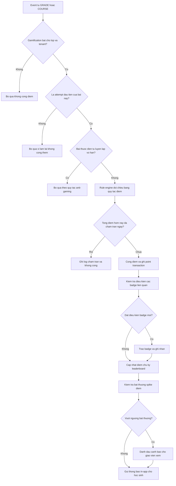
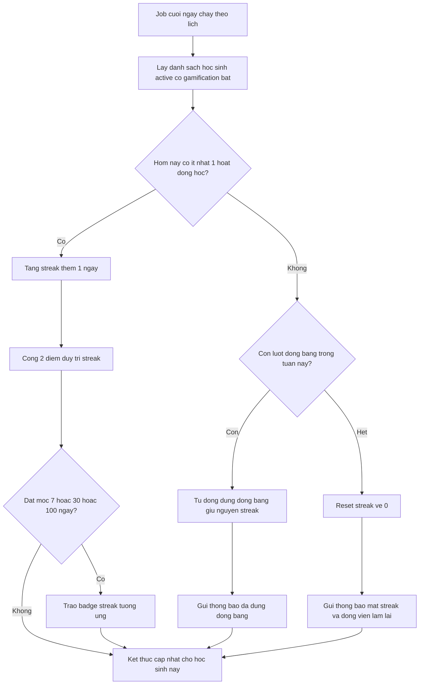
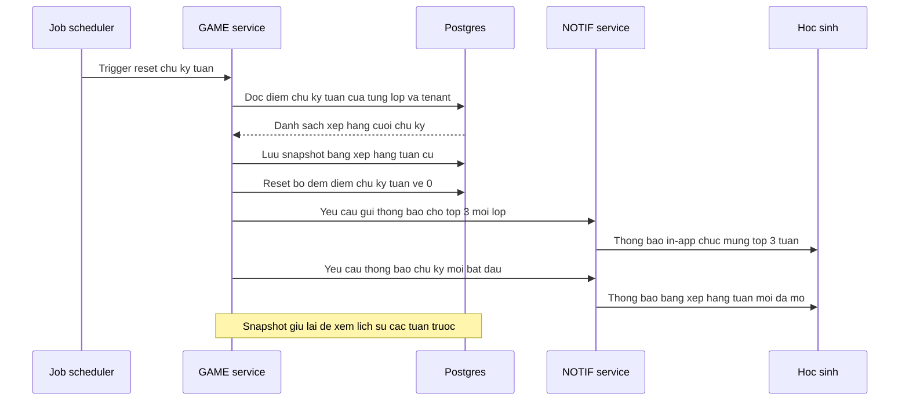

# SRS — Gamification

**Mã module:** `GAME` (dùng trong mã FR: `FR-GAME-xx`)
**Trạng thái:** 🟢 Đã chốt
**Phụ thuộc:** [GRADE — Chấm bài](../08-cham-bai/srs-cham-bai.md) (event hoàn thành/điểm bài), [COURSE — Khóa học](../04-khoa-hoc/srs-khoa-hoc.md) (event hoàn thành lesson, phiên flashcard), [ASSIGN — Giao bài](../07-giao-bai/srs-giao-bai.md) (deadline để xác định nộp đúng hạn), [NOTIF — Thông báo](../11-thong-bao/srs-thong-bao.md) (thông báo in-app), [AUTH — Phân quyền](../02-phan-quyen/srs-phan-quyen.md), [ORG — Tổ chức](../03-to-chuc-nguoi-dung/srs-to-chuc-nguoi-dung.md) (lớp, tenant)

## 1. Mục đích

Module Gamification tăng động lực học tập cho học sinh — đặc biệt nhóm thiếu niên — thông qua điểm thưởng, chuỗi ngày học (streak), huy hiệu và bảng xếp hạng, phù hợp văn hóa thi đua lớp học ở Việt Nam. Giáo viên dùng dữ liệu này để khen thưởng, khích lệ trên lớp; trung tâm dùng như một công cụ giữ chân học sinh. Module thiết kế theo hướng "khích lệ chứ không gây áp lực": mọi thành phần có thể tắt theo lớp hoặc theo trung tâm, và có cơ chế chống gian lận điểm cơ bản.

## 2. Phạm vi

- **Trong phạm vi (v1):**
  - **Điểm thưởng (points):** cộng tự động theo bảng quy tắc — hoàn thành bài đúng hạn (+10), điểm bài từ 80% trở lên (+5), hoàn thành lesson (+5), duy trì streak (+2/ngày), hoàn thành đủ phiên ôn flashcard trong ngày (+3). Bảng quy tắc cấu hình được ở mức platform (tenant **không** sửa được ở v1 — tránh loạn chuẩn giữa các trung tâm).
  - **Streak:** chuỗi ngày liên tiếp có hoạt động học (làm ≥1 bài, hoàn thành ≥1 lesson, hoặc ≥1 phiên flashcard); "đóng băng streak" 1 lần/tuần tự động dùng khi lỡ 1 ngày; hiển thị nổi bật trên dashboard học sinh.
  - **Huy hiệu (badges):** catalog ~15 badge milestone ở v1 (hoàn thành khóa đầu tiên; streak 7/30/100 ngày; 100 câu đúng kỹ năng nghe; nộp sớm 10 bài liên tiếp; điểm tuyệt đối bài thi…), mở rộng dần; badge hiển thị trên hồ sơ học sinh.
  - **Bảng xếp hạng (leaderboard):** theo lớp (mặc định bật) và theo trung tâm (mặc định tắt — tenant tự bật); chu kỳ tuần và tháng (reset đầu chu kỳ); xếp theo điểm kiếm được **trong chu kỳ** (không phải tổng tích lũy — để người mới có cơ hội); tùy chọn ẩn danh (hiện nickname).
  - **Bật/tắt:** owner tắt/bật toàn bộ gamification theo tenant; owner/manager/teacher tắt/bật theo từng lớp.
  - **Anti-gaming:** chỉ tính điểm lần attempt đầu của mỗi bài; trần điểm/ngày (mặc định 100); không cộng điểm cho bài tự luyện lặp vô hạn; phát hiện bất thường đơn giản (spike điểm) để giáo viên xem.
  - **Cho GV/trợ giảng:** xem points/streak học sinh lớp mình; thưởng điểm thủ công có lý do (tối đa 20 điểm/lần, ghi log) — Should.
- **Ngoài phạm vi (để v2 / không làm):**
  - Đổi điểm lấy quà/voucher (điểm v1 thuần danh hiệu, không có giá trị quy đổi).
  - Avatar, vật phẩm ảo, level nhân vật.
  - Thi đấu realtime giữa học sinh (quiz battle).
  - Tenant tự cấu hình bảng quy tắc điểm hoặc tự tạo badge riêng.
  - Bảng xếp hạng liên tenant (giữa các trung tâm).

## 3. Vai trò liên quan

| Vai trò | Tương tác với module này |
|---|---|
| Học sinh (`student`) | Nhận điểm/badge tự động; xem điểm, lịch sử điểm, streak, badge của mình; xem bảng xếp hạng lớp/trung tâm; chọn ẩn danh trên bảng xếp hạng |
| Giáo viên (`teacher`) | Xem points/streak của học sinh lớp mình để khen trên lớp; thưởng điểm thủ công có lý do; xem cảnh báo điểm bất thường; tắt/bật gamification cho lớp mình |
| Trợ giảng (`assistant`) | Xem points/streak học sinh lớp được gán để hỗ trợ nhắc/khen; thưởng điểm thủ công (nếu được ủy quyền) |
| Chủ trung tâm (`owner`) | Tắt/bật gamification theo tenant + bật bảng xếp hạng cấp trung tâm; xem tổng quan gamification của tenant |
| Nhân viên quản lý (`manager`) | Tắt/bật theo lớp trong phạm vi; xem points/streak học sinh; thưởng điểm thủ công |
| Phụ huynh (`parent`) | Xem points/streak/badge của con |
| Admin hệ thống (`admin`) | Cấu hình bảng quy tắc cộng điểm và trần điểm/ngày ở mức platform; quản lý catalog badge |
| Nhân viên nội dung (`content_editor`) | Đề xuất/soạn nội dung mô tả và icon badge trong catalog (admin duyệt) |
| Nhân viên support (`support_agent`) | Tra cứu lịch sử điểm/streak/badge của một học sinh khi xử lý ticket (chỉ đọc, có audit) |

## 4. User stories

- `US-GAME-01` — Là **học sinh**, tôi muốn **nhận điểm thưởng khi hoàn thành bài đúng hạn và làm bài tốt** để **có động lực học đều mỗi ngày**.
- `US-GAME-02` — Là **học sinh**, tôi muốn **thấy streak của mình nổi bật trên dashboard và không bị mất streak oan khi lỡ đúng 1 ngày** để **duy trì thói quen học mà không quá áp lực**.
- `US-GAME-03` — Là **học sinh**, tôi muốn **sưu tầm huy hiệu milestone hiển thị trên hồ sơ** để **thấy được cột mốc tiến bộ của mình**.
- `US-GAME-04` — Là **học sinh**, tôi muốn **xem bảng xếp hạng tuần của lớp tính theo điểm kiếm trong tuần** để **thi đua với bạn cùng lớp kể cả khi tôi mới vào học**.
- `US-GAME-05` — Là **học sinh**, tôi muốn **ẩn tên thật và hiện nickname trên bảng xếp hạng** để **tham gia thi đua mà không ngại bị so sánh**.
- `US-GAME-06` — Là **giáo viên**, tôi muốn **xem points/streak của học sinh lớp mình** để **khen đúng người trên lớp và phát hiện em nào đang chững lại**.
- `US-GAME-07` — Là **giáo viên**, tôi muốn **thưởng điểm thủ công kèm lý do cho học sinh tích cực** để **ghi nhận cả những đóng góp ngoài bài tập**.
- `US-GAME-08` — Là **ban giám hiệu**, tôi muốn **tắt toàn bộ gamification cho một lớp luyện thi nghiêm túc** để **phù hợp với định hướng của lớp đó**.
- `US-GAME-09` — Là **admin hệ thống**, tôi muốn **chỉnh bảng quy tắc cộng điểm ở mức platform** để **cân bằng lại kinh tế điểm mà không tạo khác biệt giữa các tenant**.
- `US-GAME-10` — Là **giáo viên**, tôi muốn **được cảnh báo khi một học sinh có điểm tăng bất thường** để **kiểm tra xem em đó học thật hay đang lách luật**.

## 5. Luồng hoạt động

### 5.1 Luồng tích điểm khi học sinh hoàn thành bài

Sự kiện từ module GRADE (chấm xong attempt) hoặc COURSE (hoàn thành lesson, đủ phiên flashcard) được đẩy vào rule engine của GAME. Rule engine kiểm tra điều kiện hợp lệ, cộng điểm, kiểm tra badge và gửi thông báo in-app.

**Mô tả bước & ngoại lệ:**

1. GRADE/COURSE phát event (attempt được chấm xong, lesson hoàn thành, phiên flashcard đủ) kèm `student_id`, `tenant_id`, `class_id`, loại hành động, kết quả.
2. Kiểm tra công tắc gamification ở cả 2 cấp: tenant và lớp — tắt ở bất kỳ cấp nào thì dừng, không ghi điểm.
3. Chống cộng trùng: chỉ attempt đầu tiên của mỗi bài được tính; sự kiện lặp (retry của message queue) phải idempotent theo `event_id`.
4. Một hành động có thể khớp nhiều quy tắc (VD: nộp đúng hạn +10 **và** điểm ≥80% +5) — cộng dồn nhưng vẫn tôn trọng trần điểm/ngày; nếu cộng một phần thì chạm trần, phần vượt bị cắt.
5. Trao badge là hệ quả của giao dịch điểm hoặc bộ đếm milestone (số câu đúng listening, số bài nộp sớm liên tiếp…); một event có thể trao nhiều badge.
6. **Lỗi/ngoại lệ:** event đến muộn sau 48h vẫn được xử lý nhưng tính vào ngày phát sinh hành động (ảnh hưởng streak hồi tố); nếu rule engine lỗi, event vào hàng đợi retry — không được làm hỏng luồng chấm bài của GRADE.

### 5.2 Luồng tính streak hằng ngày

Job chạy cuối ngày (theo múi giờ hệ thống — xem Câu hỏi mở #1) duyệt qua học sinh active và cập nhật streak.

**Mô tả bước & ngoại lệ:**

1. "Hoạt động học" hợp lệ = hoàn thành ≥1 attempt (practice/exam), hoặc ≥1 lesson, hoặc ≥1 phiên flashcard — cùng định nghĩa với nguồn cộng điểm.
2. Đóng băng streak: mỗi học sinh có 1 lượt/tuần (reset sáng thứ Hai), **tự động** dùng khi lỡ đúng 1 ngày — học sinh không phải mua hay kích hoạt; lỡ ngày thứ 2 trong cùng tuần thì reset streak.
3. Dùng đóng băng thì streak giữ nguyên (không tăng, không cộng 2 điểm duy trì của ngày đó).
4. **Lỗi/ngoại lệ:** job phải idempotent — chạy lại không tăng streak 2 lần cho cùng ngày; event đến muộn (mục 5.1 bước 6) có thể phục hồi streak hồi tố trong cửa sổ 48h; học sinh bị tắt gamification giữa chừng thì streak giữ nguyên giá trị nhưng ngừng cập nhật.

### 5.3 Luồng cập nhật bảng xếp hạng chu kỳ tuần

Job đầu tuần (00:00 thứ Hai) chốt bảng xếp hạng tuần cũ, lưu snapshot, reset điểm chu kỳ và thông báo top 3.

**Mô tả bước & ngoại lệ:**

1. Reset theo từng scope: mọi lớp có leaderboard bật + leaderboard trung tâm (nếu tenant bật). Chu kỳ tháng chạy tương tự vào 00:00 ngày 1 hằng tháng.
2. Snapshot bất biến, lưu tối thiểu 12 tháng để học sinh/giáo viên xem lại lịch sử xếp hạng.
3. Học sinh chọn ẩn danh vẫn có mặt trong xếp hạng nhưng hiển thị nickname; thông báo top 3 gửi riêng cho chính học sinh đó (không lộ danh tính trong thông báo chung).
4. **Lỗi/ngoại lệ:** đồng thời có điểm bằng nhau thì đồng hạng (cùng thứ hạng, người sau nhảy hạng); lớp dưới 3 học sinh có điểm thì thông báo theo số thực tế; job lỗi giữa chừng phải rollback theo scope — không được reset điểm khi chưa lưu xong snapshot.

## 6. Yêu cầu chức năng

| Mã | Yêu cầu | Vai trò | Ưu tiên |
|---|---|---|---|
| FR-GAME-01 | Hệ thống tự động cộng điểm thưởng theo bảng quy tắc khi học sinh: hoàn thành bài đúng hạn (+10), đạt điểm bài ≥80% (+5), hoàn thành lesson (+5), duy trì streak (+2/ngày), hoàn thành đủ phiên flashcard trong ngày (+3) | Hệ thống, student | Must |
| FR-GAME-02 | Điểm chỉ được cộng cho **lần attempt đầu tiên** của mỗi bài; làm lại không cộng thêm; xử lý event idempotent để không cộng trùng | Hệ thống | Must |
| FR-GAME-03 | Áp trần điểm thưởng/ngày cho mỗi học sinh (mặc định 100); phần vượt trần bị cắt và ghi log; không cộng điểm cho bài tự luyện lặp vô hạn | Hệ thống | Must |
| FR-GAME-04 | Học sinh xem tổng điểm, lịch sử giao dịch điểm (nguồn cộng, thời điểm, số điểm) của chính mình | student | Must |
| FR-GAME-05 | Admin platform cấu hình bảng quy tắc cộng điểm và trần điểm/ngày ở mức platform; tenant không sửa được ở v1; mọi thay đổi ghi audit log và chỉ áp dụng cho giao dịch phát sinh sau đó | admin | Must |
| FR-GAME-06 | Hệ thống tính streak hằng ngày bằng job cuối ngày: có ≥1 hoạt động học (bài/lesson/phiên flashcard) thì tăng streak; hiển thị streak nổi bật trên dashboard học sinh | Hệ thống, student | Must |
| FR-GAME-07 | Đóng băng streak 1 lần/tuần: tự động dùng khi học sinh lỡ đúng 1 ngày, giữ nguyên streak và thông báo cho học sinh; lỡ ngày thứ hai trong tuần thì reset streak | Hệ thống, student | Must |
| FR-GAME-08 | Hệ thống tự động trao badge khi học sinh đạt điều kiện milestone (catalog ~15 badge v1: khóa đầu tiên, streak 7/30/100 ngày, 100 câu đúng listening, nộp sớm 10 bài liên tiếp, điểm tuyệt đối bài thi…); badge hiển thị trên hồ sơ học sinh | Hệ thống, student | Must |
| FR-GAME-09 | Admin quản lý catalog badge ở mức platform (thêm/sửa/ngưng badge); content_editor soạn mô tả và icon badge, admin duyệt; badge đã trao không bị thu hồi khi badge ngưng phát hành | admin, content_editor | Should |
| FR-GAME-10 | Bảng xếp hạng theo lớp (mặc định bật), chu kỳ tuần và tháng, xếp theo điểm kiếm được **trong chu kỳ**; học sinh xem hạng của mình và của lớp | student, teacher | Must |
| FR-GAME-11 | Bảng xếp hạng cấp trung tâm mặc định tắt; owner bật/tắt cho tenant của mình | owner, student | Should |
| FR-GAME-12 | Học sinh chọn chế độ ẩn danh trên bảng xếp hạng — hiển thị nickname thay cho tên thật; áp dụng cho mọi người xem trừ giáo viên lớp và manager | student | Should |
| FR-GAME-13 | Khi hết chu kỳ, hệ thống lưu snapshot bảng xếp hạng cũ, reset điểm chu kỳ và gửi thông báo in-app chúc mừng top 3 mỗi lớp; snapshot xem lại được | Hệ thống, student | Must |
| FR-GAME-14 | Owner tắt/bật toàn bộ gamification ở cấp tenant; manager tắt/bật cấp lớp trong phạm vi; teacher tắt/bật cho lớp mình phụ trách; khi tắt, học sinh không thấy bất kỳ thành phần gamification nào và hệ thống ngừng tích điểm | owner, manager, teacher | Must |
| FR-GAME-15 | Giáo viên và trợ giảng xem points, streak, badge của học sinh trong lớp mình (danh sách + chi tiết từng em) để khen thưởng trên lớp | teacher, assistant | Must |
| FR-GAME-16 | Giáo viên thưởng điểm thủ công cho học sinh lớp mình kèm lý do bắt buộc, tối đa 20 điểm/lần, tính vào trần điểm/ngày và ghi log đầy đủ (ai thưởng, cho ai, bao nhiêu, lý do) | teacher, assistant | Should |
| FR-GAME-17 | Hệ thống phát hiện bất thường đơn giản (spike điểm — VD kiếm điểm vượt ngưỡng trong khung thời gian ngắn) và đánh dấu để giáo viên lớp xem xét; không tự động trừ điểm | Hệ thống, teacher | Should |
| FR-GAME-18 | Owner/manager xem tổng quan gamification (toàn tenant / phạm vi gán): tỉ lệ học sinh có streak, phân bố điểm theo lớp, số badge đã trao | owner, manager | Could |
| FR-GAME-19 | Support agent tra cứu (chỉ đọc) lịch sử điểm, streak, badge của một học sinh khi xử lý ticket; mọi truy cập ghi audit log | support_agent | Could |
| FR-GAME-20 | Thông báo in-app cho học sinh khi: được cộng điểm milestone lớn, nhận badge mới, sắp mất streak (chưa có hoạt động sau 20h), vào top 3 chu kỳ | Hệ thống, student | Should |

## 7. Yêu cầu phi chức năng (riêng module)

Phần chung xem [06-yeu-cau-phi-chuc-nang](../01-kien-truc/06-yeu-cau-phi-chuc-nang.md). Riêng module GAME:

- **Không chặn luồng chính:** xử lý điểm/badge là bất đồng bộ (event-driven); lỗi của GAME không được làm chậm hay hỏng luồng nộp bài, chấm bài của GRADE/COURSE.
- **Idempotency:** mọi consumer xử lý event theo `event_id` duy nhất; job streak và job reset leaderboard chạy lại an toàn, không nhân đôi điểm/streak.
- **Độ trễ:** điểm và badge phản ánh trên UI học sinh trong vòng 30 giây kể từ khi hành động được ghi nhận (p95); bảng xếp hạng trong lớp cập nhật gần realtime, chấp nhận trễ tối đa 5 phút.
- **Nhất quán dữ liệu:** tổng điểm của học sinh luôn bằng tổng các point transaction — số dư dẫn xuất, có job đối soát định kỳ.
- **Cách ly tenant:** mọi truy vấn điểm/leaderboard ràng buộc `tenant_id`; leaderboard không bao giờ lộ dữ liệu chéo tenant.
- **Hiệu năng leaderboard:** truy vấn bảng xếp hạng lớp (≤100 học sinh) trả về <300ms (p95); cấp trung tâm (≤5.000 học sinh active) <1s, dùng bộ đếm điểm-theo-chu-kỳ tách riêng thay vì tính tổng transaction lúc đọc.
- **Bất biến lịch sử:** point transaction và snapshot leaderboard là append-only, không sửa/xóa; điều chỉnh sai sót bằng transaction bù trừ (có log).
- **i18n:** tên/mô tả badge và mọi text thông báo gamification hỗ trợ đa ngôn ngữ UI (vi/en tối thiểu) theo chuẩn chung của hệ thống.

## 8. Màn hình chính

| Màn hình | Vai trò dùng | Mockup |
|---|---|---|
| Widget gamification trên dashboard học sinh (điểm, streak nổi bật, badge mới) | student | _sẽ bổ sung_ |
| Trang điểm thưởng của tôi (tổng điểm + lịch sử giao dịch) | student | _sẽ bổ sung_ |
| Trang huy hiệu của tôi (đã đạt / chưa đạt kèm điều kiện) | student | _sẽ bổ sung_ |
| Bảng xếp hạng lớp / trung tâm (tab tuần / tháng, lịch sử chu kỳ trước) | student, teacher, assistant, manager | _sẽ bổ sung_ |
| Bảng gamification của lớp (points/streak/badge từng học sinh, nút thưởng điểm, cảnh báo bất thường) | teacher, assistant | _sẽ bổ sung_ |
| Cài đặt gamification (bật/tắt theo tenant / theo lớp, bật leaderboard trung tâm) | owner, manager, teacher | _sẽ bổ sung_ |
| Quản trị quy tắc điểm & catalog badge (platform) | admin, content_editor | _sẽ bổ sung_ |

## 9. API sơ bộ

| Method | Path | Mô tả | Quyền |
|---|---|---|---|
| GET | `/api/v1/gamification/me/summary` | Tổng điểm, streak hiện tại, lượt đóng băng còn lại, badge mới của học sinh đang đăng nhập | student |
| GET | `/api/v1/gamification/me/points` | Lịch sử giao dịch điểm của tôi (phân trang, lọc theo nguồn) | student |
| GET | `/api/v1/gamification/me/badges` | Danh sách badge của tôi + catalog badge kèm trạng thái đạt/chưa đạt | student |
| PUT | `/api/v1/gamification/me/preferences` | Cập nhật tùy chọn ẩn danh + nickname trên bảng xếp hạng | student |
| GET | `/api/v1/gamification/leaderboard` | Bảng xếp hạng theo `scope` (class/tenant), `period` (week/month), `cycle` (hiện tại hoặc snapshot cũ) | student, teacher, assistant, manager |
| GET | `/api/v1/gamification/classes/{class_id}/students` | Points/streak/badge của học sinh trong lớp (kèm cờ bất thường) | teacher, assistant, manager |
| POST | `/api/v1/gamification/classes/{class_id}/students/{student_id}/bonus` | Thưởng điểm thủ công (body: điểm ≤20, lý do bắt buộc) | teacher, assistant |
| GET | `/api/v1/gamification/classes/{class_id}/anomalies` | Danh sách cảnh báo spike điểm của lớp | teacher, assistant, manager |
| PUT | `/api/v1/gamification/settings` | Bật/tắt gamification theo tenant hoặc theo lớp; bật leaderboard trung tâm | owner (tenant), manager (lớp trong phạm vi), teacher (lớp mình) |
| GET | `/api/v1/gamification/tenant/overview` | Tổng quan gamification của tenant | manager |
| GET/PUT | `/api/v1/gamification/platform/point-rules` | Xem/sửa bảng quy tắc cộng điểm + trần điểm/ngày (platform) | admin |
| GET/POST/PATCH | `/api/v1/gamification/platform/badges` | Quản lý catalog badge (platform) | admin, content_editor (soạn, admin duyệt) |
| GET | `/api/v1/gamification/support/users/{user_id}/history` | Tra cứu chỉ đọc lịch sử điểm/streak/badge phục vụ ticket (ghi audit) | support_agent |

## 10. Entity liên quan

Chi tiết thuộc tính xem [Từ điển dữ liệu](../16-du-lieu/02-tu-dien-du-lieu.md), quan hệ xem [ERD](../16-du-lieu/01-erd.md).

- **PointRule** — quy tắc cộng điểm ở mức platform (loại hành động, số điểm, trạng thái, hiệu lực từ ngày).
- **PointTransaction** — giao dịch điểm append-only (học sinh, nguồn: rule/manual bonus/bù trừ, số điểm, tham chiếu event, tenant, lớp, thời điểm).
- **StudentGameProfile** — hồ sơ gamification của học sinh: tổng điểm tích lũy, điểm chu kỳ tuần/tháng, streak hiện tại, streak dài nhất, lượt đóng băng còn lại trong tuần, tùy chọn ẩn danh + nickname.
- **Badge** — định nghĩa badge trong catalog platform (mã, tên/mô tả i18n, icon, điều kiện, trạng thái phát hành).
- **StudentBadge** — bản ghi badge đã trao cho học sinh (thời điểm, ngữ cảnh đạt được).
- **LeaderboardSnapshot** — snapshot bảng xếp hạng cuối chu kỳ (scope lớp/tenant, chu kỳ tuần/tháng, danh sách entry: hạng, học sinh, điểm).
- **GamificationSetting** — công tắc bật/tắt theo tenant và theo lớp; cờ bật leaderboard trung tâm.
- **PointAnomalyFlag** — cảnh báo bất thường (học sinh, khung thời gian, điểm phát sinh, ngưỡng, trạng thái giáo viên đã xem/xử lý).

## 11. Câu hỏi mở cần chốt

| # | Câu hỏi | Quyết định | Ngày chốt |
|---|---|---|---|
| 1 | "Ngày" để tính streak và trần điểm dùng múi giờ nào — cố định Asia/Ho_Chi_Minh cho toàn hệ thống hay theo cấu hình tenant? | **Chốt:** Theo múi giờ tenant | 2026-07-16 |
| 2 | Học sinh chuyển lớp giữa chu kỳ leaderboard: điểm chu kỳ mang theo sang lớp mới hay tính lại từ 0 ở lớp mới? | **Chốt:** Điểm chu kỳ tính lại từ 0 ở lớp mới; tổng tích lũy cá nhân giữ nguyên | 2026-07-16 |
| 3 | Khi tắt gamification cho lớp/tenant rồi bật lại: streak và điểm có được tích ngầm trong thời gian tắt không, hay đóng băng hoàn toàn? | **Chốt:** Đóng băng hoàn toàn trong thời gian tắt | 2026-07-16 |
| 4 | Ngưỡng phát hiện spike điểm đặt cứng ở platform (VD ≥80 điểm trong 1 giờ) hay cần tinh chỉnh được theo tenant ở v2? | **Chốt:** Ngưỡng cứng platform ở v1; tinh chỉnh per tenant để v2 | 2026-07-16 |

## Lịch sử thay đổi

| Ngày | Thay đổi | Người |
|---|---|---|
| 2026-07-16 | Tạo bản nháp đầu tiên | Claude |
| 2026-07-16 | Chốt toàn bộ câu hỏi mở (quyết định ghi trong bảng), chuyển trạng thái Đã chốt | Chủ sản phẩm |
| 2026-07-16 | Quyền bật/tắt gamification tenant/per-lớp chuyển từ manager sang `owner`; parent xem points/streak của con — chi tiết ma trận ở SRS Phân quyền | Chủ sản phẩm |
| 2026-07-17 | Đồng bộ thân doc: bật/tắt cấp tenant → owner; thêm parent xem gamification của con | Chủ sản phẩm + Claude |
