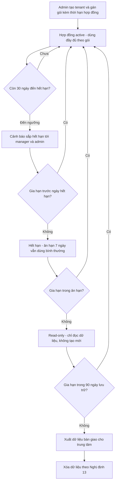
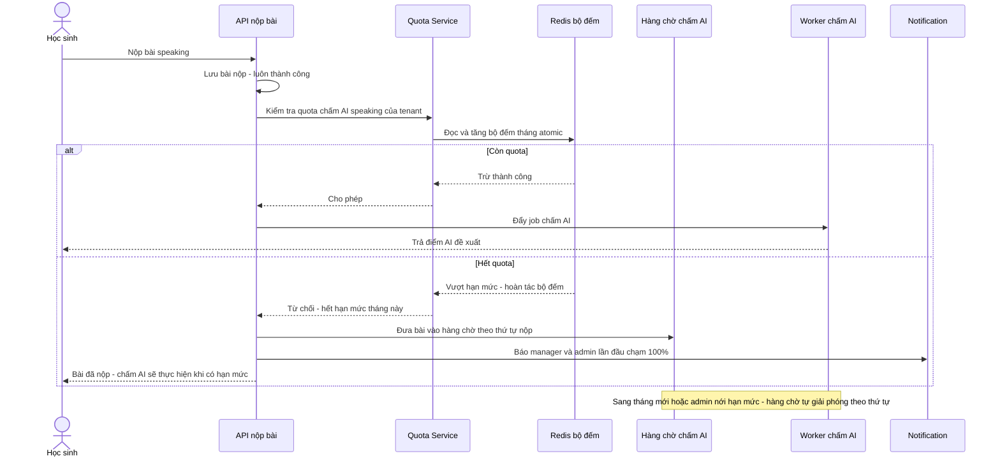
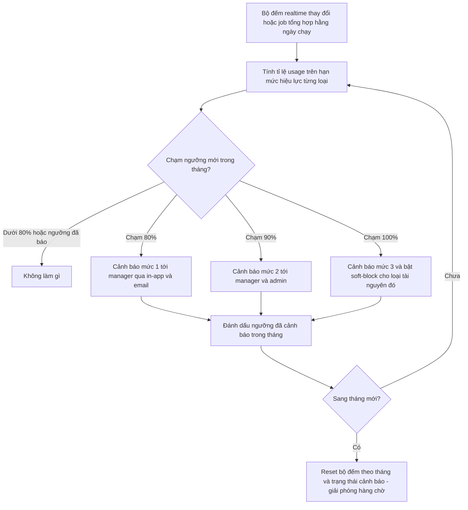

# SRS — Gói dịch vụ & hạn mức

**Mã module:** `PLAN` (dùng trong mã FR: `FR-PLAN-xx`)
**Trạng thái:** 🟢 Đã chốt
**Phụ thuộc:** [Phân quyền](../02-phan-quyen/srs-phan-quyen.md) (kiểm tra vai trò), [Tổ chức & người dùng](../03-to-chuc-nguoi-dung/srs-to-chuc-nguoi-dung.md) (tenant, học sinh), [Chấm bài](../08-cham-bai/srs-cham-bai.md) (lượt chấm AI), [Thông báo](../11-thong-bao/srs-thong-bao.md) (kênh ZNS/SMS, gửi cảnh báo), [Nội dung](../10-noi-dung/srs-noi-dung.md) (content package kho global), [Multi-tenant](../01-kien-truc/02-multi-tenant.md), [Lưu trữ file](../01-kien-truc/04-luu-tru-file.md)

## 1. Mục đích

Module Gói dịch vụ & hạn mức là "van điều tiết" thương mại của nền tảng: định nghĩa các gói dịch vụ (plan) với hạn mức (quota) và tính năng đi kèm, gán gói cho từng tenant theo hợp đồng ký thủ công, đo lường mức sử dụng thực tế (metering) và xử lý khi vượt hạn mức hoặc hết hạn hợp đồng. Với mô hình B2B tại thị trường VN — nơi độ nhạy giá rất cao và chi phí AI/ZNS/SMS là chi phí biến đổi lớn nhất — module này giúp Edmicro kiểm soát chi phí vận hành theo tenant, đồng thời cho trung tâm nhìn rõ mức dùng của mình để chủ động nâng gói. **Giá tiền không nằm trong hệ thống** — giá thuộc về hợp đồng ký ngoài; hệ thống chỉ quản lý gói, hạn mức và thời hạn.

## 2. Phạm vi

- **Trong phạm vi (v1):**
  - **Định nghĩa gói (plan):** admin platform CRUD gói — tên, mô tả, và các hạn mức: số học sinh active tối đa, dung lượng lưu trữ (GB), lượt chấm AI/tháng (tách riêng speaking và writing), số lớp tối đa (0 = không giới hạn), kênh thông báo được bật (Zalo ZNS, SMS — kèm số lượt/tháng), danh sách content package kho global được truy cập, tính năng bật/tắt theo gói (feature flags: gamification, lịch học & điểm danh, xuất báo cáo phụ huynh…).
  - **Gán gói cho tenant:** gán gói + thời hạn hợp đồng (từ ngày – đến ngày) + override hạn mức riêng cho hợp đồng đặc thù; gia hạn; đổi gói giữa chừng (hạn mức mới áp dụng ngay, usage đã dùng trong tháng giữ nguyên).
  - **Metering:** đếm usage theo tenant + theo tháng — học sinh active (đăng nhập hoặc có hoạt động trong tháng), GB lưu trữ hiện tại, lượt chấm AI đã dùng (speaking/writing), lượt ZNS/SMS đã gửi. Job tổng hợp hằng ngày cho chỉ số rẻ + bộ đếm realtime cho tài nguyên đắt (chấm AI, ZNS/SMS).
  - **Cảnh báo & xử lý vượt hạn mức:** cảnh báo ở ngưỡng 80% / 90% / 100% (thông báo manager + admin). Khi vượt: **soft-block** — không cho tạo mới tài nguyên vượt hạn mức (thêm học sinh, upload file; bài gửi chấm AI xếp hàng chờ sang tháng hoặc admin nới hạn mức). **Không bao giờ** khóa đọc dữ liệu hoặc chặn học sinh đang làm bài giữa chừng.
  - **Hết hạn hợp đồng:** ân hạn 7 ngày dùng bình thường → chuyển read-only → giữ dữ liệu 90 ngày → xuất dữ liệu bàn giao + xóa theo Nghị định 13/2023/NĐ-CP.
  - **Trang usage:** dashboard cho owner (mức dùng so hạn mức từng loại, lịch sử theo tháng; it_admin xem được); trang cho admin (usage mọi tenant, danh sách tenant sắp chạm trần để chủ động upsell).
  - **Audit:** mọi thay đổi gói / hạn mức / override / nới hạn mức ghi audit log.
- **Ngoài phạm vi (để v2 / không làm):**
  - Thanh toán online (cổng thanh toán, thẻ, ví).
  - Tự nâng cấp gói self-service từ phía tenant.
  - Hóa đơn điện tử.
  - Dùng thử tự động (trial signup) — v1 tenant chỉ do admin tạo tay theo hợp đồng.
  - Quản lý giá tiền, chiết khấu, công nợ — nằm ngoài hệ thống.

### Gợi ý 3 gói mẫu (số liệu tham khảo, chốt theo kinh doanh)

| Hạn mức / tính năng | Cơ bản | Chuẩn | Nâng cao |
|---|---|---|---|
| Học sinh active tối đa | 200 | 500 | 1.500 |
| Lưu trữ | 20 GB | 100 GB | 500 GB |
| Chấm AI speaking / tháng | 1.000 | 4.000 | 15.000 |
| Chấm AI writing / tháng | 1.000 | 4.000 | 15.000 |
| Số lớp tối đa | 20 | 60 | 0 (không giới hạn) |
| Zalo ZNS / tháng | — | 2.000 | 10.000 |
| SMS / tháng | — | 500 | 2.000 |
| Content package kho global | Bộ nền tảng | Nền tảng + IELTS + TOEIC | Toàn bộ kho |
| Gamification | ✔ | ✔ | ✔ |
| Lịch học & điểm danh | ✖ | ✔ | ✔ |
| Xuất báo cáo phụ huynh | ✖ | ✔ | ✔ |

> Không có cột giá — giá nằm trong hợp đồng ký giữa Edmicro và trung tâm.

## 3. Vai trò liên quan

| Vai trò | Tương tác với module này |
|---|---|
| Admin hệ thống (`admin`) | CRUD gói; gán gói / gia hạn / đổi gói / override hạn mức cho tenant; nới hạn mức tạm thời; xem usage mọi tenant, tenant sắp chạm trần; nhận cảnh báo 90%/100% |
| Nhân viên nội dung (`content_editor`) | Gián tiếp: content package do content_editor xuất bản là đơn vị được tham chiếu trong định nghĩa gói; không thao tác trực tiếp module này |
| Nhân viên support (`support_agent`) | Tra cứu (chỉ đọc) gói, hạn mức, usage và hàng chờ chấm AI của tenant để trả lời ticket |
| Chủ trung tâm (`owner`) | Xem dashboard usage của tenant mình so với hạn mức, lịch sử theo tháng; nhận cảnh báo 80%/90%/100%, cảnh báo sắp hết hạn hợp đồng; xem hàng chờ chấm AI |
| IT trung tâm (`it_admin`) | Xem usage tenant (read-only) |
| Giáo viên (`teacher`) | Bị ảnh hưởng gián tiếp: thấy trạng thái "chờ hạn mức" trên bài chấm AI của lớp mình; thấy thông báo thân thiện khi thao tác bị soft-block |
| Trợ giảng (`assistant`) | Bị ảnh hưởng gián tiếp như giáo viên trong phạm vi lớp được gán |
| Học sinh (`student`) | Không thấy khái niệm gói/quota; được bảo vệ tuyệt đối — bài đang làm không bao giờ bị chặn giữa chừng; khi hết quota chấm AI, bài vẫn nộp được và hiển thị "đang chờ chấm" |

## 4. User stories

- `US-PLAN-01` — Là **admin**, tôi muốn **định nghĩa sẵn các gói dịch vụ với hạn mức và tính năng chuẩn** để **gán nhanh cho tenant mới thay vì cấu hình tay từng hạn mức**.
- `US-PLAN-02` — Là **admin**, tôi muốn **gán gói kèm thời hạn hợp đồng và override hạn mức riêng** để **đáp ứng hợp đồng đặc thù mà không phải tạo gói mới cho từng khách**.
- `US-PLAN-03` — Là **admin**, tôi muốn **thấy danh sách tenant sắp chạm trần hạn mức** để **chủ động liên hệ upsell trước khi khách bị soft-block**.
- `US-PLAN-04` — Là **admin**, tôi muốn **nới hạn mức tạm thời cho tenant** để **giải phóng hàng chờ chấm AI trong lúc chờ ký phụ lục hợp đồng**.
- `US-PLAN-05` — Là **manager**, tôi muốn **xem mức dùng so với hạn mức từng loại và lịch sử theo tháng** để **dự trù nâng gói trước khi trung tâm phát triển vượt gói hiện tại**.
- `US-PLAN-06` — Là **manager**, tôi muốn **nhận cảnh báo khi chạm 80%/90%/100% hạn mức** để **không bị bất ngờ khi tính năng bị giới hạn**.
- `US-PLAN-07` — Là **teacher**, tôi muốn **biết bài speaking/writing của lớp đang chờ hạn mức chấm AI** để **giải thích cho học sinh và chấm tay nếu gấp**.
- `US-PLAN-08` — Là **student**, tôi muốn **bài đang làm và bài đã nộp luôn an toàn kể cả khi trung tâm hết quota** để **không mất công sức làm bài**.
- `US-PLAN-09` — Là **support_agent**, tôi muốn **tra cứu gói và usage của tenant khi xử lý ticket** để **trả lời chính xác vì sao người dùng bị giới hạn tính năng**.

## 5. Luồng hoạt động

### 5.1 Vòng đời hợp đồng tenant

**Mô tả các bước:**

1. Admin tạo tenant, gán gói + từ ngày – đến ngày (+ override nếu có). Tenant chuyển `active`.
2. Trước hết hạn 30 ngày (và nhắc lại ở 7 ngày, 1 ngày), hệ thống gửi cảnh báo tới manager của tenant và admin platform.
3. Gia hạn ở bất kỳ thời điểm nào (kể cả trong ân hạn / read-only / lưu trữ) đưa tenant về `active` ngay lập tức, dữ liệu nguyên vẹn.
4. Hết hạn: 7 ngày ân hạn dùng bình thường (banner nhắc trong app cho manager). Hết ân hạn: chuyển `read_only` — mọi vai trò chỉ đọc, không tạo mới/sửa; học sinh vẫn xem được kết quả cũ.
5. Sau 90 ngày ở `read_only` không gia hạn: hệ thống xuất toàn bộ dữ liệu bàn giao (theo quy trình NĐ13), sau đó xóa dữ liệu tenant và ghi biên bản xóa vào audit log.

**Ngoại lệ:** đổi gói giữa chừng không ảnh hưởng vòng đời — chỉ thay bộ hạn mức hiệu lực (áp dụng ngay), usage đã dùng trong tháng giữ nguyên; nếu usage hiện tại đã vượt hạn mức gói mới thì rơi vào soft-block như luồng 5.3.

### 5.2 Kiểm tra quota khi tiêu thụ tài nguyên đắt (chấm AI)

**Mô tả các bước:**

1. Bài nộp **luôn được lưu thành công trước** — kiểm tra quota chỉ quyết định việc chấm AI, không bao giờ chặn việc nộp.
2. Quota Service tăng bộ đếm tháng trên Redis bằng thao tác atomic (tránh race khi nhiều bài nộp cùng lúc); nếu kết quả vượt hạn mức hiệu lực (gói + override + nới tạm thời) thì hoàn tác và từ chối.
3. Hết quota: bài vào hàng chờ (FIFO theo thời điểm nộp); học sinh thấy trạng thái "đang chờ chấm", giáo viên thấy nhãn "chờ hạn mức" và vẫn có thể chấm tay.
4. Hàng chờ tự giải phóng khi: (a) sang tháng mới bộ đếm reset, hoặc (b) admin nới hạn mức tạm thời. Worker xử lý hàng chờ trước bài mới.
5. Luồng gửi ZNS/SMS áp dụng cơ chế kiểm tra tương tự; khi hết quota kênh đắt, thông báo tự hạ cấp về kênh in-app (không mất thông báo).

**Trường hợp lỗi:** nếu Quota Service / Redis không phản hồi, hành vi mặc định đề xuất là fail-open (cho chấm, ghi log để đối soát) — xem Câu hỏi mở #3.

### 5.3 Cảnh báo ngưỡng 80% / 90% / 100%

**Mô tả các bước:**

1. Ngưỡng tính riêng cho **từng loại hạn mức** (học sinh active, lưu trữ, chấm AI speaking, chấm AI writing, ZNS, SMS, số lớp) trên hạn mức hiệu lực (gói + override).
2. Mỗi ngưỡng của mỗi loại chỉ cảnh báo **1 lần/tháng** (chống spam); admin chỉ nhận từ mức 90% trở lên để tập trung tenant cần upsell.
3. Chạm 100%: soft-block đúng loại tài nguyên đó — thêm học sinh mới bị chặn kèm thông báo rõ lý do, upload file mới bị chặn, bài chấm AI vào hàng chờ (luồng 5.2). Tuyệt đối không khóa đọc, không ảnh hưởng bài đang làm dở, không chặn nộp bài.
4. Hạn mức không theo tháng (học sinh active, lưu trữ, số lớp) không reset đầu tháng — soft-block gỡ khi usage giảm (xóa bớt file, học sinh chuyển trạng thái) hoặc hạn mức tăng (nâng gói/override/nới).

## 6. Yêu cầu chức năng

| Mã | Yêu cầu | Vai trò | Ưu tiên |
|---|---|---|---|
| FR-PLAN-01 | CRUD định nghĩa gói: tên, mô tả, trạng thái (active/archived); gói đang được tenant sử dụng không xóa cứng, chỉ archive | admin | Must |
| FR-PLAN-02 | Gói khai báo đủ bộ hạn mức: học sinh active tối đa, lưu trữ (GB), lượt chấm AI/tháng tách speaking và writing, số lớp tối đa (0 = không giới hạn), lượt ZNS/tháng, lượt SMS/tháng | admin | Must |
| FR-PLAN-03 | Gói khai báo danh sách content package kho global được truy cập; tenant chỉ thấy nội dung global thuộc gói của mình | admin | Must |
| FR-PLAN-04 | Gói khai báo feature flags bật/tắt tính năng: gamification, lịch học & điểm danh, xuất báo cáo phụ huynh… — API và UI ẩn/chặn tính năng ngoài gói | admin | Must |
| FR-PLAN-05 | Gán gói cho tenant kèm thời hạn hợp đồng (từ ngày – đến ngày); một tenant tại một thời điểm chỉ có một gói hiệu lực | admin | Must |
| FR-PLAN-06 | Override từng hạn mức riêng cho tenant (cao hơn hoặc thấp hơn gói) cho hợp đồng đặc thù; hạn mức hiệu lực = gói + override | admin | Must |
| FR-PLAN-07 | Gia hạn hợp đồng (cập nhật ngày hết hạn) tại mọi trạng thái: active, ân hạn, read-only, lưu trữ — gia hạn đưa tenant về active ngay | admin | Must |
| FR-PLAN-08 | Đổi gói giữa chừng: hạn mức và feature flags mới áp dụng ngay; usage đã dùng trong tháng giữ nguyên, không hoàn/cộng lượt | admin | Must |
| FR-PLAN-09 | Job tổng hợp hằng ngày: đếm học sinh active trong tháng (đăng nhập hoặc có hoạt động), dung lượng lưu trữ hiện tại, số lớp; lưu snapshot theo ngày | hệ thống | Must |
| FR-PLAN-10 | Bộ đếm realtime (atomic) cho tài nguyên đắt: lượt chấm AI speaking/writing, lượt ZNS/SMS — kiểm tra và trừ ngay tại thời điểm tiêu thụ | hệ thống | Must |
| FR-PLAN-11 | Kiểm tra quota trước khi tiêu thụ tài nguyên: chặn tạo mới khi vượt (thêm học sinh, upload file, tạo lớp); bài chấm AI hết quota vào hàng chờ FIFO, tự giải phóng khi sang tháng hoặc được nới hạn mức | hệ thống | Must |
| FR-PLAN-12 | Nguyên tắc soft-block bất khả xâm phạm: không bao giờ khóa đọc dữ liệu, không chặn học sinh đang làm bài giữa chừng, không chặn nộp bài | hệ thống | Must |
| FR-PLAN-13 | Cảnh báo ngưỡng 80%/90%/100% theo từng loại hạn mức: 80% báo owner; 90% và 100% báo cả owner và admin; mỗi ngưỡng mỗi loại tối đa 1 lần/tháng | hệ thống | Must |
| FR-PLAN-14 | Xử lý hết hạn hợp đồng: cảnh báo trước 30/7/1 ngày; ân hạn 7 ngày dùng bình thường; sau ân hạn chuyển read-only; giữ dữ liệu 90 ngày rồi xuất bàn giao + xóa theo NĐ13 | hệ thống, admin | Must |
| FR-PLAN-15 | Dashboard usage cho manager: mức dùng so hạn mức từng loại (thanh tiến độ + phần trăm), lịch sử usage theo tháng, trạng thái hợp đồng và ngày hết hạn | manager | Must |
| FR-PLAN-16 | Trang usage platform cho admin: bảng usage mọi tenant, lọc/sắp xếp theo phần trăm sử dụng, danh sách tenant sắp chạm trần (≥ 80% bất kỳ hạn mức nào) để upsell | admin | Must |
| FR-PLAN-17 | Ghi audit log bất biến cho mọi thay đổi: tạo/sửa/archive gói, gán/đổi gói, gia hạn, override, nới hạn mức tạm thời — ai, làm gì, giá trị trước/sau, lúc nào | admin, hệ thống | Must |
| FR-PLAN-18 | Admin nới hạn mức tạm thời (grant thêm lượt trong tháng) để giải phóng hàng chờ chấm AI trong lúc chờ phụ lục hợp đồng; có ghi audit | admin | Should |
| FR-PLAN-19 | Support_agent tra cứu chỉ đọc gói, hạn mức hiệu lực, usage và hàng chờ chấm AI của tenant khi xử lý ticket | support_agent | Should |
| FR-PLAN-20 | Thông báo thân thiện khi bị soft-block: người dùng cuối (teacher/assistant/manager) thấy lý do rõ ràng và hướng xử lý ("liên hệ quản lý trung tâm") thay vì lỗi kỹ thuật; student không thấy khái niệm quota | teacher, assistant, manager, student | Should |
| FR-PLAN-21 | Teacher/manager xem danh sách bài chấm AI đang chờ hạn mức của lớp/tenant, kèm vị trí trong hàng chờ; giáo viên có thể chấm tay bài đang chờ | teacher, manager | Should |
| FR-PLAN-22 | Job đối soát hằng đêm: tính lại usage từ dữ liệu gốc trong Postgres và điều chỉnh bộ đếm Redis nếu lệch; ghi log chênh lệch | hệ thống | Should |
| FR-PLAN-23 | Xuất lịch sử usage theo tháng ra CSV/Excel (manager xuất của tenant mình, admin xuất mọi tenant) | manager, admin | Could |

## 7. Yêu cầu phi chức năng (riêng module)

Phần chung xem [Yêu cầu phi chức năng](../01-kien-truc/06-yeu-cau-phi-chuc-nang.md). Riêng module này:

- **Độ trễ kiểm tra quota:** check + trừ quota cho tài nguyên đắt ≤ 50ms p95 (bộ đếm Redis, key `t:<tenant_id>:usage:<loại>:<yyyymm>`), không được làm chậm đường nộp bài của học sinh.
- **Atomic, không race:** trừ quota dùng thao tác atomic (INCRBY + so sánh); nhiều bài nộp đồng thời không được vượt trần quá 1 đơn vị sai số tức thời.
- **Độ chính xác metering:** chênh lệch giữa bộ đếm realtime và số liệu đối soát từ Postgres ≤ 1%; đối soát hằng đêm tự sửa lệch (FR-PLAN-22). Số liệu hiển thị cho khách lấy theo bản đối soát.
- **Fail-safe:** khi hệ thống đếm quota gặp sự cố, mặc định đề xuất **fail-open** (cho tiêu thụ, ghi log, đối soát bù sau) — ưu tiên trải nghiệm học tập hơn chặn nhầm; chờ chốt ở Câu hỏi mở #3.
- **Tách bạch giá:** hệ thống không lưu, không hiển thị bất kỳ số liệu giá tiền nào của gói/hợp đồng (độ nhạy giá thị trường VN cao, giá thỏa thuận riêng từng khách).
- **Audit bất biến:** bản ghi audit của module không sửa/xóa được kể cả bởi admin.
- **Bảng platform:** `plans`, `tenant_plans` là bảng cấp platform (không có `tenant_id`, không thuộc RLS) — theo [Multi-tenant](../01-kien-truc/02-multi-tenant.md); manager chỉ đọc được gói/usage của tenant mình qua API có kiểm soát.
- **Xóa dữ liệu hết hạn:** quy trình xuất + xóa sau 90 ngày tuân thủ Nghị định 13/2023/NĐ-CP, có checklist và biên bản trong audit log.

## 8. Màn hình chính

| Màn hình | Vai trò dùng | Mockup |
|---|---|---|
| Quản lý gói dịch vụ (ops) — danh sách, tạo/sửa gói, hạn mức, feature flags, content package | admin | _sẽ bổ sung_ |
| Chi tiết tenant — tab Gói & hợp đồng: gán/đổi gói, gia hạn, override hạn mức, nới tạm thời | admin | _sẽ bổ sung_ |
| Usage toàn platform — bảng mọi tenant, lọc sắp chạm trần, drill-down từng tenant | admin | _sẽ bổ sung_ |
| Dashboard usage trung tâm — mức dùng so hạn mức từng loại, lịch sử theo tháng, trạng thái hợp đồng | manager | _sẽ bổ sung_ |
| Hàng chờ chấm AI — bài đang chờ hạn mức, vị trí hàng chờ, nút chấm tay | teacher, manager | _sẽ bổ sung_ |
| Banner/hộp thoại soft-block & cảnh báo ngưỡng, banner ân hạn hết hạn hợp đồng | manager, teacher, assistant | _sẽ bổ sung_ |
| Tra cứu gói & usage tenant (trong màn hình ticket) | support_agent | _sẽ bổ sung_ |

## 9. API sơ bộ

| Method | Path | Mô tả | Quyền |
|---|---|---|---|
| GET | `/api/v1/plans` | Danh sách gói | admin |
| POST | `/api/v1/plans` | Tạo gói mới | admin |
| GET | `/api/v1/plans/{plan_id}` | Chi tiết gói (hạn mức, feature flags, content packages) | admin |
| PATCH | `/api/v1/plans/{plan_id}` | Sửa gói | admin |
| DELETE | `/api/v1/plans/{plan_id}` | Archive gói (không xóa cứng nếu đang có tenant dùng) | admin |
| GET | `/api/v1/plans/tenants/{tenant_id}` | Gói + hợp đồng + override + hạn mức hiệu lực của tenant | admin, support_agent (đọc) |
| POST | `/api/v1/plans/tenants/{tenant_id}/assign` | Gán gói / đổi gói + thời hạn hợp đồng | admin |
| POST | `/api/v1/plans/tenants/{tenant_id}/renew` | Gia hạn hợp đồng | admin |
| PUT | `/api/v1/plans/tenants/{tenant_id}/overrides` | Cập nhật override hạn mức | admin |
| POST | `/api/v1/plans/tenants/{tenant_id}/grants` | Nới hạn mức tạm thời trong tháng (giải phóng hàng chờ) | admin |
| GET | `/api/v1/plans/me` | Gói, hạn mức hiệu lực, trạng thái hợp đồng của tenant mình | manager |
| GET | `/api/v1/usage/me` | Usage tháng hiện tại so hạn mức từng loại | manager |
| GET | `/api/v1/usage/me/history` | Lịch sử usage theo tháng (query `?months=12`) | manager |
| GET | `/api/v1/usage/me/ai-queue` | Hàng chờ chấm AI đang giữ vì hết hạn mức | manager, teacher (lớp mình) |
| GET | `/api/v1/usage/tenants` | Usage mọi tenant, lọc `?near_limit=true` (≥ 80%) | admin |
| GET | `/api/v1/usage/tenants/{tenant_id}` | Usage chi tiết 1 tenant + lịch sử | admin, support_agent (đọc) |
| POST | `/api/v1/usage/internal/consume` | Nội bộ service-to-service: check + trừ quota atomic (loại, số lượng) — không public | internal |

## 10. Entity liên quan

Chi tiết thuộc tính xem [ERD](../16-du-lieu/01-erd.md) và [Từ điển dữ liệu](../16-du-lieu/02-tu-dien-du-lieu.md).

- **Plan** (`plans`) — định nghĩa gói: tên, mô tả, bộ hạn mức, feature flags, trạng thái. Bảng platform, không RLS.
- **PlanContentPackage** (`plan_content_packages`) — gói ↔ content package kho global được truy cập.
- **TenantPlan** (`tenant_plans`) — hợp đồng: tenant, gói, từ ngày – đến ngày, trạng thái vòng đời (active / grace / read_only / archived / purged), lịch sử gia hạn/đổi gói. Bảng platform.
- **TenantPlanOverride** (`tenant_plan_overrides`) — override từng hạn mức riêng theo tenant + grant nới tạm thời theo tháng.
- **UsageCounter** (`usage_counters`) — bộ đếm theo tenant × tháng × loại hạn mức (nguồn realtime ở Redis, chốt về Postgres).
- **UsageDailySnapshot** (`usage_daily_snapshots`) — snapshot hằng ngày phục vụ biểu đồ lịch sử và đối soát.
- **QuotaAlert** (`quota_alerts`) — ngưỡng đã cảnh báo trong tháng theo tenant × loại × mức (chống lặp).
- **AIGradingHold** (`ai_grading_holds`) — hàng chờ bài chấm AI bị giữ vì hết hạn mức (FIFO).
- **AuditLog** (`audit_logs`) — dùng chung, ghi mọi thay đổi gói/hạn mức/override/nới.

## 11. Câu hỏi mở cần chốt

| # | Câu hỏi | Quyết định | Ngày chốt |
|---|---|---|---|
| 1 | Định nghĩa "học sinh active": đăng nhập hoặc có hoạt động trong tháng — học sinh được thêm vào lớp nhưng chưa từng đăng nhập có tính vào hạn mức không? | **Chốt:** Tính vào hạn mức ngay khi tạo (nhất quán với SRS ORG: tài khoản mới tạo đã tính quota) | 2026-07-16 |
| 2 | Bài chấm AI trong hàng chờ khi sang tháng mới: tự động chấm và trừ quota tháng mới, hay cần manager xác nhận để tránh tiêu quota tháng mới ngoài ý muốn? | **Chốt:** Tự động chấm và trừ quota tháng mới + thông báo manager; manager tắt được cơ chế tự động này | 2026-07-16 |
| 3 | Khi hệ thống đếm quota (Redis) gặp sự cố: fail-open (cho chấm, đối soát bù — rủi ro vượt chi phí AI) hay fail-closed (xếp hàng chờ — rủi ro trải nghiệm)? | **Chốt:** Fail-open có trần an toàn: cho chấm tối đa vượt 5% hạn mức, đối soát bù sau | 2026-07-16 |
| 4 | Đổi xuống gói thấp hơn khi usage hiện tại đã vượt hạn mức gói mới (VD đang 400 học sinh active, gói mới trần 200): soft-block ngay hay cho ân hạn điều chỉnh 30 ngày? | **Chốt:** Ân hạn 30 ngày điều chỉnh, sau đó soft-block | 2026-07-16 |

## Lịch sử thay đổi

| Ngày | Thay đổi | Người |
|---|---|---|
| 2026-07-16 | Tạo bản nháp đầu tiên | Claude |
| 2026-07-16 | Chốt toàn bộ câu hỏi mở (quyết định ghi trong bảng), chuyển trạng thái Đã chốt | Chủ sản phẩm |
| 2026-07-16 | Trang usage tenant + cảnh báo quota chuyển từ manager sang `owner` (quyền trung tâm); it_admin vẫn xem usage — chi tiết ma trận ở SRS Phân quyền | Chủ sản phẩm |
| 2026-07-17 | Trang usage + cảnh báo quota gán owner (it_admin read-only) trong thân doc | Chủ sản phẩm + Claude |
