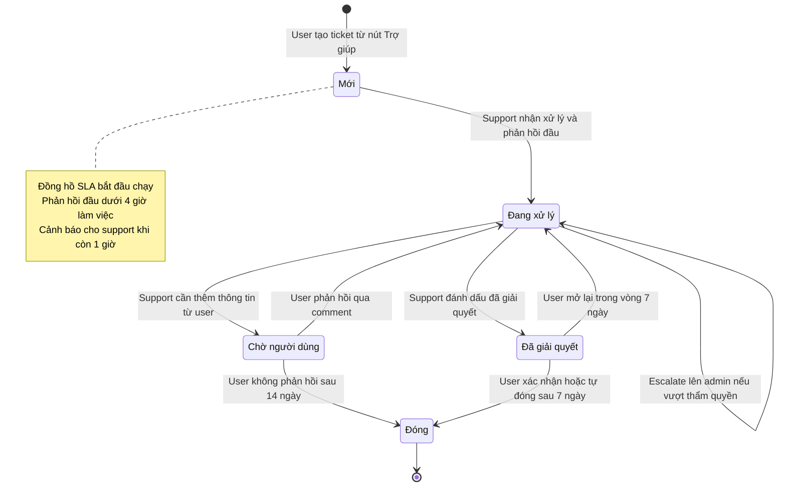
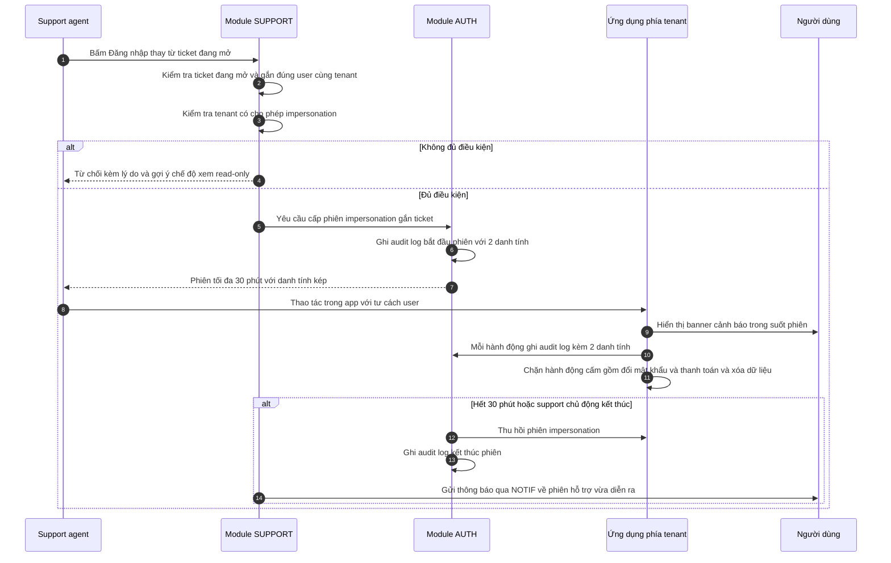
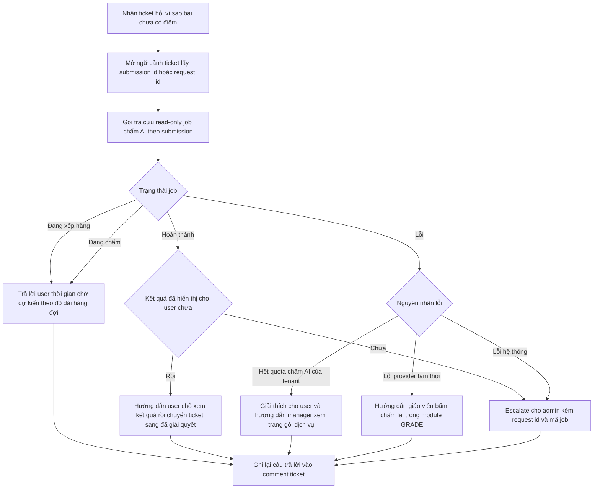

# SRS — Hỗ trợ

**Mã module:** `SUPPORT` (dùng trong mã FR: `FR-SUPPORT-xx`)
**Trạng thái:** 🟢 Đã chốt
**Phụ thuộc:** [Phân quyền](../02-phan-quyen/srs-phan-quyen.md) (phiên đăng nhập, phiên impersonation), [Thông báo](../11-thong-bao/srs-thong-bao.md) (gửi thông báo ticket/impersonation, tra cứu trạng thái gửi), [Chấm bài](../08-cham-bai/srs-cham-bai.md) (tra cứu job chấm AI), [Gói dịch vụ](../14-goi-dich-vu/srs-goi-dich-vu.md) (tra cứu gói + quota), [Tổ chức](../03-to-chuc-nguoi-dung/srs-to-chuc-nguoi-dung.md) (thông tin tenant/user), [Bảo mật](../01-kien-truc/03-bao-mat.md) (audit log, ràng buộc impersonation), [Multi-tenant](../01-kien-truc/02-multi-tenant.md) (truy cập xuyên tenant có kiểm soát)

## 1. Mục đích

Module Hỗ trợ là kênh chính thức để người dùng của trung tâm (manager/it_admin/teacher/assistant/student) gửi yêu cầu hỗ trợ và để đội CSKH Edmicro (`support_agent`) xử lý nhanh, có ngữ cảnh đầy đủ. Module cung cấp ba năng lực cốt lõi: hệ thống ticket kèm ngữ cảnh tự động, đăng nhập thay (impersonation) được kiểm soát chặt để tái hiện lỗi, và bộ tra cứu vận hành read-only đủ để trả lời ~80% câu hỏi mà không cần đụng vào tài khoản người dùng. Mục tiêu: giảm thời gian giải quyết, đồng thời giữ nguyên tắc bảo mật và cách ly tenant đã cam kết ở tài liệu kiến trúc.

## 2. Phạm vi

- **Trong phạm vi (v1):**
  - **Ticket:** người dùng tenant tạo ticket từ trong app (nút Trợ giúp): tiêu đề, mô tả, loại (lỗi / hỏi đáp / yêu cầu tính năng / dữ liệu), đính kèm ảnh chụp màn hình; hệ thống **tự động** đính kèm ngữ cảnh: tenant, user, vai trò, URL trang hiện tại, trình duyệt/OS, request-id của lỗi gần nhất (nếu có).
  - **Hàng đợi support:** `support_agent` xem hàng đợi (lọc theo trạng thái/loại/tenant/ưu tiên), nhận xử lý (assign); vòng đời trạng thái: mới → đang xử lý → chờ người dùng → đã giải quyết → đóng; trao đổi qua comment trong ticket (user nhận thông báo qua NOTIF); SLA nội bộ: phản hồi đầu < 4h làm việc, hiển thị đồng hồ SLA trên ticket; escalate lên `admin`.
  - **Impersonation (đăng nhập thay):** chỉ khi có ticket đang mở gắn với user/tenant; phiên tối đa 30 phút tự hết hạn; banner cảnh báo cho user trong phiên + thông báo sau phiên; audit log gắn cả 2 danh tính; chặn các hành động cấm; manager tắt được impersonation cho tenant mình.
  - **Tra cứu vận hành (read-only):** trạng thái job chấm AI của một submission, trạng thái gửi thông báo (đã gửi ZNS chưa, lỗi gì), thông tin tenant + gói + quota.
  - **FAQ / hướng dẫn:** trang tĩnh markdown do platform quản lý, danh mục bài theo vai trò, tìm kiếm đơn giản; gợi ý bài liên quan khi user tạo ticket (theo từ khóa) — Should.
  - **Báo cáo support** cho `admin`: số ticket theo tuần/loại/tenant, thời gian giải quyết trung bình, tỉ lệ đạt SLA.
- **Ngoài phạm vi (để v2 / không làm):**
  - Live chat realtime.
  - Chatbot AI trả lời tự động.
  - Tích hợp tổng đài (call center).

## 3. Vai trò liên quan

| Vai trò | Tương tác với module này |
|---|---|
| Học sinh (`student`) | Tạo ticket từ nút Trợ giúp, trao đổi comment, xem FAQ, nhận thông báo khi bị impersonate |
| Giáo viên (`teacher`) | Như học sinh; thường gửi ticket về chấm AI, giao bài, nội dung |
| Trợ giảng (`assistant`) | Như học sinh; ticket về điểm danh, quyền được ủy quyền |
| Chủ trung tâm (`owner`) | Tạo ticket; xem toàn bộ ticket của tenant mình; **bật/tắt cho phép impersonation** với tenant mình |
| Nhân viên quản lý (`manager`) | Tạo ticket; xem toàn bộ ticket của tenant mình |
| Admin hệ thống (`admin`) | Nhận escalation; xem báo cáo support; quản lý bài FAQ; giám sát audit log impersonation |
| Nhân viên nội dung (`content_editor`) | Không dùng trực tiếp; có thể được gán ticket loại nội dung qua escalation của admin (v1: chỉ nhận thông tin, không thao tác trong module) |
| Nhân viên support (`support_agent`) | **Người dùng chính:** xử lý hàng đợi ticket, comment, đổi trạng thái, escalate, impersonation, tra cứu vận hành |

## 4. User stories

- `US-SUPPORT-01` — Là **học sinh**, tôi muốn **bấm nút Trợ giúp và gửi ticket kèm ảnh chụp màn hình ngay tại trang đang lỗi** để **không phải mô tả dài dòng mình đang ở đâu, làm gì**.
- `US-SUPPORT-02` — Là **giáo viên**, tôi muốn **biết ticket của mình đang ở trạng thái nào và nhận thông báo khi support trả lời** để **không phải hỏi lại qua Zalo**.
- `US-SUPPORT-03` — Là **nhân viên support**, tôi muốn **hàng đợi ticket có sẵn ngữ cảnh (tenant, user, vai trò, URL, trình duyệt, request-id lỗi)** để **chẩn đoán nhanh mà không cần hỏi đi hỏi lại**.
- `US-SUPPORT-04` — Là **nhân viên support**, tôi muốn **tra cứu trạng thái job chấm AI của một submission** để **trả lời câu hỏi "sao bài của em chưa có điểm" mà không cần đăng nhập thay**.
- `US-SUPPORT-05` — Là **nhân viên support**, tôi muốn **đăng nhập thay user trong tối đa 30 phút, gắn với ticket đang mở** để **tái hiện đúng lỗi user gặp, và mọi thao tác đều được ghi audit**.
- `US-SUPPORT-06` — Là **chủ trung tâm (owner)**, tôi muốn **tắt cho phép impersonation với trung tâm của tôi** để **kiểm soát việc người ngoài thao tác trên dữ liệu trung tâm** (khi tắt, support chỉ xem read-only).
- `US-SUPPORT-07` — Là **học sinh**, tôi muốn **thấy banner cảnh báo khi support đang đăng nhập thay tôi và nhận thông báo sau đó** để **biết rõ ai đã truy cập tài khoản mình, lúc nào**.
- `US-SUPPORT-08` — Là **nhân viên support**, tôi muốn **thấy đồng hồ SLA trên từng ticket và cảnh báo khi sắp trễ** để **ưu tiên đúng ticket cần phản hồi trước**.
- `US-SUPPORT-09` — Là **admin hệ thống**, tôi muốn **xem báo cáo ticket theo tuần/loại/tenant, thời gian giải quyết trung bình và tỉ lệ đạt SLA** để **đánh giá chất lượng CSKH và phát hiện tenant/tính năng có vấn đề lặp lại**.
- `US-SUPPORT-10` — Là **giáo viên**, tôi muốn **thấy gợi ý bài hướng dẫn liên quan ngay khi gõ tiêu đề ticket** để **tự giải quyết được mà không cần chờ support**.

## 5. Luồng hoạt động

### 5.1 Vòng đời ticket (kèm SLA)

Mô tả các bước:

1. User tạo ticket → trạng thái **Mới**, đồng hồ SLA phản hồi đầu (< 4h làm việc) bắt đầu. NOTIF xác nhận đã nhận ticket cho user.
2. `support_agent` nhận xử lý (assign cho mình hoặc được phân) và gửi phản hồi đầu tiên → **Đang xử lý**; SLA phản hồi đầu dừng tại thời điểm comment đầu tiên của support.
3. Nếu cần user cung cấp thêm thông tin → **Chờ người dùng** (đồng hồ SLA giải quyết tạm dừng trong thời gian chờ). User trả lời → quay lại **Đang xử lý**.
4. Support xử lý xong → **Đã giải quyết**. User có 7 ngày để xác nhận hoặc mở lại; hết 7 ngày không phản hồi → tự **Đóng**.
5. Escalate: ticket vượt thẩm quyền (lỗi hệ thống, yêu cầu đổi gói, xóa dữ liệu…) → gắn cờ escalate cho `admin`, ticket vẫn ở **Đang xử lý** với người xử lý mới.
6. Mọi thay đổi trạng thái và comment mới đều đẩy thông báo qua NOTIF cho bên liên quan.

Trường hợp lỗi/ngoại lệ:

- Upload ảnh đính kèm thất bại → vẫn cho gửi ticket, báo rõ ảnh nào chưa tải lên được.
- Không lấy được request-id lỗi gần nhất (không có lỗi trong phiên) → trường ngữ cảnh này để trống, không chặn tạo ticket.
- Ticket **Đóng** không mở lại được — user tạo ticket mới, hệ thống gợi ý liên kết tới ticket cũ.

### 5.2 Impersonation có kiểm soát

Mô tả các bước và ràng buộc (cam kết tại [Bảo mật §6](../01-kien-truc/03-bao-mat.md) và [Multi-tenant §4](../01-kien-truc/02-multi-tenant.md)):

1. Chỉ khởi tạo được **từ trang chi tiết ticket** đang mở (trạng thái khác Đóng) và chỉ impersonate đúng user/tenant gắn với ticket đó.
2. Điều kiện tiên quyết: tenant chưa tắt cho phép impersonation. Nếu tắt → hệ thống từ chối, support chỉ dùng được chế độ xem read-only (xem dữ liệu liên quan ticket, không thao tác).
3. Phiên impersonation **tối đa 30 phút, tự hết hạn**, support có thể kết thúc sớm. Không gia hạn — cần thêm thời gian thì mở phiên mới (vẫn ghi audit).
4. Trong phiên: user thấy **banner cảnh báo cố định** trong app; mọi hành động ghi audit log với **cả hai danh tính** (`support_agent` + user bị impersonate) kèm ticket-id.
5. Hành động bị **chặn cứng ở tầng API** trong phiên impersonation: đổi mật khẩu, xem/đổi thông tin thanh toán và gói dịch vụ, xóa dữ liệu (lớp, học sinh, bài nộp…). Gọi các endpoint này trả 403 và ghi audit.
6. Kết thúc phiên (hết hạn hoặc chủ động): thu hồi token ngay, ghi audit, gửi thông báo qua NOTIF cho user về thời gian, người thực hiện và ticket liên quan.

Trường hợp lỗi/ngoại lệ:

- Ticket chuyển sang Đóng trong lúc phiên đang chạy → phiên bị thu hồi ngay.
- Manager tắt impersonation giữa phiên → phiên đang chạy bị thu hồi ngay, ghi audit lý do.
- `support_agent` mất quyền (khóa tài khoản) → mọi phiên impersonation của người đó thu hồi ngay.

### 5.3 Tra cứu trạng thái job chấm AI để trả lời ticket

Mô tả: đây là luồng minh họa cho nguyên tắc **tra cứu trước — impersonate sau**. Support chỉ đọc trạng thái job (đang xếp hàng / đang chấm / hoàn thành / lỗi + mã lỗi), **không** xem nội dung bài làm của học sinh và **không** thao tác chạy lại job (việc chấm lại thuộc quyền giáo viên trong module GRADE). Luồng tương tự áp dụng cho tra cứu trạng thái gửi thông báo (đã gửi ZNS chưa, lỗi kênh nào) và tra cứu tenant + gói + quota.

## 6. Yêu cầu chức năng

| Mã | Yêu cầu | Vai trò | Ưu tiên |
|---|---|---|---|
| FR-SUPPORT-01 | Tạo ticket từ nút Trợ giúp trong app: tiêu đề, mô tả, loại (lỗi / hỏi đáp / yêu cầu tính năng / dữ liệu), đính kèm ảnh chụp màn hình (tối đa 5 ảnh) | mọi vai trò tenant (11 vai trò — kể cả owner, academic_head, parent) | Must |
| FR-SUPPORT-02 | Hệ thống tự động đính kèm ngữ cảnh vào ticket: tenant, user, vai trò, URL trang hiện tại, trình duyệt/OS, request-id của lỗi gần nhất (nếu có) | Hệ thống | Must |
| FR-SUPPORT-03 | Người tạo xem danh sách + chi tiết + trạng thái ticket của mình; manager xem toàn bộ ticket của tenant mình | mọi vai trò tenant | Must |
| FR-SUPPORT-04 | Trao đổi qua comment trong ticket (2 chiều, đính kèm được ảnh); mỗi comment mới và mỗi lần đổi trạng thái đẩy thông báo qua NOTIF | mọi vai trò tenant, support_agent | Must |
| FR-SUPPORT-05 | Hàng đợi ticket cho support: lọc theo trạng thái / loại / tenant / ưu tiên; sắp xếp theo thời gian SLA còn lại | support_agent | Must |
| FR-SUPPORT-06 | Nhận xử lý ticket (assign cho mình), chuyển giao cho support khác; đặt/đổi mức ưu tiên | support_agent | Must |
| FR-SUPPORT-07 | Chuyển trạng thái ticket theo đúng máy trạng thái: mới → đang xử lý → chờ người dùng → đã giải quyết → đóng (kèm các nhánh mở lại / tự đóng ở §5.1); không cho chuyển trạng thái ngoài luồng | support_agent | Must |
| FR-SUPPORT-08 | Đồng hồ SLA trên ticket: phản hồi đầu < 4h làm việc; hiển thị thời gian còn lại, cảnh báo khi còn 1h, đánh dấu trễ SLA; SLA tạm dừng khi ở trạng thái chờ người dùng | support_agent | Must |
| FR-SUPPORT-09 | Escalate ticket lên admin kèm ghi chú lý do; admin nhận thông báo qua NOTIF | support_agent, admin | Must |
| FR-SUPPORT-10 | Tự động đóng ticket đã giải quyết sau 7 ngày user không phản hồi; tự đóng ticket chờ người dùng sau 14 ngày không phản hồi (nhắc user trước 3 ngày qua NOTIF) | Hệ thống | Should |
| FR-SUPPORT-11 | Khởi tạo phiên impersonation **chỉ từ ticket đang mở** gắn đúng user/tenant; hệ thống kiểm tra điều kiện trước khi cấp phiên | support_agent | Must |
| FR-SUPPORT-12 | Phiên impersonation tối đa 30 phút, tự hết hạn, không gia hạn; support kết thúc sớm được; ticket đóng hoặc tenant tắt cho phép giữa chừng thì phiên bị thu hồi ngay | support_agent, Hệ thống | Must |
| FR-SUPPORT-13 | User bị impersonate thấy banner cảnh báo cố định trong app suốt phiên và nhận thông báo qua NOTIF sau khi phiên kết thúc (ai, lúc nào, ticket nào) | Hệ thống | Must |
| FR-SUPPORT-14 | Mọi hành động trong phiên impersonation ghi audit log bất biến gắn **cả 2 danh tính** (support_agent + user) kèm ticket-id | Hệ thống | Must |
| FR-SUPPORT-15 | Chặn cứng ở tầng API trong phiên impersonation: đổi mật khẩu, xem/đổi thông tin thanh toán và gói, xóa dữ liệu; vi phạm trả 403 và ghi audit | Hệ thống | Must |
| FR-SUPPORT-16 | Owner bật/tắt cho phép impersonation với tenant mình; khi tắt, support chỉ có chế độ xem read-only dữ liệu liên quan ticket; thay đổi cấu hình ghi audit | owner | Must |
| FR-SUPPORT-17 | Tra cứu read-only trạng thái job chấm AI của một submission: đang xếp hàng / đang chấm / hoàn thành / lỗi kèm mã lỗi — không xem nội dung bài làm | support_agent | Must |
| FR-SUPPORT-18 | Tra cứu read-only trạng thái gửi thông báo của một user/sự kiện: kênh nào đã gửi (in-app, email, ZNS), thời điểm, lỗi gửi nếu có | support_agent | Must |
| FR-SUPPORT-19 | Tra cứu read-only thông tin tenant: gói dịch vụ, hạn mức quota và mức dùng hiện tại (học sinh active, dung lượng, lượt chấm AI/tháng) | support_agent | Must |
| FR-SUPPORT-20 | Trang FAQ/hướng dẫn tĩnh (markdown) do platform quản lý: danh mục bài theo vai trò, tìm kiếm đơn giản theo từ khóa; người dùng tenant xem theo vai trò của mình | admin (quản lý), mọi vai trò tenant (xem) | Must |
| FR-SUPPORT-21 | Gợi ý bài FAQ liên quan theo từ khóa ngay khi user nhập tiêu đề/mô tả ticket, trước khi gửi | Hệ thống | Should |
| FR-SUPPORT-22 | Báo cáo support cho admin: số ticket theo tuần/loại/tenant, thời gian giải quyết trung bình, tỉ lệ đạt SLA phản hồi đầu; lọc theo khoảng thời gian | admin | Must |

## 7. Yêu cầu phi chức năng (riêng module)

Phần chung xem [Yêu cầu phi chức năng](../01-kien-truc/06-yeu-cau-phi-chuc-nang.md). Riêng module SUPPORT:

- **Bảo mật impersonation:** token phiên impersonation là loại token riêng (không phải access token thường), mang cả 2 danh tính + ticket-id + hạn 30 phút; kiểm tra hạn ở **mỗi request**; danh sách hành động cấm enforce ở tầng API (deny-by-default cho nhóm endpoint nhạy cảm), không dựa vào ẩn nút ở frontend.
- **Audit log:** mọi sự kiện impersonation (bắt đầu, từng hành động, kết thúc, bị từ chối) ghi vào audit log bất biến, lưu ≥ 2 năm theo [Bảo mật §6](../01-kien-truc/03-bao-mat.md).
- **Cách ly dữ liệu tra cứu:** các API tra cứu vận hành chỉ trả **metadata trạng thái**, không trả nội dung bài làm/nội dung thông báo cá nhân; truy cập xuyên tenant tuân theo [Multi-tenant §4](../01-kien-truc/02-multi-tenant.md) — set tenant context theo ticket, ghi audit.
- **Ngữ cảnh ticket:** thu thập ngữ cảnh (URL, trình duyệt/OS, request-id) thực hiện phía client tại thời điểm mở form; không thu thập thêm dữ liệu ngoài danh sách đã khai báo; ảnh chụp màn hình lưu theo prefix tenant trên object storage, phục vụ qua presigned URL.
- **Hiệu năng:** hàng đợi support tải < 2s với 10.000 ticket; tra cứu vận hành trả kết quả < 3s.
- **Tính sẵn sàng của nút Trợ giúp:** form tạo ticket phải hoạt động cả khi một phần app lỗi (bundle tách riêng, không phụ thuộc state của trang đang lỗi).

## 8. Màn hình chính

| Màn hình | Vai trò dùng | Mockup |
|---|---|---|
| Nút Trợ giúp + form tạo ticket (kèm gợi ý FAQ) | mọi vai trò tenant | _sẽ bổ sung_ |
| Danh sách ticket của tôi / của tenant | mọi vai trò tenant | _sẽ bổ sung_ |
| Chi tiết ticket phía user (trạng thái, comment) | mọi vai trò tenant | _sẽ bổ sung_ |
| Hàng đợi support (lọc, đồng hồ SLA, assign) | support_agent | _sẽ bổ sung_ |
| Chi tiết ticket phía support (ngữ cảnh, comment, trạng thái, escalate, nút đăng nhập thay) | support_agent | _sẽ bổ sung_ |
| Màn tra cứu vận hành (job chấm AI, trạng thái thông báo, tenant + gói + quota) | support_agent | _sẽ bổ sung_ |
| Banner cảnh báo phiên impersonation (trong app tenant) | mọi vai trò tenant | _sẽ bổ sung_ |
| Cài đặt cho phép impersonation của tenant | owner | _sẽ bổ sung_ |
| Trang FAQ / hướng dẫn theo vai trò + tìm kiếm | mọi vai trò tenant | _sẽ bổ sung_ |
| Quản lý bài FAQ (markdown) | admin | _sẽ bổ sung_ |
| Báo cáo support | admin | _sẽ bổ sung_ |

## 9. API sơ bộ

| Method | Path | Mô tả | Quyền |
|---|---|---|---|
| POST | `/api/v1/support/tickets` | Tạo ticket (kèm ngữ cảnh tự động + ảnh đính kèm) | mọi vai trò tenant |
| GET | `/api/v1/support/tickets` | Danh sách ticket: user thấy của mình; manager thấy của tenant; support_agent thấy hàng đợi với filter trạng thái/loại/tenant/ưu tiên | theo vai trò |
| GET | `/api/v1/support/tickets/{id}` | Chi tiết ticket + ngữ cảnh + đồng hồ SLA | người tạo, manager cùng tenant, support_agent, admin |
| PATCH | `/api/v1/support/tickets/{id}` | Đổi trạng thái / assign / mức ưu tiên (theo máy trạng thái) | support_agent |
| POST | `/api/v1/support/tickets/{id}/comments` | Thêm comment (đẩy NOTIF cho bên kia) | người tạo, support_agent |
| POST | `/api/v1/support/tickets/{id}/escalate` | Escalate lên admin kèm lý do | support_agent |
| POST | `/api/v1/support/tickets/{id}/impersonation` | Khởi tạo phiên impersonation (kiểm tra điều kiện, cấp phiên 30 phút) | support_agent |
| DELETE | `/api/v1/support/impersonation/{session_id}` | Kết thúc phiên impersonation sớm | support_agent |
| GET | `/api/v1/support/lookup/grading-jobs?submission_id=` | Trạng thái job chấm AI của submission (read-only, metadata) | support_agent |
| GET | `/api/v1/support/lookup/notifications?user_id=&event=` | Trạng thái gửi thông báo theo kênh (read-only) | support_agent |
| GET | `/api/v1/support/lookup/tenants/{tenant_id}` | Thông tin tenant + gói + quota + mức dùng (read-only) | support_agent |
| GET | `/api/v1/support/settings/impersonation` | Xem trạng thái cho phép impersonation của tenant | owner |
| PATCH | `/api/v1/support/settings/impersonation` | Bật/tắt cho phép impersonation với tenant mình (ghi audit) | owner |
| GET | `/api/v1/support/faq` | Danh mục bài FAQ theo vai trò | mọi vai trò |
| GET | `/api/v1/support/faq/search?q=` | Tìm kiếm bài FAQ theo từ khóa (dùng chung cho gợi ý khi tạo ticket) | mọi vai trò |
| POST | `/api/v1/support/faq` | Tạo/sửa bài FAQ (markdown) | admin |
| GET | `/api/v1/support/reports?from=&to=` | Báo cáo: ticket theo tuần/loại/tenant, thời gian giải quyết TB, tỉ lệ đạt SLA | admin |

## 10. Entity liên quan

Chi tiết thuộc tính ở [Từ điển dữ liệu](../16-du-lieu/02-tu-dien-du-lieu.md), quan hệ ở [ERD](../16-du-lieu/01-erd.md).

- **Ticket** — yêu cầu hỗ trợ: tiêu đề, mô tả, loại, ưu tiên, trạng thái, ngữ cảnh (tenant, user, vai trò, URL, trình duyệt/OS, request-id), assignee, mốc SLA (hạn phản hồi đầu, thời điểm phản hồi đầu), cờ escalate.
- **TicketComment** — comment trao đổi trong ticket (tác giả, nội dung, đính kèm).
- **TicketAttachment** — ảnh chụp màn hình đính kèm ticket/comment (đường dẫn object storage theo prefix tenant).
- **ImpersonationSession** — phiên đăng nhập thay: support_agent, user đích, tenant, ticket, thời điểm bắt đầu/kết thúc, lý do kết thúc (hết hạn / chủ động / thu hồi).
- **TenantSupportSetting** — cấu hình support theo tenant (v1: cờ cho phép impersonation).
- **FaqArticle** — bài hướng dẫn markdown: tiêu đề, nội dung, danh mục, vai trò áp dụng, từ khóa.
- **AuditLog** (dùng chung, xem [Bảo mật §6](../01-kien-truc/03-bao-mat.md)) — bản ghi bất biến các sự kiện impersonation và thao tác nhạy cảm.

## 11. Câu hỏi mở cần chốt

| # | Câu hỏi | Quyết định | Ngày chốt |
|---|---|---|---|
| 1 | Giờ làm việc để tính SLA 4h là gì (đề xuất: 8h00–17h30, T2–T7 sáng) và có tính ngày lễ VN không? | **Chốt:** 8h00–17h30, T2–T7 sáng; trừ ngày lễ VN | 2026-07-16 |
| 2 | Mức ưu tiên ticket do support đặt hoàn toàn, hay cho manager chọn mức khi tạo (dễ bị lạm dụng "khẩn cấp")? | **Chốt:** Người tạo chọn mức gợi ý; support có quyền điều chỉnh cuối | 2026-07-16 |
| 3 | Bài FAQ do `admin` hay `content_editor` quản lý (v1 tạm gán admin)? | **Chốt:** v1 gán admin | 2026-07-16 |
| 4 | On-premise: impersonation mặc định tắt và khách tự bật — có đúng kỳ vọng khách lớn không? | **Chốt:** Đúng — on-premise mặc định tắt, khách tự bật | 2026-07-16 |

## Lịch sử thay đổi

| Ngày | Thay đổi | Người |
|---|---|---|
| 2026-07-16 | Tạo bản nháp đầu tiên | Claude |
| 2026-07-16 | Chốt toàn bộ câu hỏi mở (quyết định ghi trong bảng), chuyển trạng thái Đã chốt | Chủ sản phẩm |
| 2026-07-16 | Thêm vai trò `it_admin` vào nhóm người dùng tenant tạo ticket | Claude |
| 2026-07-16 | Quyền bật/tắt impersonation chuyển từ manager sang `owner`; mọi vai trò tenant (kể cả owner/academic_head/parent) tạo được ticket | Chủ sản phẩm |
| 2026-07-17 | Danh sách vai trò tạo/xem ticket mở rộng thành mọi vai trò tenant | Chủ sản phẩm + Claude |
