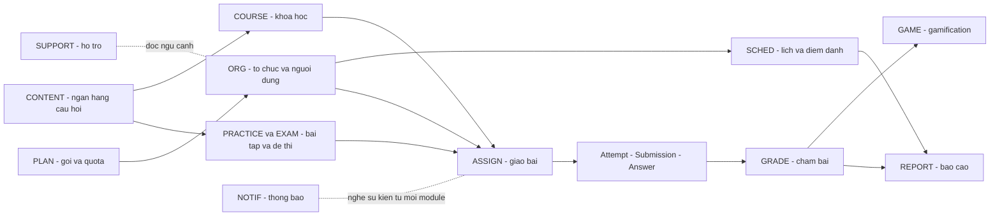
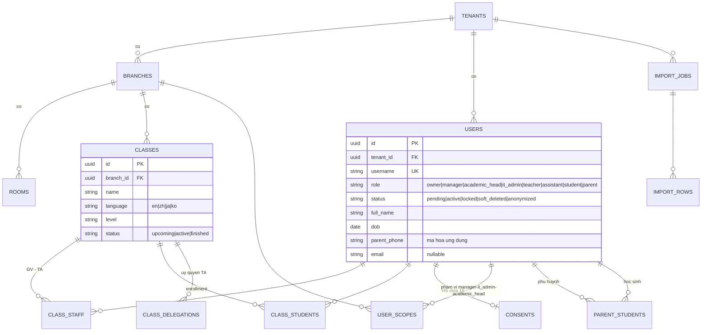
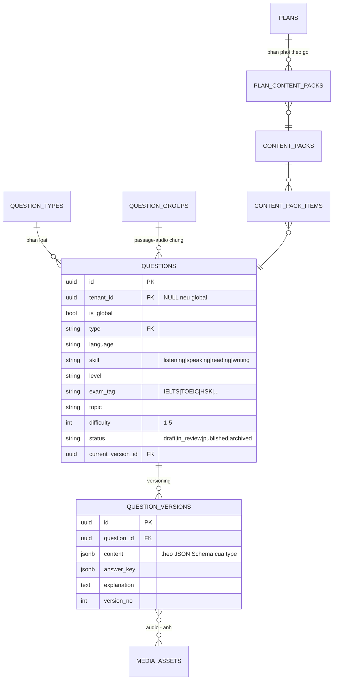
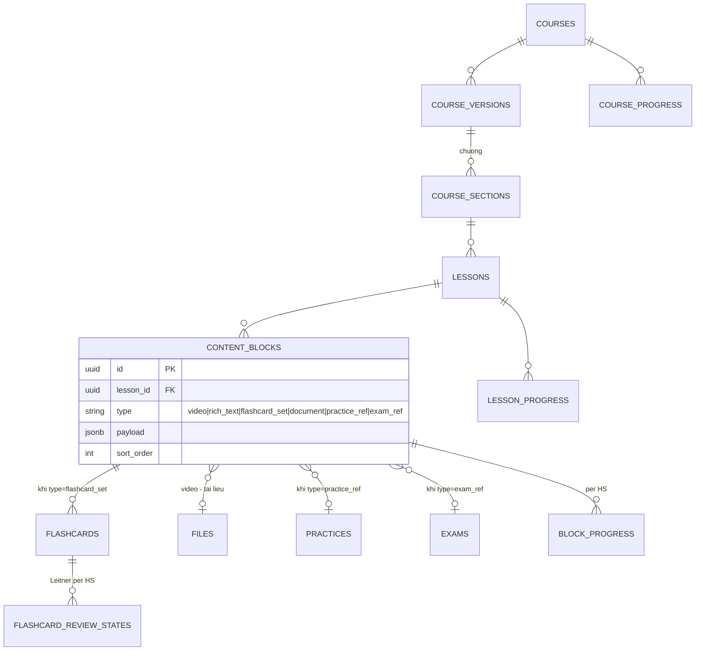
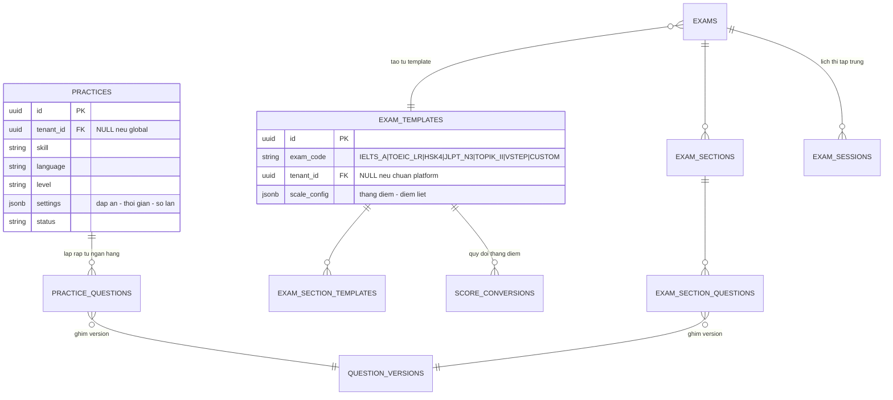
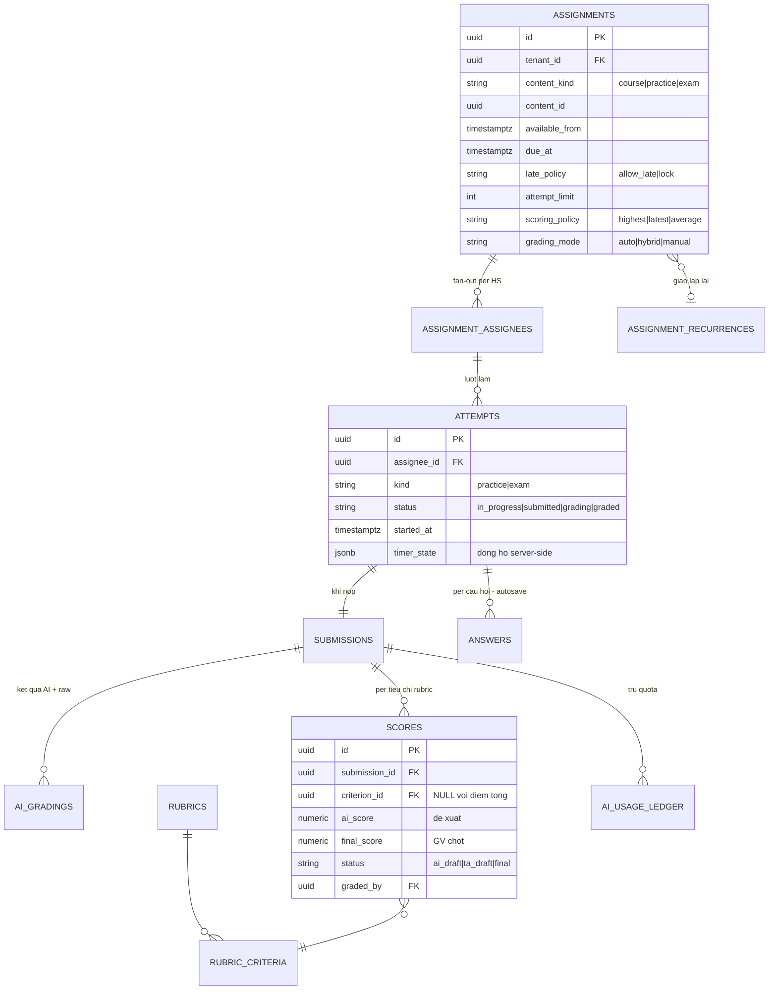
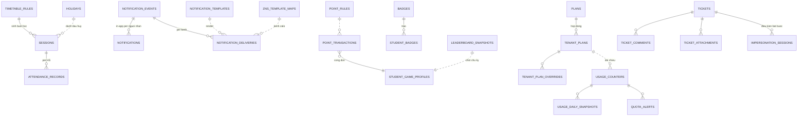

# ERD — Mô hình dữ liệu tổng

**Trạng thái:** 🟢 Đã chốt

> ERD mức thiết kế (chưa phải schema SQL cuối). Quy ước: mọi bảng nghiệp vụ có `tenant_id` (RLS) + `id UUID` + `created_at/updated_at` — không vẽ lại trong sơ đồ. Bảng platform (không RLS): `tenants`, `plans`, `tenant_plans`, `platform_users`, `question_types`, `point_rules`, `badges`, `exam_templates` chuẩn, `faq_articles`. Thuộc tính chi tiết ở [Từ điển dữ liệu](02-tu-dien-du-lieu.md); danh sách đầy đủ ~70 bảng ở [Danh mục bảng](03-danh-muc-bang.md).

## 1. Toàn cảnh quan hệ giữa các nhóm

## 2. Tổ chức & người dùng (ORG)

`platform_users` tách riêng cho vai trò platform (admin, content_editor, support_agent) — không thuộc tenant.

## 3. Nội dung (CONTENT)

## 4. Khóa học (COURSE)

## 5. Practice & Exam

## 6. Giao bài → làm bài → chấm (ASSIGN · GRADE)

## 7. Vận hành (SCHED · NOTIF · GAME · PLAN · SUPPORT)

## 8. Bảng dùng chung

| Bảng | Vai trò | Ghi chú |
|---|---|---|
| `files` | Nguồn chân lý mọi file trên object storage | key, original_name, checksum, module, entity_id — [Lưu trữ file](../01-kien-truc/04-luu-tru-file.md) |
| `audit_logs` | Nhật ký bất biến (hành động nhạy cảm) | append-only — [Bảo mật §6](../01-kien-truc/03-bao-mat.md) |
| `activity_logs` | Nhật ký hoạt động MỌI thao tác ghi (ai sửa gì, diff before/after) | append-only, partition theo tháng — [SRS Quản trị log](../18-quan-tri-log/srs-quan-tri-log.md) |
| `activity_daily_stats` | Pre-aggregate usage theo vai trò/module/ngày | rebuild được từ activity_logs |
| `jobs` (queue metadata) | Trạng thái job nền tra cứu được | chấm AI, gửi thông báo, import, export |

## 9. Nguyên tắc thiết kế dữ liệu

1. **Ghim version**: attempt/answer tham chiếu `question_version_id` (không phải question) — sửa câu hỏi không đổi điểm hồi tố. Tương tự course_version.
2. **Điểm 2 tầng**: `ai_score` (đề xuất) và `final_score` (GV chốt) tách cột — báo cáo chỉ dùng final; hiệu chuẩn dùng cả hai.
3. **Append-only cho dữ liệu tiền/điểm/audit**: `point_transactions`, `ai_usage_ledger`, `audit_logs` không update/delete.
4. **Pre-aggregate tách bảng riêng** (nhóm `*_stat`) — rebuild được từ dữ liệu gốc bất kỳ lúc nào.
5. **JSONB có schema**: `question_versions.content`, `content_blocks.payload`, `exam_templates.scale_config` validate bằng JSON Schema ở tầng ứng dụng.
6. **Soft-delete + ẩn danh**: user và file có `deleted_at`; ẩn danh hóa giữ khóa ngoại (điểm/attempt không gãy) nhưng xóa danh tính.

## Lịch sử thay đổi

| Ngày | Thay đổi | Người |
|---|---|---|
| 2026-07-16 | Tạo bản nháp đầu tiên | Claude |
| 2026-07-16 | Chốt — chuyển trạng thái Đã chốt | Chủ sản phẩm |
| 2026-07-16 | Thêm role enum 8 giá trị tenant, bảng user_scopes (phạm vi chi nhánh/tổ) và parent_students | Chủ sản phẩm |
| 2026-07-17 | Thêm activity_logs + activity_daily_stats | Chủ sản phẩm + Claude |
