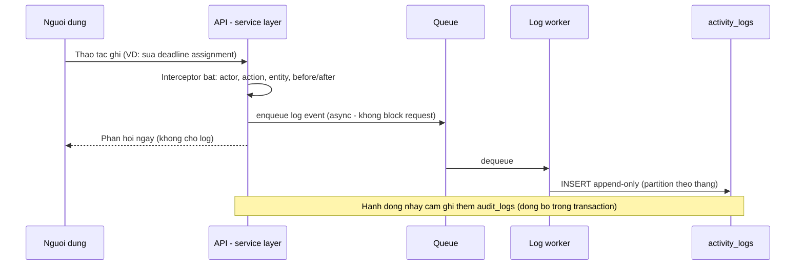
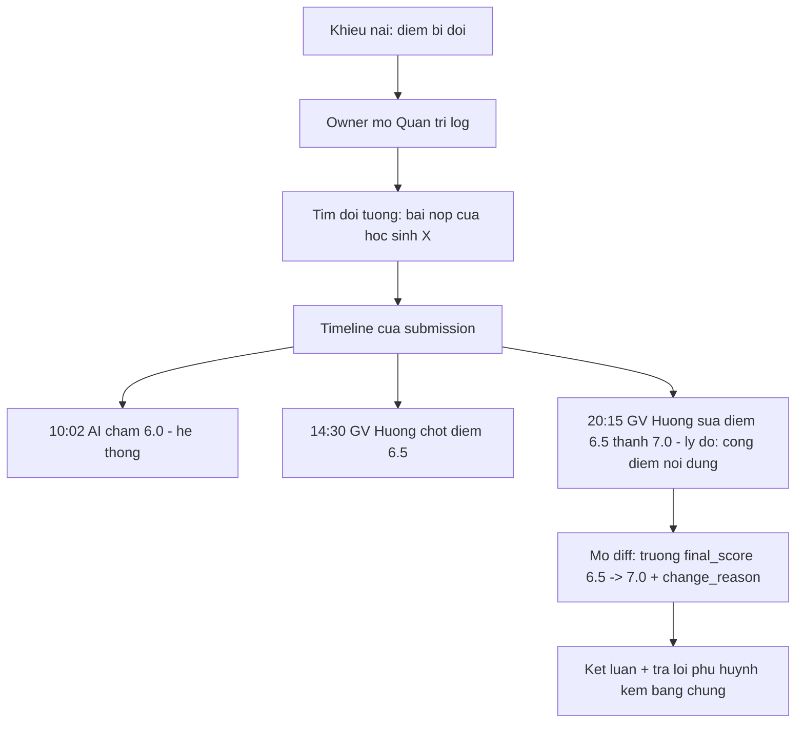

# SRS — Nhật ký hoạt động & Quản trị log

**Mã module:** `LOG`
**Trạng thái:** 🟢 Đã chốt
**Phụ thuộc:** [Phân quyền](../02-phan-quyen/srs-phan-quyen.md) (quyền xem theo scope), [Bảo mật](../01-kien-truc/03-bao-mat.md) (§6 audit log), mọi module nghiệp vụ (nguồn phát sự kiện)

## 1. Mục đích

Yêu cầu từ chủ sản phẩm: **mọi phần của hệ thống đều phải log lại phiên bản — ai đã sửa gì, ai đã cập nhật gì** — và có **màn hình quản trị log theo từng module** để (1) biết người dùng sử dụng hệ thống như thế nào, (2) khi có vấn đề (khiếu nại điểm, mất dữ liệu, cấu hình sai…) vào truy vết được ngay ai làm gì lúc nào.

Module này chuẩn hóa **2 tầng log** dùng chung toàn hệ thống và cung cấp UI quản trị:

| Tầng | Bảng | Ghi gì | Retention mặc định |
|---|---|---|---|
| **Activity log** (mới) | `activity_logs` | **Mọi thao tác ghi** (tạo/sửa/xóa) trên mọi entity nghiệp vụ của mọi module + thao tác đọc nhạy cảm (xuất dữ liệu, tải danh sách, nghe audio bài làm) | 12 tháng (cấu hình per tenant) |
| **Audit log** (đã có, giữ nguyên) | `audit_logs` | Hành động **nhạy cảm** theo [Bảo mật §6](../01-kien-truc/03-bao-mat.md): đăng nhập, đổi quyền, sửa điểm đã chốt, impersonation, xuất dữ liệu, đổi cấu hình/gói | ≥ 24 tháng |

Một hành động nhạy cảm ghi **cả 2 tầng** (audit là tập con nghiêm ngặt hơn). Các entity đã có versioning riêng (question_versions, course_versions, scores có change_reason) giữ nguyên — activity log liên kết tới version tương ứng.

## 2. Phạm vi

- **Trong phạm vi (v1):** ghi tự động activity log ở service layer (không để từng module tự chế); diff before/after cho update; UI quản trị log: lọc theo module/người/hành động/đối tượng/thời gian, timeline theo đối tượng, xem diff, export CSV; thống kê sử dụng cơ bản (hoạt động theo vai trò/module); phân quyền xem theo scope; retention + immutability.
- **Ngoài phạm vi (v2):** đẩy log sang SIEM ngoài, rule engine cảnh báo tùy biến, session replay, phân tích hành vi nâng cao (funnel, heatmap).

## 3. Vai trò liên quan

| Vai trò | Xem được gì trong UI quản trị log |
|---|---|
| Chủ trung tâm (`owner`) | **Toàn bộ** activity + audit log của tenant mình, mọi module |
| Nhân viên quản lý (`manager`) | Activity log **nghiệp vụ** (khóa học, giao bài, chấm, lịch, thông báo, nội dung) trong phạm vi chi nhánh được gán; **không** thấy log bảo mật/tài khoản |
| IT trung tâm (`it_admin`) | Activity log nhóm **tài khoản & phân lớp** trong phạm vi được gán |
| Tổ trưởng (`academic_head`) | Activity log nội dung (soạn/duyệt) trong phạm vi tổ |
| Giáo viên (`teacher`) | Timeline của đối tượng thuộc lớp mình (VD: lịch sử sửa điểm 1 bài nộp) — truy cập từ ngữ cảnh, không có trang log riêng |
| Học sinh / Phụ huynh | Không truy cập log; các thay đổi liên quan (điểm sửa sau chốt) hiển thị qua thông báo |
| Admin hệ thống (`admin`) | Log platform + activity/audit log mọi tenant (phục vụ vận hành, có audit việc xem) |
| Nhân viên support (`support_agent`) | Log liên quan tenant/user của ticket đang xử lý (read-only, ghi audit) |
| Nhân viên nội dung (`content_editor`) | Activity log kho nội dung global |

## 4. User stories

- `US-LOG-01` — Là **owner**, khi phụ huynh khiếu nại "điểm của con tôi bị đổi", tôi muốn mở timeline của bài nộp đó và thấy **ai** sửa điểm, **từ bao nhiêu thành bao nhiêu**, **lúc nào, vì lý do gì** để trả lời trong 5 phút.
- `US-LOG-02` — Là **owner**, tôi muốn xem tuần này giáo viên nào có giao bài/chấm bài, nhân viên nào chưa từng đăng nhập, để đánh giá mức độ sử dụng hệ thống.
- `US-LOG-03` — Là **it_admin**, khi một tài khoản học sinh "tự nhiên bị khóa", tôi muốn lọc log module tài khoản để biết ai khóa và khi nào.
- `US-LOG-04` — Là **admin platform**, khi tenant báo "cấu hình Zalo tự nhiên mất", tôi muốn xem log cấu hình của tenant đó trước khi đổ lỗi cho hệ thống.
- `US-LOG-05` — Là **manager**, tôi muốn xem lịch sử một lớp (đổi lịch, đổi giáo viên, thêm bớt học sinh) như một dòng thời gian duy nhất.

## 5. Luồng hoạt động

### 5.1 Ghi log tự động (mọi module, không tự chế)

- **Interceptor ở service layer** (`core/activity_log.py`): mọi hàm service ghi dữ liệu tự động phát event — module mới thêm vào là có log, không viết tay từng chỗ.
- Diff `before/after`: chỉ các trường thay đổi, JSON; trường nhạy cảm (mật khẩu, token, SĐT mã hóa) bị **loại khỏi log** hoặc che (`***`).
- Mỗi log mang `request_id` — nối được với error tracking (Sentry) và trace (OTel) khi điều tra sự cố kỹ thuật.

### 5.2 Truy vết sự cố (ví dụ: khiếu nại điểm)

### 5.3 Xem mức độ sử dụng (usage)

Dashboard đơn giản tổng hợp từ activity log (pre-aggregate hằng ngày): người dùng hoạt động theo vai trò theo ngày/tuần; số hành động theo module (giao bài, chấm, soạn nội dung…); danh sách tài khoản **không hoạt động** > N ngày (GV không đăng nhập, lớp không được giao bài…). Đây là dữ liệu vận hành nội bộ tenant — khác với [Báo cáo học tập](../09-bao-cao/srs-bao-cao.md) (kết quả học sinh).

## 6. Yêu cầu chức năng

| Mã | Yêu cầu | Vai trò | Ưu tiên |
|---|---|---|---|
| FR-LOG-01 | Ghi tự động activity log cho **mọi thao tác tạo/sửa/xóa** trên mọi entity nghiệp vụ, từ service layer (interceptor chung) — module mới tự động được phủ | hệ thống | Must |
| FR-LOG-02 | Mỗi bản ghi: actor (user, vai trò, impersonation nếu có), action, module, entity (loại + id + tên hiển thị), diff before/after (update), thời điểm, IP, user-agent, request_id | hệ thống | Must |
| FR-LOG-03 | Ghi async qua queue — không tăng latency request > 5ms; log lỗi ghi không làm hỏng nghiệp vụ (retry riêng) | hệ thống | Must |
| FR-LOG-04 | Append-only: không API sửa/xóa log; chỉ job retention xóa theo hạn | hệ thống | Must |
| FR-LOG-05 | Ghi cả thao tác đọc nhạy cảm: xuất báo cáo/danh sách, tải dữ liệu cá nhân, nghe audio bài làm của học sinh | hệ thống | Must |
| FR-LOG-06 | UI quản trị log: lọc theo module, người thực hiện, loại hành động, khoảng thời gian; tìm theo đối tượng; phân trang | owner, manager, it_admin, academic_head, admin, content_editor | Must |
| FR-LOG-07 | **Timeline theo đối tượng**: xem toàn bộ lịch sử 1 entity (lớp, học sinh, bài nộp, khóa học, cấu hình…) theo dòng thời gian; mở được từ trang chi tiết entity ("Xem lịch sử") | theo scope mục 3 | Must |
| FR-LOG-08 | Xem chi tiết diff before/after dạng bảng trường-giá trị cũ-giá trị mới; link tới version entity nếu có (question_versions, course_versions) | theo scope mục 3 | Must |
| FR-LOG-09 | Phân quyền xem đúng bảng mục 3 — cưỡng chế ở API; mọi lượt xem log của admin/support trên dữ liệu tenant tự ghi audit | hệ thống | Must |
| FR-LOG-10 | Export CSV kết quả lọc (ghi audit việc export) | owner, admin | Should |
| FR-LOG-11 | Dashboard usage: hoạt động theo vai trò/module theo ngày-tuần; tài khoản không hoạt động > N ngày; pre-aggregate hằng ngày | owner, manager (phạm vi), admin | Should |
| FR-LOG-12 | Che/loại trường nhạy cảm khỏi log (mật khẩu, token, secret, SĐT phụ huynh hiển thị dạng che); không bao giờ log nội dung file | hệ thống | Must |
| FR-LOG-13 | Retention: activity log mặc định 12 tháng (owner cấu hình 6–24), audit log ≥ 24 tháng (không giảm được); hết hạn xóa bằng job, có log việc xóa | hệ thống | Must |
| FR-LOG-14 | Hành động của phiên impersonation gắn cả 2 danh tính (support_agent + user bị thay) trong mọi bản ghi | hệ thống | Must |
| FR-LOG-15 | Log platform (thao tác của admin/content_editor/support trên cổng ops) ghi cùng cơ chế, xem ở UI quản trị log phía ops | admin | Must |

## 7. Yêu cầu phi chức năng (riêng module)

- `activity_logs` partition theo tháng ngay từ v1 (bảng ghi nhiều nhất hệ thống); index theo (tenant_id, entity_type, entity_id, at) và (tenant_id, actor_id, at).
- Truy vấn UI log p95 < 2s với tenant 12 tháng dữ liệu.
- Ước lượng dung lượng ghi vào capacity planning ([NFR](../01-kien-truc/06-yeu-cau-phi-chuc-nang.md)); log không tính vào quota dung lượng file của tenant.

## 8. Màn hình chính

| Màn hình | Vai trò dùng | Mockup |
|---|---|---|
| Quản trị log (bảng + bộ lọc theo module/người/hành động/thời gian) | owner, manager, it_admin, admin | _sẽ bổ sung (vòng 2)_ |
| Timeline lịch sử 1 đối tượng + diff | theo scope | _sẽ bổ sung (vòng 2)_ |
| Dashboard mức độ sử dụng | owner, admin | _sẽ bổ sung (vòng 2)_ |

## 9. API sơ bộ

| Method | Path | Mô tả | Quyền |
|---|---|---|---|
| GET | `/api/v1/logs` | Danh sách log theo filter (module, actor, action, from/to) | theo scope mục 3 |
| GET | `/api/v1/logs/entity/{type}/{id}` | Timeline của 1 đối tượng | theo scope |
| GET | `/api/v1/logs/{id}` | Chi tiết 1 bản ghi + diff | theo scope |
| POST | `/api/v1/logs/export` | Export CSV theo filter (job nền) | owner, admin |
| GET | `/api/v1/logs/usage-stats` | Thống kê sử dụng theo vai trò/module | owner, manager, admin |

## 10. Entity liên quan

- `activity_logs` — bảng mới: `tenant_id (NULL với platform), actor_id, actor_role, on_behalf_of (impersonation), action, module, entity_type, entity_id, entity_label, diff jsonb, ip, user_agent, request_id, at` — append-only, partition tháng.
- `activity_daily_stats` — pre-aggregate cho dashboard usage.
- `audit_logs` — giữ nguyên ([ERD §8](../16-du-lieu/01-erd.md)).
- Liên kết versioning sẵn có: `question_versions`, `course_versions`, `scores.change_reason`.

## 11. Câu hỏi mở cần chốt

| # | Câu hỏi | Quyết định | Ngày chốt |
|---|---|---|---|
| 1 | Manager có được xem log module tài khoản (do it_admin thao tác) trong phạm vi mình không, hay nhóm đó chỉ owner + it_admin? | **Chốt:** Chỉ owner + it_admin | 2026-07-17 |
| 2 | Autosave câu trả lời khi làm bài có ghi activity log từng lần không? | **Chốt:** Không — chỉ log mốc bắt đầu/nộp/chấm; autosave đã có answers.saved_at | 2026-07-17 |
| 3 | Retention activity log 12 tháng mặc định — đủ chưa? | **Chốt:** 12 tháng mặc định, owner cấu hình 6–24; audit log giữ ≥24 tháng riêng | 2026-07-17 |

## Lịch sử thay đổi

| Ngày | Thay đổi | Người |
|---|---|---|
| 2026-07-17 | Tạo module theo yêu cầu chủ sản phẩm: log phiên bản mọi thao tác + UI quản trị log theo module | Chủ sản phẩm + Claude |
| 2026-07-17 | Chốt 3 câu hỏi mở (autosave không log, log tài khoản chỉ owner+it_admin, retention 12 tháng); trạng thái Đã chốt | Chủ sản phẩm |
