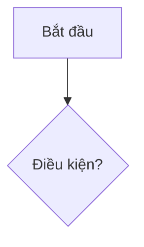

# Template SRS module

> Copy template này khi viết SRS cho một module mới. Mọi SRS module (`02`–`15`) phải theo đúng cấu trúc dưới đây để dễ đối chiếu khi chốt.

---

# SRS — <Tên module>

**Mã module:** `<MODULE>` (dùng trong mã FR: `FR-<MODULE>-xx`)
**Trạng thái:** 🟡 Nháp / 🔵 Chờ chốt / 🟢 Đã chốt
**Phụ thuộc:** liệt kê các module khác mà module này phụ thuộc

## 1. Mục đích

Module này tồn tại để làm gì, giải quyết bài toán gì cho ai. 2–4 câu.

## 2. Phạm vi

- **Trong phạm vi (v1):** …
- **Ngoài phạm vi (để v2 / không làm):** …

## 3. Vai trò liên quan

| Vai trò | Tương tác với module này |
|---|---|
| Học sinh | … |
| Giáo viên | … |

## 4. User stories

- `US-<MODULE>-01` — Là **<vai trò>**, tôi muốn **<hành động>** để **<lợi ích>**.

## 5. Luồng hoạt động

Mỗi luồng chính 1 sơ đồ mermaid (flowchart hoặc sequenceDiagram) + mô tả các bước, trường hợp lỗi/ngoại lệ.

### 5.1 Luồng <tên luồng>

## 6. Yêu cầu chức năng

| Mã | Yêu cầu | Vai trò | Ưu tiên |
|---|---|---|---|
| FR-<MODULE>-01 | … | … | Must / Should / Could |

## 7. Yêu cầu phi chức năng (riêng module)

Chỉ ghi phần riêng của module; phần chung xem [06-yeu-cau-phi-chuc-nang](../01-kien-truc/06-yeu-cau-phi-chuc-nang.md).

## 8. Màn hình chính

| Màn hình | Vai trò dùng | Mockup |
|---|---|---|
| … | … | [link](../17-mockups/…) |

## 9. API sơ bộ

| Method | Path | Mô tả | Quyền |
|---|---|---|---|
| GET | `/api/v1/…` | … | … |

## 10. Entity liên quan

Liệt kê entity + link sang [ERD](../16-du-lieu/01-erd.md). Thuộc tính chi tiết ở [Từ điển dữ liệu](../16-du-lieu/02-tu-dien-du-lieu.md).

## 11. Câu hỏi mở cần chốt

| # | Câu hỏi | Quyết định | Ngày chốt |
|---|---|---|---|
| 1 | … | _chưa chốt_ | |

## Lịch sử thay đổi

| Ngày | Thay đổi | Người |
|---|---|---|
| 2026-07-16 | Tạo bản nháp đầu tiên | Claude |
| 2026-07-16 | Chốt — chuyển trạng thái Đã chốt | Chủ sản phẩm |
